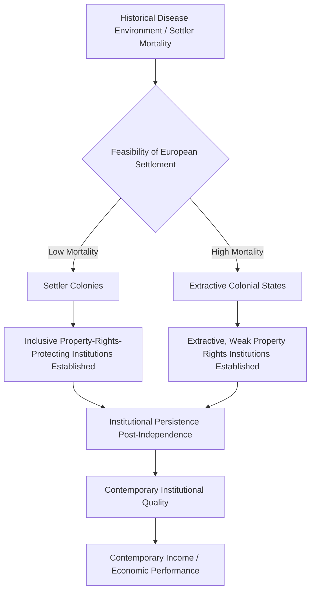

## Institutions and Economic Performance

### Definition and Scope

The study of institutions and economic performance examines how political and legal institutions — property rights protection, constraints on executive power, contract enforcement, regulatory quality — causally shape long-run economic growth and development outcomes across countries. This field sits at the intersection of comparative politics, institutional economics, and economic history, and has become one of the most influential and heavily debated research programs in political economy since the 1990s, largely displacing earlier approaches that emphasized geography, culture, or factor endowments as the primary drivers of cross-national income differences.

The central claim uniting this literature is that **"institutions matter"** for growth — specifically, that institutions constraining arbitrary state power and securing property rights against expropriation are a primary (though contested) cause of long-run prosperity differences, rather than a mere byproduct of wealth.

### North's Institutional Economics Framework

Douglass North's foundational work (*Institutions, Institutional Change and Economic Performance*, 1990) established the core conceptual vocabulary for this field, defining institutions as **"the rules of the game"** — formal rules (constitutions, laws, property rights) and informal constraints (norms, conventions, codes of conduct) that structure human interaction, distinct from **organizations** (the players operating within those rules).

- **Key Points**:
  - Institutions matter for economic performance primarily by reducing **transaction costs** — the costs of measuring, enforcing, and monitoring exchange agreements — thereby enabling more complex, impersonal, and welfare-enhancing economic exchange beyond small-scale personal trust networks
  - **Secure property rights** are theorized as particularly critical: without credible protection against expropriation (by the state or by private actors), individuals and firms face reduced incentives to invest, innovate, and engage in long-horizon economic activity
  - North's framework explicitly links to path dependence and historical institutionalism (North was a key contributor to both traditions), arguing that institutional configurations, once established, persist through **increasing returns and network effects** even when inefficient, helping explain why some countries remain trapped in low-growth institutional equilibria

### The Political Foundations of Property Rights: North and Weingast

North and Barry Weingast's influential 1989 article on England's Glorious Revolution (1688) offered a canonical historical case illustrating how **political institutional change** can credibly secure property rights and unlock economic growth.

- **Core argument**: Prior to 1688, English monarchs could arbitrarily seize assets, renege on debts, or manipulate the currency, deterring investment and limiting the Crown's own access to credit. The Glorious Revolution's constitutional settlement — strengthening Parliament's power over taxation and public finance, establishing more secure parliamentary constraints on the monarch — created a credible commitment device limiting arbitrary state action.
- **Consequence**: This credible commitment mechanism is argued to have dramatically improved the Crown's own borrowing terms (interest rates on government debt fell substantially) and to have created a more secure environment for private investment, contributing to England's subsequent financial and economic development.
- [Inference] This case has become paradigmatic in the institutions-and-growth literature specifically because it illustrates the field's core causal mechanism — political institutions constraining executive power creating credible commitment to property rights, which in turn enables growth — though economic historians have also raised empirical challenges to specific elements of the North-Weingast account (e.g., questioning the precise timing and magnitude of the interest-rate effect relative to the 1688 settlement itself)

### Acemoglu, Johnson, and Robinson: Colonial Origins and Institutional Persistence

A highly influential and extensively cited body of work by Daron Acemoglu, Simon Johnson, and James Robinson extended North's framework using colonial history as a **natural experiment** to address a central methodological challenge: institutions and growth are jointly determined (richer countries can also afford better institutions), making simple correlational evidence for the institutions-cause-growth claim vulnerable to reverse causation.

**The Colonial Origins Model** (*American Economic Review*, 2001)

- **Core argument**: European colonizers established different types of colonial institutions depending on the feasibility of European settlement, primarily determined by disease environment (settler mortality rates). Where settler mortality was low (temperate climates, lower disease burden — e.g., North America, Australia), colonizers established **"settler colonies"** with inclusive, extractive-resistant institutions replicating European property rights protections. Where settler mortality was high (tropical regions with high disease burden — much of Africa, parts of Asia and Latin America), colonizers established **"extractive states"** designed to extract resources with minimal investment in inclusive institutions, since long-term European settlement was infeasible.
- **Persistence mechanism**: These early colonial institutional choices are argued to have **persisted** substantially into the present (via path-dependent institutional inheritance, even after formal decolonization), explaining a significant portion of contemporary cross-national income differences.
- **Identification strategy**: Using historical settler mortality as an **instrumental variable** for contemporary institutional quality allows the authors to argue for a causal (not merely correlational) effect of institutions on income, since settler mortality (determined by historical disease environment) plausibly affects contemporary income only through its effect on institutions, not through any direct channel.

$$\text{Income}_i = \beta \cdot \widehat{\text{Institutions}}_i + \epsilon_i$$

where $\widehat{\text{Institutions}}_i$ is the institutional quality measure instrumented by historical settler mortality, isolating the component of institutional variation plausibly driven by the historical settlement channel rather than reverse causation from contemporary income.

**"Reversal of Fortune"** (Acemoglu, Johnson, and Robinson, *Quarterly Journal of Economics*, 2002)

- Documents that regions relatively prosperous and densely populated *before* European colonization (parts of Latin America, South Asia) frequently became relatively poorer after colonization than regions that were sparsely populated and less developed pre-colonization, attributed to colonizers establishing more extractive institutions precisely where existing dense populations and resources made extraction more profitable — a striking empirical **reversal** used to further bolster the institutions-not-geography causal interpretation, since the same geographic locations experienced opposite relative-income trajectories depending on institutional choices made during colonization

### Diagram: The Colonial Origins Causal Chain

### Extractive vs. Inclusive Institutions (Acemoglu and Robinson)

Acemoglu and Robinson's later synthesis, *Why Nations Fail* (2012), generalized this framework into a broader distinction between two institutional types theorized to explain the deep long-run divergence in national wealth.

- **Inclusive institutions**: Broad-based political participation, secure and widely distributed property rights, open economic entry, and constraints on elite power — theorized to generate sustained innovation and growth by allowing broad segments of the population to invest and innovate with confidence in reaping the returns ("creative destruction" friendly)
- **Extractive institutions**: Political power concentrated among a narrow elite, weak property rights outside that elite, and economic arrangements designed to funnel resources toward the ruling group — theorized to be capable of generating growth episodes (often through elite-directed mobilization of resources) but not *sustained* growth, since extractive elites face incentives to resist the political and economic disruption (creative destruction) that sustained innovation-driven growth requires, fearing loss of their own power
- **Key Points**:
  - The framework places heavy causal weight on **political institutions** as prior to and determinative of **economic institutions** — arguing that a narrow political elite will generally choose extractive economic institutions to preserve its power and rents, making political institutional reform the necessary precursor to sustained inclusive economic development
  - The theory explicitly argues against geography, culture, and "ignorance" (poor policy choices absent institutional constraints) as primary explanations for cross-national income differences, positioning itself in direct opposition to these alternative research programs

### Example: Comparing Institutional Trajectories — North vs. South Korea

**Example**: The institutions-and-growth literature frequently invokes paired historical comparisons to illustrate institutional divergence effects while holding other factors relatively constant.

- **North and South Korea**: Widely cited as an especially clean natural-experiment-style comparison, since the peninsula shared common culture, geography, ethnicity, and pre-division economic conditions until political division in 1945–1948. South Korea, developing relatively more inclusive political and economic institutions over subsequent decades (with significant caveats regarding its own authoritarian developmental-state period), experienced dramatic sustained economic growth. North Korea, developing highly extractive, centrally controlled political and economic institutions, experienced severe and sustained economic stagnation and periodic famine. Proponents of the institutions thesis argue this divergence, given the near-total absence of confounding geographic or cultural differences, offers unusually strong support for institutions as the primary causal driver of the outcome divergence.
- [Inference] Critics note that even this apparently clean comparison involves substantial additional confounding factors (differing international alliance structures during the Cold War, differing initial resource endowments inherited at division, differing degrees of integration into international trade and financial systems), illustrating the broader methodological difficulty of fully isolating "institutions" as a causal factor even in seemingly favorable natural-experiment cases.

### Major Critiques and Methodological Debates

- **Geography and disease-burden critiques**: Jeffrey Sachs and others have argued that geography and disease burden (malaria prevalence, tropical agricultural productivity constraints) exert substantial *direct* effects on economic performance independent of the institutional channel, challenging the identification strategy's exclusion restriction (the assumption that settler mortality affects contemporary income only through institutions, not through a direct geography/disease channel).
- **Data quality and settler mortality measurement**: David Albouy (2012) raised substantial methodological challenges to the original Acemoglu-Johnson-Robinson settler mortality data, arguing measurement problems and questionable extrapolations for a significant share of the sample countries undermine the instrument's validity — a challenge that generated an extended and technical empirical exchange within the field regarding the robustness of the original colonial-origins results.
- **Reverse causation and definitional circularity concerns**: Critics note that commonly used institutional quality indices (e.g., expropriation risk measures, rule-of-law indices) are often themselves partly constructed from or correlated with economic outcome data, raising concern about circularity in claims that "institutions cause growth" when institutional quality measures may partly reflect contemporaneous economic conditions.
- **Underspecified causal mechanisms and "institutions" as a residual category**: Some critics (echoing critiques leveled at historical institutionalism generally) argue "institutions" in this literature sometimes functions as a broad residual explanatory category invoked whenever other specific factors fail to explain outcomes, without adequately specifying the precise causal mechanisms linking particular institutional features to particular growth outcomes.
- **Alternative emphasis on human capital**: Edward Glaeser and coauthors (2004) argued that human capital (education, skills) may be a more fundamental driver of both growth and subsequently observed "good institutions" (since educated populations may demand and sustain better institutions), challenging the institutions-first causal ordering central to the Acemoglu-Johnson-Robinson framework and proposing an alternative causal sequence running partly in the opposite direction.

### Institutions and Growth: Competing Causal Frameworks Compared

| Framework | Primary Causal Factor | Proposed Mechanism |
| --- | --- | --- |
| North / North-Weingast | Political institutions constraining executive power | Credible commitment to property rights reduces transaction costs |
| Acemoglu-Johnson-Robinson | Historically-determined inclusive vs. extractive institutions | Broad-based participation enables sustained innovation; extractive elites block creative destruction |
| Sachs (geography-centered alternative) | Geographic/disease environment | Direct effects on agricultural productivity, disease burden, trade access |
| Glaeser et al. (human capital-centered alternative) | Human capital / education | Skilled populations both drive growth directly and subsequently demand better institutions |

### Contemporary Relevance and Policy Influence

[Inference] Despite sustained methodological critique, the institutions-and-growth research program has exerted substantial influence on development policy discourse, shaping the priorities of major international development institutions (World Bank governance indicators, emphasis on "good governance" conditionality in development aid) and contributing to broader academic and policy consensus that institutional quality, not merely capital accumulation or resource endowment, is a central consideration in explaining and addressing persistent cross-national development gaps — even as specific empirical claims (particularly regarding the colonial-origins instrumental variable strategy) remain actively contested within the technical economics and political science literature.

### Related Topics

- North's Transaction Cost Theory of Institutions
- Historical Institutionalism and Path Dependence (methodological foundation)
- Colonial Origins of Comparative Development (Acemoglu, Johnson, Robinson)
- Extractive versus Inclusive Institutions (Why Nations Fail framework)
- Instrumental Variables and Causal Identification in Comparative Political Economy
- Property Rights, Credible Commitment, and Economic Investment
- Geography-Based Alternative Explanations for Development (Jeffrey Sachs)
- Human Capital-Centered Critiques of the Institutions-First Thesis (Glaeser et al.)
- World Bank Governance Indicators and Development Policy Applications