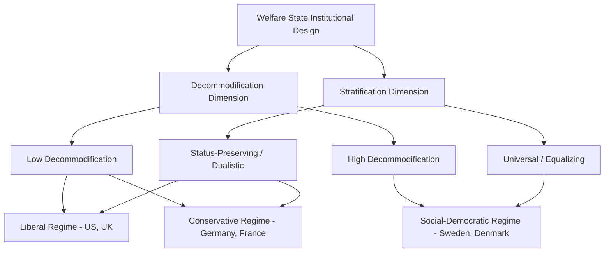

## Comparative Welfare State Regimes

### Definition and Scope

Comparative welfare state regime analysis examines how advanced democracies differ systematically in the design, generosity, and underlying logic of their social protection systems — pensions, healthcare, unemployment insurance, family policy, and social assistance. Rather than treating welfare states as varying only in overall spending level, this field emphasizes **qualitative institutional differences** in how welfare states allocate risk, structure eligibility, and shape social stratification, treating welfare state design as a coherent political-institutional system rather than a simple aggregate of spending.

This subfield is closely linked to power resources theory, historical institutionalism, and Varieties of Capitalism, but is distinguished by its focus specifically on classifying and explaining **welfare regime types** as coherent, path-dependent institutional clusters.

### Esping-Andersen's Three Worlds of Welfare Capitalism

Gøsta Esping-Andersen's *The Three Worlds of Welfare Capitalism* (1990) is the foundational and most widely used typology in comparative welfare state scholarship, classifying advanced-democracy welfare states along two central analytical dimensions.

**Core Analytical Dimensions**

- **Decommodification**: The degree to which an individual's standard of living is protected from dependence on the market (paid employment) — i.e., the extent to which social rights allow people to maintain a livelihood without reliance on employment (through unemployment benefits, pensions, sick pay, etc.). Higher decommodification means citizens can more easily opt out of employment (temporarily or permanently) without severe material hardship.
- **Stratification**: The extent to which welfare state design itself shapes and reproduces (or reduces) social class divisions — some welfare states reinforce existing occupational/status hierarchies through differentiated, status-preserving benefit schemes, while others pursue universal, equalizing provision that reduces stratification

**The Three Regime Types**

| Regime | Decommodification | Stratification Pattern | Family/Gender Model | Examples |
| --- | --- | --- | --- | --- |
| Liberal | Low | Dualistic: modest universal benefits + means-tested residual assistance, stigmatizing poverty-targeted programs | Market-reliant, weaker state support for care | US, UK, Canada, Australia |
| Conservative/Corporatist | Moderate-high | Status-preserving: benefits tied to occupational category and prior earnings, differentiated by sector | Traditionally "male breadwinner" oriented, historically weaker childcare provision | Germany, France, Italy, Austria |
| Social-Democratic | High | Universal: benefits available to all citizens/residents on equal terms, minimizing status distinctions | Strong state support for dual-earner families, extensive public childcare/eldercare | Sweden, Denmark, Norway |

- **Key Points**:
  - **Liberal regimes**: Rely heavily on means-tested social assistance and modest social insurance, often accompanied by active encouragement of private market alternatives (private pensions, private health insurance); benefits are frequently stigmatized and subject to strict eligibility testing, historically associated with English/Anglo-Saxon liberal political traditions
  - **Conservative/corporatist regimes**: Rooted historically in Bismarckian social insurance and Catholic social doctrine (subsidiarity principle — the state should only intervene when family/community capacity is exhausted); benefits are typically earnings-related and tied to occupational status, producing a system that preserves rather than reduces pre-existing status differentials
  - **Social-democratic regimes**: Characterized by universal entitlement, high benefit generosity, and heavy public investment in services (not just cash transfers) that facilitate labor market participation, particularly for women, reflecting the historical political dominance of encompassing labor movements described in power resources theory

### Diagram: Esping-Andersen's Regime Classification Logic

### Feminist Critiques and the "Fourth World"

A major and influential critique of the original Esping-Andersen typology, developed primarily by feminist political economists including Ann Shola Orloff, Jane Lewis, and Diane Sainsbury, argues the original framework's focus on decommodification (relative to *paid market labor*) inadequately captures welfare states' treatment of **unpaid care work** and gendered labor market participation.

- **Key Points**:
  - **Defamilialization** (sometimes "de-familialization") was proposed as a complementary analytical dimension: the degree to which welfare states reduce individuals' (particularly women's) dependence on the family/household for welfare provision, e.g., through public childcare, eldercare, and parental leave policies that enable labor market participation independent of family caregiving obligations
  - **Male breadwinner model critique** (Jane Lewis): Argued welfare states can be usefully classified by the strength of their historical assumption that men earn income while women perform unpaid domestic/care labor, with "strong breadwinner" states (historically including conservative regimes like Germany) differing substantially from "weak breadwinner" states (Nordic social-democratic regimes with strong dual-earner support) even when their decommodification scores might appear similar
  - This critique substantially reshaped the field by demonstrating that the original two-dimensional Esping-Andersen framework, while highly influential, systematically underrepresented the significance of gender and family policy as an independent axis of welfare state variation, not merely a byproduct of the original three regime types

### The "Fourth" and "Fifth" Regime Debates: Mediterranean and East Asian Cases

Subsequent comparative scholarship extended and contested the three-world typology by identifying additional regime clusters that fit poorly within the original framework.

- **Mediterranean/Southern European "fourth world"** (associated with work by Maurizio Ferrera and Stefano Sacchi): Proposed as a distinct cluster (Italy, Spain, Portugal, Greece) characterized by fragmented, occupationally particularistic social insurance (sometimes described as "hyper-corporatist"), historically strong reliance on family/informal care provision (partly overlapping with the defamilialization critique above), and comparatively underdeveloped social assistance safety nets relative to continental conservative regimes
- **East Asian welfare regimes** (work associated with Ian Holliday and others): Proposed a distinct "productivist" welfare regime type for cases like Japan, South Korea, Taiwan, and Singapore, characterized by welfare provision explicitly subordinated to and instrumentalized for economic growth and productivity goals, historically lower overall social spending relative to GDP than Western regimes, and heavy reliance on employer-provided and family-based welfare provision alongside state programs
- [Inference] The proliferation of proposed additional regime types since the original 1990 typology reflects both genuine empirical institutional diversity uncaptured by the original three worlds and an ongoing methodological tension in the field between preserving a parsimonious, widely-applicable typology versus capturing finer-grained institutional variation — a tension explicitly acknowledged in Esping-Andersen's own subsequent work responding to critics

### Example: Family Policy Divergence Within Nominally Similar Regimes

**Example**: Comparing family/childcare policy illustrates how the original decommodification-focused typology can obscure meaningful variation even among broadly similar regime types.

- **Germany (Conservative regime, traditionally)**: Historically featured comparatively limited public childcare provision and tax/benefit structures (e.g., joint spousal taxation) that implicitly favored a single-earner household model, consistent with the "strong male breadwinner" characterization — though subsequent reforms since the early 2000s (expanded parental leave, publicly funded childcare expansion) have moved the German case substantially toward a "weak breadwinner" model, illustrating gradual institutional change (in Mahoney-Thelen terms, largely through layering) within a nominally stable conservative regime classification.
- **France (also classified Conservative)**: Despite sharing a broadly conservative/corporatist social insurance architecture with Germany, France historically featured comparatively extensive public childcare and pro-natalist family policy dating to earlier 20th-century demographic policy concerns, producing notably higher female labor force participation and defamilialization outcomes than Germany's traditional model, despite both cases scoring similarly on Esping-Andersen's original decommodification measure.

This example illustrates the core contribution of the feminist defamilialization critique: two cases classified identically under the original typology's primary dimension can diverge substantially once family policy and gendered welfare outcomes are examined directly.

### Welfare State Retrenchment and the Politics of Reform

A major subsequent research program, most closely associated with Paul Pierson's *Dismantling the Welfare State?* (1994) and later work, examines the **politics of welfare state retrenchment** — reform and cutback — as analytically distinct from the politics of welfare state *expansion* that dominated earlier scholarship (including much of the original power-resources and Esping-Andersen literature).

- **Key Points**:
  - Pierson argued that retrenchment politics operates under a fundamentally different logic than expansion politics: because welfare programs create concentrated, mobilized constituencies of beneficiaries (pensioners, welfare-dependent populations) while retrenchment costs are diffuse before the fact, elected politicians face strong incentives toward **"blame avoidance"** rather than open confrontation with entrenched welfare constituencies
  - This generates characteristic retrenchment strategies designed to obscure attribution of unpopular cuts: **obfuscation** (technical, hard-to-observe benefit reductions rather than visible headline cuts), **division** (splitting affected constituencies to prevent unified opposition), and **compensation** (offsetting cuts with side payments to blunt opposition)
  - Pierson's retrenchment framework is frequently read as a direct application of historical-institutionalist path-dependence logic (his other major scholarly contribution) to welfare politics specifically: welfare states, once established, generate their own durable political constituencies that constrain even ideologically committed reformers (a dynamic he termed the "new politics of the welfare state," contrasted with the "old politics" of expansion-era class conflict)

### Major Critiques and Ongoing Debates

- **Persistent classification disputes**: Beyond the Mediterranean and East Asian extensions noted above, scholars continue to debate the placement of specific "hard cases" (the Netherlands, historically hybrid between conservative and social-democratic features; post-communist Central and Eastern European welfare states, which fit poorly within a typology developed for established Western capitalist democracies) — echoing broader concept-stretching concerns familiar from area studies methodological debates
- **Overreliance on decommodification as measured**: Critics have questioned whether standard decommodification indices adequately capture the lived generosity and accessibility of benefits, versus formal replacement rates that may not reflect actual administrative accessibility, benefit duration, or conditionality requirements
- **Convergence versus divergence under fiscal and demographic pressure**: A substantial empirical literature examines whether common pressures facing all advanced welfare states (population aging, post-industrial labor market shifts, fiscal constraint, EU-level integration for European cases) are producing convergence toward a common, more residual welfare model, or whether path-dependent regime-specific trajectories (as historical institutionalism would predict) remain the dominant empirical pattern — with most contemporary scholarship finding continued substantial regime divergence despite common pressures, consistent with institutional complementarity logic from Varieties of Capitalism
- **Post-industrial "new social risks"**: Scholars including Giuliano Bonoli have argued the original typology, developed primarily around industrial-era risks (unemployment, old-age, standard male full-employment trajectories), requires updating to address "new social risks" associated with post-industrial labor markets — work-family reconciliation, low-skill service-sector precarity, single parenthood — which cut across the original three-world classification in ways not fully anticipated by the 1990 framework

### Related Topics

- Power Resources Theory (theoretical foundation for regime formation)
- Decommodification and Defamilialization as Analytical Dimensions
- Varieties of Capitalism (institutional complementarity parallel)
- Historical Institutionalism and Path Dependence in Welfare Politics
- Paul Pierson's Politics of Welfare State Retrenchment
- Mediterranean and East Asian Welfare Regime Debates
- Political Economy of Redistribution (formal-theoretic complement)
- New Social Risks and Post-Industrial Welfare State Reform (Bonoli)
- Gender and Comparative Social Policy (Orloff, Lewis, Sainsbury)