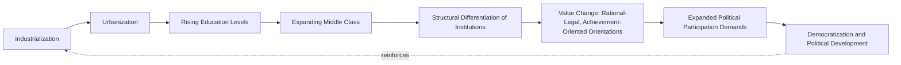

## Modernization Theory

### Definition and Core Premises

Modernization theory is a comparative politics and development framework holding that societies undergo a broadly common process of transformation — from "traditional" to "modern" social, economic, and political organization — as they industrialize, and that this process produces predictable, mutually reinforcing changes across economic, social, and political dimensions, including a tendency toward democratization. Emerging as the dominant framework for understanding political development in the 1950s–1960s, modernization theory linked economic development (industrialization, urbanization, rising education and income) causally to political development (democratization, institutional differentiation, expanded political participation).

The theory drew on classical sociology (Émile Durkheim's mechanical-to-organic solidarity, Ferdinand Tönnies's *Gemeinschaft*-to-*Gesellschaft* distinction, Max Weber's rationalization thesis) and was formalized for comparative politics substantially through structural-functionalist scholarship (Talcott Parsons's pattern variables; Gabriel Almond's developmental approach), making it closely intertwined with — though analytically distinct from — the structural-functionalist tradition.

### Core Theoretical Claims

**Traditional-to-Modern Transition**

- **Key Points**:
  - Societies are theorized to move along a broadly unilinear developmental continuum from "traditional" (agrarian, ascriptive status, particularistic/diffuse social relations, low structural differentiation) to "modern" (industrial, achieved status, universalistic/specific social relations, high structural differentiation)
  - **Structural differentiation**: As societies modernize, specialized institutions emerge to perform functions previously handled by diffuse, multi-purpose institutions (e.g., religious institutions historically performing education, welfare, and political functions simultaneously in traditional settings, gradually yielding to specialized secular schools, welfare bureaucracies, and political parties)
  - **Value change**: Modernization is theorized to produce cultural shifts from traditional/religious/particularistic value orientations toward rational-legal, achievement-oriented, and universalistic orientations (drawing directly on Weberian rationalization and Parsons's pattern-variable framework)

**Lipset's Modernization-Democracy Hypothesis**

Seymour Martin Lipset's influential 1959 article ("Some Social Requisites of Democracy") formalized the most enduring and heavily tested empirical claim associated with modernization theory: **higher levels of economic development are associated with a greater probability of stable democracy**.

$$P(\text{Democracy}) = f(\text{GDP per capita}, \text{urbanization}, \text{education}, \text{industrialization})$$

- **Proposed mechanisms**: Economic development is theorized to produce democratization through several channels — rising education expanding political awareness and participatory capacity; a growing middle class demanding political inclusion and moderating class conflict; urbanization facilitating political mobilization and communication; and economic growth reducing the zero-sum intensity of distributive political conflict
- [Inference] The Lipset hypothesis remains one of the most empirically tested propositions in comparative politics, generating decades of subsequent quantitative cross-national research; while a robust positive correlation between development level and democracy is widely replicated, the underlying *causal mechanism and direction* remains a subject of extensive ongoing debate (see below)

### Rostow's Stages of Economic Growth

Walt Rostow's *The Stages of Economic Growth: A Non-Communist Manifesto* (1960) offered an influential, explicitly anti-Marxist economic modernization framework proposing that all societies pass through a common sequence of development stages.

| Stage | Characteristics |
| --- | --- |
| Traditional society | Pre-Newtonian science/technology, limited productivity, hierarchical social structure |
| Preconditions for take-off | Emergence of entrepreneurship, expanding trade, early infrastructure investment |
| Take-off | Rapid, sustained industrial growth; investment rate rises sharply as a share of national income |
| Drive to maturity | Diversification of industry, widespread application of modern technology across the economy |
| Age of high mass consumption | Shift toward durable consumer goods and services as the dominant economic sector |

[Inference] Rostow's framework was explicitly framed as a policy-relevant alternative to Marxist stages-of-history theory during the Cold War (Rostow served in the Kennedy and Johnson administrations), and its close association with US foreign policy and development aid strategy during this period is frequently cited by later critics as evidence of modernization theory's embeddedness in Cold War ideological competition rather than purely disinterested social science.

### Diagram: The Classical Modernization Causal Chain

### Huntington's Critique: Political Order and Political Decay

Samuel Huntington's *Political Order in Changing Societies* (1968) delivered an influential internal critique of classical modernization theory's implicit assumption that development and political stability/democratization proceed together.

- **Core argument**: Huntington argued that **socioeconomic modernization and political institutionalization are analytically distinct processes that can proceed at different rates**. Rapid social mobilization (rising education, urbanization, media exposure) can outpace the development of political institutions capable of channeling and absorbing resulting political participation demands, producing **political decay** — instability, praetorianism, and institutional breakdown — rather than orderly democratic development.

$$\text{Political Instability} \propto \frac{\text{Rate of Social Mobilization}}{\text{Rate of Political Institutionalization}}$$

- **Key Points**:
  - This formalized a central corrective within the modernization tradition: development does not automatically or smoothly produce democratic stability, and can instead produce instability when institutional capacity fails to keep pace with rising participatory demands
  - Huntington's emphasis on the *independent, potentially stabilizing role of strong political institutions* (even under authoritarian conditions, provided they possessed sufficient institutionalized capacity) proved influential and controversial, since it implied that a strong, well-institutionalized single-party or authoritarian regime might, under his framework, be more stable than a weakly institutionalized democracy experiencing rapid social change
  - This critique is generally regarded as marking an important transition point within modernization scholarship itself, moving the field away from its most optimistic, linear, development-produces-democracy formulations

### Endogenous vs. Exogenous Democratization Debate

A major subsequent empirical and theoretical controversy concerns *why* the robust cross-national correlation between development and democracy exists — whether development causes democratization directly (the classical modernization claim), or whether the correlation reflects a different causal structure.

- **Przeworski and Limongi's "endogenous" critique** (Adam Przeworski and Fernando Limongi, 1997): Influential empirical work arguing that economic development does **not** significantly increase the probability that authoritarian regimes *transition* to democracy, but instead primarily affects the probability that democracies, once established (for reasons potentially unrelated to development level), **survive** rather than reverting to authoritarianism. Under this "endogenous" account, wealthier democracies are simply more durable once established — development does not explain the initial transition, only survival afterward.
- **Contrasting "exogenous" classical modernization view**: Holds that development directly increases the *likelihood of transition* to democracy in the first place, consistent with Lipset's original causal claim
- [Inference] This distinction has substantial implications for policy and theory: if the Przeworski-Limongi "endogenous" account is correct, promoting economic development in authoritarian states would not, by itself, be expected to reliably produce democratic transitions, though it would help stabilize democracy once transition occurs through other causal pathways (elite bargaining, international pressure, contingent political crises) — this remains an actively contested empirical question with subsequent studies producing mixed support for each position depending on model specification, time period, and sample

### Example: Contrasting Trajectories — South Korea and Comparative Modernization Predictions

**Example**: South Korea is frequently discussed as a case illuminating both the explanatory power and limitations of modernization theory.

- **Consistent with classical modernization prediction**: South Korea underwent rapid industrialization, urbanization, and educational expansion from the 1960s through the 1980s under a series of authoritarian developmental-state governments, followed by democratic transition in 1987 occurring at a substantially higher level of development than at the country's earlier, more fragile flirtations with democratic governance in the 1950s-60s — broadly consistent with the classical modernization causal sequence linking development to eventual democratization.
- **Complicating the simple causal story**: The multi-decade lag between rapid economic development (beginning in earnest in the early 1960s) and eventual democratic transition (1987) illustrates Huntington's point that development and democratization need not proceed simultaneously; South Korea's authoritarian government during this period arguably possessed exactly the kind of strong institutional capacity (a well-organized single-party-dominant developmental state) that Huntington's framework identified as compatible with maintained political order despite rapid social mobilization, only democratizing once elite calculations, civil society mobilization, and international context shifted — illustrating that development may create *conditions favorable to* eventual democratization without directly or automatically *causing* it on any fixed timetable

### Major Critiques of Modernization Theory

- **Ethnocentrism and teleology**: Critics (dependency theorists, world-systems theorists, postcolonial scholars) argued the theory implicitly modeled "modern" on Western liberal-democratic-capitalist societies, treating non-Western development paths as deviations from or lagging versions of a single universal trajectory rather than as legitimate alternative development patterns — a critique closely paralleling the ethnocentrism critique leveled at structural-functionalism more broadly
- **Neglect of international/structural constraints (Dependency theory)**: Andre Gunder Frank, Fernando Henrique Cardoso, and other dependency theorists argued modernization theory's exclusively internal, national-level focus ignored how developing (periphery) countries' development trajectories were structurally shaped and constrained by their position within an unequal international economic system dominated by advanced (core) capitalist economies — proposing that "underdevelopment" was actively produced by this structural relationship rather than merely reflecting insufficient internal modernization
- **Empirical challenges to unilinear sequencing**: The historical experience of numerous cases — East Asian developmental states combining rapid industrialization with prolonged authoritarian rule; oil-rich rentier states achieving high income without corresponding democratization (the broader "resource curse" and "rentier state" literatures); post-communist trajectories diverging substantially despite superficially similar starting conditions — has been extensively cited as evidence against the theory's original unilinear, developmentally-determined sequencing assumptions
- **The "reverse wave" and democratic backsliding evidence**: The existence of documented instances of **democratic reversal** even among relatively developed societies challenges any strict, deterministic reading of the modernization-democracy link, motivating more probabilistic, conditional framings of the relationship (consistent with the Przeworski-Limongi survival-focused reformulation) rather than earlier, more deterministic versions

### Modernization Theory's Contemporary Legacy

Despite the extensive critiques above, several elements of modernization theory persist as influential in contemporary comparative politics:

- The robust **cross-national statistical association** between development level and democracy remains one of the most consistently replicated findings in comparative political science, even as its precise causal interpretation remains contested
- **Ronald Inglehart's World Values Survey research program** on cultural value change (materialist-to-postmaterialist value shifts) represents a direct intellectual descendant of modernization theory's value-change component, substantially updated with extensive cross-national survey evidence and greater attention to cultural path dependence than the original formulation
- Huntington's institutionalization-versus-mobilization framework remains widely taught and applied to explain instability in rapidly developing but weakly institutionalized states
- [Inference] Contemporary comparative politics generally treats "modernization theory" as a historically important but substantially revised framework — most current scholars accept some version of the development-democracy statistical association while explicitly rejecting the theory's original unilinear, teleological, and Western-centric assumptions, often incorporating institutional, international-structural, and cultural-path-dependent factors that the classical 1950s-60s formulation largely omitted

### Related Topics

- Lipset's Modernization-Democracy Hypothesis and Its Empirical Testing
- Huntington's Political Order and Political Decay Framework
- Przeworski-Limongi Endogenous Democratization Debate
- Dependency Theory and World-Systems Critiques (Frank, Cardoso)
- Rostow's Stages of Economic Growth
- Structural-Functionalism in Comparative Politics (theoretical foundation)
- Ronald Inglehart and the World Values Survey / Postmaterialism
- Resource Curse and Rentier State Theory
- Democratic Backsliding and Reverse Waves of Democratization