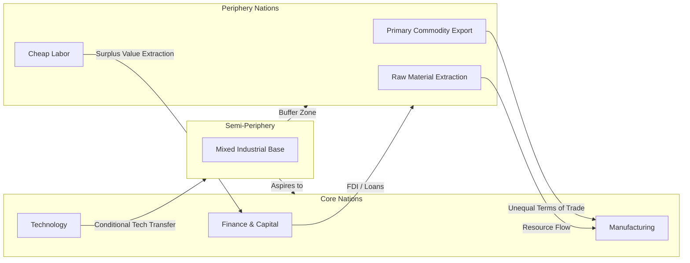

## Dependency Theory

### Overview and Definition

Dependency Theory is a body of social science theory positing that resources flow from a periphery of poor, underdeveloped states to a core of wealthy states, enriching the latter at the expense of the former. It emerged in the late 1950s and 1960s primarily from Latin American economists as a critique of modernization theory, arguing that underdevelopment is not simply an earlier stage on a universal path to development but is actively produced and reproduced through structural relationships in the global economic system.

The theory rejects the modernization-theory premise that all societies progress through similar linear stages (as in Rostow's stages of growth). Instead, dependency theorists argue that the global economy is structured as an interconnected system in which "core" (or "metropole") nations dominate "periphery" (or "satellite") nations, and this domination systematically prevents periphery nations from achieving autonomous, self-sustaining development.

### Historical and Intellectual Origins

**Key Points**

- Rooted in Latin American structuralism, particularly the work associated with the United Nations Economic Commission for Latin America and the Caribbean (ECLAC/CEPAL)
- Raúl Prebisch, an Argentine economist and first Secretary-General of ECLAC, is widely credited as a foundational figure through his work on the "Prebisch-Singer thesis"
- Emerged partly as a reaction against modernization theory's assumption that underdeveloped nations merely needed to replicate the developmental path of Western Europe and North America
- Influenced by, and influential upon, Marxist and neo-Marxist analyses of imperialism and global capitalism
- Gained prominence through the 1960s–1970s alongside decolonization movements and disillusionment with import-substitution industrialization outcomes

The **Prebisch-Singer thesis** holds that the terms of trade for primary commodity exporters (typically periphery nations) tend to deteriorate relative to manufactured goods exporters (typically core nations) over time. This challenged the classical and neoclassical trade theory assumption (rooted in comparative advantage) that free trade benefits all participating nations equally.

### Core Theoretical Propositions

1. **Core-periphery structure**: The global economy is divided into a dominant "core" of industrialized nations and a subordinate "periphery" of primary-commodity-producing nations.
2. **Structural exploitation**: Wealth is extracted from the periphery to the core through mechanisms such as unequal terms of trade, foreign direct investment, debt servicing, and multinational corporate profit repatriation.
3. **Underdevelopment as a produced condition**: Underdevelopment is not a natural or original state but a historically produced condition resulting from colonialism and ongoing integration into the world capitalist system on unfavorable terms.
4. **Blocked autonomous development**: Dependent economies cannot replicate the developmental trajectory of core nations because their economic structures are shaped to serve core interests (e.g., export-oriented monoculture, extractive industries).
5. **Elite complicity**: Local elites in periphery states often benefit from and therefore help perpetuate the dependent relationship, acting as intermediaries for core interests.

### Major Theoretical Variants

#### 1. ECLAC Structuralism (Prebisch, Furtado)

Focused on the deteriorating terms of trade and advocated **import-substitution industrialization (ISI)** as a policy response—using tariffs and state intervention to develop domestic manufacturing capacity rather than relying on primary export commodities.

#### 2. Andre Gunder Frank's "Development of Underdevelopment"

Frank argued in his 1966 essay that underdevelopment in Latin America was not a residual pre-capitalist condition but a direct product of centuries of integration into the capitalist world system through a chain of metropolis-satellite relationships extending from global core cities down to local rural areas. He contended that even reformist or nationalist development strategies within the capitalist framework could not escape this dynamic; only a break with capitalism itself could resolve it.

#### 3. World-Systems Theory (Immanuel Wallerstein)

An extension and elaboration of dependency theory, Wallerstein's world-systems analysis introduced a tripartite structure:

- **Core**: high-wage, capital-intensive, technologically advanced production
- **Periphery**: low-wage, labor-intensive, raw-material extraction
- **Semi-periphery**: an intermediate zone exhibiting characteristics of both, serving as a buffer that stabilizes the system politically

World-systems theory treats the capitalist world-economy as a single unit of analysis spanning centuries, rather than analyzing nation-states in isolation.

#### 4. Fernando Henrique Cardoso and Enzo Faletto — "Dependent Development"

Cardoso and Faletto offered a less deterministic, more historically contingent variant, arguing that dependency did not preclude *any* capitalist industrial growth in the periphery. Instead, they described "associated-dependent development," in which local elites, the state, and foreign capital could form alliances producing significant (if distorted and unequal) industrialization—famously seen in Brazil. This variant is more attentive to internal class dynamics and political agency than Frank's more structurally deterministic account.

#### 5. Samir Amin — "Unequal Exchange" and Delinking

Samir Amin emphasized unequal exchange between core and periphery labor and advocated "delinking"—a strategy of partial disengagement from the world capitalist market to pursue autocentric (self-centered) national development.

### Mechanisms of Dependency

**Key Points**

- **Trade dependency**: Reliance on a narrow range of primary commodity exports subject to volatile prices and long-term terms-of-trade decline
- **Financial dependency**: Reliance on foreign capital, loans, and aid, often resulting in debt burdens and conditionalities (e.g., structural adjustment programs)
- **Technological dependency**: Reliance on imported technology and expertise, limiting domestic innovation capacity
- **Multinational corporate penetration**: Foreign direct investment concentrated in extractive sectors, often with profit repatriation rather than reinvestment
- **Cultural/ideological dependency**: Adoption of core-nation consumption patterns, educational models, and values that reinforce economic dependency patterns

### Illustrative Diagram: Core-Periphery Resource Flow

### Policy Implications

**Example**

A canonical policy response derived from dependency theory is **Import-Substitution Industrialization (ISI)**, pursued extensively in Latin America (Brazil, Argentina, Mexico) from the 1930s–1980s. ISI involved:

- High tariffs and quotas on manufactured imports
- State subsidies and investment in domestic industry
- Currency controls to protect nascent industries

[Inference] Most economic historians consider ISI's long-term record mixed at best: it produced initial industrial growth in several countries but is widely associated with inefficiency, fiscal strain, and balance-of-payments crises, contributing to the Latin American debt crisis of the 1980s. This assessment reflects broad but not universal consensus among economists and is not a settled matter of pure fact.

Other policy prescriptions associated with dependency theory include:

- Regional economic integration among periphery states to reduce reliance on core markets
- Nationalization of key industries (especially extractive sectors)
- Amin's "delinking" strategy of selective disengagement from world markets
- South-South cooperation frameworks (e.g., the Non-Aligned Movement's economic dimensions, the New International Economic Order (NIEO) proposals at the UN in the 1970s)

### Critiques of Dependency Theory

**Key Points**

- **Empirical challenge from East Asian "Tiger" economies**: South Korea, Taiwan, Singapore, and Hong Kong achieved rapid export-oriented industrialization and development despite (or arguably through) deep integration into the global capitalist economy, contradicting the theory's core prediction that periphery status blocks development.
- **Neoclassical economists** argue dependency theory underestimates the role of domestic institutional quality, governance, and policy choices in explaining divergent development outcomes, attributing too much causal weight to external structural factors.
- **Determinism critique**: Frank's original formulation is criticized as overly deterministic, offering little room for agency, policy variation, or historical contingency—a critique that motivated Cardoso and Faletto's more nuanced "dependent development" framework.
- **Vagueness and unfalsifiability**: Critics (including some sympathetic to the broader left) argue that "dependency" is sometimes used so broadly that it becomes difficult to specify testable causal mechanisms or predictions.
- **Neoliberal critique**: From the 1980s onward, neoliberal economists associated with the "Washington Consensus" argued dependency-inspired protectionist policies (like ISI) caused more harm than the trade relationships they sought to escape.
- [Inference] Contemporary development economics has moved toward more institutionalist and mixed frameworks (e.g., the work of Daron Acemoglu and James Robinson on extractive vs. inclusive institutions) that incorporate some dependency-theory insights about historical exploitation while rejecting its more deterministic claims; characterizing the current state of the field this way reflects a synthesis of prevailing academic trends rather than a single verifiable fact.

### Relevance to Political Development and Modernization

Within the broader chapter context, Dependency Theory functions as a direct theoretical counterpoint to **modernization theory**. Where modernization theory (Rostow, Lipset, Almond) frames political and economic development as an internally-driven, linear process of traditional societies converging toward a Western liberal-capitalist-democratic model, dependency theory reframes underdevelopment as externally imposed and structurally reinforced. This has significant implications for political development:

- It challenges the assumption that democratization and economic liberalization are mutually reinforcing, since periphery states may face domestic political instability precisely *because of* their externally dependent economic structures (e.g., commodity price shocks destabilizing state revenue and legitimacy).
- It informs critiques of foreign aid and international financial institutions (IMF, World Bank) as mechanisms that can reproduce dependency rather than resolve it, particularly through structural adjustment conditionalities.
- It provides an analytical foundation for postcolonial and world-systems approaches to comparative politics, shifting the unit of analysis from the individual nation-state to the global system of unequal relations.

### Comparative Summary Table

| Dimension | Modernization Theory | Dependency Theory |
| --- | --- | --- |
| Unit of analysis | Individual nation-state | Global system (core-periphery) |
| Cause of underdevelopment | Internal/traditional factors (culture, institutions) | External/structural factors (exploitation) |
| Development trajectory | Linear, universal stages | Contingent, often blocked by structural position |
| Policy prescription | Emulate Western institutions, open markets | Protectionism, delinking, state-led industrialization |
| View of international trade | Mutually beneficial | Structurally unequal |
| Key theorists | Rostow, Lipset, Almond | Prebisch, Frank, Cardoso, Wallerstein, Amin |

### Related Topics

- Modernization Theory (Rostow's Stages of Growth)
- World-Systems Theory (Wallerstein)
- Import-Substitution Industrialization (ISI)
- The Prebisch-Singer Thesis
- Postcolonial Theory in Political Science
- The New International Economic Order (NIEO)
- East Asian Developmental State Model
- Structural Adjustment Programs and the Washington Consensus
- Neo-Marxist Theories of Imperialism
- Comparative Political Economy of Development