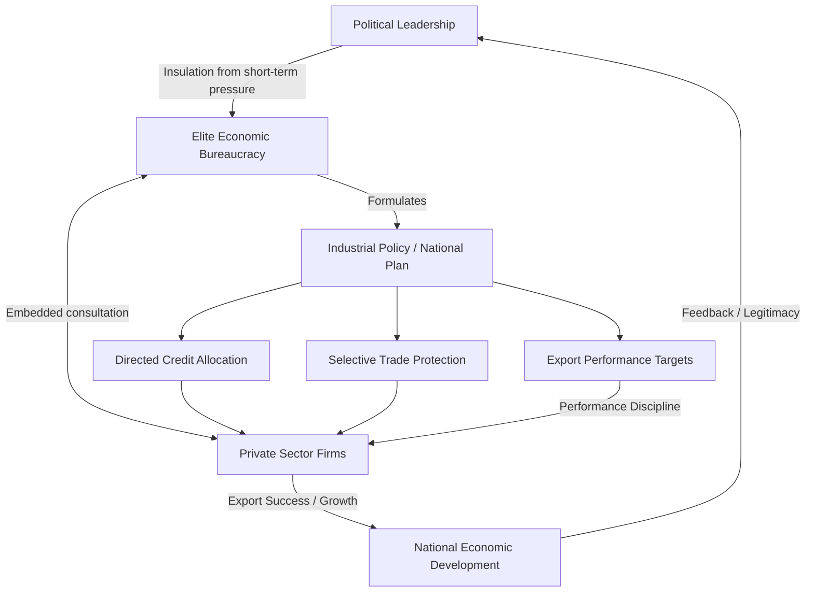

## The Developmental State

### Overview and Definition

The Developmental State refers to a model of political economy in which the state takes a central, directive role in guiding and accelerating national economic development, rather than merely regulating markets or providing a passive institutional framework as in classical liberal theory. The term was coined by political scientist Chalmers Johnson in his 1982 study of Japan's postwar economic bureaucracy, *MITI and the Japanese Miracle*, and was subsequently generalized to describe similar state-led development trajectories in South Korea, Taiwan, and Singapore.

The developmental state model stands in contrast both to laissez-faire liberal capitalism (where the state's role is minimized) and to Soviet-style command economies (where the state fully replaces market mechanisms). Instead, it describes a "plan-rational" state that harnesses market mechanisms toward nationally-defined developmental goals.

### Historical and Intellectual Origins

**Key Points**

- Chalmers Johnson's analysis of Japan's Ministry of International Trade and Industry (MITI) is the foundational text of the concept
- Emerged as an explanation for the "East Asian Miracle"—the rapid industrialization of Japan, South Korea, Taiwan, Hong Kong, and Singapore in the postwar decades
- Developed partly in dialogue with, and as a challenge to, both neoclassical economics (which credited market liberalization) and dependency theory (which predicted periphery states could not achieve autonomous development)
- The World Bank's 1993 report *The East Asian Miracle* represented a partial, if reluctant, mainstream economic acknowledgment of state-guided development's role, though it emphasized "market-conforming" interventions
- Influenced by earlier statist and mercantilist traditions of political economy (e.g., Friedrich List's arguments for infant-industry protection in 19th-century Germany)

### Core Theoretical Propositions (Chalmers Johnson's Framework)

Johnson identified several defining institutional features of the developmental state, contrasted against the American "regulatory state":

1. **A small, elite economic bureaucracy** staffed by the best-educated talent in the country, given significant autonomy to design and implement industrial policy (e.g., Japan's MITI, Korea's Economic Planning Board)
2. **A political system giving the bureaucracy room to maneuver**, typically a dominant-party or authoritarian arrangement that insulates technocrats from short-term electoral pressure and particularistic interest-group capture
3. **Market-conforming methods of state intervention**, such as targeted credit allocation, tax incentives, and selective protection—rather than direct nationalization or comprehensive central planning
4. **A pilot agency** (like MITI) that formulates and implements industrial policy in close, iterative consultation with the private sector
5. **Plan rationality over market rationality**: the state sets substantive developmental goals and priorities, using the market as an instrument rather than treating market outcomes as inherently optimal

### The Concept of "Embedded Autonomy" (Peter Evans)

Sociologist Peter Evans refined the developmental state concept in his 1995 work *Embedded Autonomy: States and Industrial Transformation*, arguing that effective developmental states combine two seemingly contradictory qualities:

- **Autonomy**: state bureaucrats are insulated from capture by particularistic private interests, enabling coherent, long-term policy formulation
- **Embeddedness**: the state maintains dense, structured networks of communication and negotiation with private-sector actors, allowing policy to be informed by and responsive to real economic conditions

[Inference] Evans's framework is widely regarded in comparative political economy as the most influential refinement of Johnson's original concept, though scholars continue to debate how precisely "embedded autonomy" can be operationalized and measured across cases—this reflects a broad but not unanimous scholarly assessment.

### Key Institutional Mechanisms

**Key Points**

- **Industrial policy**: selective, targeted support (subsidized credit, tax breaks, trade protection) for strategic sectors identified as having high growth or export potential
- **Directed/policy-based credit allocation**: state-controlled or state-influenced banks channel capital toward favored industries rather than relying solely on market-based capital allocation
- **Export-oriented industrialization (EOI)**: unlike Latin American import-substitution industrialization, East Asian developmental states pushed firms to compete in international export markets as a discipline mechanism and growth engine
- **Performance-based reciprocity**: state support was often conditioned on measurable performance benchmarks (e.g., export targets), disciplining recipient firms and avoiding indefinite rent-seeking
- **Land reform and human capital investment**: early redistributive land reforms (notably in Japan, South Korea, and Taiwan) and heavy investment in mass education created preconditions for equitable, broad-based growth
- **Selective, calibrated integration with global markets**: developmental states engaged with international trade and capital flows strategically rather than either fully opening or fully closing their economies

### Illustrative Diagram: Developmental State Institutional Architecture

### Comparative Cases

#### Japan

MITI coordinated postwar industrial policy, promoting sectors like steel, shipbuilding, automobiles, and later electronics through administrative guidance (*gyōsei shidō*), rather than always relying on binding legal mandates. The Ministry of Finance and the Bank of Japan complemented this through directed credit policy.

#### South Korea

Under Park Chung-hee (1961–1979), the state used five-year economic development plans, the Economic Planning Board, and state-influenced banks to channel credit to *chaebols* (large family-controlled conglomerates like Samsung and Hyundai) conditioned on export performance.

#### Taiwan

Combined a strong state-owned enterprise sector in upstream industries with support for small and medium enterprises in export manufacturing, guided by the Council for Economic Planning and Development.

#### Singapore

Employed an unusually direct developmental role through state-linked enterprises (e.g., Temasek Holdings) alongside aggressive courting of multinational foreign direct investment—a variant sometimes distinguished as more state-capitalist than the Japanese/Korean bureaucratic-guidance model.

### Critiques and Limitations

**Key Points**

- **Neoclassical critique**: economists associated with the "getting prices right" school argue that East Asian success stemmed primarily from sound macroeconomic fundamentals (fiscal discipline, human capital investment, export orientation) rather than industrial policy per se, and that state intervention succeeded *despite*, not because of, picking winners.
- **Crony capitalism and moral hazard risk**: close state-business ties can degrade into rent-seeking and corruption absent strong performance discipline—a dynamic some scholars link to the 1997 Asian Financial Crisis, particularly regarding over-leveraged chaebols and connected lending practices.
- **Authoritarian association**: the classic developmental state cases (Korea, Taiwan under martial law, Singapore) developed under authoritarian or semi-authoritarian conditions, raising the question of whether the model requires curtailed political pluralism—a contested causal claim rather than an established fact. [Inference] Subsequent democratization in Korea and Taiwan alongside continued (if evolving) economic dynamism has led many scholars to argue that authoritarianism was not a strict developmental prerequisite but rather a historically contingent feature of those particular cases.
- **Replicability critique**: attempts to transplant developmental-state institutions to other regions (parts of Africa, Latin America) have had mixed or limited success, suggesting the model may depend on specific historical, geopolitical (e.g., Cold War-era US support), and bureaucratic-capacity preconditions not easily replicated elsewhere.
- **Globalization pressure**: some scholars argue that WTO rules, global capital mobility, and international trade agreements have narrowed the policy space available for classic developmental-state-style industrial policy in the 21st century.

### Relevance to Political Development and Modernization

The Developmental State model occupies a distinctive position in debates over political development, offering an alternative to both classical modernization theory and dependency theory:

- Against **modernization theory**, it demonstrates that development need not follow a uniform liberal-democratic-capitalist path; East Asian developmental states achieved rapid modernization through strong state direction rather than free-market liberalism or Western-style pluralist democracy (at least initially).
- Against **dependency theory**, it demonstrates that integration into the global capitalist economy does not necessarily preclude autonomous development, provided the state possesses sufficient bureaucratic capacity and autonomy to negotiate favorable terms and direct domestic resources strategically.
- It raises enduring questions in comparative politics about the relationship between regime type and development outcomes, state capacity as an independent variable in development, and the sequencing of political versus economic liberalization.
- Contemporary debates extend the concept to discussions of China's state-led growth model, and to "new developmentalism" debates about industrial policy's return in advanced economies (e.g., US CHIPS Act discussions).

### Comparative Summary Table

| Dimension | Developmental State | Modernization Theory | Dependency Theory |
| --- | --- | --- | --- |
| Role of state | Central, directive ("plan-rational") | Facilitative/minimal | Structurally constrained by external forces |
| View of markets | Instrument of national goals | Self-regulating, efficient | Structurally biased toward core nations |
| Trade orientation | Selective export-orientation | Open trade assumed beneficial | Trade seen as exploitative |
| Regime association | Often authoritarian/dominant-party (historically) | Assumed liberal-democratic trajectory | Regime type secondary to structural position |
| Key theorists | Chalmers Johnson, Peter Evans | Rostow, Lipset, Almond | Prebisch, Frank, Wallerstein |

### Related Topics

- Chalmers Johnson's *MITI and the Japanese Miracle*
- Peter Evans's "Embedded Autonomy"
- The East Asian Miracle (World Bank, 1993)
- Import-Substitution Industrialization vs. Export-Oriented Industrialization
- State Capacity and Political Development
- The 1997 Asian Financial Crisis
- China's State-Led Growth Model and Debates on "State Capitalism"
- Friedrich List and Infant-Industry Protection
- Bureaucratic Autonomy and Weberian State Theory
- Comparative Political Economy of Industrial Policy