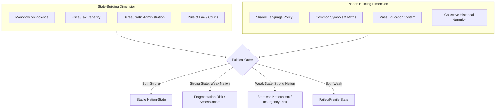

## State-Building and Nation-Building

### Overview and Definition

State-Building and Nation-Building are two related but analytically distinct processes central to the study of political development. **State-building** refers to the construction of effective governing institutions—a functioning bureaucracy, a monopoly on the legitimate use of force, tax collection capacity, and rule-enforcement mechanisms. **Nation-building** refers to the construction of a shared collective identity, sense of belonging, and social cohesion among a population, binding diverse groups into a unified political community.

Although often conflated in policy and media discourse (especially in the context of post-conflict interventions), political scientists generally treat them as separate dimensions: a state can exist with effective institutions but weak national identity (risking secessionism or civil conflict), or a strong sense of shared identity can exist without effective state institutions (as in stateless or failed-state nationalism movements).

### Conceptual Distinctions

**Key Points**

- **State**: a set of administrative, legal, extractive, and coercive institutions exercising authority over a defined territory (following Max Weber's definition emphasizing the monopoly on legitimate violence)
- **Nation**: a community of people who perceive themselves as sharing a common identity, history, culture, or destiny—what Benedict Anderson termed an "imagined community"
- **Nation-state**: the ideal-typical convergence of state and nation, where political boundaries align with a population's sense of shared identity
- **State-building** emphasizes institutional capacity: bureaucratic effectiveness, fiscal extraction, security provision, rule of law
- **Nation-building** emphasizes identity formation: shared symbols, common language policy, collective memory, civic or ethnic solidarity

[Inference] Many scholars of comparative politics regard the conflation of these two processes in post-2001 US and international interventions (Afghanistan, Iraq) as a significant analytical and practical error—this is a widely held view in the academic literature but represents an interpretive judgment rather than a settled empirical fact.

### Theoretical Foundations

#### Charles Tilly — "War Made the State, and the State Made War"

Tilly's historical-sociological account of European state formation argues that early modern states emerged largely through the fiscal-military demands of warfare. Rulers needed revenue to fight wars, which required building tax-collection bureaucracies; the need to enforce compliance and suppress rivals required building coercive and administrative apparatuses. This "bellicist" or war-making theory frames state-building as substantially a byproduct of coercion, extraction, and protection rackets rather than a purely deliberate constitutional design process.

#### Benedict Anderson — "Imagined Communities"

Anderson's influential theory of nationalism argues that nations are socially constructed "imagined communities," made possible by developments such as print capitalism (the spread of vernacular-language newspapers and novels), which allowed geographically dispersed people to conceive of themselves as part of a shared community they would never personally encounter in full.

#### Ernest Gellner — Nationalism and Industrialization

Gellner argued that nationalism is functionally tied to the demands of industrial society, which requires a culturally homogeneous, literate workforce capable of communicating across an anonymous, mobile labor market—hence the state's promotion of standardized national languages and mass education.

#### Eric Hobsbawm — "Invented Traditions"

Hobsbawm emphasized that many national traditions, symbols, and rituals presented as ancient are, in fact, relatively recent inventions deliberately constructed to legitimize political authority and foster group cohesion.

#### Civic vs. Ethnic Nationalism

A key distinction in the literature (associated with scholars like Hans Kohn) contrasts:

- **Civic nationalism**: national identity based on shared citizenship, political values, and voluntary allegiance to common institutions (often associated with Western European and North American cases)
- **Ethnic nationalism**: national identity based on shared ancestry, language, religion, or ethnicity (often associated with Central/Eastern European cases)

[Inference] This civic/ethnic dichotomy is a heuristic device widely used in teaching and comparative analysis, though many scholars caution that real-world cases usually blend both elements rather than falling cleanly into one category—this caveat reflects a common scholarly qualification rather than a universally settled taxonomy.

### Dimensions and Sequencing of State-Building

**Key Points**

- **Coercive capacity**: establishing a monopoly on legitimate violence, disarming rival armed groups, building police and military institutions
- **Fiscal capacity**: developing tax collection and public finance systems sufficient to fund state functions independent of external rents or aid
- **Administrative/bureaucratic capacity**: building a professional civil service capable of implementing policy, following Weberian principles of rational-legal authority
- **Legal-institutional capacity**: establishing courts, property rights enforcement, and a functioning rule of law
- **Infrastructural power** (Michael Mann's term): the state's capacity to actually penetrate society and implement decisions across its territory, as distinct from mere "despotic power" (the scope of elite decision-making authority)

A recurring debate in the sequencing literature concerns **which comes first**: some scholars (associated with the "stateness first" school, e.g., Francis Fukuyama) argue effective state institutions must precede meaningful democratization, since democratic contestation without strong institutions risks instability; others argue inclusive political processes are themselves necessary to build legitimate, durable state capacity.

### Illustrative Diagram: State-Building vs. Nation-Building Dimensions

### Case Illustrations

**Example**

- **Western Europe (early modern period)**: Tilly's paradigm case—centuries-long, largely endogenous process of warfare-driven state consolidation (e.g., France, Prussia) that gradually merged with nation-building through shared language standardization and public education in the 19th century.
- **Post-colonial Africa**: many states inherited colonial-era borders that grouped together diverse ethnic and linguistic communities without corresponding national identity, producing what some scholars term a "state without a nation" problem, contributing to persistent legitimacy and cohesion challenges.
- **Post-2001 Afghanistan**: an often-cited example of externally sponsored state-building (constructing government ministries, security forces, elections) proceeding without commensurate progress on nation-building (shared national identity across ethnic and tribal lines), which many analysts cite as a contributing factor in the state's fragility. [Unverified] The precise causal weight of this dynamic relative to other factors (insurgency, corruption, external interference) remains actively debated among specialists rather than settled.
- **Singapore**: an often-cited successful case of deliberate, state-directed nation-building (multiracial policy, national language planning, national service) proceeding in tandem with rapid state and economic institution-building.

### External/International State-Building Interventions

**Key Points**

- Post-Cold War and post-9/11 international interventions (UN peacekeeping/peacebuilding missions, US-led interventions in Afghanistan and Iraq) prompted a large literature on "liberal peacebuilding" and externally assisted state-building
- Common critique: externally imposed state-building often prioritizes rapid institutional replication (elections, constitutions, security forces) without adequately fostering the underlying social legitimacy or identity cohesion nation-building requires
- The "local ownership" critique argues that durable state legitimacy requires domestically rooted, not externally imposed, institutional design
- Debates persist over whether international actors can meaningfully contribute to nation-building at all, given its inherently endogenous, identity-based character, as opposed to state-building's more technical/institutional character which may be more amenable to external assistance

### Critiques and Debates

**Key Points**

- **Fukuyama's critique**: Francis Fukuyama (in *State-Building: Governance and World Order in the 21st Century*) argues that the international community has significant expertise in state *weakening* (via structural adjustment, decentralization pressures) but comparatively underdeveloped tools for state *strengthening*.
- **Ethnic/civic nationalism critique**: critics argue the ethnic/civic dichotomy can be used to implicitly valorize Western civic nationalism as more "modern" or benign while stigmatizing non-Western ethnic nationalism, a framing some scholars regard as Eurocentric.
- **Sequencing debate**: the "stateness first" position (state capacity before democratization) is contested by scholars who point to cases of successful simultaneous or democratization-led development, arguing institutional capacity and political inclusion can be mutually reinforcing rather than strictly sequential.
- **Bellicist theory's limited generalizability**: some scholars question whether Tilly's Europe-derived "war made the state" model applies well to contemporary post-colonial contexts, where international norms against territorial conquest and externally drawn borders alter the incentive structures that historically drove European state consolidation.

### Relevance to Political Development and Modernization

State-building and nation-building sit at the conceptual core of political development theory, providing the institutional and identity-based preconditions that other developmental processes (economic modernization, democratization) are often theorized to depend upon:

- Samuel Huntington's *Political Order in Changing Societies* argued that political decay (instability, praetorianism) results when social mobilization outpaces institutional capacity—directly linking state-building deficits to developmental crises.
- The concept complements modernization theory by identifying institutional and identity prerequisites that pure economic or cultural modernization accounts may underspecify.
- It provides a critical lens for evaluating democratization sequencing debates: whether elections and political liberalization are sustainable absent prior state and national cohesion.
- It connects directly to contemporary debates on state fragility, failed states, and international development/security policy.

### Comparative Summary Table

| Dimension | State-Building | Nation-Building |
| --- | --- | --- |
| Primary focus | Institutional capacity | Collective identity |
| Key theorist(s) | Charles Tilly, Max Weber, Michael Mann | Benedict Anderson, Ernest Gellner, Eric Hobsbawm |
| Core mechanism | Coercion, extraction, bureaucratization | Shared symbols, language, education, narrative |
| Risk if absent | State collapse, ungoverned space | Secessionism, ethnic conflict, weak legitimacy |
| External assistance feasibility | Comparatively more tractable | Considered more inherently endogenous |

### Related Topics

- Max Weber's Definition of the State
- Charles Tilly's Bellicist Theory of State Formation
- Benedict Anderson's *Imagined Communities*
- Samuel Huntington's *Political Order in Changing Societies*
- Failed and Fragile States Theory
- Civic vs. Ethnic Nationalism
- Post-Colonial State Formation in Africa
- Liberal Peacebuilding and International Interventions
- Michael Mann's Despotic vs. Infrastructural Power
- Sequencing Debates: Democratization vs. State Capacity