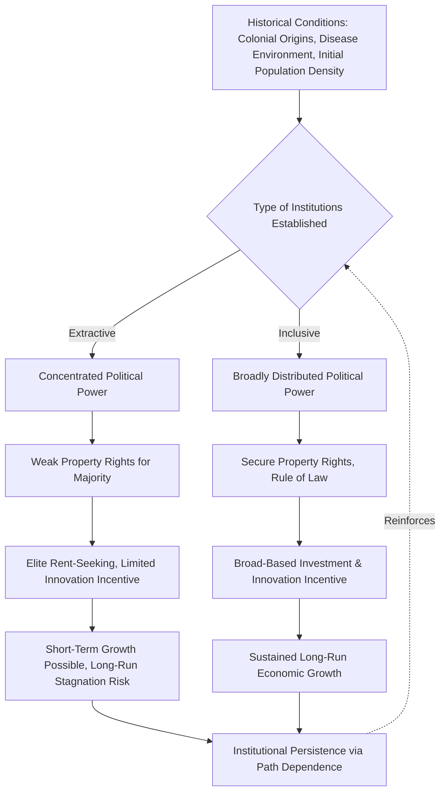

## Institutions and Development Outcomes

### Overview and Definition

The study of Institutions and Development Outcomes examines how formal and informal "rules of the game" governing political, economic, and social interaction shape long-run patterns of national development. This body of work, often grouped under **New Institutional Economics (NIE)** and **institutionalist political science**, argues that institutions—rather than geography, culture, or factor endowments alone—are the primary determinant of why some nations achieve sustained prosperity and effective governance while others do not.

Douglass North's canonical definition frames institutions as "the humanly devised constraints that shape human interaction," encompassing both formal rules (constitutions, laws, property rights regimes) and informal constraints (norms, conventions, codes of conduct), along with their enforcement characteristics.

### Theoretical Foundations

**Key Points**

- **Douglass North**: Nobel laureate economist whose work (*Institutions, Institutional Change and Economic Performance*, 1990) established institutions as the central unit of analysis for explaining differential economic performance across societies and over time
- **New Institutional Economics (NIE)**: builds on and critiques neoclassical economics by incorporating transaction costs, property rights, and incomplete information into economic analysis, arguing institutions arise to reduce uncertainty and transaction costs in exchange
- **Path dependence**: North and others emphasize that institutional trajectories are historically contingent—early institutional choices constrain and shape subsequent developmental possibilities, making institutional change typically incremental rather than revolutionary
- **Douglass North, John Wallis, and Barry Weingast** — *Violence and Social Orders* (2009): distinguished "limited access orders" (natural states, where elite rent-sharing arrangements limit political and economic access to a narrow coalition) from "open access orders" (where political and economic competition is open to the broader population), framing the transition between them as the central puzzle of political-economic development

### Daron Acemoglu and James Robinson — Extractive vs. Inclusive Institutions

In *Why Nations Fail* (2012) and related academic work, Acemoglu and Robinson advance one of the most influential contemporary institutionalist theories of development:

- **Inclusive institutions**: political and economic institutions that broadly distribute power, protect property rights for the general population, enforce contracts impartially, and allow open economic and political participation—creating incentives for investment, innovation, and human capital accumulation
- **Extractive institutions**: institutions designed to extract resources and wealth from the majority for the benefit of a narrow elite, typically featuring concentrated political power, weak property rights protection for non-elites, and barriers to economic entry

Their central thesis holds that **extractive institutions can generate short-term growth** (particularly under strong central authority directing resources toward specific sectors) but are **not conducive to sustained, innovation-driven long-run growth**, because they fail to generate the broad-based incentives for investment and creative destruction that inclusive institutions provide. Political and economic institutions are theorized to be mutually reinforcing: extractive political institutions tend to produce and protect extractive economic institutions, and vice versa.

### The "Reversal of Fortune" and Colonial Origins Thesis

**Key Points**

- Acemoglu, Johnson, and Robinson's influential paper "The Colonial Origins of Comparative Development" (2001) argues that European colonizers established different types of institutions depending on local conditions
- In regions with high disease burden (malaria, yellow fever) hostile to European settlement, colonizers tended to establish "extractive" colonial states designed to extract resources with minimal investment in broad institutions
- In regions more hospitable to European settlement, colonizers tended to establish "settler colonies" with institutions replicating European property rights and governance structures (e.g., the United States, Australia, Canada)
- Their related "Reversal of Fortune" thesis observes that regions that were relatively prosperous and densely populated in 1500 (making them attractive for extractive colonial exploitation) frequently became *relatively poorer* by the 20th century than regions that were sparser and less developed at the time of colonization, which instead received settler-colonial, more inclusive institutions
- [Inference] This body of work is highly influential and widely cited in comparative political economy, though the causal identification strategy (using historical settler mortality as an instrumental variable) has been subject to significant methodological critique regarding data reliability and instrument validity—this represents an ongoing empirical dispute in the literature rather than a resolved question.

### Institutions vs. Geography vs. Culture Debates

A major fault line in development economics and comparative politics concerns the relative causal weight of institutions versus alternative explanations:

- **Geography hypothesis** (associated with Jeffrey Sachs and others): climate, disease ecology, access to coastlines, and natural resource endowments directly shape productivity and development potential, independent of institutional quality
- **Culture hypothesis**: value systems, trust levels, religious traditions, and social norms (associated with work following Max Weber's *Protestant Ethic* thesis) shape economic behavior and development trajectories
- **Institutions hypothesis** (Acemoglu, Robinson, North): institutions are the primary and most causally fundamental determinant, with geography and culture operating largely as historical inputs that shaped which institutions emerged, rather than as independent ongoing constraints

[Inference] Most mainstream development economists now favor some synthesis position acknowledging that institutions, geography, and culture interact rather than treating any single factor as exclusively determinative, though the relative weighting assigned to each remains genuinely contested across scholars and is not a matter of settled consensus.

### Types of Institutions Relevant to Development

**Key Points**

- **Property rights institutions**: security of ownership and contract enforcement, incentivizing investment
- **Political institutions**: constraints on executive power, checks and balances, electoral accountability mechanisms
- **Legal institutions**: independent judiciary, rule of law, predictable dispute resolution
- **Financial institutions**: banking regulation, credit market institutions, capital market development
- **Bureaucratic institutions**: civil service quality, meritocratic recruitment, administrative capacity (drawing on Weberian bureaucracy theory)
- **Informal institutions**: social norms, trust, corruption tolerance, clientelist networks—which can either complement or undermine formal institutional design

### Illustrative Diagram: Institutional Causal Pathway to Development

### Empirical Measurement Approaches

**Key Points**

- **Worldwide Governance Indicators (World Bank)**: composite measures of voice and accountability, political stability, government effectiveness, regulatory quality, rule of law, and control of corruption across countries
- **Polity/Polity5 dataset**: measures regime authority characteristics and political institutional structures over time
- **Economic Freedom Indices** (Fraser Institute, Heritage Foundation): measure property rights protection, regulatory burden, and market institutional quality
- **Doing Business Indicators** (historically published by the World Bank): measured regulatory institutional quality relevant to business formation and operation
- [Unverified] The precise cross-national comparability and construct validity of several of these composite governance indices has been questioned by methodologists, and specific index compositions and provider practices may have changed since these were last widely referenced in the literature; researchers should verify current index availability and methodology directly.

### Critiques and Debates

**Key Points**

- **Endogeneity critique**: critics argue institutional quality may itself be a *consequence* of economic development rather than (or in addition to) its cause, complicating simple causal claims that "institutions cause growth"
- **Overdetermination critique**: some scholars argue the inclusive/extractive institutions framework, like some dependency-theory formulations, risks becoming difficult to falsify if virtually any developmental outcome can be retrospectively attributed to institutional quality
- **China's growth puzzle**: China's rapid growth under a political system many classify as exhibiting extractive political institutions (limited political pluralism, weak formal property rights protections relative to Western benchmarks) is frequently cited as a challenging case for the strict Acemoglu-Robinson framework, prompting responses distinguishing political from economic institutional inclusivity, or characterizing China's trajectory as not yet having reached its long-run institutional test
- **Historical Institutionalism critique** (from comparative politics, e.g., work associated with Kathleen Thelen, Paul Pierson): argues NIE approaches can underspecify the political conflict, power distribution, and gradual/incremental modes of institutional change (layering, conversion, drift) that shape real-world institutional evolution, favoring a more historically grounded, less economistic approach

### Relevance to Political Development and Modernization

Institutional theories of development provide a crucial synthesizing and critical framework relative to other theories in this chapter:

- They offer an alternative to both **modernization theory** (which emphasizes cultural/social prerequisites) and **dependency theory** (which emphasizes external structural exploitation) by locating causal primacy in domestic institutional configuration, while still incorporating historical/colonial origins as a key explanatory variable.
- They provide theoretical grounding for the **developmental state** literature's emphasis on bureaucratic capacity and "embedded autonomy," reframing effective state institutions as a *type* of inclusive institutional arrangement.
- They inform contemporary development policy debates (World Bank, IMF, USAID) that increasingly emphasize "good governance" and institutional reform as conditions for aid effectiveness, alongside or in place of purely macroeconomic conditionality.
- They connect directly to debates on the sequencing of state-building, democratization, and economic liberalization discussed elsewhere in this chapter.

### Comparative Summary Table

| Theoretical Tradition | Primary Causal Factor | Key Theorists | Relationship to Other Chapter Theories |
| --- | --- | --- | --- |
| Institutionalism (NIE) | Formal/informal rules and enforcement | North, Acemoglu, Robinson, Weingast | Synthesizes/critiques modernization and dependency theory |
| Modernization Theory | Cultural/social values, linear stages | Rostow, Lipset | Institutions seen as downstream of modernization |
| Dependency Theory | External structural exploitation | Prebisch, Frank, Wallerstein | Institutions seen as shaped by colonial/global position |
| Developmental State | State bureaucratic capacity/autonomy | Johnson, Evans | Compatible: developmental state as inclusive-institution variant |

### Related Topics

- Douglass North's New Institutional Economics
- Acemoglu and Robinson's *Why Nations Fail*
- The Colonial Origins of Comparative Development (Settler Mortality Thesis)
- Limited Access Orders vs. Open Access Orders (North, Wallis, Weingast)
- Historical Institutionalism (Thelen, Pierson, Path Dependence)
- Worldwide Governance Indicators and Institutional Measurement
- Rule of Law and Property Rights in Development
- Weberian Bureaucracy and Administrative Capacity
- Geography vs. Institutions vs. Culture Debate in Development Economics
- China's Growth Model as a Test Case for Institutional Theory