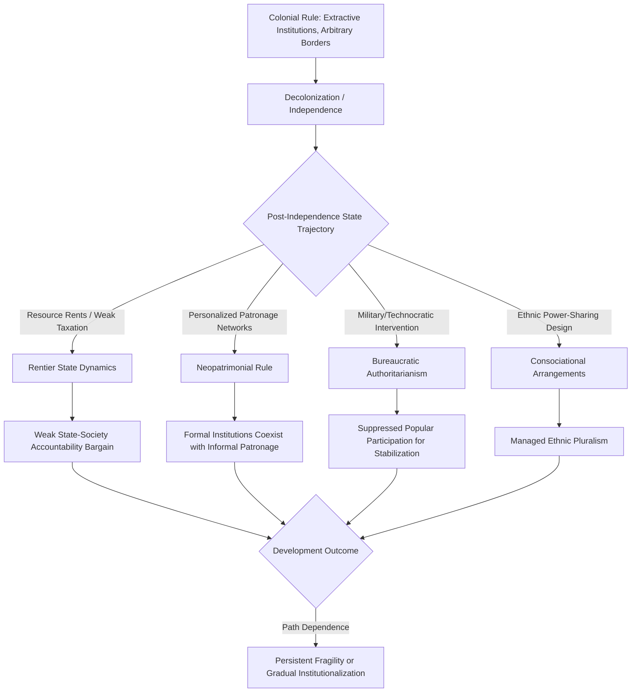

## Political Development in the Global South

### Overview and Definition

Political Development in the Global South refers to the study of state formation, institutional evolution, regime trajectories, and governance challenges in the post-colonial nations of Africa, Asia, Latin America, and the Middle East—regions historically categorized as the "Third World" during the Cold War and now more commonly termed the "Global South." This field examines how these states have navigated the transition from colonial or semi-colonial status to independent statehood, and the distinctive obstacles, patterns, and trajectories that have characterized their political development relative to the earlier, largely endogenous state-formation experience of Western Europe.

The field synthesizes and critically engages with several theoretical traditions covered elsewhere in this chapter—modernization theory, dependency theory, the developmental state, and institutionalism—while also generating region-specific frameworks attentive to colonial legacies, ethnic/religious pluralism, and the particular international-system context in which these states emerged (typically as juridically sovereign states before achieving full "empirical" statehood, per Robert Jackson's distinction).

### Historical Context: Decolonization and State Formation

**Key Points**

- The major wave of decolonization occurred roughly from the late 1940s (India, 1947) through the 1960s–1970s (much of Sub-Saharan Africa, later Portuguese colonies in the mid-1970s)
- Post-colonial states typically inherited **arbitrary colonial borders** that grouped multiple ethnic, linguistic, and religious communities together or split single communities across new international boundaries—a legacy frequently cited as a source of persistent internal conflict and weak national cohesion
- Robert Jackson's concept of **"quasi-states"** describes post-colonial states that possessed formal juridical sovereignty (recognized international borders, UN membership) without necessarily possessing the empirical attributes of effective statehood (administrative capacity, monopoly on violence, genuine control over territory)
- Many post-colonial states inherited colonial administrative and coercive apparatuses designed for extraction and control rather than for broad-based service provision or democratic representation, creating what some scholars term an "inherited institutional deficit"
- The Cold War superimposed superpower competition onto post-colonial political development, with the US and USSR often supporting client regimes based on geopolitical alignment rather than governance quality, a dynamic frequently cited as having entrenched authoritarian or patrimonial rule in various client states

### Distinctive Theoretical Frameworks

#### Patrimonialism and Neopatrimonialism

A dominant framework for analyzing Global South politics, particularly in Sub-Saharan Africa, draws on Max Weber's concept of patrimonial authority (rule based on personal loyalty and reciprocal obligation rather than impersonal legal-rational rules). **Neopatrimonialism** (associated with scholars including Jean-François Medard and Christopher Clapham) describes hybrid systems in which formal bureaucratic/legal-rational state structures coexist with informal patron-client networks, personal rule, and the use of state resources for political patronage.

- **Big man politics**: a related concept describing personalized rule by a dominant leader who distributes state resources and positions to maintain a loyal coalition
- **Prebendalism** (Richard Joseph's term, applied to Nigeria): the practice of state officials treating public office as a personal resource to be exploited for private and communal gain

#### The "Failed State" and "Fragile State" Literature

Emerging prominently in the 1990s (following state collapses in Somalia, Liberia, and elsewhere), this literature (associated with scholars like Robert Rotberg and William Zartman) categorizes states along a spectrum from strong to weak to failed/collapsed, based on their capacity to provide core political goods: security, rule of law, economic infrastructure, and basic services.

[Inference] The "failed state" framework and associated indices (such as the Fragile States Index) have drawn significant criticism from scholars who argue the concept can pathologize non-Western states relative to an implicitly Western institutional benchmark, and may obscure the historical/external (colonial, Cold War, contemporary great-power) contributions to state fragility—this is a substantive methodological and normative critique within the field rather than a settled consensus rejecting the concept outright.

#### Bureaucratic Authoritarianism (Guillermo O'Donnell)

Developed primarily to explain Latin American cases (Brazil, Argentina) in the 1960s–1970s, O'Donnell's concept describes military-technocratic regimes that emerged not as a stage of underdevelopment but as a response to the political and economic crises generated by advanced import-substitution industrialization, in which military and technocratic elites suppressed popular/labor political participation to implement stabilizing economic reforms.

#### Ethnic Politics and Consociationalism

Given the frequent ethnic and religious plurality inherited from colonial border-drawing, a substantial literature examines strategies for managing diversity, including:

- **Consociationalism** (Arend Lijphart): power-sharing arrangements among ethnic/religious elites, grand coalitions, mutual veto rights, proportionality in representation and resource allocation, and segmental autonomy
- **Centripetalism** (Donald Horowitz and others): institutional designs (e.g., electoral rules requiring cross-ethnic vote distribution) intended to incentivize moderate, cross-cutting political coalitions rather than formalizing ethnic blocs

### Regional Patterns and Variation

**Key Points**

- **Sub-Saharan Africa**: characterized by extensive scholarly attention to neopatrimonialism, weak fiscal/extractive state capacity (often attributed partly to reliance on natural resource rents and foreign aid rather than broad-based domestic taxation), and significant variation in post-Cold War democratization trajectories following the "second liberation" wave of the early 1990s
- **South and Southeast Asia**: exhibits substantial variation, from relatively durable democratic institutions (India, since independence, with periodic exceptions) to developmental-state-style authoritarian or semi-authoritarian trajectories (Singapore, historically Indonesia under Suharto) to persistent conflict-affected fragility (parts of the region)
- **Latin America**: distinctive for its earlier independence (early 19th century) relative to Africa/Asia, its cyclical patterns of democratic and authoritarian/military rule (illustrated by O'Donnell's bureaucratic authoritarianism), and its central role in generating dependency theory and ECLAC structuralism
- **Middle East and North Africa**: frequently analyzed through a distinctive lens addressing the region's comparative "authoritarian resilience" relative to global democratization trends, oil-rent-based "rentier state" dynamics, and post-2011 Arab Spring trajectories ranging from democratic transition (Tunisia, with mixed subsequent developments) to civil conflict (Syria, Libya, Yemen) to reinforced authoritarianism

### The Rentier State Thesis

A particularly influential regional framework, especially for oil-exporting states in the Middle East, the **rentier state thesis** (associated with Hazem Beblawi, Giacomo Luciani, and earlier Hossein Mahdavy) argues that states deriving substantial revenue from external rents (oil exports) rather than domestic taxation face weaker pressures toward accountable, representative governance, since the classic "no taxation without representation" bargaining dynamic between state and society is attenuated when the state does not depend on citizens' tax contributions for revenue.

### Illustrative Diagram: Post-Colonial Political Development Pathways

### Democratization Trends and "Waves"

**Key Points**

- Samuel Huntington's "**Third Wave**" of democratization (roughly 1974–1991) saw significant democratic transitions across Southern Europe, Latin America, parts of Asia, and, following the Cold War's end, Sub-Saharan Africa and Eastern Europe
- Many Global South democratic transitions during this period produced what scholars term "**hybrid regimes**" or "**illiberal democracies**"—systems combining formal multiparty elections with weak rule of law, restricted civil liberties, or entrenched executive dominance (frameworks associated with scholars like Larry Diamond, Steven Levitsky, and Lucan Way)
- [Unverified] Assessments of a subsequent global "democratic recession" or "backsliding" trend affecting numerous Global South (and some Global North) states have been widely discussed in recent scholarship and democracy-monitoring indices; the precise current state, trajectory, and country-specific classifications should be verified against up-to-date sources, as these assessments are time-sensitive and evolve with each reporting cycle
- Competitive authoritarianism (Levitsky and Way) describes regimes where formal democratic institutions exist and are the primary route to power, but incumbents systematically manipulate them to entrench their rule

### Critiques and Debates

**Key Points**

- **Eurocentrism critique**: postcolonial scholars (e.g., work influenced by Frantz Fanon, and later postcolonial theorists) argue that mainstream political development frameworks, even critical ones, often implicitly measure Global South states against a Western institutional benchmark, underappreciating alternative, indigenous, or hybrid governance forms
- **Agency vs. structure debate**: tension between frameworks emphasizing external/structural constraints (colonial legacy, dependency, great-power interference) and frameworks emphasizing domestic elite agency and choice (neopatrimonialism, institutional choice literature)
- **Homogenization critique**: critics caution against treating "the Global South" as a analytically undifferentiated category, given the vast variation in colonial experience, resource endowments, regime trajectories, and regional geopolitical context across Africa, Asia, Latin America, and the Middle East
- **Resource curse debate**: while the rentier state and "resource curse" literatures are influential, some scholars (e.g., work questioning the robustness of cross-national resource-curse findings) argue the relationship between resource wealth and poor governance outcomes is more contingent on pre-existing institutional quality than deterministic

### Relevance to Political Development and Modernization

This topic functions as a synthesizing capstone within the chapter, applying and testing the preceding theoretical frameworks against the empirical diversity of post-colonial state experience:

- It directly tests **modernization theory's** universalist assumptions against the actual, highly varied trajectories of post-colonial states, many of which have not converged toward a uniform liberal-democratic-capitalist model despite decades of development effort.
- It extends **dependency theory** and world-systems analysis by examining how colonial-era core-periphery relationships have evolved (or persisted) in the post-independence era through mechanisms like debt, foreign aid conditionality, and multinational resource extraction.
- It provides comparative testing ground for the **developmental state** model, asking why the East Asian experience has been difficult to replicate in most (though not all) Global South contexts.
- It applies **institutionalist theory** (extractive vs. inclusive institutions, colonial origins thesis) directly to the empirical cases from which much of that theory was derived.
- It connects to **state-building and nation-building** debates by examining the specific post-colonial challenge of constructing both state capacity and national cohesion within artificially bounded, often ethnically plural, territories.

### Comparative Summary Table

| Framework | Primary Region of Application | Key Theorists | Core Mechanism |
| --- | --- | --- | --- |
| Neopatrimonialism | Sub-Saharan Africa | Medard, Clapham, Joseph | Informal patronage within formal state structures |
| Bureaucratic Authoritarianism | Latin America | Guillermo O'Donnell | Military-technocratic suppression of popular participation |
| Rentier State Theory | Middle East (oil exporters) | Beblawi, Luciani, Mahdavy | External rents weaken state-society accountability bargain |
| Consociationalism/Centripetalism | Ethnically plural states (various regions) | Lijphart, Horowitz | Institutional management of ethnic pluralism |
| Competitive Authoritarianism | Cross-regional (post-Cold War) | Levitsky and Way | Formal democratic institutions manipulated by incumbents |

### Related Topics

- Robert Jackson's Concept of "Quasi-States"
- Neopatrimonialism and Big Man Politics
- Guillermo O'Donnell's Bureaucratic Authoritarianism
- The Rentier State and Resource Curse Debates
- Consociationalism vs. Centripetalism in Divided Societies
- Samuel Huntington's Waves of Democratization
- Competitive Authoritarianism and Hybrid Regimes (Levitsky and Way)
- Postcolonial Theory and Critiques of Eurocentric Development Frameworks
- The Arab Spring and Middle East Authoritarian Resilience
- Fragile and Failed States Literature (Rotberg, Zartman)