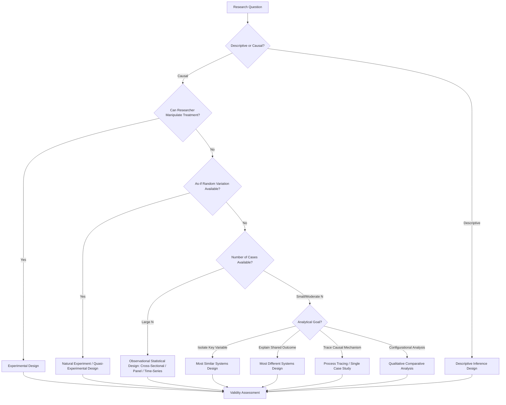

## Research Design in Political Science

### Overview and Definition

Research Design in Political Science refers to the systematic planning framework that connects a research question to appropriate methods of data collection, measurement, and analysis in order to produce valid, reliable causal or descriptive inferences about political phenomena. Research design encompasses the logical structure of an inquiry—how cases are selected, how variables are operationalized, what type of evidence is gathered, and how threats to inference validity are anticipated and addressed—prior to and independent of any specific statistical or qualitative technique applied to the resulting data.

Political science research design draws heavily on the broader philosophy and methodology of social science, particularly the influential framework articulated by Gary King, Robert Keohane, and Sidney Verba (KKV) in *Designing Social Inquiry* (1994), which sought to unify quantitative and qualitative research under a shared logic of scientific inference.

### The Scientific Inference Framework (King, Keohane, Verba)

**Key Points**

- KKV argue that both quantitative and qualitative research should aspire to the same underlying logic of valid causal and descriptive inference, differing primarily in technique rather than in fundamental epistemological standards
- Central concepts include: descriptive inference (characterizing what exists) versus causal inference (explaining why it exists or what effect one variable has on another)
- Emphasis on maximizing the number of observable implications of a theory, using all available information, and being explicit about the uncertainty of estimates
- [Inference] KKV's framework has been highly influential but has also generated substantial methodological pushback—particularly from qualitative and interpretivist scholars who argue it imposes a quantitative-inferential logic ill-suited to certain forms of qualitative and interpretive research—this represents an active and long-running methodological debate within the discipline rather than a resolved matter.

### Core Elements of Research Design

1. **Research question formulation**: specifying a clear, answerable question, distinguishing descriptive ("what happened/what exists") from causal ("what caused X" or "what effect does X have on Y") questions
2. **Theory and hypothesis specification**: deriving testable hypotheses from theoretical propositions, specifying the expected direction and, where possible, mechanism of relationships between variables
3. **Conceptualization and operationalization**: translating abstract theoretical concepts (e.g., "democracy," "state capacity," "political trust") into measurable indicators
4. **Case/unit selection**: determining the population of cases and the logic by which specific cases or observations are selected for study
5. **Data collection strategy**: determining whether data will be gathered through surveys, experiments, archival research, interviews, elite interviews, content analysis, or secondary/existing datasets
6. **Analytical strategy**: specifying the statistical or qualitative analytical technique appropriate to the design and data structure
7. **Validity and threat assessment**: anticipating and addressing threats to internal, external, construct, and measurement validity

### Major Research Design Types

#### Experimental Designs

Involve researcher manipulation of an independent variable (treatment) with random assignment of subjects to treatment and control conditions, enabling strong causal inference by design (rather than through post-hoc statistical control).

- **Laboratory experiments**: conducted in controlled settings, offering high internal validity but potentially limited external/ecological validity
- **Survey experiments**: embed randomized treatments (e.g., varying question wording or framing) within survey instruments
- **Field experiments**: conducted in real-world political settings (e.g., randomized get-out-the-vote mobilization studies), offering a balance of internal and external validity
- **Natural experiments**: exploit naturally occurring, "as-if random" variation in treatment assignment (e.g., discontinuities created by policy thresholds, redistricting, or historical accidents) when true experimental manipulation is infeasible or unethical

#### Observational Designs

Involve analysis of data where the researcher does not control treatment assignment, requiring statistical or design-based strategies to approximate causal inference.

- **Cross-sectional designs**: analyze variation across units (e.g., countries, individuals) at a single point in time
- **Time-series designs**: analyze variation within a single unit over time
- **Panel/longitudinal designs**: combine cross-sectional and time-series variation, observing multiple units over multiple time points, enabling techniques like fixed-effects estimation to control for time-invariant unit characteristics
- **Cross-national/comparative designs**: analyze variation across countries or subnational units, central to comparative politics

#### Case Study Designs

- **Single case studies**: in-depth examination of one case, useful for theory-building, process tracing, and hypothesis generation, though limited in generalizability
- **Comparative case studies**: examine a small number of cases using structured, focused comparison
- **Most Similar Systems Design (MSSD)**: selects cases that are similar on most background characteristics but differ on the key variable(s) of interest, isolating the effect of that variable (associated with Adam Przeworski and Henry Teune)
- **Most Different Systems Design (MDSD)**: selects cases that differ widely on most characteristics but share the outcome of interest, seeking common factors that explain the shared outcome despite broader diversity

### Qualitative and Mixed Methods Approaches

**Key Points**

- **Process tracing**: a within-case method that examines the causal chain and mechanisms linking a purported cause to an observed outcome, often using detailed sequential evidence (associated with scholars including Alexander George, Andrew Bennett, and Derek Beach)
- **Congruence testing**: assesses whether the observed values of variables in a case are consistent with what a given theory would predict
- **Qualitative Comparative Analysis (QCA)**: a set-theoretic, Boolean-algebra-based method (developed by Charles Ragin) for analyzing configurations of conditions associated with outcomes across a moderate number of cases, bridging small-N case-oriented and large-N variable-oriented approaches
- **Mixed methods designs**: combine quantitative and qualitative components, often using qualitative case studies to probe mechanisms underlying statistically identified relationships, or using quantitative analysis to establish generalizability of patterns identified through qualitative fieldwork
- **Multi-method research**: increasingly institutionalized as a standard for triangulating causal claims, combining, for example, a large-N regression with a small-N process-tracing case study

### Threats to Validity

**Key Points**

- **Internal validity**: the degree to which a causal claim about the relationship between variables within the study is warranted; threats include confounding variables, selection bias, reverse causality, and omitted variable bias
- **External validity**: the degree to which findings generalize beyond the specific study context (sample, setting, time period) to other populations or contexts
- **Construct validity**: the degree to which operational measures actually capture the theoretical concept they are intended to represent
- **Measurement validity and reliability**: whether indicators consistently and accurately measure the intended concept across observations and over time
- **Selection bias**: a particularly emphasized threat in political science methodology, occurring when cases are selected in a manner correlated with the outcome variable (e.g., "selecting on the dependent variable" by studying only successful revolutions without a comparison set of failed attempts)

### Illustrative Diagram: Research Design Decision Process

### Levels of Analysis in Political Science Research Design

**Key Points**

- **Individual level**: voter behavior, elite decision-making, political psychology studies
- **Group/organizational level**: political parties, interest groups, social movements, bureaucratic agencies
- **State/national level**: comparative politics studies of regime type, state capacity, policy outcomes
- **International/systemic level**: international relations studies of interstate interaction, alliance formation, and systemic distributions of power
- Research design choices regarding level of analysis carry significant implications for case selection, data availability, and the type of causal mechanisms that can be plausibly identified

### Common Methodological Pitfalls

**Key Points**

- **Selecting on the dependent variable**: studying only cases with a particular outcome (e.g., only successful democratic transitions) without a comparison group, precluding valid causal inference about what distinguishes those cases from non-occurrences
- **Endogeneity and reverse causality**: failing to account for the possibility that the outcome variable itself influences the purported explanatory variable
- **Ecological fallacy**: incorrectly inferring individual-level relationships from aggregate-level (e.g., national or district-level) data patterns
- **Overfitting in small-N designs**: adding explanatory variables until they perfectly account for a small number of cases, producing an account with no genuine predictive or generalizable content ("degrees of freedom problem," a concern raised prominently by KKV regarding small-N qualitative research)
- **Publication bias and researcher degrees of freedom**: concerns (heightened by the broader social science "replication crisis" discourse) regarding selective reporting of statistically significant results and flexible analytical choices made after observing the data

### Relevance to Political Analysis

Research design constitutes the methodological foundation underlying every substantive claim examined elsewhere in political science, including the theories of political development, modernization, dependency, and institutionalism covered in preceding chapter material:

- Claims about modernization theory's cross-national correlations (e.g., between economic development and democracy) depend on the cross-sectional/panel research designs and measurement choices used to operationalize "development" and "democracy."
- Dependency theory and world-systems claims about core-periphery relationships raise research design challenges regarding case selection (which countries/regions to compare) and the risk of selecting cases that confirm the theory's structural predictions.
- Developmental state and institutionalist claims about causal mechanisms (e.g., "embedded autonomy" or "extractive institutions" causing growth) rely heavily on process tracing and comparative case study designs to establish mechanism-level evidence beyond correlational patterns.
- Understanding research design equips students to critically evaluate the empirical support underlying competing theoretical claims throughout the discipline, rather than accepting theoretical propositions at face value.

### Comparative Summary Table

| Design Type | Causal Inference Strength | Generalizability | Typical N | Key Use Case |
| --- | --- | --- | --- | --- |
| Randomized Experiment | High | Variable (context-dependent) | Variable | Isolating causal effect of a manipulable treatment |
| Natural Experiment | Moderate-High | Context-dependent | Variable | Exploiting as-if random variation absent manipulation |
| Cross-Sectional/Panel Statistical | Moderate (with controls) | High (if representative sample) | Large | Testing generalizable cross-national/cross-unit patterns |
| Most Similar Systems Design | Moderate | Limited | Small | Isolating effect of key variable among similar cases |
| Most Different Systems Design | Moderate | Limited | Small | Explaining shared outcome despite case diversity |
| Process Tracing / Single Case | High (within-case) | Low (generalizability) | One (or few) | Establishing causal mechanism |
| Qualitative Comparative Analysis | Moderate | Moderate | Small-to-Moderate | Configurational/set-theoretic causal analysis |

### Related Topics

- King, Keohane, and Verba's *Designing Social Inquiry*
- Process Tracing and Causal Mechanisms (George, Bennett, Beach)
- Qualitative Comparative Analysis (Charles Ragin)
- Most Similar and Most Different Systems Designs (Przeworski and Teune)
- Selection Bias and "Selecting on the Dependent Variable"
- Internal, External, and Construct Validity
- Natural and Quasi-Experimental Methods in Political Science
- Mixed Methods Research Design
- The Replication Crisis and Research Transparency in Social Science
- Levels of Analysis Problem in Political Science