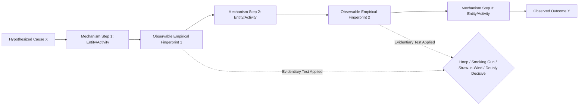

## Qualitative Methods and Process Tracing

### Overview and Definition

Qualitative Methods and Process Tracing encompass a family of research approaches in political science oriented toward understanding political phenomena through in-depth, within-case analysis, textual and contextual interpretation, and the reconstruction of causal mechanisms, as distinct from the variable-oriented, cross-case statistical logic of quantitative research. Process tracing specifically refers to a systematic method for examining the sequence of events, decisions, and causal mechanisms linking a hypothesized cause to an observed outcome within a single case or small number of cases.

These approaches address a core epistemological question distinct from (though complementary to) large-N statistical inference: not merely *whether* X is correlated with Y across many cases, but *how* and *why* X produces Y through identifiable causal steps in a specific historical or institutional context.

### Theoretical Foundations

**Key Points**

- **Alexander George and Andrew Bennett** — *Case Studies and Theory Development in the Social Sciences* (2005): a foundational text systematizing case study methodology, including structured, focused comparison and process tracing as rigorous, theory-oriented (rather than purely descriptive) qualitative techniques
- **Derek Beach and Rasmus Brun Pedersen** — developed a more formalized, philosophically explicit typology of process tracing variants, distinguishing theory-testing, theory-building, and explaining-outcome process tracing
- **David Collier** — contributed influential methodological clarifications on process tracing's core logic and its relationship to broader causal inference standards
- Process tracing draws on a **mechanism-based (as opposed to purely covariational) account of causation**, holding that establishing causal claims requires identifying the intervening causal process connecting cause and effect, not merely observing correlation between them

### Types of Process Tracing (Beach and Pedersen Typology)

1. **Theory-testing process tracing**: begins with an existing theory positing a causal mechanism, then examines whether the hypothesized mechanism's observable empirical fingerprints are actually present in the case
2. **Theory-building process tracing**: begins with an observed outcome and works to inductively construct a plausible causal mechanism from detailed case evidence, generating a new theoretical mechanism rather than testing an existing one
3. **Explaining-outcome process tracing**: aims to construct a sufficient explanation for a particular, often historically significant, outcome in a specific case, potentially combining multiple causal mechanisms and case-specific factors rather than seeking a generalizable mechanism

### The Logic of Causal Mechanisms

**Key Points**

- A **causal mechanism** is conceptualized as a series of interlocking parts—entities engaging in activities—that transmit causal force from an independent variable to a dependent variable
- Process tracing requires specifying the observable implications of a given causal mechanism at each step of the hypothesized causal chain, then gathering evidence to determine whether those implications are actually observed
- This contrasts with the "black box" character of purely statistical causal inference, which can establish that X is associated with Y without illuminating the process connecting them

### Van Evera's Four Tests / Evidentiary Tests in Process Tracing

A widely used framework (drawing on Stephen Van Evera, later systematized by scholars including David Collier) classifies process-tracing evidence according to its necessity and sufficiency for confirming a hypothesis:

| Test | Passing Confirms Hypothesis? | Failing Eliminates Hypothesis? | Description |
| --- | --- | --- | --- |
| **Straw-in-the-Wind** | Weakly (increases plausibility) | No | Evidence is neither necessary nor sufficient; provides weak support or weak doubt |
| **Hoop Test** | No (does not confirm) | Yes | Evidence is necessary but not sufficient; a hypothesis must "jump through the hoop," and failing eliminates it |
| **Smoking Gun** | Yes (strongly confirms) | No | Evidence is sufficient but not necessary; passing strongly confirms, but its absence does not eliminate the hypothesis |
| **Doubly Decisive** | Yes | Yes | Evidence is both necessary and sufficient; simultaneously confirms one hypothesis and eliminates rivals |

### Illustrative Diagram: Process Tracing Causal Chain

### Other Major Qualitative Approaches

#### Structured, Focused Comparison

Developed by Alexander George, this method involves posing a standardized set of theoretically informed questions across multiple cases, enabling systematic comparison while retaining the contextual depth of qualitative case analysis. "Structured" refers to the standardized questions; "focused" refers to the deliberate selection of a specific aspect of the cases relevant to the research objective.

#### Congruence Testing

Assesses whether the values of independent and dependent variables observed in a case are consistent with the predictions of a given theory, without necessarily tracing the detailed causal-mechanism steps that full process tracing requires—a comparatively less demanding form of within-case analysis.

#### Interpretivist and Ethnographic Approaches

- **Interpretivism**: emphasizes understanding political actors' own meanings, motivations, and self-understandings, often drawing on hermeneutic and constructivist epistemological traditions, in contrast to positivist approaches seeking generalizable causal laws
- **Ethnographic methods**: involve immersive fieldwork, participant observation, and prolonged engagement with political actors or communities (e.g., studies of local governance, social movements, or bureaucratic practice), associated with scholars such as James Scott
- **Elite interviewing**: structured or semi-structured interviews with political elites, officials, or key informants, often used to reconstruct decision-making processes not visible in public documentary records
- **Discourse and content analysis**: systematic qualitative (or qualitative-quantitative hybrid) analysis of political texts, speeches, or media content to identify framing, argumentation patterns, or ideological content

#### Qualitative Comparative Analysis (QCA)

Though sometimes classified as a distinct "configurational" method bridging qualitative and quantitative approaches, QCA (developed by Charles Ragin) uses Boolean/set-theoretic logic to identify combinations of conditions (configurations) associated with particular outcomes across a moderate number of cases, explicitly modeling causal complexity such as **equifinality** (multiple distinct causal paths leading to the same outcome) and **conjunctural causation** (causes that matter only in combination with other conditions).

### Case Selection Logic for Process Tracing

**Key Points**

- **Typical cases**: selected because they represent a broader class of cases well, used to illustrate or probe a general causal relationship
- **Deviant cases**: selected because they deviate from what existing theory or cross-case statistical patterns would predict, often used to identify omitted variables or refine theoretical scope conditions
- **Most-likely cases**: cases where a theory's predicted mechanism should be most clearly observable if the theory is correct; a failure to find the mechanism here strongly undermines the theory (a form of hoop test at the case-selection level)
- **Least-likely cases**: cases where the theory's mechanism should be hardest to observe; finding it here provides strong ("smoking gun"-type) confirmation, following a design logic associated with the "least-likely case" or "hard case" methodology (sometimes termed the Sinatra inference: "if I can make it there, I'll make it anywhere")
- **Crucial case designs**: cases specifically selected because they are theoretically decisive for adjudicating between competing hypotheses

### Combining Process Tracing with Large-N Analysis

**Key Points**

- **Nested analysis** (associated with Evan Lieberman): a mixed-methods framework combining a large-N statistical analysis to establish generalizable correlational patterns with a small-N, process-tracing case study to probe causal mechanisms and address outliers or model uncertainty
- Process tracing is frequently used to investigate cases identified as **outliers or influential observations** in a prior statistical analysis, helping to determine whether the outlier reflects mechanism failure, measurement error, or an omitted variable
- This combination directly addresses a core critique of purely statistical political science research—that establishing correlation does not by itself establish the causal mechanism connecting variables

### Strengths and Limitations

**Key Points**

- **Strengths**: high internal validity for the specific case(s) studied; capacity to uncover causal mechanisms invisible to cross-case statistical analysis; ability to generate new theoretical insights inductively; suitability for studying rare, complex, or historically specific events (revolutions, wars, critical junctures) where large-N samples are infeasible
- **Limitations**: limited generalizability beyond the case(s) studied (a central methodological trade-off, per KKV's "degrees of freedom" critique); vulnerability to confirmation bias in case selection and interpretation absent rigorous evidentiary standards; time- and resource-intensive relative to secondary-data statistical analysis; potential difficulty in achieving inter-coder or inter-researcher reliability for qualitative interpretive judgments
- [Inference] Contemporary methodological consensus in political science increasingly treats rigorous process tracing (with explicit evidentiary tests) and large-N statistical analysis as complementary rather than competing approaches, though debates about their relative epistemic priority and the proper standards for qualitative rigor remain active within the discipline—this characterization reflects a general disciplinary trend rather than a universally agreed-upon methodological settlement.

### Practical Application Example

**Example**

A researcher seeks to test the theory that international financial institution (IFI) conditionality *causes* domestic policy reform in borrowing countries (rather than reform occurring independently, with IFI lending arriving afterward). A **theory-testing process-tracing** design might proceed as follows:

1. Specify the hypothesized causal mechanism: IFI conditionality → domestic technocratic coalition empowerment → policy reform enactment
2. Identify observable implications: internal government memos referencing IFI conditions as leverage; timing sequence showing conditionality preceding, not following, reform enactment; technocrats citing IFI pressure in interviews or public statements
3. Gather evidence: archival government documents, IFI loan agreement texts and timing, elite interviews with former officials
4. Apply evidentiary tests: if government documents explicitly cite IFI conditions as the proximate trigger for a specific reform *and* the reform's design closely mirrors the conditionality's specific terms, this would function as a smoking-gun-type confirmation; if the reform timeline shows reform occurring *before* the relevant conditionality was imposed, this would function as a hoop test failure, undermining the causal claim

### Relevance to Political Analysis

Qualitative methods and process tracing provide the primary methodological tools for investigating causal mechanisms underlying the substantive theories addressed elsewhere in political science coursework:

- Testing **modernization theory's** claim that economic development causes democratization requires not just cross-national correlation but process-tracing evidence of the specific mechanism (e.g., middle-class formation, changing elite preferences) connecting the two.
- Evaluating **dependency theory** and **developmental state** claims about specific causal mechanisms (e.g., "embedded autonomy" producing effective industrial policy) relies heavily on detailed case studies and process tracing of bureaucratic decision-making.
- Assessing **institutionalist** claims (e.g., that particular colonial-era institutional choices caused long-run divergent development) often requires historical process tracing to establish the actual causal pathway, complementing cross-national statistical correlations.
- Provides essential methodological literacy for critically evaluating whether a given causal claim in political science rests on genuine mechanism-level evidence or merely on correlational association.

### Comparative Summary Table

| Method | Primary Goal | Typical N | Key Scholars |
| --- | --- | --- | --- |
| Theory-Testing Process Tracing | Test whether hypothesized mechanism is present | One (or few) | Beach and Pedersen, George and Bennett |
| Theory-Building Process Tracing | Inductively construct new causal mechanism | One (or few) | Beach and Pedersen |
| Explaining-Outcome Process Tracing | Construct sufficient explanation for a specific outcome | One | Beach and Pedersen |
| Structured, Focused Comparison | Systematic cross-case comparison via standardized questions | Small-to-Moderate | Alexander George |
| Qualitative Comparative Analysis | Identify configurational/set-theoretic causal patterns | Small-to-Moderate | Charles Ragin |
| Nested Analysis | Combine large-N correlation with small-N mechanism evidence | Large N + Small N subset | Evan Lieberman |

### Related Topics

- Alexander George and Andrew Bennett's Case Study Methodology
- Beach and Pedersen's Process Tracing Typology
- Van Evera's Four Evidentiary Tests (Hoop, Smoking Gun, Straw-in-the-Wind, Doubly Decisive)
- Qualitative Comparative Analysis (Charles Ragin)
- Nested Analysis and Mixed-Methods Research (Evan Lieberman)
- Case Selection Logic: Typical, Deviant, Most-Likely, Least-Likely Cases
- Elite Interviewing and Ethnographic Methods in Political Science
- Equifinality and Conjunctural Causation
- Interpretivism vs. Positivism in Social Science Epistemology
- Structured, Focused Comparison Methodology