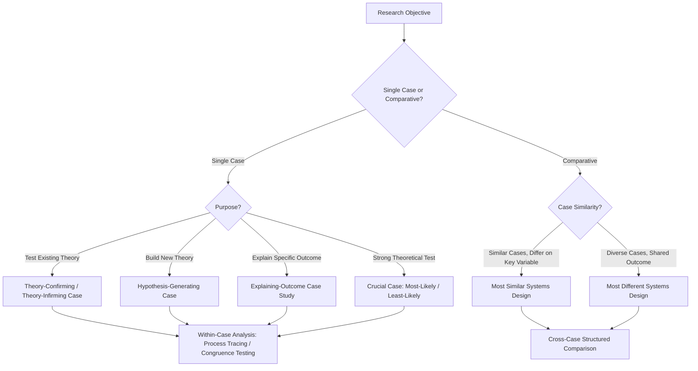

## Case Study Methodology

### Overview and Definition

Case Study Methodology refers to the systematic, in-depth investigation of one or a small number of instances (cases) of a broader class of political phenomena, undertaken to describe, explain, or generate theory about that phenomenon. In political science, a "case" is typically understood as an instance of a class of events, units, or processes—a country, a policy decision, a social movement, an election, or a historical episode—selected because it illuminates something of theoretical or substantive importance about the broader class it represents.

While related to and often employing process tracing as an analytical technique, case study methodology is a broader category encompassing the full logic of case selection, within-case analysis, and cross-case comparison in small-N research, distinct from process tracing's specific focus on causal-mechanism reconstruction.

### Theoretical Foundations

**Key Points**

- **Harry Eckstein** — one of the earliest systematic theorists of case study methodology in political science, notably identifying the **"crucial case"** as a case so critical to a theory that its outcome should decisively confirm or disconfirm the theory
- **Arend Lijphart** — contributed an influential early typology of case studies (atheoretical, interpretive, hypothesis-generating, theory-confirming, theory-infirming, and deviant case studies), helping legitimize case study research as more than merely descriptive or pre-theoretical work
- **Alexander George and Andrew Bennett** — *Case Studies and Theory Development in the Social Sciences* (2005) systematized case study logic, structured focused comparison, and process tracing as complementary, theoretically rigorous qualitative techniques standing alongside (not subordinate to) statistical methods
- **Gary King, Robert Keohane, and Sidney Verba (KKV)** — *Designing Social Inquiry* (1994) offered an influential, more skeptical assessment, arguing case studies should adhere to the same fundamental logic of scientific inference as quantitative research, and highlighting the "many variables, small N" or "degrees of freedom" problem as a central methodological challenge for case-based research
- **John Gerring** — *Case Study Research: Principles and Practices* (2007) provided a comprehensive, more sympathetic methodological defense and systematization of case study research, distinguishing it clearly from cross-case statistical methods while specifying rigorous standards for case selection and inference

### Types of Case Studies (by Analytical Purpose)

1. **Atheoretical/configurative-idiographic case studies**: purely descriptive accounts of a case without explicit theoretical framing, primarily providing detailed factual documentation (limited theoretical utility per most contemporary standards, though valuable as descriptive scholarship)
2. **Theory-confirming case studies**: select a case expected to fit an existing theory, testing whether the case's features align with theoretical predictions
3. **Theory-infirming (disconfirming) case studies**: select a case expected to challenge or contradict an existing theory, testing the theory's robustness or boundary conditions
4. **Hypothesis-generating (theory-building) case studies**: use detailed case evidence to inductively generate new hypotheses or theoretical propositions, often for subsequent testing on a larger sample
5. **Deviant case studies**: examine cases that do not fit the pattern predicted by an established theory or by a cross-case statistical model, used to identify scope conditions, omitted variables, or needed theoretical refinements
6. **Crucial case studies**: examine cases theoretically positioned to provide unusually strong tests of a theory (most-likely or least-likely cases), where confirmation or disconfirmation carries outsized inferential weight

### Case Selection Logic

**Key Points**

- **Representative/typical case selection**: cases chosen to typify a broader population, allowing (with appropriate caution regarding generalizability limits) illustrative or exploratory extension of findings to that population
- **Most-likely case selection**: cases where a theory's predicted relationship should be easiest to observe if the theory holds; theory failure here is highly damaging (a hoop-test-like logic at the case-selection stage)
- **Least-likely case selection**: cases where a theory's predicted relationship is hardest to observe (unfavorable conditions for the theory); theory confirmation here is unusually persuasive (a smoking-gun-like logic), a design associated with the informal "Sinatra inference"
- **Extreme/outlier case selection**: cases with unusually high or low values on the key variable(s) of interest, useful for theory-building but risking non-representativeness
- **Diverse case selection**: a small set of cases deliberately chosen to represent the full range of variation on the key independent and/or dependent variables
- **Pathway case selection**: a case selected specifically because a variable of interest already has an established causal effect (via prior cross-case analysis), used to trace the mechanism by which that effect operates
- **Random selection within small-N designs**: generally discouraged in case study research, since random selection does not guarantee informative variation and typically wastes the comparative leverage available through purposive selection strategies

### Single-Case vs. Comparative (Multi-Case) Designs

#### Single-Case Studies

Provide maximal depth and contextual richness for one instance, well-suited to:

- Testing a theory's applicability to a critical or unusually informative case
- Inductively generating new theoretical propositions
- Explaining a specific historically significant outcome (an "explaining-outcome" objective, in Beach and Pedersen's terminology) even where full generalizability is not the primary aim

#### Comparative Case Studies (Small-N Comparison)

Compare two or more cases to isolate the effect of variables of interest, drawing on comparative-method logics developed initially in comparative politics:

- **Most Similar Systems Design (MSSD)**: cases similar on most background characteristics but differing on the key explanatory variable and outcome, isolating the variable's apparent effect (associated with Przeworski and Teune; conceptually related to John Stuart Mill's "Method of Difference")
- **Most Different Systems Design (MDSD)**: cases differing widely on background characteristics but sharing the outcome of interest, identifying the common factor(s) present despite broader diversity (related to Mill's "Method of Agreement")

### Illustrative Diagram: Case Study Design Selection Logic

### The "Many Variables, Small N" Problem and Responses

**Key Points**

- KKV's central methodological critique of case study research holds that with few cases and comparatively many potential explanatory variables, researchers face insufficient "degrees of freedom" to statistically adjudicate between competing explanations, risking indeterminate or spurious findings
- **Responses from case study methodologists** include: (1) emphasizing within-case causal-process observations (evidence about mechanisms, not just cross-case correlational patterns) as a distinct and valid source of inferential leverage not captured by the "degrees of freedom" framework; (2) using structured, focused comparison to systematically constrain variable comparison across a small set of theoretically relevant dimensions; (3) combining case studies with large-N statistical analysis (nested analysis) to leverage the strengths of each approach
- [Inference] Most contemporary methodologists regard the "small-N" critique as a genuine but manageable limitation rather than a disqualifying flaw, provided case studies are designed with explicit attention to causal-process observation and rigorous case-selection logic rather than relying purely on cross-case covariational reasoning—this represents a widely shared but not universally accepted methodological position.

### Generalizability and External Validity in Case Studies

**Key Points**

- Case studies generally sacrifice statistical/probabilistic generalizability (the ability to estimate population-level effect sizes with known confidence) in exchange for depth, contextual richness, and the capacity for detailed causal-mechanism evidence
- **Analytic generalization** (as opposed to statistical generalization): the case study's findings are generalized to theoretical propositions, which can then be tested against additional cases, rather than generalized directly to a defined statistical population
- Well-designed comparative case studies (MSSD, MDSD) can offer stronger grounds for cautious generalization than single-case studies, though still substantially more limited than large-N statistical designs
- Explicit statement of scope conditions—the boundary conditions under which a case study's findings are expected to hold—is considered a key marker of methodological rigor in case-based generalization claims

### Practical Application Example

**Example**

A researcher wants to explain why some post-colonial states developed effective developmental-state institutions (e.g., South Korea) while others with broadly similar colonial and geopolitical starting conditions did not (e.g., the Philippines, discussed in various developmental-state comparative literatures). An appropriate case study design might:

1. Employ a **Most Similar Systems Design**, selecting South Korea and the Philippines as cases sharing colonial history, Cold War-era US alliance status, and comparable initial income levels circa 1960, but diverging sharply on subsequent developmental-state institution-building and growth outcomes
2. Use **structured, focused comparison** to systematically compare both cases across a standardized set of theoretically derived questions (bureaucratic recruitment methods, land reform implementation, degree of elite insulation from particularistic interests)
3. Supplement the comparison with **within-case process tracing** in each case to establish the specific historical sequence and mechanisms (e.g., differing land reform outcomes shaping subsequent elite-bureaucracy relations) that produced the divergent outcomes
4. Explicitly specify scope conditions limiting generalization claims (e.g., findings may apply primarily to mid-20th-century, US-aligned, agrarian post-colonial states rather than to all developing countries universally)

### Critiques and Limitations

**Key Points**

- **Selection bias risk**: case study researchers may unconsciously or deliberately select cases that confirm their prior theoretical commitments, particularly in the absence of explicit, pre-specified case-selection criteria
- **Confirmation bias in interpretation**: qualitative interpretation of case evidence is more vulnerable than standardized statistical coding to researcher bias, especially without transparent evidentiary standards (e.g., Van Evera's tests) or inter-coder reliability checks
- **Limited statistical generalizability**: a persistent and largely undisputed limitation, requiring case study researchers to be explicit about the scope and nature of generalization claims they are making
- **Resource intensity**: in-depth case studies (archival research, elite interviewing, extended fieldwork) are typically far more time- and resource-intensive per case than large-N statistical analysis using existing datasets

### Relevance to Political Analysis

Case study methodology provides essential tools for investigating the specific theoretical claims examined throughout political science coursework, particularly where causal mechanisms or historically specific configurations of causes are central to the theoretical claim:

- Comparative case studies (MSSD/MDSD) are the primary methodological vehicle for testing **developmental state** and **institutionalist** claims about why some post-colonial states achieved effective, growth-promoting institutions while similarly situated states did not.
- Crucial and deviant case selection provide rigorous tests of **modernization theory** and **dependency theory's** broader structural claims, identifying cases that should be especially confirming or especially damaging to each framework.
- Single-case, explaining-outcome designs are well-suited to investigating specific instances of **state-building and nation-building** processes, or particular episodes of democratic transition or breakdown.
- Understanding case selection logic equips students to critically assess whether a given qualitative study's case selection strategy supports the causal or theoretical claims it makes, or whether it suffers from selection bias or unwarranted generalization.

### Comparative Summary Table

| Case Study Type | Primary Analytical Purpose | Generalization Logic | Key Risk |
| --- | --- | --- | --- |
| Theory-Confirming/Infirming | Test existing theory's applicability | Analytic generalization to theory | Confirmation bias in case selection |
| Hypothesis-Generating | Inductively build new theory | Generates propositions for further testing | Overfitting to single case |
| Crucial Case (Most/Least-Likely) | Provide unusually strong theoretical test | Strong analytic generalization if design is sound | Requires accurate ex-ante case classification |
| Deviant Case | Identify theory's scope conditions/limits | Refines theory boundaries | May reflect measurement error rather than true deviance |
| Most Similar Systems (Comparative) | Isolate effect of key variable | Moderate, bounded by shared background conditions | Unobserved confounding differences between cases |
| Most Different Systems (Comparative) | Identify common factor despite diversity | Moderate, bounded by shared outcome logic | Difficulty establishing true "common" factor |

### Related Topics

- Harry Eckstein's "Crucial Case" Concept
- Arend Lijphart's Case Study Typology
- John Gerring's *Case Study Research: Principles and Practices*
- The "Many Variables, Small N" Problem (King, Keohane, Verba)
- Most Similar and Most Different Systems Designs
- Process Tracing and Causal Mechanisms
- Structured, Focused Comparison
- Analytic Generalization vs. Statistical Generalization
- John Stuart Mill's Methods of Agreement and Difference
- Nested Analysis and Mixed-Methods Research