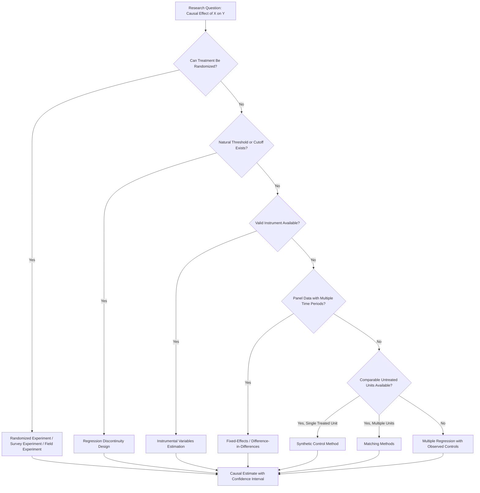

## Quantitative Methods and Statistical Analysis

### Overview and Definition

Quantitative Methods and Statistical Analysis in political science comprise the family of techniques used to measure political phenomena numerically and to test hypotheses about relationships between variables using probabilistic and statistical inference across a relatively large number of observations (large-N analysis). These methods rest on the epistemological premise, articulated influentially by King, Keohane, and Verba, that systematic patterns of covariation across many cases—analyzed with attention to uncertainty, sampling, and the possibility of confounding—can support generalizable causal or descriptive claims about political behavior and institutions.

Quantitative political science draws heavily on statistics, econometrics, and increasingly on computational and data science techniques, applied to distinctive substantive domains including voting behavior, public opinion, legislative behavior, international conflict, comparative political economy, and policy outcomes.

### Foundational Statistical Concepts

**Key Points**

- **Descriptive statistics**: summarizing data through measures of central tendency (mean, median, mode) and dispersion (variance, standard deviation, range), foundational for characterizing distributions of political variables before hypothesis testing
- **Inferential statistics**: using sample data to draw probabilistic conclusions about a broader population, incorporating explicit measures of uncertainty (confidence intervals, standard errors, p-values)
- **Hypothesis testing framework**: formulating a null hypothesis (typically no relationship/no effect) and an alternative hypothesis, then assessing whether observed data provide sufficient evidence to reject the null hypothesis at a specified significance level (conventionally $\alpha = 0.05$ in much of political science, though this convention has been increasingly scrutinized)
- **Statistical significance vs. substantive significance**: a critical methodological distinction—a result can be statistically significant (unlikely to arise from a true null relationship, given sample size) while having a substantively small or practically unimportant effect size, and vice versa in smaller samples

### Levels of Measurement

Political science variables are commonly classified into levels of measurement that determine appropriate statistical technique:

1. **Nominal**: categorical variables with no inherent order (e.g., country, political party affiliation, religion)
2. **Ordinal**: categorical variables with a meaningful order but no consistent interval between categories (e.g., Likert-scale survey responses, regime-type rankings)
3. **Interval**: numeric variables with consistent intervals but no true zero point (e.g., certain standardized index scores)
4. **Ratio**: numeric variables with a true zero point, permitting meaningful ratio comparisons (e.g., GDP per capita, vote share percentages, number of seats)

### Core Statistical Techniques

#### Bivariate Analysis

- **Cross-tabulation and chi-square tests**: assessing association between two categorical variables
- **Correlation coefficients** (e.g., Pearson's $r$): measuring the strength and direction of linear association between two continuous variables
- **Difference-of-means tests** (t-tests): comparing average values of a continuous variable across two groups

#### Multivariate Regression Analysis

- **Ordinary Least Squares (OLS) regression**: the workhorse technique for modeling the linear relationship between a continuous dependent variable and one or more independent variables, while statistically controlling for potential confounders
- **Logistic regression**: used when the dependent variable is binary (e.g., war/no war, democratize/not democratize), modeling the log-odds of the outcome as a linear function of predictors
- **Multinomial and ordered logit/probit models**: extensions for categorical (unordered) or ordinal dependent variables (e.g., regime-type categories, ordinal policy positions)
- **Multilevel/hierarchical models**: account for data with nested structure (e.g., individuals within countries, or repeated observations within units over time), modeling variation at multiple levels simultaneously

#### Panel and Time-Series Techniques

- **Fixed-effects models**: control for all time-invariant characteristics of each unit (e.g., country) by including unit-specific intercepts, isolating within-unit variation over time and addressing a major source of omitted variable bias in cross-national panel data
- **Random-effects models**: assume unit-specific effects are uncorrelated with the independent variables, offering efficiency gains over fixed effects when this (often strong) assumption holds
- **Time-series analysis**: models temporal dependence and dynamics within a single unit's data over time, addressing issues such as autocorrelation and non-stationarity
- **Difference-in-differences (DiD) designs**: compare changes over time between a treatment group and control group, isolating the effect of an intervention or policy change under a "parallel trends" assumption

### Causal Inference Techniques for Observational Data

**Key Points**

- **Instrumental variables (IV) estimation**: uses a variable correlated with the treatment but uncorrelated with the outcome except through the treatment (the "exclusion restriction") to address endogeneity and estimate causal effects from non-experimental data (e.g., used in the Acemoglu-Johnson-Robinson colonial settler mortality research design)
- **Regression discontinuity design (RDD)**: exploits a threshold or cutoff rule (e.g., vote-share thresholds determining electoral victory) to compare units just above and just below the cutoff, approximating random assignment near the threshold
- **Matching methods**: pair treated and untreated observations with similar values on observed confounding variables, reducing bias from measured confounders before estimating treatment effects
- **Synthetic control method**: constructs a weighted combination of control units to approximate the counterfactual trajectory of a treated unit absent treatment, widely used in comparative case studies of policy interventions with a single treated unit
- [Inference] These quasi-experimental techniques are generally regarded in the discipline as offering stronger causal identification than standard multiple regression on observational data alone, though each carries its own strong identifying assumptions (exclusion restrictions, parallel trends, selection on observables) that must be justified and are not directly testable in most applications—this represents a widely shared methodological caution rather than a claim that any technique fully resolves causal identification challenges.

### Experimental Methods in Quantitative Political Science

**Key Points**

- **Randomized controlled trials (RCTs)**: random assignment of subjects to treatment and control conditions ensures (in expectation, especially with adequate sample size) that treatment and control groups are balanced on both observed and unobserved confounders, providing the strongest basis for causal inference
- **Survey experiments**: embed randomized stimuli (e.g., varied question framing, randomized vignette content) within surveys to isolate causal effects of framing, information, or messaging on political attitudes
- **Field experiments**: conducted in naturalistic political settings (e.g., randomized voter mobilization or persuasion campaigns), balancing internal validity with greater external/ecological validity than laboratory settings
- **Conjoint analysis**: a survey-experimental technique presenting respondents with multi-attribute profiles (e.g., hypothetical candidates with randomized attribute combinations) to estimate the causal effect of each attribute on respondent preferences

### Illustrative Diagram: Quantitative Method Selection Logic

### Data Sources in Quantitative Political Science

**Key Points**

- **Cross-national datasets**: Polity5 (regime characteristics), V-Dem (Varieties of Democracy, multidimensional democracy measures), World Bank World Development Indicators, Correlates of War (interstate conflict data), Quality of Government dataset
- **Survey data**: national election studies (e.g., American National Election Studies), cross-national surveys (World Values Survey, Afrobarometer, Latinobarómetro, Eurobarometer)
- **Legislative and elite behavior data**: roll-call voting records, legislative speech corpora, campaign finance databases
- **Text-as-data sources**: increasingly, large corpora of political speeches, legislative debates, social media content, and news text, analyzed using computational text-analysis methods
- [Unverified] Specific current data-access terms, coverage years, and platform details for these datasets change over time and should be verified directly against each dataset's current documentation before use in research.

### Emerging and Computational Methods

**Key Points**

- **Text-as-data / computational text analysis**: applies quantitative techniques (dictionary methods, supervised and unsupervised machine learning classification, topic modeling such as Latent Dirichlet Allocation) to analyze large volumes of political text at scale
- **Machine learning applications**: increasingly used for prediction tasks (e.g., forecasting conflict onset, classifying political text, predicting voting behavior) and, more cautiously, for causal inference tasks (e.g., causal forests, double/debiased machine learning for heterogeneous treatment effect estimation)
- **Network analysis**: examines relational data structures (e.g., alliance networks, legislative co-sponsorship networks, social media interaction networks) using graph-theoretic and statistical network methods
- [Inference] The integration of machine learning and computational text analysis into mainstream quantitative political science has grown substantially in recent scholarship, though methodologists continue to actively debate appropriate standards for causal (as opposed to purely predictive) inference using these techniques—this reflects an evolving and actively contested area of methodological practice rather than a fully settled set of standards.

### Common Threats to Valid Statistical Inference

**Key Points**

- **Omitted variable bias**: failing to control for a confounding variable correlated with both the independent and dependent variables, biasing the estimated relationship
- **Reverse causality/simultaneity**: the dependent variable may itself causally influence the independent variable, complicating straightforward causal interpretation of regression coefficients
- **Measurement error**: imprecise or invalid operationalization of theoretical concepts (e.g., contested cross-national measures of "democracy" or "state capacity") can bias estimates and complicate interpretation
- **Multicollinearity**: high correlation among independent variables can inflate standard errors and destabilize coefficient estimates, though it does not bias the coefficients themselves
- **Heteroskedasticity and autocorrelation**: violations of standard regression assumptions regarding error term variance and independence, particularly common in panel and time-series political data, requiring corrected standard errors (e.g., robust or clustered standard errors) for valid inference
- **Publication bias and p-hacking**: selective reporting of statistically significant findings and researcher degrees of freedom in analytical choices, a concern central to the broader social science "replication crisis" discourse and to growing calls for pre-registration and open-data practices in political science

### Relevance to Political Analysis

Quantitative methods provide the primary tool for testing generalizable, cross-national or cross-unit claims underlying major theories examined elsewhere in political science:

- **Modernization theory's** claims about the relationship between economic development (GDP per capita) and democratization have been extensively tested using cross-national panel regression and, more recently, quasi-experimental designs addressing reverse-causality concerns.
- **Institutionalist** claims (Acemoglu and Robinson's extractive/inclusive institutions framework) rely heavily on instrumental variables estimation (the settler mortality instrument) to address the endogeneity of institutional quality and economic outcomes.
- **Dependency theory and world-systems** claims about core-periphery terms-of-trade patterns have been tested using cross-national time-series analysis of commodity price trends and trade data.
- Quantitative literacy equips students to critically evaluate whether published empirical claims about political phenomena rest on statistically and causally sound analysis, or are vulnerable to the threats to inference outlined above.

### Comparative Summary Table

| Technique | Data Structure | Primary Use Case | Key Assumption |
| --- | --- | --- | --- |
| OLS Regression | Cross-sectional/continuous DV | Modeling linear relationships with controls | No omitted confounders, linearity |
| Logistic Regression | Binary DV | Modeling probability of binary outcome | Correct functional form (logit link) |
| Fixed-Effects Panel Model | Panel (unit x time) | Controlling for time-invariant unit heterogeneity | No time-varying unit-specific confounders |
| Instrumental Variables | Cross-sectional/panel | Addressing endogeneity | Valid instrument (relevance + exclusion restriction) |
| Regression Discontinuity | Data with a threshold/cutoff | Causal inference near a cutoff | No manipulation of the running variable |
| Difference-in-Differences | Panel with treatment/control groups | Estimating policy/treatment effects over time | Parallel pre-treatment trends |
| Randomized Experiment | Experimental (randomized assignment) | Strongest causal identification | Successful randomization/compliance |

### Related Topics

- King, Keohane, and Verba's *Designing Social Inquiry*
- Instrumental Variables and the Colonial Origins Thesis (Acemoglu, Johnson, Robinson)
- Regression Discontinuity and Synthetic Control Methods
- Panel Data Methods: Fixed and Random Effects
- Survey Experiments and Conjoint Analysis
- Text-as-Data and Computational Text Analysis in Political Science
- Cross-National Datasets: Polity5, V-Dem, World Values Survey
- The Replication Crisis and Pre-Registration in Political Science
- Difference-in-Differences and the Parallel Trends Assumption
- Machine Learning Applications in Political Science Research