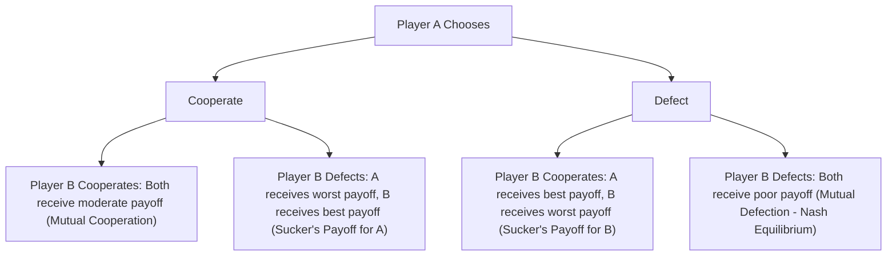

## Game Theory and Formal Modeling

### Overview and Definition

Game Theory and Formal Modeling refer to the use of mathematical models—particularly models of strategic interaction among rational actors—to analyze and explain political phenomena. Formal modeling encompasses a broader category of mathematically specified theoretical frameworks (including spatial models of voting, decision-theoretic models, and formal models of institutions) while game theory specifically addresses situations of **strategic interdependence**, in which the outcome for each actor depends not only on their own choices but on the choices of other actors, who are themselves assumed to be reasoning strategically.

Formal modeling in political science serves distinct but complementary purposes to empirical (qualitative and quantitative) methods: rather than directly testing hypotheses against data, formal models are used to rigorously derive the logical implications of a set of assumptions about actor preferences, information, and strategic environment, generating precise, falsifiable hypotheses that can subsequently be tested empirically.

### Foundational Concepts

**Key Points**

- **Rational choice framework**: actors are modeled as having well-defined, typically transitive preferences over outcomes, and as choosing actions to maximize expected utility given their beliefs about the strategic environment
- **Strategic interdependence**: the defining feature of game-theoretic (as opposed to purely decision-theoretic) situations—each actor's optimal choice depends on the anticipated choices of other actors
- **Players, strategies, and payoffs**: the basic components of any game—the set of actors, the complete set of actions available to each actor (a strategy specifies an action for every possible contingency), and the utility each actor receives from each possible outcome
- **Equilibrium concepts**: solution concepts specifying which combinations of strategies constitute a stable, self-enforcing outcome from which no player has an incentive to unilaterally deviate

### Nash Equilibrium and Core Solution Concepts

**Key Points**

- **Nash equilibrium**: a set of strategies, one for each player, such that no player can improve their payoff by unilaterally changing their own strategy, given the strategies chosen by all other players; the foundational solution concept for non-cooperative game theory, developed by John Nash
- **Dominant strategy equilibrium**: an equilibrium in which each player has a single best strategy regardless of what other players do—a stronger and less common equilibrium condition than Nash equilibrium
- **Subgame perfect equilibrium**: a refinement of Nash equilibrium applicable to sequential (extensive-form) games, requiring that strategies constitute a Nash equilibrium in every subgame, ruling out equilibria that rely on non-credible threats
- **Bayesian Nash equilibrium**: extends Nash equilibrium to games of incomplete information, where players hold probabilistic beliefs about other players' types (private information) and update rationally
- **Mixed-strategy equilibrium**: an equilibrium in which players randomize over available actions according to specific probabilities, relevant in games lacking a pure-strategy equilibrium (e.g., matching pennies-type games)

### Classic Game Structures Applied to Politics

#### The Prisoner's Dilemma

Models situations where individually rational strategies produce a collectively suboptimal outcome—each player has a dominant strategy to defect (not cooperate), yielding an equilibrium worse for both players than mutual cooperation would provide. Widely applied to:

- International cooperation problems (arms races, climate change mitigation, trade liberalization)
- Collective action problems in domestic politics (public goods provision, interest group free-riding)

#### Coordination Games

Model situations with multiple equilibria where players benefit from coordinating on the same strategy, but may lack a unique focal point for doing so. Applied to:

- Institutional choice and constitutional design (e.g., choice of electoral systems, currency standards)
- Standard-setting and policy diffusion across states

#### Chicken/Brinkmanship Games

Model situations where mutual escalation produces the worst outcome for both players, but each has an incentive to appear committed to escalation in order to induce the other to back down. Widely applied to:

- International crisis bargaining and deterrence theory (e.g., Thomas Schelling's foundational work on the strategy of conflict)
- Legislative brinkmanship (e.g., budget standoffs, debt-ceiling confrontations)

#### The Stag Hunt

Models a coordination problem with a "risk-dominant" but suboptimal equilibrium (both hunt hare, a safer but lower-payoff option) alongside a "payoff-dominant" equilibrium (both hunt stag, a riskier but higher-payoff cooperative option), used to model trust and cooperation dilemmas in international relations and collective action.

### Illustrative Diagram: Prisoner's Dilemma Payoff Structure

### Spatial Models of Voting and Political Competition

**Key Points**

- **Downsian spatial model** (Anthony Downs, building on Harold Hotelling): models political competition as candidates or parties positioning themselves along an ideological dimension (e.g., left-right) to maximize vote share, given voters who support the candidate positioned closest to their own ideal point
- **Median voter theorem**: under specific conditions (single-peaked preferences, single-dimensional policy space, two-candidate competition), the median voter's ideal point is the unique equilibrium position that both candidates converge toward
- **Multidimensional spatial models**: extend the framework to multiple policy dimensions simultaneously, where the McKelvey-Schofield chaos theorems demonstrate that stable majority-rule equilibria generally fail to exist absent a median in all directions, a foundational (and somewhat destabilizing) result for formal theories of legislative and electoral competition
- **Structure-induced equilibrium** (associated with Kenneth Shepsle): argues that institutional rules (e.g., committee jurisdictions, agenda-setting procedures) can restore stable equilibrium outcomes in multidimensional settings that would otherwise be chaotic under pure majority rule, highlighting institutions' role in stabilizing collective choice

### Bargaining Models

**Key Points**

- **Nash bargaining solution**: a cooperative game-theoretic solution specifying how two parties should divide a surplus from cooperation based on their relative bargaining power and outside options (disagreement payoffs)
- **Rubinstein bargaining model**: a non-cooperative, alternating-offers bargaining framework in which the equilibrium division of a surplus depends on players' relative patience (discount rates) and the cost of delay
- **Bargaining models of war** (associated with James Fearon's influential work): frame war as resulting from a bargaining failure—since fighting is generally costlier than a negotiated settlement reflecting the same underlying balance of power, war onset requires specific mechanisms (private information with incentives to misrepresent, commitment problems, or issue indivisibility) to explain why rational actors would fail to reach a mutually preferable negotiated agreement

### Formal Models of Institutions

**Key Points**

- **Veto player theory** (associated with George Tsebelis): models policy stability and change as a function of the number, ideological distance, and internal cohesion of "veto players"—actors whose agreement is required for a change from the status quo—providing a formal framework for comparing institutional gridlock potential across political systems (presidential vs. parliamentary, unicameral vs. bicameral)
- **Agenda-setting models**: formalize the power that arises from controlling which proposals are brought to a vote, independent of formal voting weight (e.g., committee gatekeeping power in legislatures)
- **Principal-agent models**: apply formal modeling to delegation relationships (e.g., voters delegating to legislators, legislators delegating to bureaucratic agencies), analyzing information asymmetries, monitoring mechanisms, and incentive-compatibility constraints
- **Signaling models**: analyze how actors with private information can credibly (or non-credibly) communicate that information to others through costly signals, applied extensively to international crisis bargaining (costly signaling of resolve) and electoral politics (costly policy commitments as credibility signals)

### Games of Incomplete Information

**Key Points**

- Many important political phenomena involve **private information**—actors possess information (about their own resolve, capabilities, or preferences) not directly observable by other actors, fundamentally shaping strategic interaction
- **Signaling games**: one player with private information ("type") takes an observable action, and the other player updates beliefs about the sender's type based on that action, with equilibrium concepts distinguishing "separating" equilibria (different types choose different actions, revealing information) from "pooling" equilibria (different types choose the same action, revealing no information)
- **Cheap talk models**: analyze communication that is costless and non-binding, examining the conditions under which such communication can nonetheless be informative in equilibrium
- Fearon's bargaining theory of war relies centrally on incomplete-information dynamics: states may have private information about their military capability or resolve, with incentives to misrepresent that information (e.g., bluffing strength to extract concessions), which can produce inefficient war outcomes that would not occur under complete information

### Strengths and Limitations of Formal Modeling

**Key Points**

- **Strengths**: enforces logical rigor and internal consistency in theorizing; clarifies precisely which assumptions generate which predictions; generates precise, falsifiable, and often counterintuitive hypotheses; enables systematic comparison of institutional arrangements through controlled variation of formal model parameters
- **Limitations**: rests on potentially restrictive assumptions about actor rationality, preference stability, and common knowledge of the game's structure, which may not hold in real political settings; models can become analytically tractable only by simplifying away substantively important complexity; formal elegance does not by itself establish empirical validity, requiring separate empirical testing of model predictions
- [Inference] The relationship between formal theory and empirical testing is generally regarded within the discipline as complementary rather than competitive—formal models generate testable hypotheses, and empirical (quantitative or qualitative) methods assess their validity—though debates persist about the proper balance of formal versus empirical work within political science training and publication, and about how much unrealistic assumptions can be tolerated in exchange for analytical tractability.

### Behavioral and Experimental Critiques

**Key Points**

- **Behavioral economics and psychology-informed critiques**: substantial experimental evidence (e.g., work following Daniel Kahneman and Amos Tversky's prospect theory) demonstrates systematic deviations from strict rational-actor assumptions, including loss aversion, bounded rationality, and framing effects, prompting some formal theorists to incorporate behavioral modifications into otherwise standard game-theoretic frameworks
- **Bounded rationality models**: relax strict rationality assumptions to incorporate cognitive limitations, heuristics, and satisficing (rather than strict optimizing) behavior, associated originally with Herbert Simon
- Political scientists increasingly integrate experimental methods directly with formal theory to test specific behavioral predictions of game-theoretic models (e.g., experimental tests of bargaining model predictions, ultimatum game variants)

### Relevance to Political Analysis

Game theory and formal modeling provide a distinct, deductive complement to the largely inductive/empirical methods discussed elsewhere in this chapter, and connect directly to substantive theories examined throughout political science coursework:

- Bargaining models of war and crisis bargaining provide the dominant contemporary formal framework in international relations for explaining conflict onset, directly informing empirical research design (e.g., testing whether private information or commitment problems better explain specific historical conflicts).
- Veto player theory and spatial models of legislative competition provide formal microfoundations for comparative-institutionalist claims about policy stability and gridlock across different constitutional and electoral system designs.
- Principal-agent models formally underpin analyses of bureaucratic delegation relevant to **developmental state** theory's emphasis on bureaucratic autonomy and embeddedness, and to broader accountability and representation questions in democratic theory.
- Formal modeling equips students to evaluate whether verbal or qualitative theoretical claims about strategic political behavior are logically coherent, and to identify the specific, often implicit, assumptions that generate a given theory's predictions.

### Comparative Summary Table

| Framework | Core Application | Key Theorist(s) | Central Insight |
| --- | --- | --- | --- |
| Prisoner's Dilemma | Collective action, cooperation failure | (Formalized by Albert Tucker) | Individual rationality can produce collective irrationality |
| Downsian Spatial Model | Electoral competition | Anthony Downs, Harold Hotelling | Candidates converge toward the median voter under specific conditions |
| Veto Player Theory | Comparative institutional policy stability | George Tsebelis | More/more-distant veto players increase policy stability (gridlock) |
| Bargaining Theory of War | International conflict onset | James Fearon | War results from bargaining failure, requiring private information, commitment problems, or indivisibility |
| Signaling Games | Crisis bargaining, electoral credibility | Multiple (game-theoretic IR/signaling literature) | Costly actions can credibly reveal private information |
| Structure-Induced Equilibrium | Legislative institutional stability | Kenneth Shepsle | Institutional rules can stabilize otherwise chaotic multidimensional choice |

### Related Topics

- Nash Equilibrium and Solution Concept Refinements
- The Prisoner's Dilemma and Collective Action Problems
- Anthony Downs's Spatial Model and the Median Voter Theorem
- James Fearon's Bargaining Theory of War
- George Tsebelis's Veto Player Theory
- Principal-Agent Models of Political Delegation
- Signaling Games and Costly Signaling in International Relations
- The McKelvey-Schofield Chaos Theorems
- Behavioral Economics and Bounded Rationality (Kahneman, Tversky, Simon)
- Cooperative vs. Non-Cooperative Game Theory