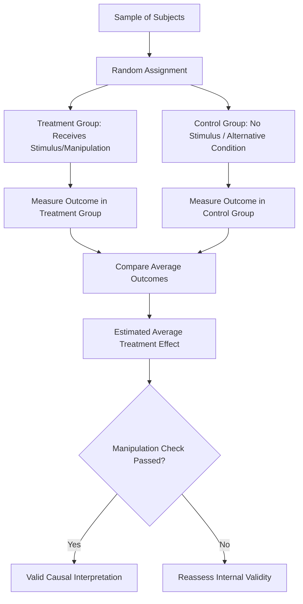

## Survey Research and Experimental Design

### Overview and Definition

Survey Research and Experimental Design encompass the methods political scientists use to systematically measure public opinion, political attitudes, and behavior, and to test causal hypotheses about political persuasion, information effects, and decision-making through controlled manipulation of stimuli. Surveys provide the primary vehicle for descriptive and correlational measurement of mass political attitudes, while experimental methods—increasingly embedded within surveys—provide the strongest available basis for causal inference about how specific informational, framing, or contextual factors shape political attitudes and behavior.

These two method families are frequently combined in contemporary political science through the **survey experiment**, which merges the representative sampling and measurement infrastructure of survey research with the random-assignment causal-identification logic of experimental design.

### Survey Research Fundamentals

#### Sampling Theory and Design

**Key Points**

- **Population and sampling frame**: the theoretical population of interest (e.g., all eligible voters in a country) versus the practical, often imperfect, list or mechanism used to draw a sample (e.g., a voter registration list, an online panel)
- **Probability sampling**: methods (simple random sampling, stratified sampling, cluster sampling, multistage sampling) in which every member of the population has a known, non-zero probability of selection, providing the statistical foundation for generalizing sample estimates to the broader population with quantifiable margins of error
- **Non-probability sampling**: methods (convenience sampling, quota sampling, opt-in online panels) lacking known selection probabilities, complicating formal statistical generalization even when statistical weighting adjustments are applied
- **Sampling error and margin of error**: the expected discrepancy between sample estimates and true population values arising from sampling variability alone, which shrinks as sample size increases but never fully disappears

#### Survey Modes

- **In-person/face-to-face surveys**: traditionally associated with high response rates and data quality, but resource-intensive
- **Telephone surveys**: historically dominant for national polling, though response rates have declined substantially with the shift toward mobile phones and general survey fatigue
- **Mail surveys**: lower cost but typically lower and slower response rates
- **Online/web surveys**: increasingly dominant mode given cost efficiency, though raising distinctive coverage and self-selection concerns depending on panel recruitment methodology
- [Unverified] Current comparative response rates, cost structures, and best-practice recommendations across these modes continue to evolve with changing technology and public survey-participation norms, and should be verified against current survey methodology literature rather than assumed static.

#### Questionnaire Design Considerations

**Key Points**

- **Question wording effects**: subtle changes in phrasing can substantially shift response distributions, particularly for emotionally or politically charged topics
- **Question order effects**: the sequence in which questions are presented can influence subsequent responses through priming or consistency-seeking response patterns
- **Response scale design**: choices regarding the number of response categories, presence of a midpoint/neutral option, and labeling of scale points affect measurement properties and cross-study comparability
- **Social desirability bias**: respondents may misreport attitudes or behaviors perceived as socially unacceptable (e.g., on sensitive topics like racial attitudes or turnout), motivating specialized techniques such as list experiments and randomized response techniques designed to elicit more truthful responses on sensitive items

### Measurement Validity and Reliability in Survey Research

**Key Points**

- **Reliability**: the consistency of a measure across repeated administrations or items intended to capture the same underlying concept (commonly assessed via test-retest reliability or internal consistency measures such as Cronbach's alpha for multi-item scales)
- **Validity**: the degree to which a survey item or scale actually captures the theoretical concept it is intended to measure, encompassing face validity, content validity, convergent/discriminant validity, and criterion validity (correlation with an external benchmark)
- **Measurement invariance**: particularly important in cross-national survey research, the assumption that a given survey item measures the same underlying construct comparably across different countries, languages, or cultural contexts—a frequently contested assumption in comparative attitudinal research

### Experimental Design Fundamentals

**Key Points**

- **Random assignment**: the defining feature of true experiments, ensuring that treatment and control groups are, in expectation, balanced on all observed and unobserved characteristics, isolating the causal effect of the treatment
- **Treatment and control conditions**: the manipulated stimulus (treatment) versus its absence or an alternative baseline condition (control), with the average difference in outcomes between groups constituting the estimated **average treatment effect (ATE)**
- **Manipulation checks**: measures included to verify that the experimental manipulation was actually perceived or processed by subjects as intended, supporting the internal validity of the causal interpretation
- **Compliance and intention-to-treat analysis**: in field settings, subjects assigned to treatment may not always receive or comply with it; **intention-to-treat (ITT)** analysis estimates the effect of assignment to treatment regardless of compliance, while **complier average causal effect (CACE)** estimation isolates the effect specifically among those who complied

### Types of Political Science Experiments

#### Laboratory Experiments

Conducted in controlled settings (often using student or convenience samples), offering high internal validity and precise control over the experimental stimulus, but often facing questions about external/ecological validity given non-representative samples and artificial settings.

#### Survey Experiments

Embed randomized manipulations within a survey instrument administered to a sample (increasingly a nationally representative or large online sample), combining measurement infrastructure with causal identification. Common designs include:

- **Framing experiments**: randomly vary how an issue or policy is described (e.g., emphasizing economic versus civil liberties framing) to measure framing effects on attitudes
- **Vignette/list experiments**: present randomized scenario details to measure how specific factors affect judgments, or use list-experiment techniques to measure sensitive attitudes indirectly
- **Conjoint experiments**: present respondents with multi-attribute profiles (e.g., hypothetical political candidates or policies with randomized attribute bundles) to estimate the independent causal effect of each attribute on preferences—an increasingly prominent technique for studying multidimensional political judgments (e.g., candidate evaluation, immigration attitudes)
- **Priming experiments**: expose subjects to specific stimuli intended to activate particular considerations before measuring subsequent attitudes or judgments

#### Field Experiments

Conducted in real-world political settings, often in partnership with campaigns, government agencies, or civil society organizations, studying phenomena such as:

- Voter mobilization and get-out-the-vote (GOTV) effects (a research tradition strongly associated with Alan Gerber and Donald Green's foundational field-experimental work)
- Persuasion effects of campaign contact or advertising
- Effects of constituent services or legislator responsiveness on political trust and engagement

Field experiments typically offer stronger external validity than laboratory settings while retaining the internal-validity benefits of randomization, though they face greater logistical complexity, compliance challenges, and ethical considerations.

#### Natural and Quasi-Experiments

When true randomization is infeasible, researchers exploit "as-if random" variation arising from naturally occurring events, policy discontinuities, or administrative rules (e.g., randomized lottery-based program assignment, redistricting-induced discontinuities), discussed more fully under quantitative causal-inference methods.

### Illustrative Diagram: Experimental Design Logic

### Ethical Considerations in Survey and Experimental Research

**Key Points**

- **Informed consent**: standard ethical requirement that subjects be informed of the general nature of the study and voluntarily agree to participate, subject to Institutional Review Board (IRB) oversight in most academic institutional contexts
- **Deception**: some experimental designs involve limited deception about the study's true purpose to avoid demand effects or social desirability bias; ethical guidelines generally require debriefing subjects afterward and justifying that the deception's necessity and minimal-risk character outweigh transparency concerns
- **Field experiment ethics**: field experiments involving real political processes (e.g., voter mobilization, deployed policy interventions) raise distinctive ethical questions regarding subject awareness, potential real-world consequences of manipulation, and the propriety of researchers influencing actual political outcomes (e.g., election-related field experiments have drawn particular ethical scrutiny)
- **Data privacy and confidentiality**: increasingly significant given the growing use of large administrative and digital trace datasets linked to survey responses

### External Validity and Generalizability Challenges

**Key Points**

- **WEIRD sample critique**: much experimental political science historically relied on convenience samples of university students, raising concerns about generalizability to broader "Western, Educated, Industrialized, Rich, and Democratic" populations, let alone cross-nationally
- **Artificiality critique**: laboratory and even survey-experimental stimuli may not accurately represent the complexity, repetition, and contextual richness of real-world political information environments, potentially producing effect sizes that do not generalize to naturalistic settings
- **Generalizability across contexts**: even well-identified causal effects from a single experimental study may not generalize across different political, cultural, or institutional contexts, motivating calls for replication across diverse samples and settings
- [Inference] The discipline has increasingly emphasized addressing these external validity concerns through field experiments, nationally representative online samples, and cross-national replication efforts, though methodologists continue to debate how much weight should be given to internal validity (via tightly controlled designs) versus external validity (via more naturalistic but less controlled designs) in experimental research design trade-offs—this reflects an ongoing methodological discussion rather than a fully resolved standard.

### Practical Application Example

**Example**

A researcher wants to test whether exposure to information about a candidate's stance on economic policy causes greater support among voters, compared to exposure to identical information framed around the candidate's personal characteristics. A **survey experiment** design might proceed as follows:

1. Recruit a sample (ideally a nationally representative or high-quality online panel sample) and randomly assign respondents to one of two conditions
2. **Treatment A**: respondents read a candidate profile emphasizing economic policy positions
3. **Treatment B (control/comparison)**: respondents read an otherwise identical candidate profile emphasizing personal biographical characteristics
4. Measure the outcome variable (candidate support, e.g., on a feeling thermometer or vote-intention scale) immediately afterward
5. Include a manipulation check confirming respondents accurately recalled the framing they received
6. Estimate the average treatment effect as the difference in mean candidate support between the two randomly assigned groups, with an appropriate standard error reflecting sampling uncertainty

### Relevance to Political Analysis

Survey research and experimental design provide essential empirical tools for testing individual-level and attitudinal claims underlying broader political science theories:

- Survey research on cross-national public attitudes toward democracy, government, and political trust provides key descriptive and correlational evidence relevant to **modernization theory's** claims about the cultural and attitudinal prerequisites or consequences of democratization.
- Experimental methods provide the strongest causal-identification tools for testing micro-level mechanisms (e.g., how specific information or framing affects support for redistribution, trade policy, or immigration) that underlie many macro-level political economy theories discussed elsewhere in the curriculum.
- Field experiments on voter mobilization and political participation directly inform debates about civic engagement and democratic responsiveness central to political development literature.
- Understanding survey and experimental methodology equips students to critically assess the representativeness, causal validity, and generalizability of public opinion and behavioral findings cited throughout political science research.

### Comparative Summary Table

| Method | Sample Type | Causal Inference Strength | External Validity | Key Use Case |
| --- | --- | --- | --- | --- |
| Cross-Sectional Survey | Probability or non-probability sample | Low (correlational) | High (if representative sample) | Descriptive/correlational measurement of attitudes |
| Laboratory Experiment | Often convenience sample | High (internal validity) | Lower (artificial setting, sample) | Precise causal mechanism isolation |
| Survey Experiment | Representative or online panel sample | High | Moderate-High | Framing/information effects on representative populations |
| Field Experiment | Real-world subject population | High | High | Real-world behavioral interventions (e.g., GOTV) |
| Conjoint Experiment | Survey sample | High (per-attribute effects) | Moderate | Multidimensional preference estimation |

### Related Topics

- Probability vs. Non-Probability Sampling Methods
- Question Wording and Question Order Effects
- List Experiments and Sensitive Attitude Measurement
- Conjoint Analysis in Political Science
- Alan Gerber and Donald Green's Field-Experimental Voter Mobilization Research
- Intention-to-Treat vs. Complier Average Causal Effect Estimation
- The WEIRD Sample Problem in Experimental Political Science
- Measurement Invariance in Cross-National Survey Research
- Research Ethics and Institutional Review Board Oversight
- Cross-National Survey Programs: World Values Survey, Afrobarometer, Eurobarometer