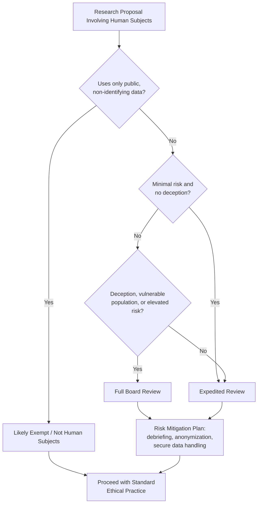

## Research Ethics in Political Science

### Definition and Scope

Research ethics in political science comprises the normative principles and institutional procedures governing how scholars design, conduct, and disseminate research involving human subjects, sensitive political data, and politically consequential findings. The field draws on general research ethics (informed consent, beneficence, justice) but adapts these principles to distinctive challenges: studying power relations, working in authoritarian or conflict settings, handling politically sensitive data, and navigating the discipline's dual role as both an academic enterprise and a producer of knowledge that can shape policy and political outcomes.

Political science research ethics operates across several overlapping domains:

- **Human subjects protection** — consent, privacy, and harm avoidance in surveys, interviews, experiments, and ethnography
- **Research integrity** — honesty in data collection, analysis, and reporting; avoidance of fabrication, falsification, and plagiarism
- **Political and field-specific risks** — protecting subjects and researchers in repressive or violent contexts
- **Methodological ethics** — the ethics of specific techniques (field experiments, deception, elite interviewing, covert observation)
- **Publication and dissemination ethics** — authorship, data sharing, replication, and the politicization of findings

### Historical Development

**Key Points**

- The Nuremberg Code (1947) and Declaration of Helsinki (1964) originated in biomedical contexts but established the template for consent-based research ethics later adopted by social sciences.
- The Belmont Report (1979) in the United States articulated three foundational principles — respect for persons, beneficence, and justice — that became the basis for Institutional Review Board (IRB) systems governing US university research, including political science.
- Political science absorbed these frameworks later and more unevenly than psychology or medicine, in part because much of the discipline's data (public records, elite interviews, macro-level statistics) does not involve the same vulnerability profile as clinical research.
- The rise of field experiments in political science (notably get-out-the-vote and governance experiments from the 1990s onward) triggered renewed ethical scrutiny, since these interventions can manipulate real political outcomes (e.g., voter turnout) rather than merely observe them.
- The American Political Science Association (APSA) issued its first comprehensive "Principles and Guidance for Human Subjects Research" in 2020, reflecting years of internal debate (notably following controversies over deceptive field experiments in the 2010s).

### Core Ethical Principles

**Informed Consent**

Subjects must voluntarily agree to participate after understanding the study's purpose, procedures, risks, and their right to withdraw. In political science this principle faces specific tensions:

- Elite interview subjects (politicians, bureaucrats) often consent to identified quotation, altering the anonymity norm assumed in generic human-subjects frameworks.
- Observational research using public political behavior (e.g., analyzing legislators' floor speeches) typically does not require consent because subjects act in a public, official capacity.
- Deceptive field experiments (e.g., audit studies sending fictitious constituent emails to legislators) necessarily withhold full informed consent, requiring ethical justification through debriefing, minimal risk, and IRB-approved deception protocols.

**Beneficence and Non-Maleficence**

Researchers must maximize benefits and minimize harms. In political science, harms are often social, political, or reputational rather than physical:

- Exposing an interview subject's dissent to an authoritarian government can result in imprisonment or violence.
- Publishing granular voting or attitudinal data can enable retaliation against identifiable individuals or communities.
- Field experiments that alter political outcomes (e.g., mailings designed to increase turnout) raise the question of whether researchers are permissibly influencing democratic processes for scientific purposes.

**Justice**

The benefits and burdens of research should be fairly distributed. This principle underlies concerns about:

- Extractive research patterns, where researchers from wealthy institutions study vulnerable populations in the Global South without reciprocal benefit or local capacity-building.
- Overuse of convenience samples (e.g., certain accessible communities or countries) that concentrates research burden unevenly.

**Autonomy and Privacy**

Subjects retain control over their personal information and political views, which is particularly sensitive in contexts where political affiliation itself is dangerous to disclose.

### Institutional Review Board (IRB) Processes

**Key Points**

- IRBs (in the US) or Research Ethics Committees (RECs, common internationally) review proposed research involving human subjects prior to data collection.
- Review levels are typically tiered: **exempt** (minimal-risk research using existing public data or standard educational practices), **expedited** (minimal risk requiring limited review, e.g., anonymous surveys), and **full board review** (higher-risk research, such as studies involving vulnerable populations, deception, or sensitive political topics).
- [Inference] Many political science studies using publicly available data, aggregate statistics, or historical archives are classified as exempt or not human-subjects research at all, though this determination varies by institution and is not standardized across universities.
- IRBs were originally designed around biomedical and behavioral research models, and scholars have long argued (a recurring theme in APSA's ethics guidance) that this template fits awkwardly with political science methods such as elite interviewing, ethnography, and public-records analysis.

**Example: IRB Risk Tiering (Illustrative)**

| Research Activity | Typical IRB Category | Rationale |
| --- | --- | --- |
| Analysis of published legislative voting records | Exempt / Not human subjects | Public, non-identifying aggregate data |
| Anonymous survey on policy attitudes | Exempt or expedited | Minimal risk, no identifiers collected |
| Elite interviews with named public officials | Expedited | Subjects consent to identification; low physical risk |
| Field experiment with deceptive stimuli (e.g., fictitious constituent letters) | Full board review | Deception present; requires debrief plan |
| Interviews with dissidents in an authoritarian state | Full board review | High risk of harm to subjects if identified |

[Inference] The exact categorization depends on institutional policy and jurisdiction; the table above illustrates common practice rather than a universal standard.

### Distinctive Ethical Challenges in Political Science

**Field Experiments and Manipulation of Political Outcomes**

Randomized field experiments (e.g., testing whether mailers increase voter turnout, or whether legislator response rates differ by constituent race or name) directly intervene in real political processes. Ethical debates center on:

- Whether researchers should be permitted to alter election-relevant behavior (turnout, vote choice) for scientific purposes, even at small scale.
- The 2014 Montana judicial election mailer controversy, in which university researchers sent postcards comparing candidates' ideology to voters without state approval, drew formal condemnation from the Montana Commissioner of Political Practices and became a widely cited case study in APSA's subsequent ethics guidance. [Unverified: specific regulatory findings and sanctions from this case should be confirmed against primary sources for precise details, as accounts vary in secondary literature.]
- Standard mitigations include obtaining pre-approval from electoral authorities where required, limiting sample sizes to avoid detectable electoral impact, and ensuring interventions are non-deceptive or minimally deceptive with debriefing.

**Research in Authoritarian and Conflict Settings**

- Researchers interviewing activists, journalists, or ordinary citizens under authoritarian governments face the risk that data (recordings, notes, contact lists) could be seized and used to identify and punish subjects.
- Standard protective practices include data encryption, anonymization at the point of collection (not just at publication), secure or non-digital storage, using pseudonyms or composite identities in publications, and obtaining consent through processes that do not themselves create a paper trail (e.g., verbal rather than signed consent, since a signed form can itself be incriminating).
- Researchers must also weigh their own safety and legal exposure, including the risk of expulsion, detention, or being compelled by host governments to disclose data.

**Elite Interviewing**

- Elite subjects (politicians, senior officials) frequently expect and prefer to be identified and quoted, inverting the default anonymity assumption in generic human-subjects ethics.
- Ethical practice requires explicit negotiation of attribution terms (on the record, on background, off the record) and honoring those terms precisely in publication.

**Big Data, Digital Trace Data, and Computational Social Science**

- The growing use of social media data, administrative records, and digital trace data raises consent questions, since such data is often collected without the subject's awareness that it will be used for research.
- Platforms' terms of service, data scraping legality, and re-identification risk (the possibility that "anonymized" datasets can be de-anonymized by cross-referencing) are increasingly central ethical concerns.
- [Inference] Norms in this area are still evolving relative to more settled traditions like survey or interview ethics, and institutional guidance varies considerably across universities and journals.

**Community-Engaged and Participatory Research**

- Community-based participatory research (CBPR) approaches seek to involve study communities in research design and share benefits, partly as a response to justice concerns about extractive fieldwork.

### Research Integrity: Data and Reporting Standards

**Key Points**

- Fabrication (inventing data), falsification (manipulating data or results), and plagiarism constitute the core categories of research misconduct across academic disciplines, including political science.
- Pre-registration of hypotheses and analysis plans (e.g., via the Open Science Framework or the EGAP registry for experiments) has become an increasingly common practice to reduce p-hacking and publication bias, though it remains more common in experimental and quantitative subfields than in qualitative or historical research.
- Data transparency norms — exemplified by the Data Access and Research Transparency (DA-RT) initiative and the Journal Editors' Transparency Statement (JETS), adopted by numerous political science journals starting around 2015 — require authors to make data and analytic procedures available for verification, subject to ethical and legal constraints on sensitive data.
- DA-RT generated significant internal controversy, particularly among qualitative researchers and scholars working with vulnerable populations, over tension between transparency mandates and obligations to protect confidential sources; some qualitative scholars organized public opposition (e.g., the "Qualitative Transparency Deliberations") arguing that blanket transparency requirements could endanger subjects or misrepresent interpretive methods. [Unverified: the scope and current implementation status of these initiatives vary by journal and have continued to evolve; consult current journal policies for specifics.]

**Conclusion**

Data transparency and human-subjects protection can pull in opposite directions: transparency asks researchers to share underlying data, while protection of vulnerable subjects (especially in authoritarian or conflict contexts) may require withholding or redacting identifying information indefinitely. Most current guidance treats confidentiality obligations as taking precedence over transparency mandates when they conflict.

### Institutional and Professional Frameworks

**APSA Principles and Guidance for Human Subjects Research (2020)**

The American Political Science Association's guidance emphasizes:

- Context-sensitive ethical judgment over rigid rule-following, recognizing that political science methods (elite interviews, archival research, ethnography, experiments) require different ethical considerations than clinical trials.
- Researcher responsibility for ongoing risk assessment throughout a project, not merely at the IRB approval stage.
- Special attention to research involving vulnerable populations, authoritarian contexts, and politically sensitive topics.

**International and Comparative Frameworks**

- The Declaration of Helsinki and the Council for International Organizations of Medical Sciences (CIOMS) guidelines inform international human-subjects standards but are medically oriented.
- The European Union's General Data Protection Regulation (GDPR, effective 2018) imposes data protection obligations on researchers handling personal data of EU residents, including consent, data minimization, and the right to erasure, with direct implications for survey and digital-trace political science research.
- National ethics review systems vary substantially; some countries lack formal REC structures for social science research, meaning researchers may rely primarily on home-institution and disciplinary norms.

### Applied Example: Ethical Review of a Hypothetical Study

**Example**

*Study*: A researcher proposes a field experiment sending emails posing as concerned constituents to state legislators, varying the sender's apparent race and religion, to measure differential response rates (a common audit-study design in political science).

*Ethical analysis*:

- **Deception**: Legislators and staff are deceived about the sender's identity and intent — a departure from full informed consent.
- **Risk assessment**: Risk to subjects (legislative staff) is generally low (no physical harm, minor time cost), but reputational risk exists if differential treatment is publicly attributed to named offices.
- **Justification for deception**: The study cannot be conducted without deception, since disclosure would alter the behavior being measured (demand characteristics); this is a standard justification recognized in IRB deception protocols.
- **Mitigations**: Aggregate reporting without identifying individual legislative offices; debriefing letters sent to legislative offices post-study, where feasible; minimizing the number of contacts per office to avoid burdening legislative staff resources.
- **IRB category**: Full board review due to deception, per standard practice.

[Inference] This example synthesizes common design and mitigation patterns documented in published legislative audit studies; specific IRB determinations depend on the reviewing institution.

### Diagram: Ethical Review Decision Pathway

### Common Pitfalls and Debates

**Key Points**

- Treating IRB approval as sufficient for ethical conduct, when IRB review addresses only a baseline procedural standard and does not substitute for ongoing ethical judgment during fieldwork.
- Underestimating digital security risks — assuming that verbal or informal data handling is inherently safer than digital records, when both require deliberate protective protocols.
- Applying uniform transparency/data-sharing expectations to qualitative and interview-based research without adapting for confidentiality constraints, a central point of contention in the DA-RT/JETS debates.
- [Speculation] As political science increasingly incorporates large-scale digital trace data and AI-assisted analysis, existing IRB frameworks—largely developed before such methods existed—may require further adaptation; the direction and pace of such changes is not yet settled.

### Illustration: Domains of Political Science Research Ethics (svg_diagram)

<svg xmlns="http://www.w3.org/2000/svg" viewBox="0 0 760 460" font-family="Helvetica, Arial, sans-serif">
<text x="380" y="30" font-size="20" font-weight="bold" text-anchor="middle" fill="#1a1a2e">Domains of Political Science Research Ethics (svg_diagram)</text>
<circle cx="380" cy="240" r="70" fill="#4a6fa5" opacity="0.85" />
<text x="380" y="235" font-size="14" font-weight="bold" text-anchor="middle" fill="white">Core</text>
<text x="380" y="252" font-size="12" text-anchor="middle" fill="white">Principles</text>
<rect x="60" y="60" width="180" height="80" rx="10" fill="#e07a5f" />
<text x="150" y="90" font-size="13" font-weight="bold" text-anchor="middle" fill="white">Informed Consent</text>
<text x="150" y="110" font-size="11" text-anchor="middle" fill="white">Voluntary, informed</text>
<text x="150" y="125" font-size="11" text-anchor="middle" fill="white">agreement to participate</text>
<rect x="520" y="60" width="180" height="80" rx="10" fill="#81b29a" />
<text x="610" y="90" font-size="13" font-weight="bold" text-anchor="middle" fill="white">Beneficence</text>
<text x="610" y="110" font-size="11" text-anchor="middle" fill="white">Maximize benefit,</text>
<text x="610" y="125" font-size="11" text-anchor="middle" fill="white">minimize harm</text>
<rect x="60" y="340" width="180" height="80" rx="10" fill="#f2cc8f" />
<text x="150" y="370" font-size="13" font-weight="bold" text-anchor="middle" fill="#1a1a2e">Justice</text>
<text x="150" y="390" font-size="11" text-anchor="middle" fill="#1a1a2e">Fair distribution of</text>
<text x="150" y="405" font-size="11" text-anchor="middle" fill="#1a1a2e">research burdens/benefits</text>
<rect x="520" y="340" width="180" height="80" rx="10" fill="#3d5a80" />
<text x="610" y="370" font-size="13" font-weight="bold" text-anchor="middle" fill="white">Privacy/Autonomy</text>
<text x="610" y="390" font-size="11" text-anchor="middle" fill="white">Control over personal</text>
<text x="610" y="405" font-size="11" text-anchor="middle" fill="white">and political information</text>
<rect x="290" y="20" width="180" height="60" rx="10" fill="#9d8189" />
<text x="380" y="45" font-size="12" font-weight="bold" text-anchor="middle" fill="white">Field Experiment Ethics</text>
<text x="380" y="62" font-size="10" text-anchor="middle" fill="white">Manipulation of real outcomes</text>
<rect x="290" y="400" width="180" height="55" rx="10" fill="#6d597a" />
<text x="380" y="422" font-size="12" font-weight="bold" text-anchor="middle" fill="white">Data Transparency</text>
<text x="380" y="440" font-size="10" text-anchor="middle" fill="white">vs. Confidentiality</text>
<line x1="310" y1="240" x2="240" y2="150" stroke="#555" stroke-width="1.5" />
<line x1="450" y1="240" x2="520" y2="150" stroke="#555" stroke-width="1.5" />
<line x1="310" y1="280" x2="240" y2="340" stroke="#555" stroke-width="1.5" />
<line x1="450" y1="280" x2="520" y2="340" stroke="#555" stroke-width="1.5" />
<line x1="380" y1="170" x2="380" y2="80" stroke="#555" stroke-width="1.5" />
<line x1="380" y1="310" x2="380" y2="400" stroke="#555" stroke-width="1.5" />
</svg>

### Formulaic Note on Risk-Benefit Assessment

While ethics review is not purely quantitative, some methodological literature frames minimal risk determinations heuristically as a comparison between study-induced risk and everyday-life risk exposure, denoted informally as:

$$R_{study} \leq R_{baseline}$$

where $R_{study}$ is the probability-weighted magnitude of harm from participation and $R_{baseline}$ is the harm ordinarily encountered in daily life or routine physical/psychological examinations. [Inference] This is a conceptual heuristic used in regulatory guidance discussions rather than a formally computed statistic applied in political science IRB reviews.

### Related Topics

- Institutional Review Board procedures and exemption categories in comparative context
- Ethics of field experiments and audit studies in political behavior research
- Data Access and Research Transparency (DA-RT) and the Qualitative Transparency Deliberations
- Fieldwork safety and digital security for researchers in authoritarian or conflict settings
- Ethics of elite interviewing and attribution norms (on/off the record)
- GDPR and data protection law as applied to political science survey and digital-trace research
- Research misconduct: fabrication, falsification, and plagiarism in political science
- Pre-registration and replication standards in experimental political science
- Extractive research patterns and community-engaged/participatory research design
- Ethics of studying vulnerable and marginalized political populations