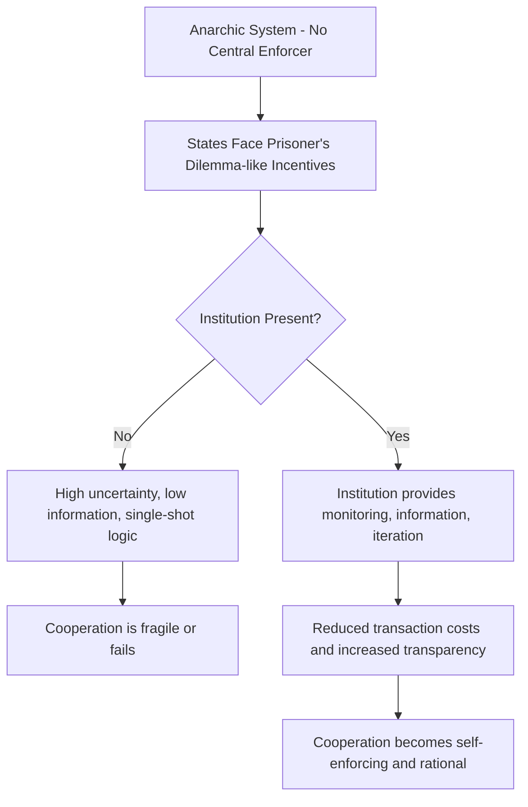

## Liberalism and Neoliberal Institutionalism

### Overview

Liberalism is a paradigm in International Relations (IR) theory holding that cooperation among states is possible and durable, driven by shared interests, institutions, economic interdependence, and the character of domestic political systems. Neoliberal Institutionalism (also called Neoliberalism in IR, distinct from economic neoliberalism) emerged in the 1980s as a systemic, rationalist reformulation of liberal thought, designed to compete directly with neorealism on its own theoretical terrain while retaining liberalism's emphasis on cooperation.

### Classical/Idealist Liberalism

**Key Points**

- Traces intellectual roots to Immanuel Kant's *Perpetual Peace* (1795), which argued that republican governments, international commerce, and a "pacific federation" of states could produce lasting peace
- Woodrow Wilson's post-WWI "Fourteen Points" and advocacy for the League of Nations represent the interwar "idealist" strand
- Core claim: human reason and progress can transform international politics away from a perpetual power struggle
- Fell out of favor after E.H. Carr's *The Twenty Years' Crisis* (1939) critiqued idealism as naive in the face of interwar collapse and WWII, ceding ground to realism for several decades

### Core Strands of Liberal IR Theory

**Key Points**

1. **Republican/Democratic Peace Liberalism**: Democracies rarely, if ever, go to war with one another (Michael Doyle's formulation of the Kantian tripod: republican governance, cosmopolitan law, economic interdependence)
2. **Commercial Liberalism**: Economic interdependence raises the cost of conflict and creates mutual incentives for peace (trade as a pacifying mechanism)
3. **Institutional Liberalism**: International institutions and regimes reduce transaction costs, increase transparency, and enable sustained cooperation despite anarchy
4. **Sociological/Transnationalist Liberalism**: Non-state actors, NGOs, and transnational networks shape outcomes independent of state-centric bargaining (associated with Keohane and Nye's *Transnational Relations and World Politics*, 1971)

### Complex Interdependence (Keohane and Nye)

Introduced in *Power and Interdependence* (1977) as a direct challenge to realist assumptions:

| Realist Assumption | Complex Interdependence Alternative |
| --- | --- |
| States are unitary rational actors | Multiple channels connect societies (interstate, transgovernmental, transnational) |
| Military force is the primary instrument of power | Issues lack clear hierarchy; military force is often not usable or relevant |
| Security dominates the agenda | Multiple issues (economic, environmental, social) compete without fixed hierarchy |

**Key Points**

- Under conditions of complex interdependence, military power becomes a less effective tool of statecraft
- Sensitivity and vulnerability interdependence become key analytic concepts: *sensitivity* refers to how quickly changes in one state affect another; *vulnerability* refers to the cost of adjusting to those changes over time

### Neoliberal Institutionalism: Core Theory

**Key Points**

- Developed principally by Robert Keohane, especially in *After Hegemony: Cooperation and Discord in the World Political Economy* (1984)
- Accepts core neorealist assumptions: anarchy, states as rational unitary actors, self-interest as the primary motivator
- Diverges sharply on the **consequences** of anarchy: institutions can mitigate anarchy's effects even without a central enforcement authority
- Central mechanism: institutions reduce transaction costs, provide information, increase transparency, create iterated interaction (the "shadow of the future"), and enable issue-linkage, all of which make cooperation self-enforcing and rational even among self-interested states

**Why Institutions Matter (Functionalist Logic)**

$$P(\text{Cooperation}) \propto f(\text{Information}, \text{Iteration}, \text{Issue Linkage}, \text{Monitoring Costs}^{-1})$$

This is a conceptual, not a literal statistical, relationship: as information availability and interaction frequency increase, and monitoring/enforcement costs decrease, the probability of sustained cooperation rises.

### Absolute Gains vs. Relative Gains

**Key Points**

- This debate is the central empirical and theoretical fault line between neorealism and neoliberal institutionalism
- **Neoliberals** argue states are primarily concerned with **absolute gains**: whether they themselves are better off from cooperation, regardless of how others fare
- **Neorealists** (notably Joseph Grieco) argue states also weigh **relative gains**: whether a cooperative partner gains more, since disproportionate gains could later be converted into military or political leverage
- Neoliberals respond that relative-gains concerns are most acute in security affairs but far less binding in economic and environmental cooperation, where absolute gains dominate state calculations

### Regime Theory

**Key Points**

- A "regime" is defined (Stephen Krasner, 1982) as a set of implicit or explicit principles, norms, rules, and decision-making procedures around which actor expectations converge in a given issue area
- Regimes function below the level of formal institutions (e.g., a formal organization like the WTO) but shape state behavior through shared expectations (e.g., international trade norms, nonproliferation norms)
- Regimes are argued to persist even after the conditions that created them change (a claim central to explaining continuity in institutions like Bretton Woods-derived structures after U.S. relative decline)

### Neoliberal Institutionalism vs. Neorealism (Summary Comparison)

| Dimension | Neoliberal Institutionalism | Neorealism |
| --- | --- | --- |
| View of anarchy | Mitigable through institutions | Persistent structural constraint |
| Type of gains states seek | Absolute gains | Relative gains |
| Role of institutions | Independent causal effect on behavior | Reflect and are constrained by power distribution |
| Greatest obstacle to cooperation | Cheating/defection (addressed via monitoring) | Relative power shifts (addressed via balancing) |
| Domain of greatest applicability | Political economy, environment, trade | Security and military affairs |

### Illustrative Diagram: How Institutions Enable Cooperation Under Anarchy

### Example: Applying Neoliberal Institutionalism to a Case

**Example**

The World Trade Organization (WTO) dispute settlement system illustrates neoliberal logic:

- States delegate authority to a formal institution to resolve trade disputes, reducing the risk of unilateral retaliation spirals
- Repeated interaction ("shadow of the future") among member states creates reputational costs for defection
- Because trade cooperation predominantly involves absolute economic gains, states have historically been more willing to accept binding dispute rulings in this domain than in comparable security arrangements [Inference: the comparative willingness across domains is a pattern documented in the regime-theory literature, not a strictly quantified metric]

### Democratic Peace Theory (Applied Liberal Claim)

**Key Points**

- Empirical claim: liberal democracies have historically not gone to war with one another (a "law-like" finding described by Jack Levy as "the closest thing we have to an empirical law in international relations")
- Proposed causal mechanisms:
  - **Normative/cultural**: democratic norms of compromise and non-violence extend to interstate relations between democracies
  - **Structural/institutional**: checks and balances, public accountability, and electoral costs constrain leaders from initiating war
- Debate persists over whether the mechanism is genuinely democratic institutions or confounding factors (e.g., shared alliances, wealth, geographic distance) [Unverified as a matter of definitive causal isolation, given ongoing methodological debate in the quantitative IR literature]

### Major Critiques of Liberalism/Neoliberal Institutionalism

**Key Points**

- **Realist critique**: understates relative-gains concerns and the fragility of cooperation when core security interests are at stake
- **Constructivist critique**: neoliberalism, like neorealism, retains a rationalist, materialist ontology that underplays the role of norms, identity, and social construction in shaping state interests
- **Critical/Marxist critique**: liberal institutions often encode and reproduce existing power asymmetries (e.g., Bretton Woods institutions reflecting Western economic dominance) rather than serving as neutral arenas of cooperation
- **Empirical critique of democratic peace**: selection effects, definitional disputes over "democracy," and small historical sample sizes complicate causal claims

### Related Topics

- Realism and Neorealism (comparative counterpart)
- Democratic Peace Theory (in depth)
- Regime Theory and Global Governance
- Constructivism in International Relations
- Collective Security and International Organizations (UN, League of Nations)
- Complex Interdependence and Globalization
- Game Theory in International Relations (Prisoner's Dilemma, Iterated Games)
- International Political Economy (IPE)
- The English School and International Society