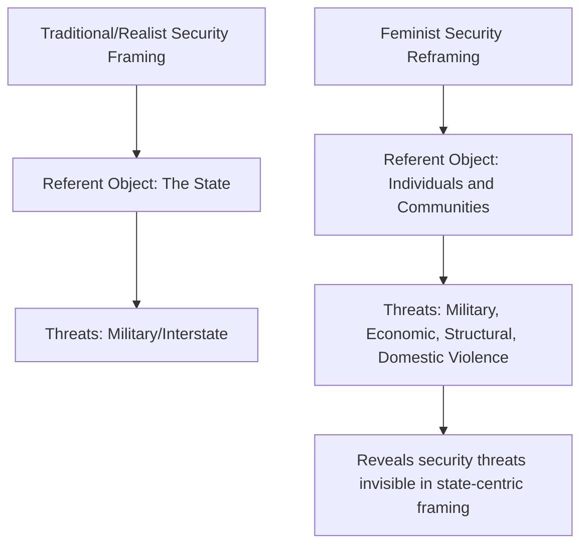

## Feminist International Relations Theory

### Overview

Feminist International Relations Theory examines how gender—as a social construct organizing power, roles, and value—shapes and is shaped by international politics. It challenges the ostensibly gender-neutral concepts at the core of mainstream IR (the state, security, power, sovereignty) by arguing these concepts are implicitly masculinized, and it seeks to make visible the roles, experiences, and structural positions of women and gendered hierarchies that traditional IR theory renders invisible.

### Emergence and Foundational Claims

**Key Points**

- Emerged as a distinct field within IR primarily in the late 1980s, coinciding with the broader "third debate"/post-positivist turn in the discipline
- J. Ann Tickner's *Gender in International Relations* (1992) is widely regarded as a foundational text, directly engaging and critiquing Hans Morgenthau's realist principles from a feminist standpoint
- Cynthia Enloe's *Bananas, Beaches and Bases* (1989) is a foundational text demonstrating how international politics depends on and obscures gendered labor (e.g., diplomatic wives, sex work around military bases, banana plantation workers)
- Core claim: gender is not an add-on variable to existing IR frameworks but a constitutive lens — IR's core concepts (sovereignty, security, power, rationality) are themselves built on gendered assumptions historically coded as masculine (autonomy, control, rational self-interest) versus feminine (dependence, emotion, vulnerability)

### Core Theoretical Commitments

**Key Points**

1. **Gender as a category of analysis**: gender operates as a structuring principle of global politics, not merely a descriptive trait of individuals
2. **Critique of the public/private divide**: mainstream IR's focus on "high politics" (war, diplomacy, statecraft) marginalizes "private sphere" phenomena (household labor, reproduction, care work) that are integral to sustaining the international political economy
3. **The personal is international**: everyday, seemingly domestic or personal relationships (marriage, labor, sexuality) are linked to and constitutive of macro-level international structures
4. **Multiple feminisms**: no single unified "feminist IR" exists; the field comprises several theoretically distinct approaches

### Major Strands of Feminist IR

| Strand | Core Focus | Key Question |
| --- | --- | --- |
| **Liberal Feminism** | Equal inclusion of women within existing state/institutional structures | How can women's representation in diplomacy, military, and governance be increased? |
| **Standpoint Feminism** | Knowledge produced from women's structurally distinct social position | What does international politics look like from the standpoint of the marginalized? |
| **Postcolonial/Third World Feminism** | Intersection of gender with race, colonialism, and global economic hierarchy | How do gender and (post)colonial power structures mutually reinforce each other? |
| **Poststructuralist Feminism** | Discursive construction of gendered identities and binaries in IR language/practice | How does IR discourse itself produce and naturalize gender hierarchies? |
| **Critical/Marxist Feminism** | Gendered division of labor within global capitalism | How does capitalism depend on the unpaid/underpaid labor of women? |

### Gendering Security: Tickner's Critique of Morgenthau

**Key Points**

- Tickner directly reformulated Morgenthau's six principles of political realism from a feminist perspective, arguing that his conception of "objective laws rooted in human nature" reflects a particular, historically masculinized understanding of human nature (competitive, autonomous, power-seeking) rather than a universal one
- Proposes an expanded, multidimensional concept of security that goes beyond military/state-centric security to include economic, environmental, and physical security **at the level of individuals and communities**, not only states
- This reframing directly challenges the neorealist assumption that the state is the appropriate primary referent object of security

### Gendered Division of Labor in the Global Political Economy

**Key Points**

- Enloe's analysis traces how international economic and political structures rely on gendered labor made structurally invisible in mainstream analysis:
  - Export-processing zone labor, disproportionately performed by women in low-wage manufacturing
  - Domestic and care labor (including transnational migrant domestic labor) that enables the participation of others in formal (often male-coded) economic and political life
  - The sexual economy surrounding military bases and tourism, which is treated as incidental to "real" international politics in conventional accounts, but which feminist IR treats as structurally load-bearing
- Central methodological move: "Where are the women?" — Enloe's guiding question for uncovering the gendered infrastructure underlying seemingly gender-neutral international phenomena

### Gender, War, and Militarism

**Key Points**

- Feminist IR scholars analyze how militarization depends on and reproduces gendered norms: idealized "protector" masculinity and "protected" femininity underpin justifications for war and national security policy
- Conflict-related sexual violence is analyzed not as an incidental byproduct of war but as a systematic tool connected to gendered power structures
- UN Security Council Resolution 1325 (2000), the "Women, Peace and Security" agenda, is a frequently cited case of feminist IR concerns entering formal international policy — mandating women's participation in conflict prevention/resolution and protection from conflict-related gender-based violence

### Illustrative Diagram: Feminist Reframing of the Security Referent

### Intersectionality in Feminist IR

**Key Points**

- Drawing on Kimberlé Crenshaw's concept of intersectionality (originally developed in critical legal studies), feminist IR increasingly emphasizes that gender does not operate as an isolated axis of power but intersects with race, class, nationality, and (post)colonial status
- Postcolonial feminist scholars (e.g., Chandra Talpade Mohanty) critique some Western liberal feminist IR scholarship for universalizing the experience of Western, middle-class women and thereby erasing the distinct structural position of women in the Global South
- This critique parallels broader postcolonial critiques of universalizing claims across mainstream IR theory more generally

### Comparison with Other Critical Approaches

| Dimension | Feminist IR | Constructivism | Marxist/Critical IR |
| --- | --- | --- | --- |
| Primary structuring category | Gender | Norms/identity (general) | Class/capitalist production |
| View of "the state" | Gendered institution, not neutral | Socially constructed but not primarily gendered | Instrument/site of class power |
| Core question | How does gender structure global politics? | How are interests and identities socially constituted? | How does capitalism structure global politics? |
| Relationship to mainstream IR | Direct critique of gendered foundational concepts | Ontological challenge to rationalist materialism | Rejects state-centrism and reductionist materialism of realism |

### Example: Applying Feminist IR to a Case

**Example**

Structural adjustment programs (SAPs) imposed by international financial institutions in the 1980s–1990s are a commonly analyzed case in feminist IPE:

- Cuts to public health, education, and social welfare spending disproportionately increased unpaid care labor burdens on women, who absorbed the gap left by reduced state services
- Mainstream economic analyses of SAPs at the time largely did not account for this gendered redistribution of labor as a cost of adjustment, illustrating the feminist claim that gender-blind analysis produces incomplete accounts of policy impact [Inference: the scale and universality of this effect varied significantly by country and program design, and is documented unevenly across the feminist economics literature]

### Major Critiques and Internal Debates

**Key Points**

- **Mainstream/positivist critique**: feminist IR is sometimes criticized by traditional scholars for prioritizing normative/emancipatory goals over generating parsimonious, testable causal theories comparable to realism or neoliberalism
- **Internal debate over essentialism**: standpoint feminist claims about a unified "women's perspective" have been critiqued from within feminism itself (particularly by poststructuralist and postcolonial feminists) for risking gender essentialism and erasing differences among women across race, class, and geography
- **Liberal feminism critique (from other feminist strands)**: critics argue that focusing primarily on increasing women's representation within existing institutions (e.g., more women in the military or diplomatic corps) leaves the underlying gendered and militarized structures themselves unchallenged
- **Response to marginalization**: feminist IR scholars have documented the field's continued relative marginalization within mainstream IR journals and curricula, which they argue is itself an illustration of the gendered hierarchies the field critiques

### Related Topics

- Constructivism in International Relations (comparative counterpart)
- Marxist and Critical International Relations Theory (comparative counterpart)
- Postcolonialism and International Relations
- Human Security and Non-Traditional Security Studies
- Securitization Theory and the Copenhagen School
- International Political Economy (IPE)
- Women, Peace and Security Agenda (UNSCR 1325 and successors)