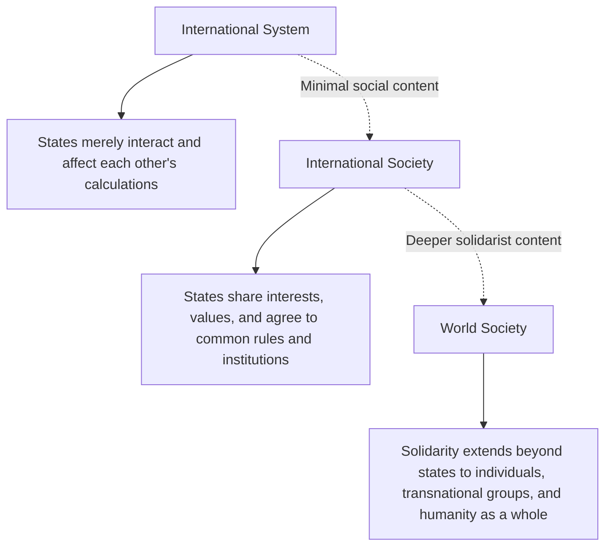

## The English School and International Society

### Overview

The English School (also called the International Society approach or the British Institutionalists) is an IR paradigm that occupies a deliberately middle ground between realism and liberalism/idealism. Its central claim is that international relations should be understood as an "international society" of states bound together by shared norms, institutions, rules, and a degree of common culture, rather than either a pure Hobbesian anarchy (realism) or a fully cooperative community bound by shared values approaching domestic-style governance (some strands of idealism/liberalism).

### Origins and Foundational Figures

**Key Points**

- Emerged from the **British Committee on the Theory of International Politics**, established in 1958/1959, bringing together historians, philosophers, and IR scholars including Martin Wight, Herbert Butterfield, and later Hedley Bull
- Hedley Bull's *The Anarchical Society: A Study of Order in World Politics* (1977) is the paradigm's foundational and most widely cited text
- Martin Wight's essays (posthumously compiled in *International Theory: The Three Traditions*, 1991) established the school's characteristic method of organizing IR thought into three enduring traditions rather than a single unified theory
- The label "English School" was popularized retrospectively by Roy Jones (1981), somewhat ironically in an article arguing the school should be disbanded; the name persisted despite the article's critical intent

### Wight's Three Traditions (Via Media Approach)

A defining methodological feature of the English School is Wight's tripartite categorization of the history of international thought:

| Tradition | Associated Thinker | Core View of International Politics |
| --- | --- | --- |
| **Realism (Hobbesian)** | Thomas Hobbes | International system as a state of war; anarchy as pure power struggle |
| **Rationalism (Grotian)** | Hugo Grotius | International **society** bound by shared rules, law, and institutions despite anarchy |
| **Revolutionism (Kantian)** | Immanuel Kant | Universal community of humankind transcending the state system; potential for cosmopolitan transformation |

**Key Points**

- The English School situates itself primarily within the **Grotian/rationalist** tradition, positioned deliberately as a "via media" (middle way) between Hobbesian pessimism and Kantian cosmopolitanism
- Rather than declaring one tradition definitively correct, Wight treated the three as a permanent, unresolved dialogue that recurs throughout the history of international thought

### System, Society, and Community (Bull's Core Distinction)

Bull's central conceptual contribution distinguishes three levels of possible order among states:

**Key Points**

- **International System**: the mere fact of regular interaction and interdependence among states, sufficient to affect their behavior, without any shared normative framework (closest to the realist conception)
- **International Society**: states that, while remaining sovereign and self-interested, share a consciousness of common interests and values, and consent to bind themselves through common rules, diplomacy, and institutions (the English School's central object of study)
- **World Society**: a further, more solidarist stage in which the focus shifts beyond the state to a broader community encompassing individuals, non-state actors, and humanity generally
- Bull argued that a genuine international society had emerged and persisted historically among sovereign states despite the absence of a world government, contra realist expectations of pure anarchic conflict

### The Five Institutions of International Society (Bull)

**Key Points**

Bull identified specific historical institutions that sustain order within international society, distinct from formal international organizations:

1. **Balance of power**: prevents any single state from dominating the system, preserving the plurality of sovereign states
2. **International law**: provides a shared normative framework of rules states generally recognize as binding
3. **Diplomacy**: the institutionalized practice of communication and negotiation between states
4. **War**: paradoxically treated as an institution of international society insofar as it is regulated by shared rules (just war doctrine, laws of armed conflict) rather than pure unrestrained violence
5. **The role of great powers**: great powers are understood to bear special managerial responsibilities for maintaining systemic order, distinct from smaller states

[Inference] Bull's inclusion of war as an "institution" rather than simply a breakdown of order is one of the more distinctive and occasionally debated aspects of his framework, since it depends on a particular reading of how regulated versus unregulated violence is defined.

### Pluralism vs. Solidarism (The Central Internal Debate)

**Key Points**

- This is the primary axis of debate **within** the English School itself, concerning how much shared normative content international society actually requires or should aspire to
- **Pluralism** (associated with Bull's more cautious position): international society rests on a thin, minimal consensus — primarily mutual recognition of sovereignty and non-intervention — precisely because deeper value consensus among culturally diverse states is unrealistic and imposing it risks conflict
- **Solidarism** (associated with scholars such as Nicholas Wheeler): international society can and should develop a thicker set of shared values, including collective enforcement of human rights norms, even where this requires qualifying strict non-intervention (e.g., justifying humanitarian intervention)
- This debate maps closely onto real-world policy controversies, such as the tension between state sovereignty and the Responsibility to Protect (R2P) doctrine

### Pluralism vs. Solidarism Compared

| Dimension | Pluralism | Solidarism |
| --- | --- | --- |
| Depth of shared values required | Minimal (sovereignty, non-intervention, mutual recognition) | Substantive (human rights, justice, humanitarian norms) |
| View of intervention | Strongly disfavored; risks unraveling order | Justifiable to prevent mass atrocity |
| Primary value prioritized | Order among diverse states | Justice for individuals, even across state lines |
| Representative concern | Cultural/political diversity must be respected | Universal human dignity transcends state boundaries |

### The English School vs. Neorealism and Neoliberal Institutionalism

| Dimension | English School | Neorealism | Neoliberal Institutionalism |
| --- | --- | --- | --- |
| Anarchy | Contains social/normative content ("anarchical society") | Purely material structural condition | Rationalist condition mitigated by institutions |
| Method | Historical, interpretive, normative | Structural, parsimonious, systemic | Rationalist, game-theoretic |
| Central object | International society and its institutions | Distribution of capabilities | Formal/informal institutions reducing transaction costs |
| Normative stance | Explicitly engages questions of order and justice | Claims descriptive/explanatory neutrality | Largely claims descriptive/explanatory neutrality |

### Example: Applying the English School to a Case

**Example**

The post-Cold War expansion of humanitarian intervention norms (Kosovo 1999, the 2005 adoption of the Responsibility to Protect at the UN World Summit) illustrates the pluralism-solidarism debate in practice:

- Pluralist-inflected analyses emphasize the risks such interventions pose to the norm of sovereign non-intervention that has historically underpinned international order
- Solidarist-inflected analyses frame the same events as evidence of international society's normative evolution toward prioritizing human protection over strict sovereignty
- The unevenness and selectivity of actual humanitarian interventions across different crises has been used by scholars on both sides to support their respective readings of how far international society's solidarist content genuinely extends [Unverified as a matter of settled interpretation; this remains an active area of normative and empirical dispute within the literature]

### Major Critiques of the English School

**Key Points**

- **Positivist/scientific critique**: the school's historically grounded, interpretive method is sometimes criticized (particularly by American mainstream IR scholarship) for lacking the parsimony, falsifiability, and generalizability associated with rationalist theories like neorealism
- **Eurocentrism critique**: critics, including postcolonial scholars, argue the concept of "international society" was historically constructed around European great-power norms and later expanded to (rather than co-constructed with) non-European states, embedding a Eurocentric normative baseline
- **Conceptual ambiguity critique**: the boundaries between "system," "society," and "world society" have been criticized as insufficiently precise, complicating empirical application
- **Constructivist overlap critique**: some scholars argue the English School's emphasis on shared norms and institutions overlaps substantially with constructivism, raising questions about the English School's independent theoretical distinctiveness, though English School scholars typically respond that their historically grounded, institution-specific method remains distinct from constructivism's more general focus on norm dynamics

### Related Topics

- Realism and Neorealism (comparative counterpart)
- Liberalism and Neoliberal Institutionalism (comparative counterpart)
- Constructivism in International Relations (comparative counterpart)
- Sovereignty and Non-Intervention Norms
- Responsibility to Protect (R2P) and Humanitarian Intervention
- International Law and Global Order
- Postcolonialism and International Relations
- Balance of Power Theory (in depth)