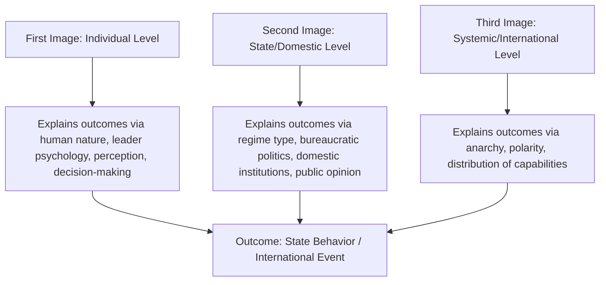

## Levels of Analysis in International Relations

### Overview

The Levels of Analysis framework is a methodological tool in International Relations used to organize explanations of state behavior and international outcomes according to the location of their causal source: the individual, the state, or the international system. Rather than a substantive theory in itself, it is a taxonomic device that clarifies where different IR theories locate their explanatory variables, and it helps identify whether disagreements between theories stem from different levels of analysis rather than genuinely incompatible claims.

### Origins: Waltz's "Images"

**Key Points**

- The framework's canonical formulation originates with Kenneth Waltz's *Man, the State, and War* (1959), which analyzed the causes of war through three "images"
- J. David Singer's article "The Level-of-Analysis Problem in International Relations" (1961) formalized the methodological implications, particularly the risks of conflating levels or committing errors when generalizing findings from one level to another
- Waltz later built directly on the third image in *Theory of International Politics* (1979), elevating the systemic level to primacy in neorealism

### The Three Classical Images/Levels

**First Image (Individual Level)**

**Key Points**

- Locates causal explanation in human nature, individual leaders' psychology, perception, misperception, belief systems, and decision-making processes
- Associated theoretically with classical realism (Morgenthau's claim that the drive for power is rooted in human nature)
- Also encompasses cognitive and psychological approaches to foreign policy analysis: bounded rationality, cognitive biases, groupthink (Irving Janis), operational codes, and misperception (Robert Jervis's *Perception and Misperception in International Politics*, 1976)
- Example explanatory question: did a particular leader's personal risk tolerance, ideology, or misperception of an adversary's intentions shape a specific crisis decision?

**Second Image (State/Domestic Level)**

**Key Points**

- Locates causal explanation within the internal characteristics of states: regime type, domestic political institutions, bureaucratic politics, interest groups, and public opinion
- Associated with liberal IR theory (particularly democratic peace theory), foreign policy analysis, and bureaucratic politics models (Graham Allison's "Governmental/Bureaucratic Politics Model" in *Essence of Decision*, 1971, analyzing the Cuban Missile Crisis)
- Also encompasses "Second Image Reversed" arguments (Peter Gourevitch, 1978), which invert the traditional causal arrow to ask how systemic/international pressures shape domestic political structures, rather than only the reverse
- Example explanatory question: does a state's democratic institutional structure make it less likely to initiate interstate war?

**Third Image (Systemic/International Level)**

**Key Points**

- Locates causal explanation in the structure of the international system itself: the ordering principle (anarchy), the distribution of capabilities (polarity), and systemic-level interactions among functionally similar units
- Associated centrally with neorealism (Waltz) and, in a different systemic mode, neoliberal institutionalism and world-systems theory
- Explanatory logic here deliberately brackets domestic and individual-level variation, treating states as functionally alike "black boxes" whose behavior is shaped primarily by their position within the system
- Example explanatory question: does bipolarity versus multipolarity better explain the relative frequency of great-power war across different historical eras?

### Mapping IR Theories onto Levels of Analysis

| Level | Primary Theories/Approaches | Representative Scholars |
| --- | --- | --- |
| Individual (First Image) | Classical Realism, Foreign Policy Analysis, Cognitive/Psychological Approaches | Morgenthau, Jervis, Janis |
| State/Domestic (Second Image) | Liberalism, Democratic Peace Theory, Bureaucratic Politics Model, Neoclassical Realism (partially) | Doyle, Allison, Gourevitch |
| Systemic (Third Image) | Neorealism, Neoliberal Institutionalism, World-Systems Theory | Waltz, Keohane, Wallerstein |

[Inference] This mapping is a widely used pedagogical simplification; several theories (notably neoclassical realism and constructivism) deliberately operate across or bridge multiple levels rather than fitting neatly into a single one, a point elaborated below.

### Theories That Bridge Multiple Levels

**Key Points**

- **Neoclassical Realism**: explicitly incorporates systemic-level pressures (third image) as the primary independent variable, but treats domestic-level factors (state-society relations, leader perception, bureaucratic capacity) as intervening variables that shape how systemic pressures translate into actual foreign policy — a deliberate multi-level synthesis developed partly in response to the "black-boxing" critique of neorealism
- **Constructivism**: does not map neatly onto any single level, since it treats agents (individuals, states) and structures (norms, systemic culture) as mutually constitutive rather than causally hierarchical — Wendt's work operates explicitly at the systemic level, but constructivist analysis of norm entrepreneurs (Finnemore and Sikkink) draws on domestic/individual-level agency as well
- **Second Image Reversed** approaches explicitly treat the causal arrow between levels as running in the opposite direction from the classical formulation, showing that the framework's directionality is itself an analytical choice rather than a fixed law

### The Level-of-Analysis Problem (Methodological Caution)

**Key Points**

- Singer's core methodological warning: analysts must be explicit about which level they are working at, since findings and generalizations derived at one level do not automatically transfer to another
- **Ecological fallacy risk**: inferring individual-level causation from system-level or aggregate-level patterns (e.g., assuming a systemic correlation between polarity and war frequency directly explains any single leader's decision to go to war)
- **Reductionist fallacy risk** (in the opposite direction): assuming system-level outcomes can be fully explained simply by aggregating individual or state-level behavior without accounting for emergent structural properties (Waltz's central objection to reductionist theorizing, which partly motivated his structural third-image approach)
- Rigorous analysis requires specifying, and where relevant testing, at which level a given causal claim is actually operating

### Illustrative Diagram: Directionality of Causal Arguments Across Levels

<svg xmlns="http://www.w3.org/2000/svg" viewBox="0 0 640 300">
<text x="320" y="30" text-anchor="middle" font-size="18" font-weight="bold">Directionality Across Levels of Analysis (svg_diagram)</text>
<rect x="40" y="70" width="150" height="60" fill="none" stroke="black" stroke-width="2" />
<text x="115" y="105" text-anchor="middle" font-size="13" font-weight="bold">Individual</text>
<rect x="245" y="70" width="150" height="60" fill="none" stroke="black" stroke-width="2" />
<text x="320" y="105" text-anchor="middle" font-size="13" font-weight="bold">State/Domestic</text>
<rect x="450" y="70" width="150" height="60" fill="none" stroke="black" stroke-width="2" />
<text x="525" y="105" text-anchor="middle" font-size="13" font-weight="bold">Systemic</text>
<line x1="190" y1="90" x2="245" y2="90" stroke="black" stroke-width="2" marker-end="url(#a1)" />
<line x1="395" y1="90" x2="450" y2="90" stroke="black" stroke-width="2" marker-end="url(#a1)" />
<text x="320" y="160" text-anchor="middle" font-size="12" font-style="italic">Classical "bottom-up" direction (First/Second Image thinking)</text>
<line x1="450" y1="200" x2="395" y2="200" stroke="black" stroke-width="2" marker-end="url(#a1)" />
<line x1="245" y1="200" x2="190" y2="200" stroke="black" stroke-width="2" marker-end="url(#a1)" />
<text x="320" y="230" text-anchor="middle" font-size="12" font-style="italic">"Top-down" direction (Third Image / Second Image Reversed)</text>
</svg>

### Example: Applying Multi-Level Analysis to a Case

**Example**

Explaining the outbreak of World War I illustrates how the three levels generate distinct, non-mutually-exclusive explanations of the same event:

- **First image**: emphasizes the decision-making failures, misperceptions, and personal miscalculations of key leaders during the July 1914 crisis
- **Second image**: emphasizes domestic pressures within great powers, including militarism, nationalist public opinion, and the internal political incentives of ruling elites (e.g., arguments that domestic instability incentivized diversionary war)
- **Third image**: emphasizes the destabilizing effects of a shifting multipolar power distribution and rigid alliance structures that transformed a regional crisis (the assassination of Archduke Franz Ferdinand) into systemic great-power war
- Comprehensive historical explanations of 1914 typically draw on some combination of all three levels rather than treating them as mutually exclusive, illustrating that the levels-of-analysis framework is best used as an organizing device rather than a forced single-level explanation [Inference: the relative causal weight assigned to each level remains a genuinely contested question among historians and IR scholars]

### Extensions Beyond the Classical Three Levels

**Key Points**

- Some scholars propose a **fourth level**, the **global/transnational level**, to capture phenomena that operate above and across the state system entirely (e.g., globalization, transnational advocacy networks, global capitalism in world-systems theory), arguing the classical third image still implicitly retains a state-centric bias
- **Regional level analysis** has also been proposed as an intermediate level between state and global system, particularly relevant to Regional Security Complex Theory (Buzan and Wæver), which argues security dynamics often cluster meaningfully at the regional rather than purely global level

### Major Critiques and Limitations

**Key Points**

- **Static/aggregative critique**: the classical framework can obscure genuinely interactive or co-constitutive processes between levels, as constructivists argue regarding agent-structure mutual constitution
- **Overly rigid categorization critique**: real-world causal processes rarely respect clean level boundaries, and forcing an explanation into a single level can produce artificially parsimonious or incomplete accounts
- **Waltz's own caution**: even Waltz, despite privileging the third image, acknowledged that a complete explanation of any specific historical event typically requires reference to multiple images, reserving his structural theory specifically for explaining recurrent patterns and outcomes across the system rather than any single discrete event

### Related Topics

- Realism and Neorealism (in depth)
- Liberalism and Neoliberal Institutionalism (in depth)
- Constructivism in International Relations (in depth)
- Neoclassical Realism
- Foreign Policy Analysis and Decision-Making Models
- Regional Security Complex Theory
- The Causes of War: Comparative Theoretical Approaches