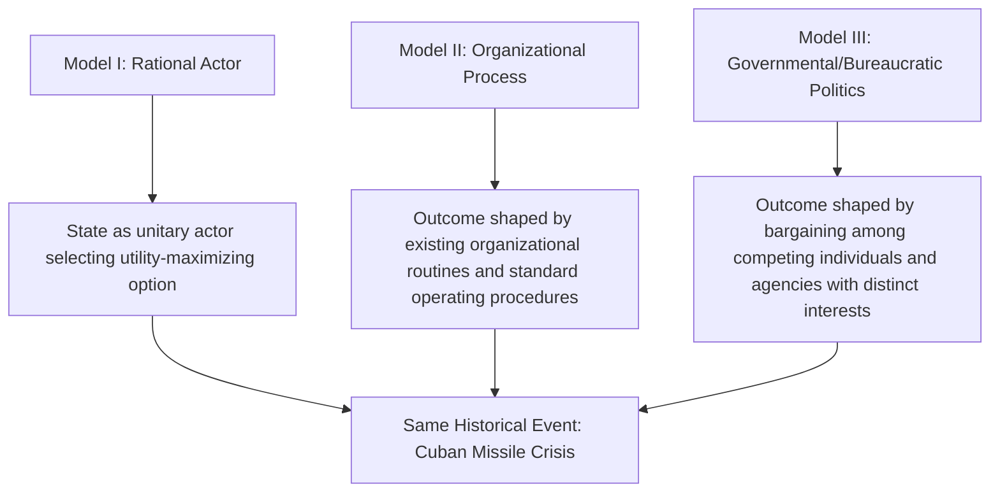

## Theories of Foreign Policy Decision-Making

### Overview

Theories of Foreign Policy Decision-Making examine how states actually arrive at foreign policy choices, opening the "black box" that systemic theories like neorealism deliberately leave closed. This subfield sits primarily at the individual and state/domestic levels of analysis, drawing on cognitive psychology, organizational theory, and bureaucratic politics to explain why real-world foreign policy decisions frequently diverge from the unitary-rational-actor assumption common to systemic IR theory.

### The Rational Actor Model as Baseline

**Key Points**

- The starting point against which most decision-making theories react: the state is treated as a single, unitary actor that identifies goals, weighs all available options against expected costs and benefits, and selects the utility-maximizing choice
- This model underlies most systemic-level theorizing (neorealism, neoliberal institutionalism) and much of classical strategic/deterrence theory
- Graham Allison's *Essence of Decision: Explaining the Cuban Missile Crisis* (1971, revised 1999 with Philip Zelikow) explicitly used this model as "Model I" and then demonstrated its explanatory limits by contrasting it with two alternative models developed from the same case

### Allison's Three Models of Decision-Making

Allison's tripartite framework, developed from the 1962 Cuban Missile Crisis, remains the most widely taught framework in foreign policy analysis:

**Model I: Rational Actor Model**

**Key Points**

- Explains government behavior as the product of a single, purposive decision-maker calculating the optimal response to a strategic problem
- Applied to the Cuban Missile Crisis: explains U.S. and Soviet behavior in terms of coherent strategic calculation regarding nuclear deterrence and relative advantage

**Model II: Organizational Process Model**

**Key Points**

- Governments are not unitary actors but **loose confederations of large organizations** (military services, intelligence agencies, diplomatic corps), each with pre-established standard operating procedures (SOPs) and limited capacity for improvisation under time pressure
- Policy "choices" often reflect which existing organizational routine or program is invoked, rather than a bespoke calculation of the specific situation at hand
- Applied to the Cuban Missile Crisis: explains specific operational details (e.g., the precise configuration of the naval blockade, the U-2 flight patterns) as outputs of standing military procedures rather than deliberate strategic design

**Model III: Governmental/Bureaucratic Politics Model**

**Key Points**

- Policy outcomes emerge from **political bargaining** among individual government officials and agencies, each with distinct organizational interests, personal stakes, and relative bargaining power ("where you stand depends on where you sit")
- The final decision is often not any single actor's preferred option but a **resultant** of pulling and hauling among participants with competing preferences
- Applied to the Cuban Missile Crisis: explains the shift from an initial air-strike option toward a naval blockade partly as the product of internal bargaining among President Kennedy's advisors (the "ExComm") with differing institutional perspectives and risk tolerances

### Comparison of Allison's Three Models

| Dimension | Model I (Rational Actor) | Model II (Organizational Process) | Model III (Bureaucratic Politics) |
| --- | --- | --- | --- |
| Unit of analysis | The state as a whole | Organizations and their SOPs | Individual officials and agencies |
| Explanation of action | Strategic calculation | Routine and organizational output | Political bargaining and compromise |
| Predictability | High, if goals/constraints known | Path-dependent on existing routines | Contingent on relative bargaining power |
| Best suited to explain | Broad strategic posture | Operational/tactical implementation details | Why a specific compromise decision emerged |

### Cognitive and Psychological Approaches

**Key Points**

- Challenge the rational actor model's assumption of accurate information processing, arguing decision-makers operate under **bounded rationality** (Herbert Simon): cognitive and informational limits mean actors "satisfice" (choose an acceptable option) rather than genuinely optimize
- **Robert Jervis**, *Perception and Misperception in International Politics* (1976): decision-makers systematically misperceive adversary intentions due to cognitive biases, including:
  - **Attribution bias**: attributing one's own actions to situational necessity while attributing an adversary's identical actions to inherent hostility
  - **Confirmation bias**: interpreting ambiguous new information as confirming pre-existing beliefs
  - **Historical analogies**: over-relying on salient past events (e.g., "Munich analogy" cautioning against appeasement) as templates for interpreting new, potentially dissimilar situations

**Prospect Theory in Foreign Policy Analysis**

**Key Points**

- Adapted from behavioral economics (Daniel Kahneman and Amos Tversky) into IR by scholars such as Jack Levy and Rose McDermott
- Core claim: decision-makers evaluate options relative to a reference point and are systematically **loss-averse** — they weigh potential losses more heavily than equivalent potential gains
- Predicts decision-makers will be more risk-acceptant when facing a frame of prospective losses (e.g., defending existing territory or status) than when facing an equivalent frame of prospective gains
- This directly challenges the expected-utility calculations assumed in the rational actor model, since it demonstrates that framing (not just the objective stakes) systematically shapes risk preferences

### Groupthink

**Key Points**

- Developed by social psychologist Irving Janis in *Victims of Groupthink* (1972), applied to cases including the Bay of Pigs invasion
- Occurs in highly cohesive small decision-making groups under stress, where the desire for consensus and group harmony overrides realistic appraisal of alternative courses of action
- Symptoms include: illusion of invulnerability, collective rationalization of warning signs, belief in inherent group morality, stereotyping of out-groups/adversaries, self-censorship of doubts, and the emergence of "mindguards" who suppress dissenting information from reaching the group
- Often invoked as an explanation for foreign policy fiascoes where a small, insulated advisory group failed to seriously evaluate an eventually disastrous course of action

### Poliheuristic Theory

**Key Points**

- Developed by Alex Mintz as a two-stage decision model integrating cognitive and rational elements
- **Stage 1**: decision-makers use a non-compensatory cognitive shortcut to eliminate options that fail on a critical dimension (most often the domestic political dimension) — an option that is politically unacceptable is dropped regardless of how favorable it might be on other dimensions
- **Stage 2**: among the surviving options, decision-makers apply more classical expected-utility/rational-choice reasoning to select the optimal remaining choice
- Explicitly designed to bridge cognitive and rational-choice traditions rather than treating them as strictly competing paradigms

### Operational Code Analysis

**Key Points**

- Originating with Nathan Leites's Cold War-era study of Bolshevik decision-making, later systematized by Alexander George and quantitatively operationalized by Stephen Walker and others
- Analyzes a leader's characteristic **philosophical and instrumental beliefs** about the nature of political conflict and the best means of pursuing political goals, derived systematically from that leader's speeches, writings, and statements
- Used to construct a predictive profile of an individual leader's likely decision tendencies (e.g., their assessment of the nature of the political universe, their preferred risk calculus, and their approach to timing and control)

### Illustrative Diagram: Bounded Rationality vs. Rational Actor Assumptions

<svg xmlns="http://www.w3.org/2000/svg" viewBox="0 0 640 300">
<text x="320" y="30" text-anchor="middle" font-size="18" font-weight="bold">Rational Actor vs. Bounded Rationality (svg_diagram)</text>
<rect x="30" y="60" width="270" height="200" fill="none" stroke="black" stroke-width="2" />
<text x="165" y="85" text-anchor="middle" font-size="14" font-weight="bold">Rational Actor Model</text>
<text x="165" y="115" text-anchor="middle" font-size="11">Full information</text>
<text x="165" y="140" text-anchor="middle" font-size="11">All options considered</text>
<text x="165" y="165" text-anchor="middle" font-size="11">Utility-maximizing choice</text>
<text x="165" y="190" text-anchor="middle" font-size="11">Consistent preference ordering</text>
<rect x="340" y="60" width="270" height="200" fill="none" stroke="black" stroke-width="2" />
<text x="475" y="85" text-anchor="middle" font-size="14" font-weight="bold">Bounded Rationality</text>
<text x="475" y="115" text-anchor="middle" font-size="11">Limited/imperfect information</text>
<text x="475" y="140" text-anchor="middle" font-size="11">Satisficing, not optimizing</text>
<text x="475" y="165" text-anchor="middle" font-size="11">Cognitive shortcuts and biases</text>
<text x="475" y="190" text-anchor="middle" font-size="11">Framing affects risk preference</text>
</svg>

### Example: Applying Multiple Decision-Making Models to a Case

**Example**

The 2003 U.S. decision to invade Iraq is frequently analyzed through multiple decision-making lenses simultaneously:

- **Bureaucratic politics** framing highlights competing preferences among the Department of Defense, State Department, and intelligence community regarding both the justification for and planning of the invasion
- **Groupthink**-adjacent critiques have been raised regarding the insulated nature of key pre-war intelligence assessment and policy planning processes, though scholars differ on how precisely Janis's specific symptoms map onto this case [Inference: application of the groupthink model to this case is a contested interpretation rather than a settled consensus finding]
- **Cognitive/perceptual** analyses point to confirmation bias in the interpretation of ambiguous intelligence regarding weapons of mass destruction, consistent with Jervis's broader findings about motivated reasoning in high-stakes foreign policy judgments

### Comparative Summary of Major Approaches

| Approach | Key Theorist(s) | Core Mechanism |
| --- | --- | --- |
| Rational Actor Model | (Baseline/classical) | Unitary actor maximizes expected utility |
| Organizational Process | Allison | Outcomes reflect existing organizational SOPs |
| Bureaucratic Politics | Allison | Outcomes reflect bargaining among competing officials |
| Bounded Rationality/Cognitive Bias | Simon, Jervis | Information-processing limits and systematic biases shape choices |
| Prospect Theory | Kahneman, Tversky, Levy | Loss aversion and framing distort risk calculus |
| Groupthink | Janis | Group cohesion suppresses critical evaluation of alternatives |
| Poliheuristic Theory | Mintz | Two-stage: non-compensatory screening, then rational selection |
| Operational Code Analysis | Leites, George, Walker | Individual leader belief systems predict decision tendencies |

### Major Critiques and Limitations

**Key Points**

- **Parsimony critique**: cognitive and bureaucratic models sacrifice the predictive parsimony of the rational actor model, often producing rich post-hoc explanations that are harder to generalize or test prospectively
- **Case-selection critique**: much of the foundational literature (Allison, Janis) draws heavily on a small number of high-profile U.S. Cold War-era cases, raising questions about generalizability across different political systems, regime types, and eras [Inference: this is a longstanding methodological concern raised within the FPA literature itself, not a settled disqualifying flaw]
- **Level-of-analysis tension**: decision-making theories operate primarily at individual and state levels, and integrating their micro-level findings with systemic-level theories (as neoclassical realism attempts) remains an ongoing theoretical challenge
- **Falsifiability critique of operational code and cognitive approaches**: critics argue post-hoc attribution of cognitive biases or belief systems to explain a given decision can be difficult to falsify rigorously

### Related Topics

- Levels of Analysis in International Relations (in depth)
- Neoclassical Realism
- Crisis Decision-Making and Deterrence Theory
- Cognitive Biases in Political Psychology
- Bureaucratic Politics and Organizational Theory
- The Cuban Missile Crisis as a Case Study
- Prospect Theory and Risk Behavior in International Relations