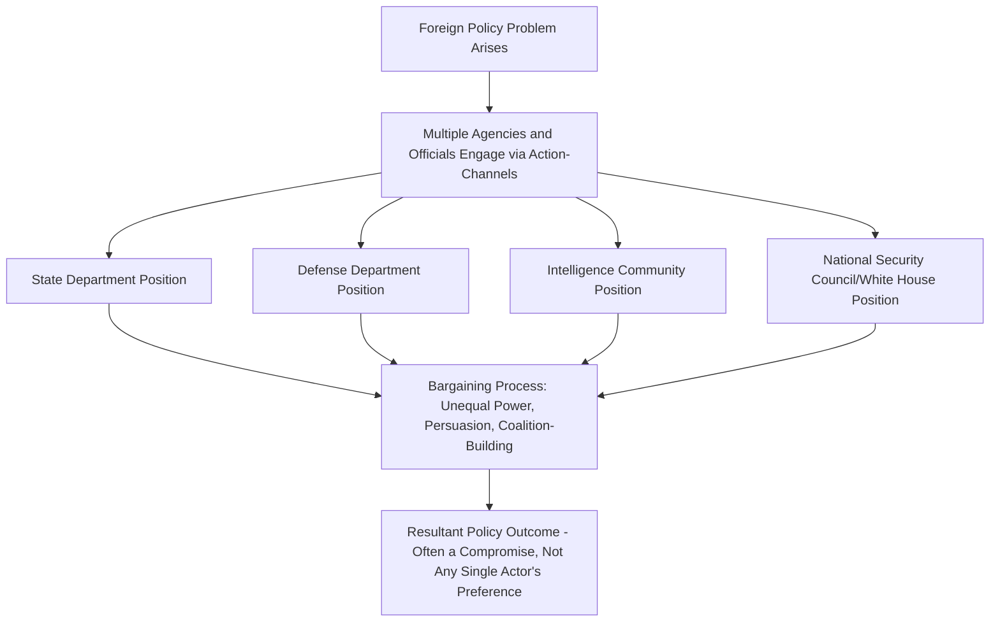

## Bureaucratic Politics and Foreign Policy

### Overview

Bureaucratic Politics is a framework within Foreign Policy Analysis holding that foreign policy outcomes are best explained not as the product of a unitary state calculating strategic optimality, but as the **resultant** of bargaining, negotiation, and competition among multiple individuals and organizations within the government, each possessing distinct interests, perceptions, and relative power. This approach directly challenges the rational actor model's core assumption that "the state" acts as a single, coherent decision-maker.

### Origins and Foundational Text

**Key Points**

- Developed most influentially by Graham Allison in *Essence of Decision: Explaining the Cuban Missile Crisis* (1971), where it appears as "Model III: Governmental (Bureaucratic) Politics," alongside the Rational Actor Model (Model I) and the Organizational Process Model (Model II)
- Revised and extended in the second edition co-authored with Philip Zelikow (1999), incorporating additional archival material from the crisis
- Morton Halperin's *Bureaucratic Politics and Foreign Policy* (1974) further systematized the framework, focusing specifically on the U.S. national security bureaucracy and the recurring organizational interests that shape policy positions
- Emerged partly as a direct empirical challenge to the dominance of the rational actor model in Cold War-era strategic studies and deterrence theory

### Core Theoretical Claim

**Key Points**

- Foreign policy "decisions" are not discrete, deliberate choices but **outcomes of a political process** — specifically, a pattern of bargaining among players positioned in a hierarchical government structure
- Allison's famous shorthand: **"where you stand depends on where you sit"** — an official's policy position is substantially predictable from their organizational role and institutional affiliation, not solely from objective assessment of the national interest
- The final policy that emerges is frequently **not the first choice of any single participant**, but a compromise, a resultant of pulling and hauling among actors with unequal bargaining power and divergent goals

### Key Conceptual Elements

**Key Points**

1. **Players in positions**: foreign policy is shaped by a defined set of individuals occupying formal government roles (Secretary of State, Secretary of Defense, National Security Advisor, CIA Director, service chiefs), each bringing distinct organizational perspectives to the table
2. **Action-channels**: the regularized, pre-established procedures through which government business is organized and policy issues get raised, ensuring that certain players and considerations are structurally advantaged in a given process
3. **Bargaining advantages**: unequal distribution of formal authority, expertise, control over information, personal relationships (especially proximity to the chief executive), and persuasive skill among participants
4. **Parochial priorities**: officials tend to advocate positions that protect or advance their organization's budget, mission, autonomy, and institutional prestige, sometimes independent of the substantive merits of a given policy option
5. **Misperception and communication failure**: because participants occupy different organizational vantage points, they may genuinely perceive the same situation differently, generating friction not reducible to mere self-interest

### The Bureaucratic Politics Process (Illustrated)

### Organizational Interests: Illustrative Patterns

**Key Points**

- **Department of Defense/military services**: often prioritize budget share, force structure, and maintaining service-specific missions (e.g., interservice rivalry over roles and resources between the Army, Navy, and Air Force)
- **State Department**: often prioritizes diplomatic relationships, negotiated solutions, and the preservation of institutional channels for future diplomacy
- **Intelligence agencies**: often prioritize protecting sources and methods, which can shape how intelligence assessments are framed or shared with policymakers
- **National Security Council/White House staff**: often prioritize the president's political standing and personal preferences, sometimes creating tension with career bureaucracies with longer institutional time horizons

[Inference] These are stylized patterns drawn from the bureaucratic politics literature's case studies rather than fixed laws; actual agency positions vary considerably by issue, administration, and individual personalities involved.

### Distinguishing Bureaucratic Politics from Organizational Process (Model II)

A frequent point of conflation that merits explicit distinction:

| Dimension | Organizational Process (Model II) | Bureaucratic Politics (Model III) |
| --- | --- | --- |
| Core mechanism | Standard operating procedures (SOPs) and routines | Bargaining and negotiation among individuals |
| Unit of analysis | Organizations as semi-autonomous entities following routines | Individual officials pursuing interests within organizational roles |
| Explains | Why policy implementation follows certain patterns (e.g., military operational details) | Why a specific policy compromise emerged from competing preferences |
| Degree of agency emphasized | Low — behavior follows programmed routines | High — outcomes depend on skill, position, and political maneuvering |

### Applying the Framework: The Cuban Missile Crisis

**Example**

Allison's original case study illustrates the bureaucratic politics model through the shift from an initial preference for airstrikes to the eventual naval blockade decision:

- Military advisors within the Kennedy administration's "ExComm" initially favored a decisive air strike against Soviet missile installations in Cuba
- Other participants, including Secretary of Defense Robert McNamara, advocated for a naval blockade (quarantine) as a lower-escalation-risk alternative that preserved room for negotiation
- The final blockade decision reflected the outcome of internal bargaining and shifting coalitions among ExComm participants rather than a straightforward, unitary strategic calculation of the objectively optimal military response [Inference: Allison's own account itself has been subject to later historical reassessment as more archival material became available, particularly regarding how much genuine "bargaining" occurred versus centralized presidential decision-making]

### Interagency Coordination Mechanisms (Contemporary U.S. Context)

**Key Points**

- The U.S. National Security Council (NSC) system, formalized structurally since the National Security Act of 1947, exists partly as an institutional mechanism to manage and adjudicate bureaucratic politics among competing departments and agencies
- Interagency processes (e.g., Deputies Committee and Principals Committee meetings) function as formal "action-channels" through which competing agency positions are surfaced, debated, and reconciled before reaching the president
- The relative influence of the NSC staff versus line departments (State, Defense, CIA) has varied significantly across different presidential administrations, itself illustrating a meta-level bureaucratic politics dynamic over control of the foreign policy process

### Major Critiques of the Bureaucratic Politics Model

**Key Points**

- **Explanatory overreach critique** (notably from Stephen Krasner, "Are Bureaucracies Important? Or Allison Wonderland," 1972): argues the model can understate the degree to which presidents and top leaders, when sufficiently motivated and attentive, can and do override bureaucratic preferences and impose their own priorities — meaning "where you stand" does not always determine outcomes as strongly as claimed
- **Empirical/historiographical critique**: later archival releases regarding the Cuban Missile Crisis have led some scholars to argue that Allison's original account somewhat overstated the degree of genuine multi-actor bargaining relative to centralized decision-making, particularly by President Kennedy himself
- **Parsimony critique**: because the model emphasizes the particularities of specific bureaucratic actors, institutional configurations, and personalities, it can be difficult to generate generalizable, falsifiable predictions applicable across different governments or cases
- **Applicability critique across regime types**: the model was developed almost entirely from U.S. case studies with a specific, relatively pluralistic bureaucratic structure; its applicability to more centralized, authoritarian, or differently structured governments is less thoroughly established in the literature [Unverified as a matter of broad cross-regime empirical validation]

### Related Topics

- Theories of Foreign Policy Decision-Making (in depth)
- Levels of Analysis in International Relations
- Organizational Process Model (Allison's Model II)
- Crisis Decision-Making and the Cuban Missile Crisis
- National Security Council and Interagency Process
- Groupthink and Small-Group Decision Dynamics
- Civil-Military Relations