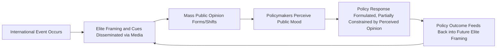

## Public Opinion and Foreign Policy

### Overview

Public Opinion and Foreign Policy examines the extent to which mass public attitudes shape, constrain, or are shaped by state foreign policy decisions. This subfield sits at the intersection of the second (domestic/state) level of analysis and political psychology, and it directly engages a long-standing debate over whether ordinary citizens possess the knowledge and attitudinal coherence necessary to meaningfully influence foreign affairs, traditionally considered an elite-dominated policy domain.

### The Almond-Lippmann Consensus

**Key Points**

- Named for Gabriel Almond (*The American People and Foreign Policy*, 1950) and Walter Lippmann, whose earlier work (*Public Opinion*, 1922; *The Phantom Public*, 1925) argued mass publics are poorly equipped to form stable, informed judgments on complex policy matters
- Core claims of this traditional consensus, dominant through the mid-20th century:
  1. Public opinion on foreign policy is **volatile** — subject to large, unpredictable swings driven by transient events rather than stable underlying values
  2. Public opinion is **unstructured/incoherent** — lacking the ideological or attitudinal consistency associated with elite policy reasoning
  3. Public opinion has **minimal impact** on actual foreign policy decision-making, which is properly and practically the domain of elites with specialized expertise
- This consensus provided a normative and empirical justification for insulating foreign policy from close democratic accountability, in contrast to domestic policy

### The Revisionist Challenge

**Key Points**

- Beginning substantially in the 1980s, a body of empirical work challenged each core claim of the Almond-Lippmann consensus
- **Rationality/structure critique**: scholars including William Caspary and later Benjamin Page and Robert Shapiro (*The Rational Public*, 1992) argued that while individual opinions may be poorly informed, aggregate public opinion exhibits meaningful stability and responds sensibly to real-world events, largely canceling out individual-level "noise" (a "wisdom of crowds"-style aggregation argument)
- **Attitude structure critique**: Eugene Wittkopf and Ole Holsti demonstrated that foreign policy attitudes, rather than being random, can be organized along coherent underlying dimensions
- **Responsiveness critique**: subsequent research (e.g., work associated with Page and Shapiro) found greater correspondence between shifts in aggregate public opinion and subsequent policy change than the traditional consensus predicted, though the direction of causality (opinion shaping policy versus policy/elite framing shaping opinion) remains contested

### Wittkopf's Two-Dimensional Model of Foreign Policy Attitudes

**Key Points**

A widely cited structural model organizing mass foreign policy attitudes along two relatively independent dimensions:

1. **Militant Internationalism (MI)**: support for the use of force and military engagement abroad
2. **Cooperative Internationalism (CI)**: support for diplomacy, international institutions, foreign aid, and multilateral cooperation

Crossing these two dimensions produces four attitudinal types:

| MI \ CI | High Cooperative Internationalism | Low Cooperative Internationalism |
| --- | --- | --- |
| **High Militant Internationalism** | Internationalist (supports both engagement and cooperation) | Hardliner (supports force, skeptical of cooperation/diplomacy) |
| **Low Militant Internationalism** | Accommodationist (favors cooperation over force) | Isolationist (skeptical of both force and broad engagement) |

### Elite-Public Opinion Dynamics

**Key Points**

- A central empirical question: does public opinion drive elite policy positions ("bottom-up"), or do elite cues and framing shape mass opinion ("top-down")?
- **Elite cue theory** (John Zaller, *The Nature and Origins of Mass Opinion*, 1992): most citizens lack the information to independently evaluate foreign policy issues and instead take cues from trusted political elites, particularly those sharing their partisan or ideological identification
- This generates a recurring pattern: when elite consensus exists on a foreign policy issue, mass opinion tends to follow that consensus; when elites are visibly divided, mass opinion tends to polarize along corresponding partisan lines
- Zaller's Receive-Accept-Sample (RAS) model formalizes this: an individual's expressed opinion depends on which considerations they have been exposed to (elite messaging reception) and which of those considerations are salient at the moment of being asked

### The Rally 'Round the Flag Effect

**Key Points**

- Term coined by John Mueller (*War, Presidents, and Public Opinion*, 1973): public approval of the president tends to increase sharply and immediately following a dramatic international event involving the United States, particularly the use of military force or a direct national security crisis
- Explained partly through elite cue theory: rally events are often accompanied by a temporary suspension of elite criticism as opposition figures avoid appearing unpatriotic during a crisis, reducing the "supply" of critical cues available to the public
- Rally effects are typically found empirically to be **short-lived**, decaying as elite criticism resumes and as initial optimism about the outcome of the crisis or conflict fades [Inference: the precise duration and magnitude of decay vary considerably by case and are not governed by a fixed, universal formula]

### The Casualty Sensitivity Debate

**Key Points**

- A long-running empirical debate over whether public support for military engagement declines primarily as a direct function of accumulating combat casualties
- **Early "casualty-phobia" thesis**: public support erodes rapidly and directly as casualties mount, constraining elite willingness to sustain prolonged military engagements
- **Revisionist "principal policy objective" thesis** (Eric Larson; Christopher Gelpi, Peter Feaver, and Jason Reifler in *Paying the Human Price of War*, 2009): casualty tolerance is conditioned heavily by whether the public believes the mission is likely to succeed and whether it is perceived as principled/necessary, rather than by casualty numbers in isolation — the public tolerates significant losses in missions perceived as winnable and worthwhile
- This debate carries direct policy implications for how governments communicate about the justification, expected duration, and likely success of military interventions

### Diversionary War Theory (Public Opinion Linkage)

**Key Points**

- Proposes that domestic political leaders facing declining approval, economic difficulty, or internal political weakness have incentives to initiate or escalate international conflict to generate a rally effect and divert public attention from domestic troubles
- Empirical support for diversionary war theory is decidedly mixed across quantitative studies; findings vary considerably depending on regime type, historical period, and methodological specification [Unverified as a matter of settled empirical consensus; this remains one of the more contested causal claims linking domestic public opinion dynamics to interstate conflict]

### Illustrative Diagram: Opinion-Policy Feedback Loop

### Public Opinion's Constraining vs. Enabling Role

**Key Points**

- **Constraining function**: public opinion is frequently theorized as a "mood" that sets outer boundaries on acceptable policy options, rather than dictating specific policy choices (Almond's original "mood theory," partially retained even by revisionists)
- **Enabling/legitimizing function**: elites sometimes actively cultivate public support to build domestic political capital for policies they already favor, rather than opinion functioning as an independent constraint (raising causality questions similar to the elite-cue debate above)
- Democratic accountability arguments (linked to democratic peace theory) suggest that anticipated electoral consequences give publics indirect structural influence over foreign policy even absent detailed public engagement with specific policy content

### Example: Applying the Framework to a Case

**Example**

U.S. public opinion during the Vietnam War is a canonical case study in this literature:

- Public support for the war declined over time in a pattern researchers have linked to accumulating casualties, but subsequent reanalysis (consistent with the Gelpi/Feaver/Reifler "principal policy objective" thesis) suggests that declining beliefs about the likelihood of success were at least as significant as casualty totals themselves in driving opinion erosion
- The war also produced a documented, historically significant partisan and elite realignment in foreign policy attitudes, illustrating how elite division (rather than direct public reasoning about Vietnam-specific facts) helped structure the war's increasing domestic polarization over time [Inference: apportioning precise causal weight between casualty levels, success perceptions, and elite cues for this specific historical case remains an active subject of scholarly disagreement]

### Major Critiques and Open Debates

**Key Points**

- **Causality/endogeneity critique**: much of the literature struggles to cleanly separate whether public opinion independently causes policy change or whether both are jointly driven by elite framing and real-world events, a persistent methodological challenge
- **Measurement critique**: survey-based public opinion research faces well-documented challenges regarding question wording effects, low levels of issue-specific knowledge among respondents, and the difficulty of capturing genuinely stable attitudes versus top-of-mind reactions
- **Generalizability critique**: the large majority of foundational research in this subfield is drawn from U.S. survey data, raising open questions about the applicability of these models (rally effects, casualty sensitivity, elite cue structures) to political systems with different media environments, party structures, and civil-military relations [Unverified as a matter of broad cross-national validation]
- **Social media/digital era critique**: much of the classical literature predates the contemporary fragmented digital media environment, and scholars are still assessing how algorithmically mediated information environments affect the elite-cue transmission mechanisms central to earlier theoretical models

### Related Topics

- Theories of Foreign Policy Decision-Making (in depth)
- Democratic Peace Theory
- Diversionary War Theory (in depth)
- Elite Cue Theory and Political Communication
- Media and Foreign Policy (the "CNN Effect")
- Levels of Analysis in International Relations
- Political Psychology and International Relations