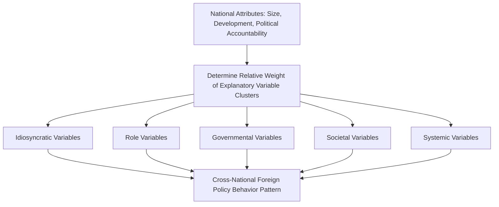

## Comparative Foreign Policy

### Overview

Comparative Foreign Policy (CFP) is a subfield of Foreign Policy Analysis that seeks to develop generalizable, systematically testable theories of foreign policy behavior by comparing patterns across multiple states, rather than producing single-case, idiosyncratic historical narratives. It emerged as an explicitly scientific, behavioralist project aiming to identify recurring relationships between national attributes and foreign policy outputs, in contrast to the more interpretive, single-case tradition of much classical diplomatic history.

### Origins and the Behavioral Turn

**Key Points**

- Emerged from the broader **behavioral revolution** in political science during the 1960s, which sought to apply rigorous, quantitative, hypothesis-testing methods to political phenomena previously studied primarily through historical and legal analysis
- James N. Rosenau's essay "Pre-Theories and Theories of Foreign Policy" (1966) is widely regarded as the field's founding statement, explicitly calling for a genuinely comparative, generalizable theory of foreign policy rather than a collection of single-country studies
- Rosenau's central methodological ambition: identify which **national attributes** (size, level of economic development, political accountability/openness) systematically predict variation in foreign policy behavior across a large number of states, rather than relying on case-specific historical explanation

### Rosenau's Pre-Theory: Genotypic and Phenotypic Variables

**Key Points**

- Rosenau proposed that foreign policy behavior (the phenomenon to be explained) is shaped by five clusters of independent variables, later refined into a widely cited ranking framework
- **Genotypic variables** (categories of explanatory factors):
  1. **Idiosyncratic**: individual leader characteristics, values, and personality
  2. **Role**: the behavioral expectations attached to specific governmental positions, independent of who occupies them
  3. **Governmental**: the structure of political decision-making institutions within the state
  4. **Societal**: nongovernmental features of the society, including public opinion, culture, and economic structure
  5. **Systemic**: features of the external international environment
- Rosenau further proposed that the **relative explanatory weight** of these clusters varies systematically depending on a state's characteristics, producing his well-known typology of national attributes

### The CFP Genotype: Size, Development, and Political Accountability

Rosenau argued the relative importance of the five variable clusters depends on where a state falls along three dimensions:

| National Attribute Dimension | Categories | Implication for Explanatory Weight |
| --- | --- | --- |
| **Size** | Large vs. Small | Large states' foreign policy is less dependent on immediate systemic pressures than small states', which have less capacity to shape their external environment |
| **Economic Development** | Developed vs. Underdeveloped | Less developed states are theorized to be more constrained by systemic/economic pressures and more susceptible to individual leader idiosyncrasies given weaker institutionalization |
| **Political Accountability/Openness** | Open (democratic/pluralist) vs. Closed (authoritarian) | Open polities are theorized to be more responsive to societal variables (public opinion, interest groups); closed polities are theorized to concentrate explanatory weight in idiosyncratic and governmental variables |

[Inference] Rosenau's specific rank-orderings of variable importance across these categories were offered as hypotheses for empirical testing rather than as definitively confirmed findings, and later CFP scholarship substantially revised and complicated this original schema.

### CREON and Events Data Projects

**Key Points**

- The **Comparative Research on the Events of Nations (CREON)** project, led by Charles Hermann, Maurice East, and others in the 1970s, represented a major empirical effort to operationalize Rosenau's pre-theory using systematically coded, quantifiable data on state foreign policy actions ("events data") across many countries
- **Events data methodology**: coding foreign policy behavior into standardized categories (e.g., cooperative/conflictual actions, verbal/physical actions) drawn from large volumes of news reporting, enabling statistical comparison across states and time (related projects include WEIS — World Event/Interaction Survey — and COPDAB — Conflict and Peace Data Bank)
- This approach aimed to move foreign policy analysis toward the same quantitative, hypothesis-testing rigor found in other subfields of political science

### Decline and Critique of the Original CFP Project

**Key Points**

- By the late 1970s and 1980s, the ambitious behavioralist CFP research program associated with Rosenau and CREON faced substantial internal and external criticism, and enthusiasm for the project waned considerably
- **Conceptual stretching critique**: reducing complex, context-dependent foreign policy decisions to standardized quantitative event categories was criticized for losing essential contextual and causal nuance
- **Middle-range theory difficulty**: efforts to identify robust, generalizable cross-national laws linking national attributes to foreign policy behavior produced comparatively modest, often weak or inconsistent statistical findings relative to the project's original ambitions
- **Rosenau's own partial retreat**: Rosenau himself later moved toward more qualitative, "post-international politics" theorizing (*Turbulence in World Politics*, 1990), reflecting broader disciplinary skepticism about the original strict behavioralist research program's payoff

### Comparative Foreign Policy Today: A More Pluralistic Field

**Key Points**

- Contemporary comparative foreign policy work is less unified around a single behavioralist research program and instead draws on multiple methodological traditions:
  - **Quantitative/statistical approaches**: continue in refined forms, particularly using large cross-national datasets on conflict behavior, trade policy, and alliance patterns
  - **Structured, focused comparison** (a method associated with Alexander George): systematic comparison of a smaller number of carefully selected cases using a common analytical framework, explicitly designed to balance generalizability with contextual depth
  - **Middle-range theorizing on specific policy domains**: rather than seeking a single grand theory of all foreign policy, contemporary CFP scholarship often focuses on comparing specific policy areas (e.g., comparative alliance behavior, comparative sanctions policy, comparative foreign aid allocation) across a defined set of cases

### Structured, Focused Comparison (George's Method)

**Key Points**

- Developed by Alexander George as a middle path between purely idiographic (single-case, historically specific) and purely nomothetic (universal law-seeking) approaches
- **"Structured"**: the researcher poses the same general questions to each case under examination, ensuring systematic comparability
- **"Focused"**: the researcher deliberately narrows the inquiry to specific aspects of the cases relevant to the research objective, rather than attempting comprehensive historical coverage of each case
- Widely used in subsequent qualitative comparative foreign policy scholarship, including much of the case-based deterrence and crisis-decision-making literature

### Comparative Foreign Policy vs. Other IR Levels/Approaches

| Dimension | Comparative Foreign Policy | Systemic Theories (Neorealism/Neoliberalism) | Single-Case Foreign Policy Analysis |
| --- | --- | --- | --- |
| Primary goal | Generalizable, cross-national patterns in foreign policy behavior | Generalizable patterns in systemic outcomes | Rich, contextualized explanation of one state's/decision's specifics |
| Unit of analysis | Multiple states' foreign policy behavior | The international system as a whole | A single state, leader, or decision |
| Methodological orientation | Originally strongly quantitative/behavioralist; now pluralistic | Structural, often deductive/parsimonious | Historical, interpretive, process-tracing |
| Key limitation acknowledged | Difficulty generating robust cross-national generalizations | Brackets domestic/individual variation entirely | Limited generalizability beyond the case studied |

### Illustrative Diagram: CFP's Explanatory Architecture

### Example: Applying Comparative Foreign Policy to a Case

**Example**

Comparing foreign aid allocation patterns across donor democracies illustrates a contemporary, domain-specific CFP research design:

- Researchers systematically compare aid allocation decisions across multiple donor states (e.g., differing patterns among Nordic donors emphasizing humanitarian/developmental criteria versus donors whose allocation more closely tracks strategic/commercial interests) using a common analytical framework applied consistently across cases
- This kind of domain-specific, structured comparison reflects the field's contemporary approach: rather than seeking one universal theory explaining all foreign policy behavior (as the original Rosenau project aspired to), it develops middle-range theories explaining variation within a specific, well-defined policy domain [Inference: the specific findings regarding donor motivation patterns vary across studies and datasets and remain subject to ongoing empirical refinement]

### Major Critiques and Limitations

**Key Points**

- **Aggregation critique**: cross-national statistical comparison can obscure important within-case variation and context-specific causal mechanisms that qualitative single-case work captures more effectively
- **Data availability and comparability critique**: events data and cross-national foreign policy datasets often face significant challenges in ensuring genuinely comparable coding across states with very different political systems, media environments, and information availability
- **Middle-range vs. grand theory tension**: the field has largely abandoned Rosenau's original ambition of a single unified predictive theory of foreign policy in favor of more modest, domain-specific middle-range theorizing, which some view as scientific maturation and others view as a retreat from the field's founding ambitions
- **Persistent U.S./Western case bias**: despite its comparative aspiration, a substantial share of empirical CFP research has historically concentrated on Western, and particularly U.S., foreign policy cases, limiting the genuinely global comparative scope the field's founders envisioned [Unverified as a matter of a precise, quantified bias, but widely noted as a qualitative pattern in disciplinary reviews]

### Related Topics

- Theories of Foreign Policy Decision-Making (in depth)
- Bureaucratic Politics and Foreign Policy (in depth)
- Levels of Analysis in International Relations
- Events Data Analysis in International Relations
- Structured, Focused Comparison as a Research Method
- Foreign Aid Policy: Comparative Perspectives
- Small States in International Relations