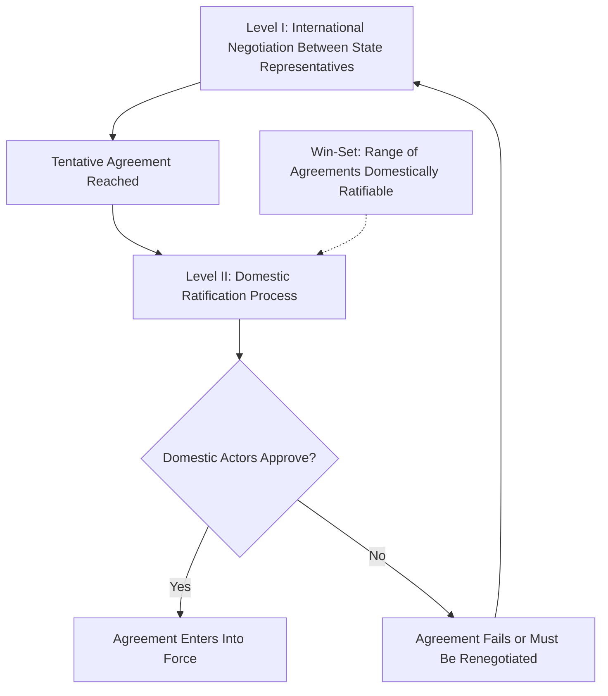

## Diplomacy and Diplomatic Practice

### Overview

Diplomacy and Diplomatic Practice refers to the formal and informal processes by which states (and increasingly non-state actors) manage relations, negotiate agreements, resolve disputes, and represent their interests to one another without resort to force. It is both a substantive subject of theoretical inquiry within IR and a professional practice governed by longstanding customary norms and, since the mid-20th century, codified international law.

### Historical Development

**Key Points**

- Modern diplomatic practice traces institutionally to the **Italian city-states of the Renaissance** (15th century), which pioneered permanent resident embassies rather than the earlier practice of purely ad hoc envoys sent for specific occasions
- The **Peace of Westphalia (1648)** is conventionally treated as consolidating the modern state-based diplomatic system, formalizing principles of state sovereignty and non-interference that underpin the practice of interstate diplomacy
- The **Congress of Vienna (1814–1815)** established many procedural and protocol norms (including diplomatic precedence and rank) that were later codified into treaty law
- Harold Nicolson's *Diplomacy* (1939) remains a foundational text distinguishing the "old diplomacy" (secretive, aristocratic, bilateral) from the "new diplomacy" associated with 20th-century mass politics, open covenants, and multilateral institutions

### Core Functions of Diplomacy

**Key Points**

Following the categorization used in the Vienna Convention on Diplomatic Relations (see below) and standard diplomatic theory, the core functions include:

1. **Representation**: formally representing the sending state's government and interests to the receiving state
2. **Negotiation**: conducting formal and informal bargaining to reach agreements on matters of mutual concern
3. **Reporting/observation**: gathering and transmitting information about political, economic, and social conditions in the receiving state back to the home government
4. **Protection of interests**: safeguarding the sending state's interests and its nationals within the receiving state
5. **Promotion of friendly relations**: developing economic, cultural, and scientific ties between the two states

### The Vienna Convention on Diplomatic Relations (1961)

**Key Points**

- The foundational multilateral treaty codifying customary diplomatic law, widely ratified and considered largely reflective of binding customary international law even for non-signatories
- **Diplomatic immunity**: diplomatic agents are immune from the criminal jurisdiction of the receiving state and generally immune from its civil and administrative jurisdiction, with limited exceptions (e.g., certain private real property or commercial activity disputes)
- **Inviolability of premises**: diplomatic mission premises (embassies) are inviolable — receiving-state authorities may not enter without the consent of the head of mission
- **Inviolability of the diplomatic bag and correspondence**: official communications and diplomatic pouches are protected from search or seizure
- **Persona non grata**: the receiving state may at any time, without needing to explain its reasoning, declare a diplomat unacceptable, requiring the sending state to recall that individual
- These immunities exist not as a personal privilege for individual diplomats but functionally, to ensure diplomatic missions can carry out their representative and negotiating functions without interference or intimidation

### Types and Levels of Diplomatic Engagement

**Key Points**

- **Bilateral diplomacy**: direct state-to-state engagement, typically conducted through resident embassies headed by an ambassador (or, at a lower rank, a chargé d'affaires)
- **Multilateral diplomacy**: diplomatic engagement conducted through or within international organizations and conferences (UN General Assembly sessions, WTO negotiating rounds, climate conferences such as the UNFCCC Conference of the Parties)
- **Summit diplomacy**: direct engagement between heads of state or government, which has become substantially more prominent since the mid-20th century relative to Nicolson's "old diplomacy" model of professional career diplomats operating at arm's length from top leadership
- **Track II diplomacy**: unofficial, informal dialogue involving non-governmental actors (academics, former officials, civil society), often used to explore possible solutions or build trust in situations where official Track I (government-to-government) diplomacy is politically constrained or has stalled
- **Public diplomacy**: efforts by a state to communicate directly with and influence the public (rather than only the government) of another country, encompassing cultural exchange, international broadcasting, and strategic communication

### Coercive Diplomacy

**Key Points**

- A concept developed substantially by Alexander George, describing the use of threats or limited force to persuade an adversary to reverse an action already taken or to halt an ongoing action, distinguished from deterrence (which seeks to prevent an action not yet taken)
- George identified conditions under which coercive diplomacy is more or less likely to succeed, including the credibility of the threat, the proportionality of the demand, and whether the target state is offered a face-saving way to comply
- Related to but conceptually distinct from **compellence** (Thomas Schelling's term in *Arms and Influence*, 1966), which similarly involves using threatened force to induce a change in an adversary's behavior rather than merely deter

### Negotiation Theory in Diplomatic Practice

**Key Points**

- **Distributive (zero-sum) bargaining**: negotiation over the division of a fixed set of resources or concessions, where one party's gain is the other's loss
- **Integrative (win-win) bargaining**: negotiation seeking to expand the total value available through mutual gains, often by identifying differing priorities across issues that allow for mutually beneficial trade-offs
- **BATNA (Best Alternative to a Negotiated Agreement)**, a concept from Roger Fisher and William Ury's *Getting to Yes* (1981), is widely applied in diplomatic negotiation theory: a party's leverage in negotiation depends significantly on the attractiveness of its alternative to reaching an agreement at all
- **Two-level games** (Robert Putnam, 1988): diplomatic negotiators must simultaneously satisfy both the international bargaining table (Level I, with the counterpart state) and domestic ratification constraints (Level II, with their own legislature, public, or interest groups) — an agreement acceptable internationally may fail if it cannot be ratified domestically, and vice versa

### Illustrative Diagram: Putnam's Two-Level Game

**Key Points**

- The **"win-set"** is the range of possible agreements that would be ratified domestically at Level II; a larger win-set generally strengthens a negotiator's flexibility at Level I but can weaken their bargaining leverage (since counterparts know more options are acceptable), producing a strategic tension negotiators must manage

### Track I vs. Track II Diplomacy Compared

| Dimension | Track I Diplomacy | Track II Diplomacy |
| --- | --- | --- |
| Actors | Official government representatives | Non-governmental actors (academics, NGOs, former officials) |
| Formal authority | Binding on the state | Non-binding, exploratory |
| Typical use case | Formal treaty negotiation, official crisis management | Confidence-building, generating options when official channels are politically constrained |
| Public visibility | Often high-profile/public | Frequently confidential/low-profile |

### Example: Applying Diplomatic Theory to a Case

**Example**

The 2015 Joint Comprehensive Plan of Action (JCPOA) negotiations over Iran's nuclear program illustrate several diplomatic concepts in combination:

- Multilateral diplomacy structure: negotiations involved Iran and the P5+1 (the five permanent UN Security Council members plus Germany), requiring coordination among multiple negotiating parties with distinct interests, not a simple bilateral exchange
- Two-level game dynamics: U.S. negotiators had to secure an agreement that could survive domestic political scrutiny (notably from Congress) while Iranian negotiators similarly had to manage domestic political constituencies skeptical of concessions to Western powers
- Integrative bargaining elements: the eventual agreement combined sanctions relief with nuclear program restrictions, an exchange designed to create mutual gains across differently prioritized issues rather than a pure distributive trade-off [Inference: assessments of how effectively the agreement balanced these competing domestic and international constraints remain a matter of ongoing political and scholarly debate, and the agreement's subsequent trajectory—including the 2018 U.S. withdrawal—is itself frequently cited as evidence of the fragility such two-level agreements can face when domestic ratification is not durably secured]

### Diplomatic Practice in the Digital Era

**Key Points**

- **Digital diplomacy/Twitter diplomacy**: the increasing use of social media platforms by heads of state, foreign ministries, and diplomats for direct public communication, which some scholars argue partially bypasses traditional, more controlled bilateral channels and accelerates the pace of diplomatic signaling
- This development raises open questions about the durability of established diplomatic protocol and confidentiality norms in an environment of instantaneous, public, and less formally mediated diplomatic communication [Unverified as a matter of settled scholarly consensus on its net effects, since this remains a comparatively recent and actively studied development]

### Major Critiques and Debates

**Key Points**

- **Erosion-of-privacy critique**: the shift toward more public, "open" diplomacy (accelerated further by digital communication) is argued by some scholars and practitioners to undermine the confidential space traditionally considered necessary for genuine compromise and face-saving concessions in sensitive negotiations
- **Democratic legitimacy debate**: tension persists between the traditional insulation of diplomacy from direct public scrutiny (justified on grounds of effectiveness and confidentiality) and democratic norms favoring transparency and accountability in foreign policy conduct
- **Efficacy of coercive diplomacy debate**: scholars continue to dispute the conditions under which coercive diplomacy reliably succeeds versus escalates into unwanted conflict, given the difficulty of credibly signaling resolve without provoking the very escalation coercive diplomacy seeks to avoid
- **Relevance-in-decline debate**: some scholars have periodically questioned whether traditional resident-embassy diplomacy retains its historical importance given instantaneous communication technology and direct leader-to-leader summit contact, though career diplomatic services continue to perform extensive functions (reporting, protecting nationals, managing day-to-day bilateral relations) not replicated by summitry alone

### Related Topics

- Coercive Diplomacy and Compellence (in depth)
- Two-Level Games and Domestic-International Linkage
- The Vienna Convention and Diplomatic Law
- Public Diplomacy and Soft Power
- Multilateral Negotiation and International Organizations
- Crisis Diplomacy and Deterrence Theory
- Track II Diplomacy and Conflict Resolution