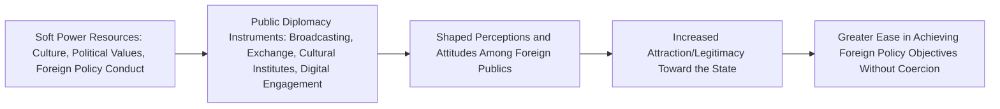

## Soft Power and Public Diplomacy

### Overview

Soft Power and Public Diplomacy examine how states pursue foreign policy goals through attraction, persuasion, and shaping preferences rather than through coercion (hard power via military force) or payment (economic inducement). Soft power is the conceptual foundation; public diplomacy is the primary set of practical instruments states use to generate and project it.

### Origins of the Soft Power Concept

**Key Points**

- Coined and developed by Joseph Nye, first in *Bound to Lead: The Changing Nature of American Power* (1990) and elaborated fully in *Soft Power: The Means to Success in World Politics* (2004)
- Nye's core definition: soft power is **the ability to get others to want the outcomes you want, through attraction rather than coercion or payment**
- Developed partly as a corrective to declinist arguments of the late 1980s that overemphasized relative U.S. military and economic decline while overlooking non-material sources of continuing American global influence

### Nye's Three Faces of Power

**Key Points**

Nye situates soft power within a broader typology of how power operates in international politics:

1. **Command power (hard power)**: getting others to change their behavior through coercion (threats) or inducement (payments) — associated with military and economic capabilities
2. **Co-optive power (soft power)**: getting others to want what you want by shaping their preferences, through attraction to one's values, culture, and policies
3. **Agenda-setting/structural power**: shaping the very structure of choices available to others, determining what options are even considered

### Sources of Soft Power

Nye identifies three principal resources from which a state's soft power derives:

| Source | Description | Illustrative Mechanism |
| --- | --- | --- |
| **Culture** | The values, practices, and cultural products that are attractive to others | Film, music, literature, educational exchange, language |
| **Political Values** | Domestic and international political values a state upholds and is perceived to live up to | Democratic governance, rule of law, human rights record |
| **Foreign Policy** | The perceived legitimacy and moral authority of a state's foreign policy conduct | Multilateral engagement, consistency between stated values and actual conduct |

**Key Points**

- Nye emphasizes that soft power resources are effective only insofar as they are genuinely perceived as attractive and legitimate by the target audience; a state's soft power can be significantly undermined by foreign policy actions perceived as hypocritical relative to its professed values (e.g., a state advocating human rights while itself engaging in conduct widely viewed as violating those same norms)

### Smart Power: Combining Hard and Soft Power

**Key Points**

- Nye later introduced **smart power** as a corrective to the perception that soft power should substitute entirely for hard power; smart power denotes the strategic combination of hard and soft power resources into a coherent, mutually reinforcing strategy
- The concept gained institutional traction in U.S. policy discourse, notably through the bipartisan Center for Strategic and International Studies "Smart Power Commission" (2007) and subsequent adoption in official U.S. foreign policy rhetoric

### Public Diplomacy: Definition and Scope

**Key Points**

- Public diplomacy refers to the set of instruments and activities through which a government seeks to inform, engage, and influence foreign publics (rather than only foreign governments) in support of its foreign policy objectives
- Distinguished from traditional diplomacy by its target audience: traditional diplomacy is government-to-government; public diplomacy is government-to-foreign-public (and increasingly, in some formulations, involves engagement between publics directly, sometimes termed "new public diplomacy")
- The term is often traced to Edmund Gullion, a former U.S. diplomat who helped establish the Fletcher School's Edward R. Murrow Center in the mid-1960s, though related state practices (international broadcasting, cultural exchange) predate the coined term considerably

### Core Instruments of Public Diplomacy

**Key Points**

1. **International broadcasting**: state-funded media services aimed at foreign audiences (e.g., historically the BBC World Service, Voice of America, Deutsche Welle), intended to provide information and shape perceptions of the broadcasting state
2. **Educational and cultural exchange programs**: initiatives that bring foreign students, scholars, and professionals into direct contact with the host country (e.g., the Fulbright Program), premised on the theory that direct personal experience builds lasting favorable attitudes
3. **Cultural institutes and diplomacy**: state-supported cultural promotion bodies (e.g., the British Council, the Goethe-Institut, the Alliance Française, China's Confucius Institutes) that promote language instruction and cultural programming abroad
4. **Nation branding**: coordinated efforts to shape a country's overall international image and reputation, often coordinated across tourism promotion, trade promotion, and cultural diplomacy simultaneously
5. **Digital/social media public diplomacy**: direct engagement with foreign publics via digital platforms, increasingly prominent since the 2010s as a lower-cost, faster, and more interactive complement to traditional broadcasting

### Illustrative Diagram: Soft Power to Foreign Policy Outcome Pathway

### Old vs. New Public Diplomacy

| Dimension | "Old" Public Diplomacy | "New" Public Diplomacy |
| --- | --- | --- |
| Communication direction | Largely one-way (state to foreign public) | Increasingly two-way/networked (state-public and public-public dialogue) |
| Primary channel | State-controlled broadcasting and print media | Digital and social media platforms, enabling direct and interactive engagement |
| Key actors | Primarily government agencies | Governments, NGOs, diaspora communities, private citizens, and networked non-state actors |
| Theoretical emphasis | Persuasion and information dissemination | Relationship-building, listening, and mutual dialogue |

### Nation Branding and Soft Power Rankings

**Key Points**

- Various indices attempt to quantitatively rank countries' soft power (e.g., the Portland/USC Soft Power 30 index, later succeeded by other rankings), typically aggregating measures across government effectiveness, culture, education, digital engagement, enterprise, and global engagement
- Such indices face significant methodological critique regarding the difficulty of operationalizing an inherently perceptual, relational concept (attraction is by definition audience-dependent) into a single composite national score [Unverified as a matter of universally accepted measurement validity, given ongoing methodological debate over how to properly quantify soft power]

### Example: Applying Soft Power Theory to a Case

**Example**

South Korea's cultural diplomacy strategy, often analyzed under the informal label "Korean Wave" (Hallyu), illustrates soft power accumulation through primarily non-state-driven cultural export:

- The global popularity of Korean popular music (K-pop), television dramas, and film has been widely credited with substantially increasing favorable international perceptions of South Korea, functioning as a soft power resource even though the cultural content itself is produced primarily by private commercial entities rather than direct government propaganda
- The South Korean government has subsequently incorporated support for cultural export industries into its formal public diplomacy strategy, illustrating how organically generated cultural attraction can be selectively leveraged and amplified through state policy rather than created from the state downward [Inference: the precise causal contribution of the Korean Wave specifically (versus other simultaneous developments in South Korea's economic and diplomatic profile) to broader shifts in national reputation is difficult to isolate empirically and is treated with some caution in the academic public diplomacy literature]

### Major Critiques of Soft Power and Public Diplomacy

**Key Points**

- **Measurement/causality critique**: unlike military or economic power, soft power's effects are diffuse, long-term, and difficult to isolate causally from other simultaneous influences on foreign public attitudes, making rigorous empirical assessment of specific public diplomacy programs' effectiveness genuinely difficult
- **Propaganda-adjacency critique**: critics have questioned whether public diplomacy, particularly state-funded international broadcasting, is meaningfully distinguishable in practice from propaganda, especially when the line between "informing" and "persuading" foreign publics is not sharply defined
- **Conceptual elasticity critique**: some IR scholars argue "soft power" has become an overly broad, catch-all term applied to almost any non-military form of influence, potentially diluting its explanatory precision as a distinct analytical concept
- **Asymmetric applicability critique**: critics note that Nye's framework, developed substantially with reference to U.S. cultural and political global appeal, may not translate equally well to states whose soft power resources or target audiences differ structurally (e.g., states without dominant global media/cultural export industries), a concern connected to broader critiques of Western-centric bias in foundational IR concepts
- **Limits under adversarial conditions**: soft power is widely observed to be substantially less effective in influencing the perceptions of publics or governments that are already deeply adversarial or ideologically opposed, raising questions about its practical utility precisely in the highest-stakes foreign policy contexts

### Related Topics

- Diplomacy and Diplomatic Practice (in depth)
- Nation Branding and International Image Management
- Cultural Diplomacy and Educational Exchange Programs
- Propaganda and International Political Communication
- Hegemonic Stability Theory and Hegemony (comparative concept of power)
- Digital Diplomacy and Social Media in Foreign Policy
- Hard Power, Smart Power, and Comprehensive National Power