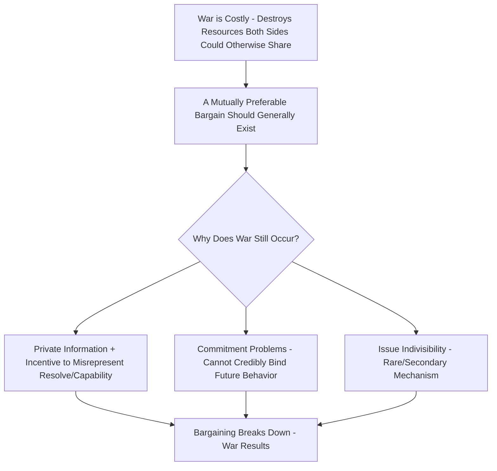

## Theories of the Causes of War

### Overview

Theories of the Causes of War constitute one of the central research agendas in International Relations and Security Studies, seeking to explain why organized violent conflict between states (and, in extended applications, within states) occurs. Because war is a complex, multi-causal phenomenon, the literature spans all three levels of analysis (individual, state, system) and encompasses structural, decision-theoretic, and psychological explanatory traditions that are frequently complementary rather than strictly competing.

### Organizing the Field by Levels of Analysis

**Key Points**

- Consistent with the levels-of-analysis framework, causes-of-war theories are conventionally organized by where they locate the primary causal mechanism: the individual/leader, the state/regime, or the international system
- Most rigorous contemporary explanations of specific wars draw on multiple levels simultaneously rather than treating them as mutually exclusive; the levels-of-analysis framework is best understood as an organizing taxonomy rather than a forced single-cause requirement

### Systemic-Level Theories

**Power Transition Theory**

**Key Points**

- Developed by A.F.K. Organski (*World Politics*, 1958), later formalized by Organski and Jacek Kugler in *The War Ledger* (1980)
- Directly challenges balance-of-power logic: rather than parity producing peace, power transition theory argues war is **most likely when a rising challenger approaches parity with a declining dominant power**, particularly when the challenger is dissatisfied with the existing international order
- Key variables: relative power trajectory (rising vs. declining) and satisfaction with the status quo (satisfied vs. dissatisfied challenger)
- A dissatisfied rising power approaching parity with the dominant state is theorized to produce the highest risk of major war, as the challenger seeks to revise an order it views as unjustly favoring the incumbent hegemon

**Hegemonic Stability Theory / Long Cycle Theory**

**Key Points**

- Associated with Robert Gilpin (*War and Change in World Politics*, 1981) and George Modelski's long cycle theory
- Argues that periods of unambiguous hegemonic dominance produce relative international order and stability (the hegemon has both the capacity and incentive to maintain a favorable system), while the decline of hegemonic power and the corresponding rise of challengers creates structural conditions conducive to major systemic war
- Overlaps substantially with power transition theory but places additional emphasis on the hegemon's active role in constructing and enforcing international rules and public goods during its ascendancy

**Balance of Power / Neorealist Explanations**

**Key Points**

- As covered under Realism and Neorealism, war is explained as a structural consequence of anarchy and the security dilemma, with the distribution of capabilities (polarity) shaping the probability and severity of conflict
- Debate persists among neorealists themselves over whether **bipolarity** (Waltz) or **multipolarity** better preserves peace, and over whether unbalanced/unipolar systems are prone to distinctive instabilities (contested within the offensive/defensive realism debate)

**The Security Dilemma and Spiral Model**

**Key Points**

- As covered under Realism and Neorealism, the security dilemma (John Herz) explains how mutually defensive actions by states with no aggressive intent can nonetheless generate escalating mutual insecurity and, ultimately, war
- Robert Jervis's **spiral model** formalizes this into a decision-theoretic account of how misperceived hostility, rather than genuine incompatible interests, can drive states into avoidable conflict

### State/Domestic-Level Theories

**Democratic Peace Theory**

**Key Points**

- As covered under Liberalism and Neoliberal Institutionalism, the empirical finding that liberal democracies rarely or never fight one another is among the most robustly documented patterns in the quantitative IR literature, though the underlying causal mechanism (normative vs. institutional/structural) remains debated
- Explicitly a state/regime-level theory, since the causal variable (regime type) is a domestic institutional characteristic

**Diversionary War Theory**

**Key Points**

- Proposes that political leaders facing domestic political weakness (economic distress, declining approval, internal unrest) have incentives to initiate or escalate external conflict to generate a "rally 'round the flag" effect and divert public attention from domestic troubles
- Empirical support across large-N quantitative studies is notably mixed, with findings sensitive to regime type, historical period, and model specification [Unverified as a matter of settled empirical consensus, remaining one of the more contested causal claims in the causes-of-war literature]

**Nationalism and Domestic Political Coalitions**

**Key Points**

- Jack Snyder's *Myths of Empire* (1991) argues that expansionist, war-prone foreign policies are frequently produced by domestic coalition politics, particularly in states where narrow, cartelized interest groups (military-industrial constituencies, imperial bureaucracies) successfully propagate self-serving strategic myths that exaggerate external threats and the benefits of expansion to a broader public
- This represents a domestic-level explanation for behavior that structural/systemic theories alone struggle to fully account for (e.g., cases of apparently strategically counterproductive imperial overexpansion)

### Individual-Level Theories

**Key Points**

- As covered extensively under Theories of Foreign Policy Decision-Making, individual-level explanations locate the causes of specific wars in leader psychology, misperception, cognitive bias, and flawed decision-making processes (Jervis's perception/misperception framework, groupthink, prospect theory's loss-aversion predictions)
- Individual-level theories are generally better suited to explaining the timing and specific trajectory of a particular conflict decision than to generating broad, generalizable predictions about the systemic frequency of war

### Rationalist Explanations for War (Bargaining Theory)

A distinct and highly influential contemporary approach that cuts across levels of analysis by asking a different foundational question:

**Key Points**

- Associated most prominently with James Fearon's "Rationalist Explanations for War" (*International Organization*, 1995)
- Starting puzzle: if war is costly, and both sides are rational, there should generally exist a negotiated bargain preferable to both sides compared to fighting (since fighting destroys resources both sides could otherwise divide) — so why does war occur at all between rational actors?
- Fearon identifies three rationalist mechanisms that can generate war despite this general inefficiency:
  1. **Private information and incentives to misrepresent**: states have incentives to bluff about their true military capabilities or resolve, and this asymmetric, strategically distorted information can prevent the discovery of a mutually acceptable bargain
  2. **Commitment problems**: even when a mutually acceptable bargain exists, states may be unable to credibly commit to upholding it in the future (e.g., a rising power's promise not to exploit a future power advantage may not be credible to a currently stronger but declining state, incentivizing preventive war)
  3. **Issue indivisibility**: certain contested goods may be difficult or impossible to divide in a way that satisfies both parties (though Fearon notes this mechanism is generally considered less significant than the first two, since side payments or issue-linkage can often substitute for physical division)

### Bargaining Model of War (Formal Representation)

**Key Points**

- The bargaining model conceptualizes war as occurring within a "bargaining range": the set of possible negotiated outcomes both sides would prefer to the expected costs and risks of fighting
- If $p$ represents State A's probability of winning a war, and $c_A$, $c_B$ represent the respective costs of fighting for States A and B, a bargaining range exists between the outcomes:

$$p - c_A \quad \text{and} \quad p + c_B$$

Any negotiated division of the contested stakes within this range should be preferable to both sides relative to war; war occurs (in the rationalist framework) specifically when private information, commitment problems, or (more rarely) indivisibility prevent states from locating and credibly agreeing to a point within this range.

### Illustrative Diagram: The Bargaining Model's Central Puzzle

### Comparative Summary of Major Theoretical Traditions

| Theory | Level of Analysis | Central Causal Variable |
| --- | --- | --- |
| Power Transition Theory | Systemic | Rising challenger approaching parity with dissatisfied status |
| Hegemonic Stability/Long Cycle Theory | Systemic | Hegemonic decline and challenger emergence |
| Balance of Power (Neorealism) | Systemic | Distribution of capabilities/polarity |
| Security Dilemma/Spiral Model | Systemic/Individual (perception) | Mutual misperception under anarchy |
| Democratic Peace Theory | State/Domestic | Regime type (joint democracy) |
| Diversionary War Theory | State/Domestic | Leader's domestic political vulnerability |
| Nationalist Myth-Making (Snyder) | State/Domestic | Cartelized domestic coalition politics |
| Cognitive/Psychological Theories | Individual | Misperception, bias, flawed information processing |
| Bargaining Theory of War (Fearon) | Cross-level (dyadic/rationalist) | Private information, commitment problems |

### Example: Applying Bargaining Theory to a Case

**Example**

The outbreak of World War I is frequently reanalyzed through the bargaining-theory lens as a case combining multiple rationalist mechanisms:

- **Private information**: great powers in 1914 had significant uncertainty and incentive to misrepresent their true resolve and alliance commitments, complicating efforts to locate a peaceful bargain during the July Crisis
- **Commitment problems**: Germany's strategic planners' fears about Russia's rapidly growing future military potential are commonly cited as generating incentives for preventive military action while Germany still held a relative advantage — a textbook commitment-problem dynamic, since Russia could not credibly promise not to exploit its anticipated future strength
- These rationalist mechanisms are typically presented as complementary to, rather than a replacement for, the domestic and systemic-level explanations discussed above (alliance rigidity, militarism, multipolar instability) [Inference: apportioning definitive relative causal weight among these mechanisms for this specific historical case remains genuinely contested among historians and IR scholars]

### Major Critiques and Ongoing Debates

**Key Points**

- **Overdetermination critique**: because so many plausible causal mechanisms exist across levels, specific historical wars are frequently "overdetermined" by multiple simultaneously present causal factors, complicating efforts to isolate which mechanism was actually decisive
- **Rationalist theory's scope critique**: bargaining theory explains why war can occur among rational actors but has been critiqued for saying comparatively less about **why** particular commitment problems or informational asymmetries arise in the first place, often requiring supplementary systemic or domestic-level theory to fully account for a given case
- **Empirical testing challenges for systemic theories**: power transition theory and hegemonic stability theory face persistent methodological difficulty in operationalizing key concepts (e.g., precisely defining "parity" or "dissatisfaction") in ways enabling rigorous, replicable empirical testing
- **Selection effects in quantitative war studies**: scholars caution that observed patterns (e.g., regarding democratic peace or power transitions) can be affected by selection processes — for instance, states anticipating an unfavorable bargaining outcome from war may resolve disputes short of war, complicating inferences drawn purely from cases where war actually occurred

### Related Topics

- Realism and Neorealism (in depth)
- Liberalism and Neoliberal Institutionalism (in depth)
- Theories of Foreign Policy Decision-Making (in depth)
- Levels of Analysis in International Relations (in depth)
- Deterrence Theory and Coercive Diplomacy
- Power Transition Theory and Rising Power Dynamics
- The Security Dilemma and Arms Races