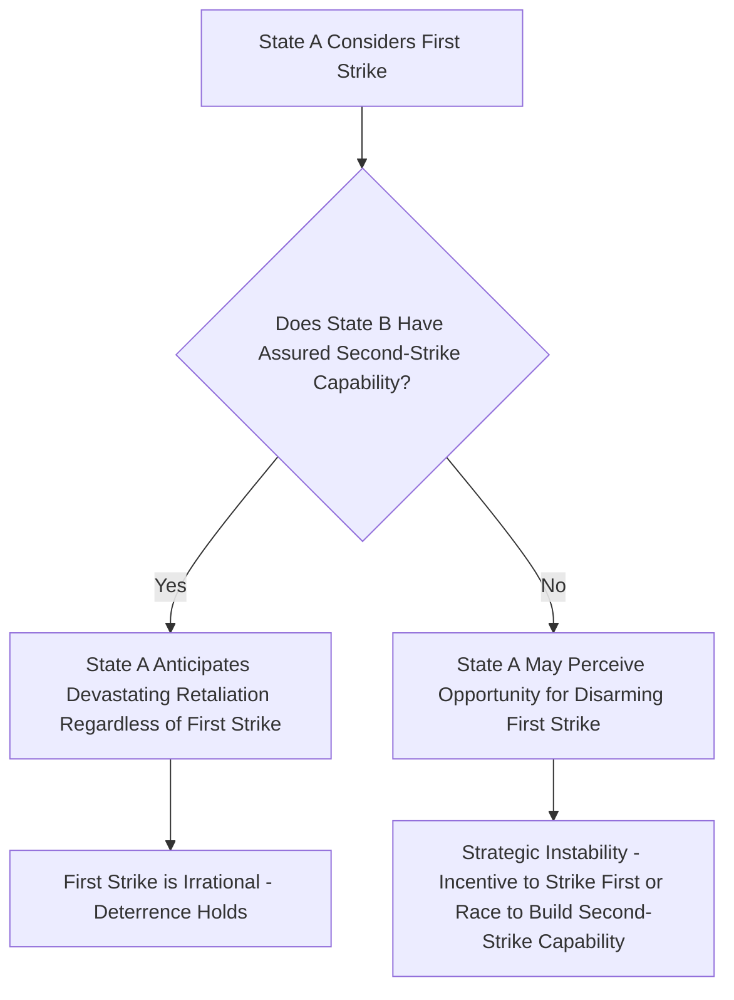

## Deterrence Theory and Nuclear Strategy

### Overview

Deterrence Theory and Nuclear Strategy constitute a central subfield of Security Studies concerned with how states prevent adversaries from taking undesired actions by credibly threatening unacceptable costs in response. While deterrence logic predates nuclear weapons, the advent of nuclear weapons transformed the theoretical and practical stakes of deterrence, since nuclear war threatens costs of a fundamentally different order of magnitude than conventional conflict, giving rise to a distinct and highly formalized body of nuclear strategic theory during the Cold War.

### Core Conceptual Foundations

**Key Points**

- **Deterrence** is distinguished from **compellence** (Thomas Schelling's terminology, *Arms and Influence*, 1966): deterrence seeks to prevent an adversary from initiating an action not yet taken, while compellence seeks to induce an adversary to reverse or halt an action already underway — deterrence is generally regarded as easier to achieve than compellence, since maintaining a status quo requires less visible capitulation by the target than actively reversing course
- Deterrence success is theorized to depend on three interrelated components:
  1. **Capability**: the deterring state must possess the actual military means to inflict the threatened costs
  2. **Credibility**: the adversary must believe the deterring state is genuinely willing to carry out the threat
  3. **Communication**: the threat and its conditions must be clearly conveyed to and understood by the adversary
- **Extended deterrence**: a state's attempt to deter an attack not on itself but on a third party (typically an ally), which introduces additional credibility challenges since the deterring state must convince an adversary it would accept significant risk on behalf of another state's security

### Types of Deterrence: General vs. Immediate, Direct vs. Extended

| Dimension | Category | Description |
| --- | --- | --- |
| Temporal scope | **General deterrence** | Ongoing, background deterrent posture maintained without an active, specific crisis underway |
| Temporal scope | **Immediate deterrence** | Deterrent signaling and posturing during an active, specific crisis where an attack appears imminent |
| Scope of protection | **Direct/Central deterrence** | Deterring an attack on the deterring state's own homeland |
| Scope of protection | **Extended deterrence** | Deterring an attack on an allied third party |

### Classical Deterrence Theory and Rational Choice

**Key Points**

- Deterrence theory is grounded substantially in rational-choice/expected-utility logic: a rational adversary will refrain from an action if the expected costs (probability of retaliation multiplied by the severity of that retaliation) exceed the expected benefits of proceeding
- Formal expected-value framing: an adversary will be deterred when

$$P(\text{retaliation}) \times \text{Cost}(\text{retaliation}) > \text{Expected Benefit}(\text{action})$$

- Critics (drawing on the cognitive/psychological decision-making literature covered under Theories of Foreign Policy Decision-Making) note that this rational-actor framing can understate the role of misperception, bounded rationality, and prospect-theory-style loss aversion in actual crisis decision-making, complicating deterrence's real-world reliability

### Nuclear Strategy: The Revolution in Strategic Thought

**Key Points**

- Nuclear weapons introduced a qualitatively distinct strategic problem: for the first time, a state could inflict devastating, society-threatening damage on an adversary without first achieving battlefield victory or territorial conquest
- Bernard Brodie's early and influential formulation (*The Absolute Weapon*, 1946): "Thus far the chief purpose of our military establishment has been to win wars. From now on its chief purpose must be to avert them" — an early articulation of deterrence, rather than warfighting, as the primary rationale for nuclear forces
- This gave rise to a substantial body of formalized Cold War-era nuclear strategic theory, developed by figures including Bernard Brodie, Thomas Schelling, Herman Kahn, and Albert Wohlstetter

### Mutual Assured Destruction (MAD)

**Key Points**

- A strategic condition in which both adversaries possess **second-strike capability**: sufficient invulnerable retaliatory nuclear forces to guarantee devastating retaliation even after absorbing a first strike, ensuring that any nuclear first strike would be met with unacceptable retaliatory destruction
- Under MAD, stability is theorized to result precisely from mutual vulnerability: neither side can achieve a disarming first strike, so neither has a rational incentive to initiate nuclear use
- MAD is generally treated as an emergent condition arising from certain force structures and vulnerabilities rather than a deliberately chosen "strategy" per se, though it heavily informed U.S. and Soviet strategic force planning during significant portions of the Cold War

### Second-Strike Capability and the Stability-Instability Paradox

**Key Points**

- **First-strike capability**: the ability to destroy an adversary's nuclear forces before they can be used, potentially disarming the adversary entirely
- **Second-strike capability**: the ability to absorb a first strike and still retaliate with sufficient force to inflict unacceptable damage, generally considered the cornerstone of stable deterrence
- **Stability-instability paradox** (a term associated with Glenn Snyder): stable mutual deterrence at the nuclear/strategic level may paradoxically increase the likelihood of conventional or lower-level conflict, since both sides can be confident that limited conflicts are unlikely to escalate to mutually catastrophic nuclear exchange, thereby reducing inhibitions against engaging in conflict below the nuclear threshold

### The Nuclear Strategic Triad and Force Structure

**Key Points**

- The **nuclear triad** refers to a force structure diversified across three delivery platforms, intended to ensure survivable second-strike capability even if one or two legs of the triad are compromised:
  1. **Land-based intercontinental ballistic missiles (ICBMs)**
  2. **Submarine-launched ballistic missiles (SLBMs)**, valued particularly for their survivability due to submarine concealment
  3. **Strategic bomber aircraft**
- Diversification across delivery platforms is intended to complicate an adversary's ability to achieve a disarming first strike against all legs simultaneously

### Illustrative Diagram: Deterrence Stability Logic Under MAD

### Escalation Theory and the Nuclear Threshold

**Key Points**

- Herman Kahn's *On Escalation* (1965) formalized the concept of an **escalation ladder**: a graduated sequence of conflict intensity levels from low-level crisis through conventional war to limited and eventually full-scale strategic nuclear exchange
- The theoretical value of thinking in escalation-ladder terms was to identify **firebreaks** — clear thresholds (most critically, the conventional/nuclear firebreak) that both sides have a shared interest in maintaining to prevent inadvertent or incremental escalation into uncontrolled nuclear conflict
- **Limited nuclear war theory** debated whether nuclear conflict could plausibly be contained below full strategic exchange (e.g., through the use of smaller-yield tactical nuclear weapons); critics argued the risks of uncontrollable escalation once any nuclear threshold was crossed made "limited" nuclear war a strategically unstable and dangerous concept to plan around [Unverified as a matter of settled strategic consensus; this remains a genuinely contested question given the absence of historical nuclear war to empirically test escalation dynamics]

### Credibility and the "Rationality of Irrationality"

**Key Points**

- A persistent theoretical puzzle: because carrying out a full nuclear retaliatory threat might itself be catastrophically self-destructive (particularly under MAD, where retaliation invites further devastating retaliation), an adversary might rationally doubt a threat's credibility
- Schelling's resolution: **the threat that leaves something to chance** — rather than making a fully deliberate, controllable threat, a state can generate credibility by demonstrating it has entered a situation where escalation could occur through processes not fully under either side's control, making the risk of unintended nuclear use genuinely uncertain rather than a simple, calculable bluff
- This connects to broader "rationality of irrationality" arguments in deterrence theory, wherein appearing genuinely willing to risk mutual catastrophe (even irrationally) can paradoxically enhance deterrent credibility relative to a purely calculating, self-interested posture

### Deterrence Theory vs. Related Coercive Concepts

| Concept | Goal | Timing Relative to Action |
| --- | --- | --- |
| **Deterrence** | Prevent an action from being initiated | Before the undesired action begins |
| **Compellence** | Reverse or halt an action already underway | After the undesired action has begun |
| **Coercive Diplomacy** | Broader category using threats/limited force to change adversary behavior (overlaps with compellence) | Typically during or after an initial adversary action |

### Example: Applying Deterrence Theory to a Case

**Example**

The 1962 Cuban Missile Crisis is frequently analyzed as a case testing multiple deterrence and escalation concepts simultaneously:

- The crisis illustrates the "threat that leaves something to chance" dynamic: the U.S. naval quarantine created genuine risk of uncontrolled escalation (e.g., through the actions of individual Soviet submarine commanders operating under significant communication constraints) rather than relying purely on a calculated, fully controllable threat
- The eventual resolution, involving both public and secret components (the public Soviet withdrawal of missiles from Cuba and the secret U.S. agreement to remove Jupiter missiles from Turkey), illustrates how face-saving, partially concealed compromise can help resolve compellence-adjacent crises without requiring one side's visible, complete capitulation [Inference: the relative causal weight of deterrence signaling, backchannel diplomacy, and individual decision-making (including Kennedy's and Khrushchev's personal risk calculations) in producing this outcome remains a subject of ongoing historical and strategic-studies debate]

### Contemporary Extensions and Challenges

**Key Points**

- **Cyber deterrence**: scholars and practitioners have debated whether classical nuclear-derived deterrence logic (based on clear attribution, assured retaliation, and threshold clarity) transfers effectively to the cyber domain, where attribution is often difficult and the line between espionage, sabotage, and armed attack is less clearly defined
- **Deterrence against non-state actors**: classical deterrence theory assumes a rational, identifiable state adversary with assets that can be held at risk; deterring non-state actors (particularly those without fixed territory or centralized command structures vulnerable to retaliation) poses distinct theoretical and practical challenges not fully addressed by Cold War-era frameworks
- **Multipolar nuclear dynamics**: much classical nuclear strategic theory was developed around the bipolar U.S.-Soviet dyad; the increasing number of nuclear-armed states raises open questions about whether bilateral deterrence stability concepts translate cleanly to more complex multilateral nuclear relationships [Unverified as a matter of established theoretical consensus, given the comparative novelty and complexity of contemporary multipolar nuclear dynamics]

### Major Critiques of Deterrence Theory

**Key Points**

- **Rationality assumption critique**: as with rational-actor models generally, deterrence theory has been critiqued (drawing on the cognitive/psychological decision-making literature) for underestimating misperception, cognitive bias, and domestic political pressures that can undermine the clean rational calculations the theory assumes
- **Empirical testing difficulty**: because deterrence success is observed as an absence of action (the attack that did not happen), rigorously establishing that deterrence specifically, rather than simply an adversary's independent lack of intent, caused a given non-event is a persistent methodological challenge in the field
- **Moral/normative critique**: MAD-based deterrence has drawn sustained ethical critique for resting explicitly on the threatened mass destruction of civilian populations, a feature some scholars and moral philosophers argue is difficult to reconcile with just war principles regardless of its strategic stabilizing function
- **Stability-instability paradox critique**: some scholars question the empirical robustness of the stability-instability paradox itself, noting the difficulty of isolating nuclear deterrence's specific causal contribution to patterns of conventional conflict amid many confounding factors

### Related Topics

- Theories of the Causes of War (in depth)
- Coercive Diplomacy and Compellence
- Nuclear Proliferation and Arms Control
- The Cuban Missile Crisis as a Case Study
- Escalation Theory and Crisis Stability
- Cyber Warfare and Emerging Security Domains
- Theories of Foreign Policy Decision-Making