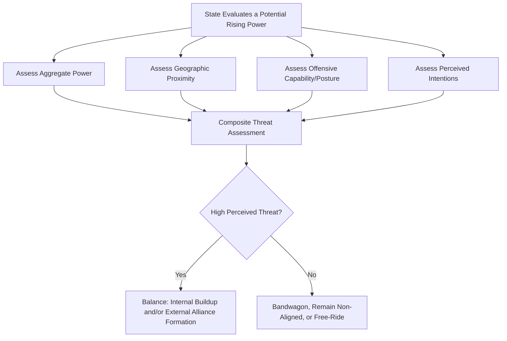

## Alliance Formation and the Balance of Power

### Overview

Alliance Formation and the Balance of Power examines why states form, maintain, and abandon security alliances, and how these alignment patterns relate to the broader systemic dynamics of power distribution among states. This subfield combines structural realist balance-of-power logic with more granular theories of alliance choice, addressing both why alliances form at all under anarchy and which specific partners states choose to align with.

### Balance of Power: Core Theoretical Claim

**Key Points**

- As covered under Realism and Neorealism, balance of power theory holds that states act, individually or in combination, to prevent any single state or coalition from achieving preponderant power over the system
- Kenneth Waltz treats balancing behavior as a structurally induced tendency of anarchic systems: states balance not necessarily out of deliberate systemic design but because balancing behavior is repeatedly rewarded (survival) while failure to balance is repeatedly punished (domination or elimination) — an evolutionary-style selection mechanism rather than a conscious collective strategy
- Two principal balancing mechanisms:
  1. **Internal balancing**: increasing one's own military capabilities and economic resources
  2. **External balancing**: forming or strengthening alliances with other states against a rising threat

### Balancing vs. Bandwagoning

**Key Points**

- **Balancing**: aligning against the stronger or rising power to prevent it from dominating the system
- **Bandwagoning**: aligning with the stronger or rising power, typically to share in the spoils of its dominance or to avoid the costs of opposing it
- Waltz and most structural realists argue balancing is the more common and theoretically expected behavior among great powers, since bandwagoning risks subordinating a state's autonomy to a potentially predatory dominant power
- Stephen Walt's refinement (*The Origins of Alliances*, 1987) found that bandwagoning, while less common than balancing overall, occurs more frequently among weaker states that lack the capacity to balance effectively and calculate that alignment with the stronger power offers better prospects than futile resistance

### Balance of Threat Theory (Walt's Refinement)

**Key Points**

- Walt's central contribution: states balance against **threat**, not merely against raw aggregate power, correcting a key underspecification in classical balance-of-power theory
- Four factors determine the level of threat a state poses, according to Walt:
  1. **Aggregate power**: total resources (population, industrial capacity, military strength, technology)
  2. **Geographic proximity**: nearer powers are generally perceived as more threatening than distant ones, all else equal, since they can more readily project force
  3. **Offensive capability**: states with military forces or doctrines oriented toward offense are perceived as more threatening than those postured primarily for defense
  4. **Perceived (aggressive) intentions**: states seen as harboring expansionist or hostile intentions are balanced against more readily than equally powerful states perceived as status-quo oriented

$$\text{Threat Level} = f(\text{Aggregate Power}, \text{Proximity}, \text{Offensive Capability}, \text{Perceived Intentions})$$

- This reformulation explains empirical puzzles that pure power-based balancing struggles to account for, such as why some states balance against comparatively weaker but more proximate and aggressively postured neighbors while bandwagoning with or ignoring more powerful but distant and status-quo states

### Illustrative Diagram: Balance of Threat Decision Logic

### Alliance Reliability and the Alliance Security Dilemma

**Key Points**

- Glenn Snyder's concept of the **alliance security dilemma** (*Alliance Politics*, 1997) identifies a persistent internal tension within alliances between the risks of **abandonment** and **entrapment**:
  - **Fear of abandonment**: an ally may fail to honor its commitment when actually needed, either by defecting entirely or by realigning with an adversary
  - **Fear of entrapment**: an ally's own reckless or unrelated behavior may drag a state into an unwanted conflict due to alliance commitments
- States within an alliance must continuously manage this trade-off: signaling stronger commitment reduces abandonment risk but increases entrapment risk, and vice versa
- This dynamic explains recurring alliance management behaviors such as deliberate ambiguity in commitment language, consultation requirements, and graduated escalation clauses designed to balance reassurance against entrapment risk

### Collective Action Problems in Alliances

**Key Points**

- Mancur Olson and Richard Zeckhauser's economic analysis of alliances (*An Economic Theory of Alliances*, 1966) applies public goods theory to alliance behavior: collective defense functions as a public good among alliance members, generating a structural incentive for smaller or less exposed members to **free-ride** on the military contributions of larger members
- This produces the empirically observed pattern (sometimes called the "exploitation of the great by the small") in which larger alliance members bear disproportionate shares of collective defense costs relative to their proportional benefit — a recurring point of contention within NATO regarding relative burden-sharing among member states
- Alliance institutionalization (formal treaty commitments, integrated command structures, agreed spending benchmarks) is partly theorized as a mechanism to mitigate this collective action/free-rider problem

### Types of Alliance Commitments

| Type | Description | Illustrative Example |
| --- | --- | --- |
| **Defense pact** | Mutual commitment to intervene militarily if a member is attacked | NATO Article 5 |
| **Non-aggression pact** | Mutual commitment not to attack one another | Molotov-Ribbentrop Pact (1939) |
| **Entente** | Looser commitment to consult and coordinate in the event of crisis, without binding mutual defense obligation | The Triple Entente (pre-WWI) |

**Key Points**

- The strength and specificity of alliance commitment language (e.g., automatic versus discretionary intervention clauses) significantly affects both deterrent credibility toward external adversaries and internal alliance-management dynamics around abandonment and entrapment risk

### Alliance Formation and Polarity

**Key Points**

- Alliance dynamics vary systematically across different polarity structures:
  - **Bipolar systems**: alliance flexibility is theorized to be low, since most significant alignment decisions are effectively predetermined by the overarching bipolar competition (the Cold War's NATO/Warsaw Pact structure being the paradigmatic case)
  - **Multipolar systems**: alliance flexibility is theorized to be considerably higher, with shifting coalitions and cross-cutting alignments more feasible (the shifting alliance patterns of 19th-century European great-power politics being a commonly cited illustration)
- This variation connects directly to the broader neorealist debate over the relative stability of bipolar versus multipolar systems, since alliance flexibility and rigidity are argued to shape crisis dynamics and miscalculation risk differently across these structures

### Comparative Summary of Major Theoretical Contributions

| Theorist/Framework | Core Contribution |
| --- | --- |
| Kenneth Waltz | Balancing as a structurally induced, selection-driven systemic tendency |
| Stephen Walt | Balance of threat: states balance threat (power + proximity + offense + intentions), not raw power alone |
| Glenn Snyder | Alliance security dilemma: abandonment vs. entrapment trade-off within alliances |
| Mancur Olson/Richard Zeckhauser | Collective action/free-rider dynamics in alliance burden-sharing |

### Example: Applying Balance of Threat Theory to a Case

**Example**

NATO's post-Cold War expansion is frequently analyzed through a balance of threat lens:

- Central and Eastern European states seeking NATO membership after the Cold War are commonly interpreted as balancing against a perceived potential future threat from Russia, driven significantly by geographic proximity and a historical assessment of Russian intentions, rather than purely by contemporary Russian aggregate power levels (which were significantly diminished immediately following the Soviet collapse)
- This illustrates Walt's core refinement: relatively modest aggregate power in the 1990s did not prevent these states from perceiving and balancing against a meaningful threat, since proximity and historically informed intention assessments carried substantial independent weight in their alliance-seeking behavior [Inference: the relative weighting of historical experience, proximity, and contemporaneous power assessments in these specific alliance decisions is a matter of ongoing scholarly interpretation rather than a single settled causal account]

### Major Critiques and Debates

**Key Points**

- **Bandwagoning frequency debate**: some scholars (particularly those studying weaker and non-Western states) argue structural realism's emphasis on balancing as the dominant tendency understates how frequently bandwagoning and hedging behaviors actually occur, particularly among smaller states with limited capacity for effective independent balancing
- **Domestic-politics critique**: alliance choices are argued by some scholars to be shaped significantly by domestic regime characteristics, ideological affinity, and leader-level factors not fully captured by systemic balance-of-threat calculations alone, connecting to broader second-image critiques of purely systemic explanations
- **Measurement critique of "threat"**: while balance of threat theory improves on pure power-based balancing, "perceived intentions" in particular remains a notoriously difficult variable to operationalize and measure independently of the outcome (alliance formation) it purports to explain, raising a degree of circularity concern in empirical testing
- **Alliance durability debate**: scholars continue to debate the conditions under which alliances persist beyond the disappearance of the original threat that prompted their formation (e.g., NATO's continuation after the Warsaw Pact's dissolution), an empirical puzzle not fully resolved by threat-based alliance formation theories alone

### Related Topics

- Realism and Neorealism (in depth)
- Theories of the Causes of War (in depth)
- Polarity and System Stability (Bipolarity vs. Multipolarity)
- Collective Security and International Organizations
- Deterrence Theory and Extended Deterrence
- NATO and Post-Cold War Security Architecture
- Hegemonic Stability Theory and Power Transition Theory