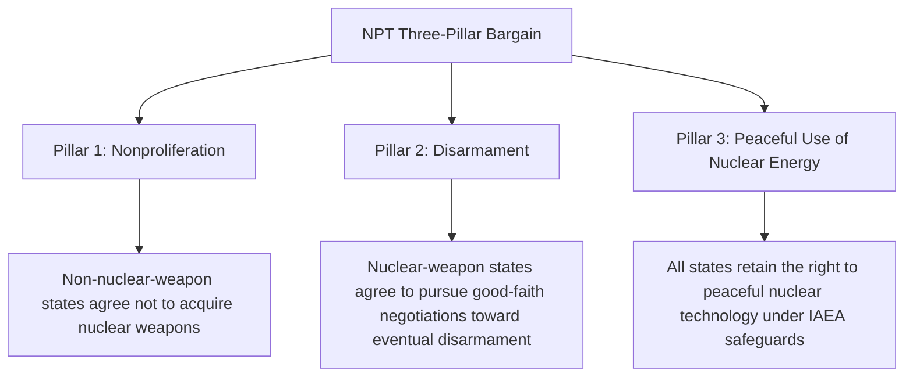

## Arms Control and Nonproliferation

### Overview

Arms Control and Nonproliferation examines the theory, institutions, and treaty frameworks through which states attempt to limit, reduce, regulate, or prevent the spread of weapons—particularly weapons of mass destruction—in order to reduce the likelihood, severity, or destructiveness of conflict. Arms control is distinguished from disarmament: arms control seeks to manage and regulate weapons within a framework that may still permit their possession, whereas disarmament aims at their reduction toward elimination.

### Conceptual Foundations of Arms Control

**Key Points**

- The modern theoretical foundation of arms control is substantially attributed to Thomas Schelling and Morton Halperin's *Strategy and Arms Control* (1961), which reframed arms limitation not as an alternative to strategic competition but as a **complementary extension of deterrence strategy** — a means of reducing the risks and costs of the military competition between adversaries, not merely a step toward eliminating it
- Three commonly cited objectives of arms control, per this foundational framing:
  1. **Reducing the probability of war**, particularly by decreasing incentives for surprise attack or preemption
  2. **Reducing the destructiveness of war**, should it occur, by limiting the most catastrophic weapons or targeting practices
  3. **Reducing the economic costs of military preparation**, by limiting wasteful or destabilizing arms competition
- This framing explicitly departs from earlier, more idealist disarmament traditions (e.g., interwar League of Nations disarmament conferences) by treating arms control as a hard-nosed, mutual-interest-based strategic tool compatible with continued adversarial competition

### Arms Control vs. Disarmament vs. Nonproliferation

| Concept | Core Goal | Illustrative Mechanism |
| --- | --- | --- |
| **Arms Control** | Regulate, limit, or stabilize existing weapons competition | Numerical caps, verification regimes, confidence-building measures |
| **Disarmament** | Reduce or eliminate weapons stockpiles | Complete or phased weapons destruction |
| **Nonproliferation** | Prevent the spread of weapons (particularly WMD) to additional actors | Export controls, safeguards, verification of non-diversion |

### Major Nuclear Arms Control Treaties (Historical Framework)

**Key Points**

- **Partial Test Ban Treaty (PTBT, 1963)**: prohibited nuclear weapons tests in the atmosphere, outer space, and underwater, though it permitted continued underground testing
- **Treaty on the Non-Proliferation of Nuclear Weapons (NPT, opened for signature 1968, entered into force 1970)**: the cornerstone multilateral nonproliferation treaty, built on a three-pillar bargain (detailed below)
- **Strategic Arms Limitation Talks (SALT I, 1972) and the Anti-Ballistic Missile Treaty (ABM Treaty, 1972)**: SALT I placed interim limits on U.S. and Soviet strategic offensive missile launchers; the ABM Treaty limited missile defense systems, based on the theory that limiting defenses helped preserve the stabilizing logic of mutual vulnerability under MAD
- **Strategic Arms Reduction Treaty (START I, signed 1991)** and subsequent agreements (START II, SORT/Moscow Treaty 2002, New START 2010): progressively negotiated reductions in deployed strategic nuclear warheads and delivery vehicles between the U.S. and Russia/Soviet Union
- **Intermediate-Range Nuclear Forces (INF) Treaty (1987)**: eliminated an entire class of U.S. and Soviet ground-launched intermediate-range missiles; the U.S. withdrew from the treaty in 2019, citing Russian noncompliance

[Unverified as a matter of requiring current verification] The status, membership, and specific numerical limits of active arms control treaties change over time through renewal, withdrawal, or renegotiation; current treaty status should be verified against up-to-date sources rather than assumed static.

### The NPT's Three-Pillar Structure

**Key Points**

- The NPT distinguishes between five recognized "nuclear-weapon states" (those that tested nuclear weapons before January 1, 1967: the U.S., Russia/USSR, UK, France, China) and all other "non-nuclear-weapon states," creating an inherently asymmetric legal structure that has drawn persistent criticism (see critiques below)
- **International Atomic Energy Agency (IAEA) safeguards**: the verification mechanism underpinning Pillar 3, through which non-nuclear-weapon states permit inspections to verify that civilian nuclear programs are not diverted to weapons purposes

### Verification Theory

**Key Points**

- A central theoretical and practical challenge in arms control: agreements are only as credible as the mechanisms available to verify compliance, given the strong incentive states may have to cheat covertly
- Verification approaches include:
  - **National technical means (NTM)**: satellite reconnaissance, seismic monitoring, and other unilateral intelligence-gathering methods not requiring the counterpart's cooperation
  - **On-site inspections**: negotiated inspection rights, often including short-notice or "challenge" inspections designed to deter concealment
  - **Data exchanges and declarations**: mutual, verifiable disclosure of relevant force levels and facility information
- The verification-versus-sovereignty tension is persistent: more intrusive verification regimes increase confidence in compliance but face greater domestic political resistance from states concerned about intelligence exposure or sovereignty infringement

### Nonproliferation Strategy Beyond the NPT

**Key Points**

- **Export control regimes**: multilateral, non-treaty-based arrangements coordinating restrictions on the transfer of sensitive technologies and materials, including the Nuclear Suppliers Group (NSG), the Missile Technology Control Regime (MTCR), and the Australia Group (chemical/biological)
- **Nuclear-Weapon-Free Zones (NWFZs)**: regional treaties in which groups of states commit not to develop, acquire, or host nuclear weapons within a defined geographic area (e.g., the Treaty of Tlatelolco for Latin America, the Treaty of Pelindaba for Africa)
- **Counter-proliferation** (distinguished from nonproliferation): a broader category of measures, sometimes including coercive or military options, aimed at preventing or reversing an actual weapons program already underway, rather than solely relying on treaty-based, cooperative nonproliferation mechanisms

### Chemical and Biological Weapons Regimes

**Key Points**

- **Chemical Weapons Convention (CWC, opened for signature 1993, entered into force 1997)**: prohibits the development, production, stockpiling, and use of chemical weapons, and is distinguished by its relatively robust verification regime, including mandatory declarations and a standing inspectorate (the Organisation for the Prohibition of Chemical Weapons, OPCW)
- **Biological Weapons Convention (BWC, opened for signature 1972, entered into force 1975)**: prohibits the development, production, and stockpiling of biological weapons, but notably **lacks a formal verification mechanism** comparable to the CWC's inspectorate, a long-standing and widely acknowledged structural weakness of the regime
- This asymmetry in verification robustness between the CWC and BWC is frequently cited in the arms control literature as illustrating how technical and political factors (including the dual-use nature of much biological research) can constrain achievable verification design even when the underlying prohibitory norm enjoys broad international support

### Theoretical Debates: Does Arms Control Enhance or Undermine Security?

**Key Points**

- **Optimist/stabilizing view**: arms control agreements, by codifying mutual restraint and improving transparency, reduce miscalculation risk, arms race costs, and crisis instability, complementing rather than substituting for deterrence
- **Skeptical/realist view**: some realist scholars argue arms control agreements are largely epiphenomenal — reflecting rather than independently causing existing strategic restraint — and that states will abandon agreements whenever they meaningfully constrain a perceived vital security interest, limiting arms control's independent causal contribution to stability
- **Proliferation optimism vs. pessimism debate**: a distinct but related theoretical dispute (associated with Kenneth Waltz on the optimist side and Scott Sagan on the pessimist side) over whether the spread of nuclear weapons to additional states is likely to enhance deterrence stability (optimists, following core deterrence logic) or increase the risk of accidents, unauthorized use, and crisis instability due to weaker command-and-control institutions in new nuclear states (pessimists)

### Waltz-Sagan Proliferation Debate Compared

| Dimension | Waltz (Proliferation Optimism) | Sagan (Proliferation Pessimism) |
| --- | --- | --- |
| Core logic | Deterrence generally works; more nuclear states means more mutual deterrence and caution | Organizational and command-control weaknesses in new nuclear states increase accident/unauthorized-use risk |
| View of new nuclear states' rationality | Assumes broadly rational, cautious behavior consistent with deterrence theory | Emphasizes organizational pathologies that can undermine rational, centralized control |
| Policy implication | Selective proliferation may not be as destabilizing as commonly feared | Nonproliferation efforts remain critical given organizational risks independent of state-level rationality |

### Example: Applying Arms Control Theory to a Case

**Example**

The Iran nuclear negotiations culminating in the 2015 JCPOA illustrate several arms control and verification concepts in combination:

- The agreement relied heavily on enhanced IAEA verification access (a Pillar 3/safeguards-adjacent mechanism) as the primary tool for building confidence that Iran's nuclear program remained within agreed civilian limits
- The negotiation reflects the underlying nonproliferation logic that verified restraint, backed by sanctions relief incentives, can be preferable to unconstrained proliferation risk or the alternative of preventive military action
- The agreement's subsequent unraveling following the 2018 U.S. withdrawal is frequently cited in the arms control literature as illustrating the realist-skeptical concern that even well-verified agreements remain vulnerable to shifting domestic political calculations within a treaty party [Inference: the longer-term consequences for Iranian nuclear development following the agreement's breakdown remain a matter of ongoing assessment and should be evaluated against current reporting rather than treated as settled]

### Major Critiques and Ongoing Debates

**Key Points**

- **NPT asymmetry critique**: non-nuclear-weapon states and some scholars have long criticized the NPT's inherent two-tier structure (five recognized nuclear-weapon states versus all others) as a discriminatory bargain, and have specifically criticized the recognized nuclear powers for what critics view as insufficient progress on the Pillar 2 disarmament commitment
- **Verification asymmetry critique**: as illustrated by the CWC-BWC comparison, achievable verification robustness varies significantly by weapons category, and weaker verification regimes (particularly for biological weapons) are widely acknowledged as a persistent structural vulnerability
- **Enforcement and compliance critique**: arms control regimes generally lack robust, automatic enforcement mechanisms for confirmed violations, relying instead on ad hoc diplomatic, economic, or (rarely) military responses by concerned states, raising questions about the practical deterrent effect of treaty commitments against a determined violator
- **Selective application/double standards critique**: critics note that the international response to suspected or confirmed proliferation activity has varied considerably across different states and circumstances, raising normative and practical questions about the consistency of nonproliferation enforcement [Unverified as a matter of a precisely quantified pattern, though widely discussed as a qualitative critique in the nonproliferation literature]

### Related Topics

- Deterrence Theory and Nuclear Strategy (in depth)
- Theories of the Causes of War
- The NPT Regime and IAEA Safeguards (in depth)
- Alliance Formation and Extended Deterrence
- Chemical and Biological Weapons Governance
- Cyber Warfare and Emerging Security Domains
- Proliferation Optimism vs. Pessimism Debate (Waltz-Sagan)