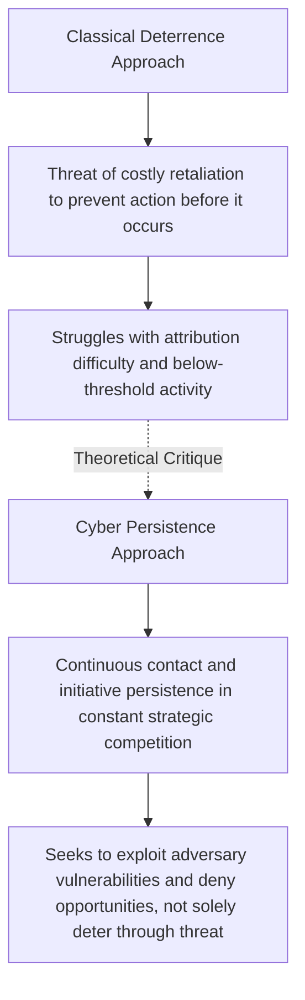

## Cyber Conflict and Emerging Security Domains

### Overview

Cyber Conflict and Emerging Security Domains examines how digital and networked technologies have created a distinct arena of interstate competition, coercion, and potential armed conflict, and asks whether classical Security Studies frameworks (deterrence, escalation, balance of power) transfer effectively to this new domain or require fundamentally new theoretical treatment. The subfield remains comparatively young and theoretically unsettled relative to nuclear strategy or conventional deterrence theory, and it is evolving rapidly alongside the technology itself.

### Why Cyberspace Is Treated as a Distinct Security Domain

**Key Points**

- Cyberspace is frequently analyzed as a "fifth domain" of conflict alongside land, sea, air, and space, but with structural properties that distinguish it sharply from the others
- Unlike conventional warfare, which involves direct physical engagements and territorial disputes, cyber warfare operates in the digital domain, targeting information systems, communication networks, and critical infrastructure, introducing new vulnerabilities and complexities that affect national security and geopolitical stability [Ijrar](https://www.ijrar.org/papers/IJRAR19D5776.pdf)
- **Attribution problem**: the anonymity of cyberspace often obscures the origin of threats, and the challenge of attributing cyber attacks complicates responses and escalates tensions, since this ambiguity can lead to misjudgments and strained diplomatic relations [Ijrar](https://www.ijrar.org/papers/IJRAR19D5776.pdf)
- **Low barrier to entry**: offensive cyber capability does not require the scale of industrial and financial investment associated with nuclear or advanced conventional weapons, expanding the range of capable actors well beyond traditional great powers
- **Dual-use ambiguity**: the same tools and network access used for espionage can often be readily repurposed for sabotage or attack, blurring traditional legal and strategic distinctions between intelligence-gathering and acts of aggression

### Applying Classical IR Theory to Cyberspace

**Key Points**

- **Realist lens**: treats cyberspace primarily as a new arena for the same underlying great-power competition for relative power and security that structural realism describes in the conventional domain, with states seeking cyber capability partly as a component of comprehensive national power
- **Liberal/institutionalist lens**: considers cyberspace as a global space that should be accessible to all and governed by common rules, emphasizing collective management of cyberspace to prevent it from becoming a terrain of pure conflict between states, exemplified by efforts such as the UN's Global Digital Compact promoting international cooperation on technology governance [Eu-opensci](https://eu-opensci.org/index.php/politics/article/view/8172)
- **Constructivist lens**: examines how emerging normative frameworks and shared understandings of "responsible state behavior" in cyberspace are being socially constructed and contested among states, rather than existing as a fixed, pre-given structural condition
- Scholars have noted that IR theory has been comparatively limited in examining how it informs the maximization of strategic cyberpower and in testing key realist concepts and assumptions against cyber realities, creating a risk of theoretical stagnation in the study of statecraft and cybersecurity [Cambridge Core](https://www.cambridge.org/core/journals/perspectives-on-politics/article/great-power-cyberpolitics-and-global-cyberhegemony/F418036C85E656BAA5B54BC38ED09430)

### The Deterrence Debate in Cyberspace

**Key Points**

- A foundational early question in the field: does classical nuclear-derived deterrence theory (covered under Deterrence Theory and Nuclear Strategy) transfer effectively to cyberspace?
- Skeptics argue attribution difficulty, the diversity of potential adversaries (including non-state actors), and the ambiguous line between espionage and attack undermine the credibility and clarity that classical deterrence requires
- Harknett and Fischerkeller have argued that deterrence is not a credible strategy for cyberspace, since deterrence is generally based upon a threat of use of force with an operational objective of avoiding costly operational contact — a framing that does not match the actual, continuous pattern of cyber activity observed among states [Oxford Academic](https://academic.oup.com/cybersecurity/article/5/1/tyz008/5554878)

### Cyber Persistence Theory (A Major Contemporary Framework)

**Key Points**

- Developed by Michael Fischerkeller, Emily Goldman, and Richard Harknett, most fully articulated in *Cyber Persistence Theory* (2022)
- The theory argues that most cyber operations and campaigns fall short of activities that states would regard as armed conflict, and that a failure to understand this strategic competitive space has led many states to misapply the logic and strategies of coercion and conflict to this environment, suffering strategic loss as a result [Oxford University Press](https://global.oup.com/academic/product/cyber-persistence-theory-9780197638255)
- The authors show how the paradigm of deterrence theory can neither explain nor manage the preponderance of state cyber activity, presenting a new theory that illuminates the exploitive, rather than coercive, dynamics of cyber competition [Oxford University Press](https://global.oup.com/academic/product/cyber-persistence-theory-9780197638255)
- Cyber persistence theory posits the existence of a distinct strategic environment based on the logic of exploitation rather than coercion, arguing that to achieve security in this environment, states must engage in initiative persistence [Google Books](https://books.google.com/books/about/Cyber_Persistence_Theory.html?id=zrVoEAAAQBAJ)
- Harknett and Fischerkeller describe the constant contact of cyber forces as producing a "strategic process of tacit bargaining," distinct from the explicit bargaining associated with formal treaties [Oxford Academic](https://academic.oup.com/cybersecurity/article/5/1/tyz008/5554878)
- An earlier 2016 formulation by Harknett and Emily Goldman characterized cyberspace as an "offense-persistent strategic environment" in which the contest between offense and defense is continual and defense is in constant contact with the adversary [Oxford Academic](https://academic.oup.com/cybersecurity/article/5/1/tyz008/5554878)

### Persistent Engagement and Defend Forward (Policy Application)

**Key Points**

- Cyber Persistence Theory directly informed the U.S. Department of Defense's strategic shift beginning around 2018 toward **Persistent Engagement** and **Defend Forward**, moving away from a strategy centered on deterrence by punishment
- Persistent engagement prescribes that the United States defend forward both geographically, beyond Department of Defense networks, and temporally, ahead of adversary exploitation, in order to enable anticipatory resilience in domestic and foreign partner networks [The National Interest](https://nationalinterest.org/blog/techland-when-great-power-competition-meets-digital-world/persistent-engagement-cyberspace)
- The underlying rationale is that competition in and through cyberspace, short of the threat or use of force, can be just as strategically consequential for a state's relative international position as war and militarized crises have historically been, even though the strategic logic driving cyberspace campaigns differs from that of militarized crises and armed conflict [The National Interest](https://nationalinterest.org/blog/techland-when-great-power-competition-meets-digital-world/persistent-engagement-cyberspace)
- This U.S. doctrinal shift has had international influence: the United Kingdom's National Cyber Force operating document, "Responsible Cyber Power in Practice," offers its own framework for responsible cyber behavior in a highly contested strategic environment, which its authors argue further validates cyber persistence theory [lawfaremedia](https://www.lawfaremedia.org/article/uk-national-cyber-force-responsible-cyber-power-and-cyber-persistence-theory)

### Escalation Dynamics: "Agreed Competition" vs. Spiraling Conflict

**Key Points**

- A central concern among policymakers regarding persistent engagement/defend forward strategies has been whether a more proactive cyber posture risks uncontrolled escalation
- Fischerkeller and Harknett conclude that competitive interaction in cyberspace short of armed conflict constitutes an "agreed competition," rather than a spiraling escalation dynamic, and that this framing best explains the pattern of behavior resulting from persistent engagement — suggesting that prevailing concerns about escalation may be overstated [Army](https://cyberdefensereview.army.mil/Portals/6/CDR-SE_S5-P3-Fischerkeller.pdf)
- This "agreed competition" concept is a genuinely contested theoretical claim rather than a settled finding, and represents one side of an ongoing scholarly debate about cyber escalation risk

### Illustrative Diagram: Deterrence Logic vs. Persistence Logic in Cyberspace

### International Norms and Legal Frameworks

**Key Points**

- International cooperation is considered crucial for developing frameworks that address cybersecurity, share intelligence, and coordinate responses to cyber incidents, with various international organizations and forums working to create norms and standards for responsible state behavior in cyberspace [Ijrar](https://www.ijrar.org/papers/IJRAR19D5776.pdf)
- Initiatives such as the UN Group of Governmental Experts (GGE) and the Tallinn Manual on the International Law Applicable to Cyber Warfare seek to provide guidance on acceptable state behavior and the application of existing international law to cyber conflicts, though achieving consensus on these norms remains a challenge given differing national interests and perspectives [Ijrar](https://www.ijrar.org/papers/IJRAR19D5776.pdf)
- States are moving toward the operationalization of a newly established United Nations Global Mechanism on developments in the field of information and communication technologies in the context of international security and advancing responsible state behavior in the use of such technologies [UNIDIR](https://unidir.org/wp-content/uploads/2026/02/UNIDIR_Insights_into_Cyberthreats_and_International_Security_in_2025.pdf)

### Non-State and Financially Motivated Cyber Threats

**Key Points**

- Non-state actors engage in cyber activity primarily for financial gain, such as through ransomware operations, distinguishing a significant category of cyber threat activity from state-directed strategic competition [UNIDIR](https://unidir.org/wp-content/uploads/2026/02/UNIDIR_Insights_into_Cyberthreats_and_International_Security_in_2025.pdf)
- A documented pattern in the financial sector illustrates how actor type and motive correlate with targeting behavior: financially motivated criminal groups tend to exploit vulnerabilities in smaller, less resilient commercial and cooperative banks using an "easy prey" strategy, while politically motivated hacktivist groups tend to target larger, more profitable banks in order to "send a message," with profitability characteristics distinguishing the banks typically targeted [ResearchGate](https://www.researchgate.net/publication/326845990_International_relations_theory_and_cyber_security_Threats_conflicts_and_ethics_in_an_emergent_domain)
- This state/non-state distinction complicates governance efforts, since nonproliferation-style frameworks designed around state actors (as in nuclear arms control) do not map cleanly onto financially motivated criminal or hacktivist activity operating largely outside formal state control

### Great Power Cyber Competition

**Key Points**

- As interstate cyberconflict intensifies, the intersection of national security, cybersecurity, and IR theory has emerged as a critical venue for scholarly inquiry, with states increasingly engaging in cyberconflict to achieve strategic ends by exploiting the growing global interconnectivity of the internet and the vulnerabilities it contains [Cambridge Core](https://www.cambridge.org/core/journals/perspectives-on-politics/article/great-power-cyberpolitics-and-global-cyberhegemony/F418036C85E656BAA5B54BC38ED09430)
- This has generated scholarly interest in concepts such as "cyberhegemony" and the extension of great-power competition dynamics into digital infrastructure, technology supply chains (e.g., 5G network infrastructure), and platform governance, extending traditional great-power rivalry into a domain not contemplated by classical geopolitical theory

### Comparative Summary: Cyber vs. Nuclear Strategic Logic

| Dimension | Nuclear Strategic Domain | Cyber Strategic Domain |
| --- | --- | --- |
| Dominant strategic logic | Deterrence (avoiding costly use) | Persistence/exploitation (continuous engagement short of armed conflict) |
| Attribution | Generally unambiguous (state-level delivery systems) | Frequently difficult and contested |
| Barrier to entry | Very high (industrial/financial/technical) | Comparatively low |
| Primary actors | States (small number of nuclear-armed states) | States, criminal organizations, hacktivists, proxy actors |
| Verification/arms control analog | Established treaty and inspection regimes (NPT, CWC) | No comparable binding, verifiable arms control framework |
| Escalation theory | Escalation ladder, firebreaks (Kahn) | Contested: "agreed competition" (Fischerkeller/Harknett) vs. spiral-escalation concerns |

### Example: Applying These Frameworks to a Case

**Example**

Sustained, below-threshold cyber activity between major powers (widely documented in cybersecurity and IR literature as an ongoing pattern rather than a single discrete incident) illustrates the practical stakes of the deterrence-versus-persistence debate:

- A pure deterrence-based framework would predict that absent a clear, costly retaliatory threat, states would be strategically restrained from continuous below-threshold intrusion into adversary networks
- Cyber persistence theory instead predicts, and proponents argue better explains, the empirically observed pattern of continuous, largely unremitting cyber campaigns conducted by multiple great powers against one another's networks, since this competition occurs short of the threat or use of force yet remains strategically consequential for relative international position [Inference: the relative explanatory power of these competing frameworks for any specific, non-public state cyber campaign is difficult to assess definitively from open sources, and remains an active area of scholarly and policy debate] [The National Interest](https://nationalinterest.org/blog/techland-when-great-power-competition-meets-digital-world/persistent-engagement-cyberspace)

### Major Critiques and Open Debates

**Key Points**

- **Theoretical immaturity critique**: the cyber conflict subfield lacks the decades of accumulated, tested theory available in nuclear strategy, and scholars continue to debate foundational questions (whether deterrence, persistence, or some hybrid framework best describes state behavior) that are considered largely settled in other strategic domains
- **Escalation risk critique of persistent engagement**: critics of the "agreed competition" framing argue that a more proactive, continuously engaged posture could still generate miscalculation or unintended escalation, particularly given the attribution and signaling challenges unique to cyberspace, making the theory's optimistic escalation conclusions difficult to fully validate
- **Norms enforcement critique**: as with arms control generally, achieving consensus on international cyber norms remains genuinely difficult given that different nations have varying interests and perspectives on cyber issues, and existing frameworks like the Tallinn Manual carry no binding enforcement mechanism [Ijrar](https://www.ijrar.org/papers/IJRAR19D5776.pdf)
- **Data and measurement critique**: much of the empirical basis for cyber conflict theorizing relies on incomplete, classified, or commercially sourced threat intelligence, raising persistent questions about the representativeness and generalizability of publicly available cyber incident data
- **Rapid obsolescence risk**: because both the technology and state doctrine in this domain are evolving quickly, theoretical frameworks and policy assessments in this area carry a distinctive risk of becoming outdated faster than in more mature strategic domains, and current developments should be checked against up-to-date sources rather than assumed static

### Related Topics

- Deterrence Theory and Nuclear Strategy (comparative framework)
- Arms Control and Nonproliferation (comparative governance challenge)
- Terrorism and Counterterrorism (comparative non-state threat governance)
- Theories of the Causes of War
- International Law and Cyber Norms (Tallinn Manual, UN GGE)
- Great Power Competition and Emerging Technology
- Attribution Theory and Escalation Management in Cyberspace