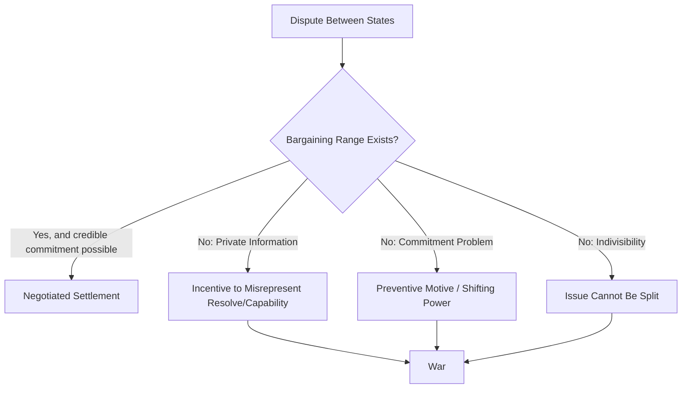

## Interstate War

### Definition and Conceptual Scope

Interstate war refers to armed conflict between two or more sovereign states, conducted by their organized military forces, resulting in significant battle-related deaths. The Correlates of War (COW) Project, one of the most widely used datasets in the field, defines interstate war as sustained combat involving organized armed forces of two or more state members of the international system, producing a minimum of 1,000 battle-related fatalities within a twelve-month period. This threshold is a methodological convention rather than a natural law of politics, and other datasets, such as the Uppsala Conflict Data Program (UCDP), use different thresholds (25 or more battle-related deaths per year) to classify armed conflict more broadly.

Interstate war is distinguished from other conflict categories, including:

- **Intrastate (civil) war**: conflict between a government and internal opposition groups
- **Extrastate (colonial) war**: conflict between a state and a non-state actor outside its borders, historically colonial in nature
- **Non-state conflict**: armed conflict between two organized non-state actors
- **Intercommunal conflict**: violence between communal or identity groups without direct state military involvement

The state-centric definition rests on the Westphalian model of sovereignty, in which states are treated as the primary legitimate holders of organized violence (per Max Weber's concept of the state's monopoly on the legitimate use of force). This framing has been critiqued for underrepresenting hybrid, proxy, and non-state dimensions of contemporary warfare.

### Theoretical Approaches to the Causes of Interstate War

**Levels of Analysis Framework**

Kenneth Waltz's tripartite framework in *Man, the State, and War* (1959) remains foundational for organizing causal theories of interstate war:

1. **First image (individual level)**: War attributed to human nature, leader psychology, misperception, or cognitive biases (e.g., prospect theory, groupthink, bounded rationality in crisis decision-making).
2. **Second image (state/domestic level)**: War attributed to internal characteristics of states, such as regime type, nationalism, economic structure, or domestic political incentives (e.g., diversionary war theory).
3. **Third image (systemic level)**: War attributed to the structure of the international system itself, particularly anarchy, the absence of a central authority to enforce agreements, and the resulting security dilemma.

**Major Theoretical Traditions**

- **Realism/Neorealism**: States exist in an anarchic system with no overarching authority to guarantee security, producing a security dilemma in which defensive measures by one state appear threatening to others, generating spirals of arms competition and war. Structural realists (Waltz, Mearsheimer) emphasize the distribution of power (polarity) as a key variable—debates continue over whether bipolarity, multipolarity, or unipolarity is more war-prone.
- **Power Transition Theory** (A.F.K. Organski): War is most likely when a rising challenger approaches parity with a declining hegemon, particularly if the challenger is dissatisfied with the existing international order. This is closely related to the "Thucydides Trap" concept popularized by Graham Allison, describing the structural stress produced when a rising power threatens to displace a ruling power.
- **Bargaining Model of War** (James Fearon, 1995): Since war is costly, rational unitary states should theoretically prefer a negotiated settlement that reflects the anticipated outcome of war without incurring its costs. Fearon identifies three rationalist explanations for why bargaining nonetheless fails and war occurs:
  1. **Private information and incentives to misrepresent**: states have incentives to bluff about capabilities or resolve, and cannot always credibly signal true strength.
  2. **Commitment problems**: states cannot credibly promise to abide by a bargain in the future, particularly relevant to preventive war logic (striking now before a rival becomes stronger).
  3. **Issue indivisibility**: certain stakes (e.g., sovereignty over a sacred territory) may resist the compromises necessary for a negotiated bargain.
- **Liberalism / Democratic Peace Theory**: Democracies rarely, if ever, fight one another (monadic vs. dyadic formulations differ on whether democracies are generally more peaceful or only peaceful toward other democracies). Proposed mechanisms include normative constraints (democratic norms of compromise), institutional constraints (checks and balances, audience costs from domestic electorates), and economic interdependence (commercial liberalism, per Norman Angell and later Oneal & Russett's "Kantian triad" of democracy, trade, and international organizations).
- **Constructivism**: Emphasizes the role of identity, norms, and intersubjective understandings in shaping whether states perceive each other as threats. Alexander Wendt's dictum that "anarchy is what states make of it" suggests that security dilemmas are not automatic but socially constructed.
- **Diversionary War Theory**: Domestic political leaders facing internal unrest or declining approval may initiate external conflict to rally nationalist sentiment and consolidate power ("rally 'round the flag" effect). Empirical support is mixed and contested.
- **Offense-Defense Theory** (Robert Jervis): The severity of the security dilemma depends on whether offensive or defensive military technology/doctrine has the advantage, and whether offensive and defensive postures are distinguishable to observers.

### Typologies of Interstate War

| Type | Description | Example |
| --- | --- | --- |
| Total war | Mobilization of entire societal resources; unlimited aims | World War II |
| Limited war | Constrained aims, geography, or means | Korean War (1950–53) |
| Preventive war | Initiated to stop a rival from gaining relative power in the future | Debated case: Israel's 1981 Osirak strike |
| Preemptive war | Initiated in anticipation of an imminent attack | Six-Day War (1967), per Israeli justification |
| Proxy war | Great powers support opposing sides without direct confrontation | Cold War conflicts (Angola, Afghanistan) |
| Hegemonic/systemic war | Struggle over leadership of the entire international system | Napoleonic Wars, World War I & II (per long-cycle theory) |

### The Bargaining Failure Model (Formal Logic)

The rationalist bargaining approach models interstate conflict as a negotiation over a divisible good (often represented as territory or resources on a continuum from 0 to 1). If $p$ represents State A's probability of winning a war, and $c_A$ and $c_B$ represent the costs of war to A and B respectively, a bargaining range exists where both sides prefer a negotiated settlement to war:

$$p - c_A \leq x \leq p + c_B$$

Any settlement $x$ within this range is mutually preferable to fighting, since war is costly and destroys value. War occurs, in this framework, when this bargaining range collapses or cannot be located due to private information, commitment problems, or indivisibility—not because war is somehow "irrational" in the aggregate sense, but because specific structural conditions prevent states from locating and credibly committing to a mutually acceptable deal.

### The Security Dilemma (Illustration)

<svg xmlns="http://www.w3.org/2000/svg" viewBox="0 0 700 380" font-family="Helvetica, Arial, sans-serif">
<text x="350" y="30" text-anchor="middle" font-size="18" font-weight="bold" fill="#1a1a2e">The Security Dilemma Spiral (svg_diagram)</text>
<circle cx="150" cy="120" r="55" fill="#3a86ff" opacity="0.85" />
<text x="150" y="115" text-anchor="middle" font-size="13" fill="white" font-weight="bold">State A</text>
<text x="150" y="132" text-anchor="middle" font-size="11" fill="white">Builds Arms</text>
<text x="150" y="146" text-anchor="middle" font-size="11" fill="white">(for defense)</text>
<circle cx="550" cy="120" r="55" fill="#e63946" opacity="0.85" />
<text x="550" y="115" text-anchor="middle" font-size="13" fill="white" font-weight="bold">State B</text>
<text x="550" y="132" text-anchor="middle" font-size="11" fill="white">Perceives Threat</text>
<text x="550" y="146" text-anchor="middle" font-size="11" fill="white">(uncertain of intent)</text>
<line x1="205" y1="120" x2="495" y2="120" stroke="#333" stroke-width="2" marker-end="url(#arrow1)" />
<circle cx="550" cy="250" r="55" fill="#e63946" opacity="0.85" />
<text x="550" y="245" text-anchor="middle" font-size="13" fill="white" font-weight="bold">State B</text>
<text x="550" y="262" text-anchor="middle" font-size="11" fill="white">Builds Arms</text>
<text x="550" y="276" text-anchor="middle" font-size="11" fill="white">(in response)</text>
<line x1="550" y1="175" x2="550" y2="195" stroke="#333" stroke-width="2" marker-end="url(#arrow1)" />
<circle cx="150" cy="250" r="55" fill="#3a86ff" opacity="0.85" />
<text x="150" y="245" text-anchor="middle" font-size="13" fill="white" font-weight="bold">State A</text>
<text x="150" y="262" text-anchor="middle" font-size="11" fill="white">Perceives Threat</text>
<text x="150" y="276" text-anchor="middle" font-size="11" fill="white">(spiral continues)</text>
<line x1="495" y1="250" x2="205" y2="250" stroke="#333" stroke-width="2" marker-end="url(#arrow1)" />
<line x1="150" y1="195" x2="150" y2="205" stroke="#333" stroke-width="2" stroke-dasharray="4,3" marker-end="url(#arrow1)" />

<text x="350" y="340" text-anchor="middle" font-size="12" fill="#555" font-style="italic">Neither state can be certain the other's intentions are purely defensive,</text>

<text x="350" y="358" text-anchor="middle" font-size="12" fill="#555" font-style="italic">producing an arms spiral even when both prefer peace.</text>

</svg>

### Empirical Patterns and Datasets

Key data sources used in the systematic study of interstate war include:

- **Correlates of War (COW) Project**: The foundational dataset (started by J. David Singer and Melvin Small in the 1960s) categorizing wars since 1816 by type (interstate, intrastate, extrastate, non-state) and battle deaths.
- **Uppsala Conflict Data Program / PRIO**: Tracks armed conflicts globally since 1946 using a lower fatality threshold, distinguishing "minor armed conflict" (25+ deaths/year) from "war" (1,000+ deaths/year).
- **Militarized Interstate Disputes (MID) dataset**: Captures threats, displays, and uses of force short of full-scale war, useful for studying escalation dynamics and crisis bargaining.

**[Inference]** Long-run empirical patterns, such as the apparent decline in interstate war frequency and battle deaths since 1945 (sometimes called the "Long Peace," a term associated with John Lewis Gaddis and later popularized by Steven Pinker), are subject to ongoing methodological debate regarding measurement, selection effects, and whether the trend reflects a durable structural shift or a statistically fragile pattern vulnerable to reversal by a single large-scale war.

### Escalation and Crisis Bargaining Dynamics

Interstate wars typically emerge through identifiable stages studied under crisis bargaining theory:

1. **Dispute onset**: Incompatible claims arise (territorial, ideological, resource-based).
2. **Coercive signaling**: States use militarized interstate disputes (troop mobilizations, shows of force, ultimatums) to signal resolve.
3. **Audience costs**: Domestic political costs of backing down after public commitments (per James Fearon's audience cost theory) can lock leaders into confrontational postures.
4. **Crisis bargaining failure**: Escalation continues when neither side can credibly commit to concessions or accurately assess the other's resolve.
5. **War onset**: Organized combat begins, often preceded by a formal or informal casus belli.

### Termination and Postwar Settlement

War termination theory examines how and why interstate wars end, addressing puzzles such as why belligerents sometimes continue fighting long after the outcome is effectively determined ("costly signaling" and information revelation during war itself, per Fearon and Slantchev). Key mechanisms include:

- **Military decisiveness**: Clear battlefield outcomes update both sides' beliefs about relative power, narrowing the bargaining range.
- **Third-party mediation**: External actors can broker settlements or offer guarantees that address commitment problems.
- **Peace settlements and enforcement**: The durability of postwar peace often depends on power-sharing arrangements, external security guarantees, and institutional mechanisms (e.g., demilitarized zones, peacekeeping missions).

**Example**: The Korean War (1950–1953) ended in an armistice rather than a formal peace treaty, illustrating how bargaining failures around indivisible issues (regime survival, ideological division) can produce durable ceasefires without full political resolution—the Korean Peninsula remains technically in a state of suspended war.

### Contemporary Debates and Critiques

- **Changing character of interstate war**: Scholars debate whether traditional interstate war is declining in relative importance compared to hybrid warfare, cyber conflict, gray-zone competition, and the use of proxies and private military companies, which may not meet classical battle-death thresholds but achieve similar strategic effects.
- **Nuclear deterrence and the "stability-instability paradox"**: Nuclear weapons are widely credited with reducing the likelihood of direct great-power interstate war (mutually assured destruction), while potentially enabling lower-level conflict and proxy competition to continue unchecked.
- **Measurement debates**: Critics of the COW battle-death threshold argue it is an arbitrary cutoff that can misclassify important conflicts and obscure trends; the choice of threshold materially affects historical war counts and trend analyses.
- **Gendered and critical security perspectives**: Feminist and critical security scholars argue that state-centric definitions of interstate war obscure the gendered impacts of conflict and the continuum of violence that persists in "postwar" societies.

### Related Topics

- Security Dilemma and Spiral Model
- Democratic Peace Theory
- Power Transition Theory and Hegemonic Stability
- Deterrence Theory and Nuclear Strategy
- Crisis Bargaining and Audience Costs
- Civil War and Intrastate Conflict (comparative contrast)
- Just War Theory and the Ethics of Interstate Conflict
- Peacekeeping and Peacebuilding Frameworks (UN Chapter VI/VII operations)
- Alliance Formation and Balance-of-Power Theory
- Long Peace Debate and Trends in Great-Power War