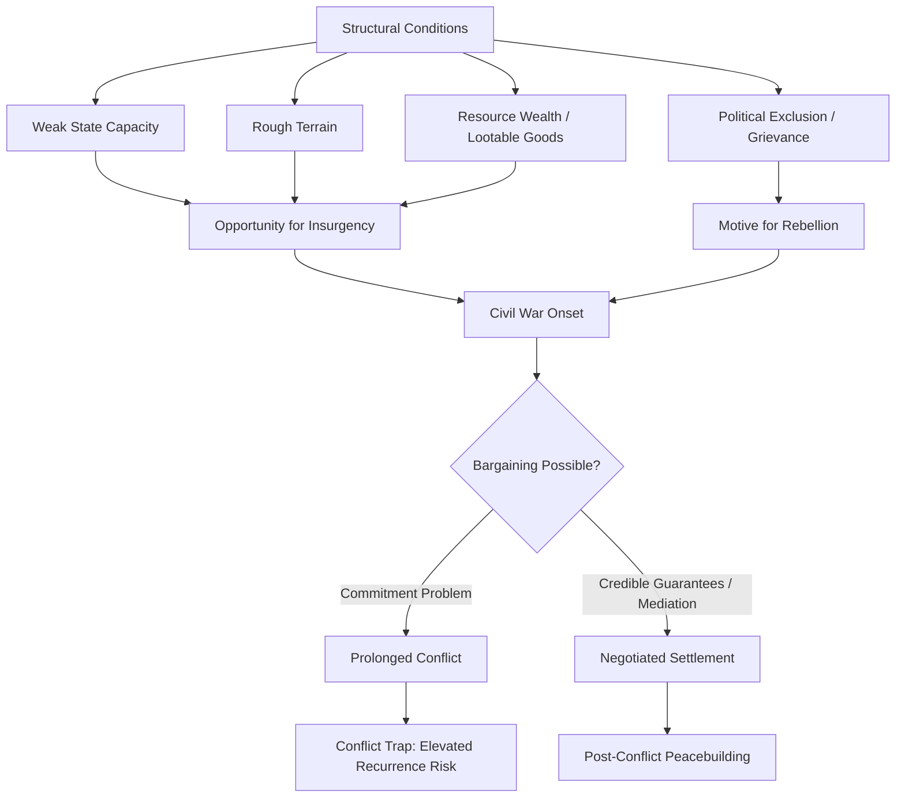

## Civil War and Intrastate Conflict

### Definition and Conceptual Scope

Civil war refers to sustained armed conflict occurring primarily within the recognized borders of a single sovereign state, involving the government (or a faction contesting state authority) and one or more organized non-state armed groups. The Correlates of War (COW) Project defines civil war as internal conflict involving the government of a state as a combatant, sustained military action by an organized force capable of effective resistance, and a minimum of 1,000 battle-related deaths within a twelve-month period. The Uppsala Conflict Data Program (UCDP) uses a lower threshold of 25 battle-related deaths per year to classify "intrastate armed conflict," reserving "civil war" for conflicts crossing 1,000 cumulative deaths.

Intrastate conflict is the broader analytical category encompassing civil war and related but distinct phenomena:

- **Civil war**: large-scale, sustained combat between government and organized rebel forces
- **Insurgency**: irregular, often protracted armed resistance against an established government, frequently using guerrilla tactics
- **Communal/intercommunal conflict**: violence between identity groups (ethnic, religious, tribal) without one side necessarily being the state
- **Coup d'état**: rapid, typically short-duration seizure of state power by military or elite factions, distinct from prolonged civil war unless it triggers broader resistance
- **Genocide/mass atrocity**: one-sided violence against civilian populations, analytically distinct from civil war though frequently co-occurring with it

Fearon and Laitin's influential definition (2003) additionally requires that the conflict involve fighting between agents of a state and organized groups seeking to take control of the state, a region, or to change government policy, using violence that is not merely one-sided repression.

### Theoretical Approaches to the Causes of Civil War

**Grievance-Based Explanations**

Early scholarship emphasized horizontal inequality, ethnic and religious cleavages, and political exclusion as root causes. Ted Gurr's *Why Men Rebel* (1970) framed rebellion in terms of "relative deprivation"—the gap between what groups believe they are entitled to and what they actually receive. Group-based grievance theories point to:

- Political exclusion of ethnic or religious minorities from state power
- Economic marginalization of specific regions or identity groups
- Historical grievances tied to colonial boundary-drawing or prior repression

**Greed and Opportunity-Based Explanations**

Paul Collier and Anke Hoeffler's influential "greed vs. grievance" research (2000s) argued that opportunity structures—not grievances—better predict civil war onset. Key opportunity variables include:

- **Natural resource wealth**: primary commodity exports (especially "lootable" resources like alluvial diamonds, oil, or narcotics) can finance rebel organizations and create incentives for predation (the "resource curse" literature).
- **Weak state capacity**: low GDP per capita and weak bureaucratic/military institutions reduce the state's ability to deter or suppress insurgency.
- **Terrain**: mountainous or forested terrain provides insurgents with sanctuary, reducing the state's counterinsurgency advantage (Fearon and Laitin, 2003).
- **Large population**: statistically associated with higher civil war risk, plausibly through increased coordination costs for the state.

**Fearon and Laitin's "Insurgency Model" (2003)**

This highly cited study argued that ethnic and religious diversity per se does not significantly predict civil war onset; instead, conditions favoring insurgency—financially and militarily weak central governments, rough terrain, political instability, and low income (a proxy for state capacity)—are the strongest predictors. This reframed the debate away from primordialist ethnic-conflict narratives toward state capacity and feasibility arguments.

**Commitment Problems and Bargaining Failure**

As with interstate war, rationalist bargaining theory applies to civil war onset: negotiated settlements between governments and challengers are difficult to sustain because:

- **Commitment problems**: a government cannot credibly promise power-sharing arrangements will be honored once a rebel group disarms (the central dilemma in DDR—disarmament, demobilization, reintegration—processes).
- **Information asymmetries**: governments may underestimate rebel groups' true strength or resolve.
- **Indivisibility of sovereignty**: control over the state apparatus itself is difficult to divide, unlike some interstate territorial disputes.

**Ethnic Fractionalization vs. Polarization**

Some scholars (Montalvo and Reynal-Querol) argue that it is not ethnic fractionalization (many small groups) but ethnic polarization (few large, roughly balanced groups) that predicts civil war risk, since polarized configurations more easily map onto a two-sided "us vs. them" conflict structure.

### Typologies of Civil War

| Type | Description | Example |
| --- | --- | --- |
| Secessionist civil war | Rebel group seeks to break away and form an independent state | Nigerian Civil War (Biafra, 1967–70) |
| Center-seeking (revolutionary) civil war | Rebel group seeks to capture control of the entire state | Chinese Civil War (1927–49) |
| Ethnic civil war | Conflict organized substantially along ethnic cleavage lines | Rwandan Civil War / Genocide (1990–94) |
| Ideological civil war | Conflict organized around competing political ideologies | Spanish Civil War (1936–39) |
| Factional/warlord conflict | Fragmented conflict among multiple armed factions without unified command | Somali Civil War (1991–present phases) |

### Duration, Recurrence, and Conflict Traps

Civil wars tend to last substantially longer than interstate wars; empirical studies (Fearon, 2004; Collier, Hoeffler, and Söderbom, 2004) find average durations often exceeding a decade for conflicts involving lootable resources or weak state capacity. Key dynamics include:

- **Conflict trap**: post-conflict states face a statistically elevated risk of relapse into civil war (Collier's "conflict trap" concept), driven by weakened institutions, continued availability of arms and combatants, and unresolved grievances.
- **Lootable resources and duration**: wars financed by easily extractable resources (gemstones, timber, narcotics) tend to persist longer, as combatants can self-finance independent of civilian population support.
- **Third-party intervention**: external military or financial support to either government or rebels can prolong conflict by shifting the balance of power and undermining incentives to negotiate (a commitment problem effect).

### Civil War Termination

Civil wars end through several documented pathways:

1. **Military victory**: one side is decisively defeated or eliminated (historically the most durable form of termination, per Monica Duffy Toft's research, though it raises humanitarian concerns when achieved through victor's justice or repression).
2. **Negotiated settlement**: often requiring third-party security guarantees to overcome commitment problems, since disarming rebels must trust the government not to exploit their vulnerability post-settlement.
3. **Stalemate/de facto cessation**: fighting diminishes without formal resolution, sometimes producing "frozen conflicts."
4. **Partition/secession**: the state formally divides, resolving the sovereignty dispute by removing its indivisibility (e.g., South Sudan's 2011 independence following prolonged civil war with Sudan).

**[Inference]** Barbara Walter's research suggests that third-party security guarantors are often necessary, though not universally sufficient, for durable negotiated settlements, since without an external enforcer neither side can credibly commit to the terms of a power-sharing agreement.

### Illustrative Example: Power-Sharing as a Commitment Device

Post-conflict power-sharing arrangements (political, territorial, military, and economic) are frequently proposed institutional solutions to the commitment problem underlying civil war settlements. Example structural components:

- **Political power-sharing**: guaranteed cabinet or legislative seats for former rebel factions (e.g., Lebanon's confessional system)
- **Military power-sharing**: integration of rebel combatants into a unified national army (e.g., post-apartheid South Africa's integration of ANC's Umkhonto we Sizwe into the SANDF)
- **Territorial power-sharing**: federalism or regional autonomy granted to formerly rebellious regions (e.g., Mindanao's Bangsamoro Autonomous Region in the Philippines)

### Measurement and Data Considerations

- **UCDP/PRIO Armed Conflict Dataset**: the standard source for intrastate conflict data since 1946, using the 25-death annual threshold.
- **Correlates of War Intra-State War Data**: uses the higher 1,000-death threshold and a longer historical timeframe extending to 1816.
- **Uppsala Georeferenced Event Dataset (UCDP GED)**: provides geographically disaggregated, event-level data useful for subnational analysis of violence patterns.

**[Unverified]** Precise casualty figures in ongoing or historically contested civil wars (e.g., competing estimates for the Syrian Civil War or the Democratic Republic of Congo conflicts) often vary significantly across sources due to access constraints, politicized reporting, and differing methodologies for counting direct versus indirect (famine, disease) deaths.

### Contemporary Debates and Critiques

- **Internationalized civil wars**: many contemporary intrastate conflicts (Syria, Yemen, Libya) feature substantial foreign state intervention, blurring the analytical line between "civil" and "interstate" war and complicating both termination and data classification.
- **New Wars thesis** (Mary Kaldor): argues that post-Cold War intrastate conflicts increasingly feature identity politics, transnational financing networks, and deliberate targeting of civilians, differing qualitatively from earlier ideologically driven civil wars—though this thesis has been contested for overstating novelty.
- **Gender dimensions**: feminist security scholars highlight the systematic use of sexual violence as a tactic of war and the differentiated impacts of civil conflict on women and men, including combatant recruitment patterns and post-conflict DDR program design gaps.
- **Climate and environmental stress**: emerging research examines whether resource scarcity and climate-related shocks (drought, agricultural failure) act as threat multipliers for civil conflict risk, though causal mechanisms remain actively debated and evidence is mixed.

### Related Topics

- Interstate War (comparative framework)
- Insurgency and Counterinsurgency Doctrine
- Disarmament, Demobilization, and Reintegration (DDR)
- Power-Sharing and Consociationalism
- Ethnic Conflict and Fractionalization Theory
- Resource Curse and Conflict Financing
- Peacebuilding and Post-Conflict Reconstruction
- Genocide and Mass Atrocity Prevention
- Failed States and State Capacity
- Third-Party Mediation and Peacekeeping Operations