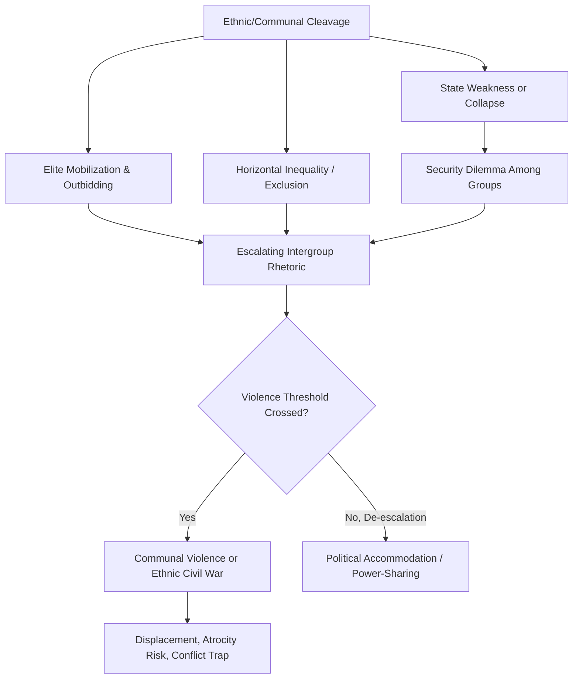

## Ethnic and Communal Conflict

### Definition and Conceptual Scope

Ethnic and communal conflict refers to organized violence between groups defined by ascriptive identity markers—ethnicity, religion, tribe, clan, caste, or race—rather than, or in addition to, conflict between a state and an organized challenger. It overlaps substantially with civil war and intrastate conflict but is analytically distinguished by its organizing cleavage: the primary fault line is group identity rather than ideology, class, or contested control of the central state per se.

The Uppsala Conflict Data Program (UCDP) categorizes relevant violence into distinct types useful for disaggregating this domain:

- **State-based armed conflict**: at least one party is the government of a state, which may or may not be organized along ethnic lines
- **Non-state conflict**: armed conflict between two organized groups, neither of which is the state (frequently communal or ethnic militias)
- **One-sided violence**: organized use of armed force by a state or group against unarmed civilians, often ethnically targeted

Communal conflict specifically refers to violence between non-state identity-based groups (e.g., farmer-herder clashes, inter-tribal violence, sectarian riots) that may occur with or without direct state involvement, distinguishing it from state-based ethnic civil wars such as insurgencies fought by an ethnically defined rebel organization against the central government.

### Theoretical Approaches

**Primordialism**

Primordialist theories (associated with earlier anthropological and some early political science literature) treat ethnic identity as a fixed, deeply rooted characteristic and ethnic conflict as a natural consequence of ancient hatreds or civilizational differences. Samuel Huntington's "Clash of Civilizations" thesis (1993/1996) is a prominent, and heavily contested, example applying primordialist logic to a macro-level argument about post-Cold War international conflict along civilizational fault lines. **[Speculation]** Critics broadly regard strong primordialism as empirically weak, since it struggles to explain variation in when and why ostensibly "ancient" rivalries erupt into violence at particular moments rather than others.

**Instrumentalism**

Instrumentalist theories view ethnicity as a resource strategically mobilized by political elites to achieve power, resources, or security, rather than a fixed driver of conflict in itself. Ethnic identity is treated as one of several available bases for political coalition-building, activated when elites find it advantageous. This tradition emphasizes elite manipulation, patronage networks, and the strategic construction of ethnic narratives during political competition.

**Constructivism**

Constructivist approaches (Rogers Brubaker, David Laitin) argue that ethnic categories themselves are socially and historically constructed, fluid, and subject to reinterpretation, rather than objectively given. Ethnic boundaries can be reinforced, blurred, or reconstructed depending on political context; "ethnic conflict" is thus partly an outcome of processes that make ethnicity politically salient in the first place, rather than a pre-political given that simply explodes into violence.

**Security Dilemma Applied to Ethnic Conflict**

Barry Posen's influential application of the security dilemma to intrastate settings (1993) argues that when central state authority collapses (e.g., during state disintegration), ethnic groups face a mini-anarchy analogous to the international system: each group must provide for its own security, and the same offense-defense and information problems that produce interstate arms spirals can generate preemptive ethnic violence, particularly when groups are geographically intermixed and one has an offensive military advantage.

**Ethnic Fractionalization vs. Polarization (Revisited)**

As discussed in relation to civil war more broadly, empirical findings suggest that highly fractionalized societies (many small groups) may face different conflict dynamics than polarized societies (few large, competing groups). Montalvo and Reynal-Querol's polarization index has been used to argue that bipolar ethnic configurations more readily produce large-scale violence than fragmented ones, because polarized settings more easily generate a clear "us vs. them" mobilization structure.

### Key Drivers and Escalation Mechanisms

- **Elite mobilization and ethnic outbidding**: political competition within an ethnic group can produce a "ratchet effect" where politicians compete to appear the most uncompromising defender of group interests, escalating rhetoric and reducing space for moderate, cross-ethnic coalitions (Donald Horowitz's *Ethnic Groups in Conflict*, 1985).
- **Security dilemma dynamics** in the context of state weakness or collapse (Posen, discussed above).
- **Discrimination and horizontal inequality**: systematic political, economic, or social exclusion of a group along identity lines increases grievance and mobilization potential (Frances Stewart's "horizontal inequalities" framework).
- **Demographic and resource competition**: communal violence (e.g., farmer-herder conflict in the Sahel) is frequently linked to competition over land, water, and grazing rights, sometimes exacerbated by demographic pressure or environmental stress.
- **Institutional design**: majoritarian "winner-take-all" electoral systems in ethnically divided societies can incentivize purely ethnic voting blocs and exclude minorities from power, whereas power-sharing or proportional systems are often proposed (though contested) as mitigating mechanisms.
- **External patronage and diaspora support**: kin groups or diaspora communities across borders can provide financing, arms, or safe haven, internationalizing ostensibly domestic ethnic conflicts (Horowitz's concept of "ethnic affinities" crossing state borders).

### Typologies and Illustrative Cases

| Type | Description | Example |
| --- | --- | --- |
| Ethnic secessionist conflict | Ethnic group seeks independent statehood | Eritrean War of Independence (1961–91) |
| Ethnic center-seeking conflict | Ethnic group seeks control of the central state | Rwandan Civil War (1990–94) |
| Communal/non-state violence | Violence between groups without direct state combatant role | Farmer-herder clashes in the Sahel region |
| Sectarian conflict | Violence organized along religious sectarian lines | Sectarian violence in post-2003 Iraq (Sunni-Shia) |
| Ethnic riot/pogrom | Episodic, often urban mass violence against a targeted group | 2002 Gujarat riots, India |

### Institutional Responses and Conflict Management

Political science identifies several institutional strategies proposed to manage or mitigate ethnic conflict, each with contested trade-offs:

- **Consociationalism** (Arend Lijphart): power-sharing through grand coalitions, mutual veto rights, proportionality in representation and civil service, and segmental autonomy. Applied (with mixed results) in Lebanon, Bosnia and Herzegovina (Dayton Accords), and Northern Ireland (Good Friday Agreement).
- **Centripetalism** (Donald Horowitz, Benjamin Reilly): electoral and institutional designs intended to incentivize cross-ethnic coalition-building rather than segmental autonomy, such as preferential voting systems requiring candidates to gain support across multiple ethnic groups.
- **Federalism and territorial autonomy**: devolving power to ethnically defined subnational units, intended to reduce the stakes of central government control (e.g., Ethiopia's ethnic federalism, itself a contested case given renewed conflict in the Tigray region).
- **Integrationist approaches**: deliberately de-emphasizing ethnic categories in political institutions, sometimes through bans on ethnic political parties (e.g., certain African states' constitutional provisions).

**[Inference]** The comparative effectiveness of consociational versus centripetal/integrationist designs remains a live scholarly debate; consociational arrangements are sometimes criticized for entrenching the very ethnic divisions they aim to manage, while integrationist approaches are criticized for suppressing legitimate group-based grievances rather than resolving them.

### Measurement and Data Sources

- **UCDP Non-State Conflict Dataset**: tracks communal and non-state armed conflict globally, distinguishing it from state-based conflict.
- **Ethnic Power Relations (EPR) Dataset**: codes the political power status of ethnic groups relative to the state (e.g., included, excluded, discriminated against, dominant), widely used to test exclusion-based theories of ethnic conflict onset.
- **Minorities at Risk (MAR) Project**: historically tracked politically active ethnic minority groups and their status, grievances, and conflict behavior (though data collection has been discontinued in its original form; successor efforts continue under related research programs).

### Contemporary Debates and Critiques

- **Overuse of the "ethnic conflict" label**: scholars caution against reflexively labeling any conflict involving groups of different ethnicities as fundamentally "ethnic," when underlying drivers may be more precisely economic, political, or resource-based, with ethnicity serving as a mobilization vector rather than a root cause.
- **Climate-conflict linkages**: growing research examines whether resource scarcity from climate stress intensifies communal conflict (e.g., farmer-herder violence), though the literature shows contested and context-dependent findings rather than a uniform causal relationship.
- **Social media and mobilization**: recent scholarship examines how digital platforms can accelerate ethnic outbidding dynamics and disinformation-driven communal violence, a rapidly evolving area with limited long-term empirical consensus.
- **Transitional justice and reconciliation**: post-conflict societies face design choices between retributive justice (tribunals, e.g., the International Criminal Tribunal for Rwanda), restorative justice (truth and reconciliation commissions, e.g., South Africa), and traditional/local mechanisms (e.g., Rwanda's gacaca courts), each with debated trade-offs for long-term intergroup reconciliation.

### Related Topics

- Civil War and Intrastate Conflict (comparative framework)
- Consociationalism and Power-Sharing Design
- Genocide and Mass Atrocity Prevention
- Nationalism and Ethnic Identity Formation
- Security Dilemma Theory (interstate and intrastate applications)
- Horizontal Inequality and Political Exclusion
- Transitional Justice and Reconciliation Mechanisms
- Federalism in Divided Societies
- Diaspora Politics and Conflict Financing
- Peacebuilding and Post-Conflict Reconstruction