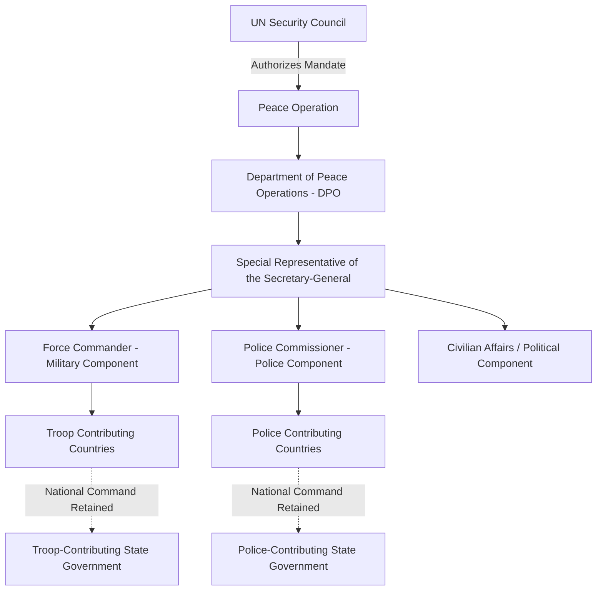

## Peacekeeping and Peace Operations

### Definition and Conceptual Scope

Peacekeeping and peace operations refer to the deployment of international military, police, and civilian personnel—typically under the authorization of the United Nations, a regional organization, or an ad hoc coalition—to support the prevention, management, or resolution of armed conflict. The term encompasses a spectrum of activities that has expanded significantly since the Cold War era, ranging from lightly armed monitoring missions to complex, multidimensional operations involving state-building and civilian protection.

The UN's own doctrine (articulated in the 2008 "Capstone Doctrine," officially *United Nations Peacekeeping Operations: Principles and Guidelines*) distinguishes several related concepts often grouped under the broader "peace operations" umbrella:

- **Conflict prevention**: diplomatic and structural measures to prevent disputes from escalating to armed conflict
- **Peacemaking**: diplomatic efforts (mediation, negotiation) to bring active conflict parties to a settlement
- **Peacekeeping**: deployment of international presence, historically to monitor and facilitate implementation of a ceasefire or peace agreement
- **Peace enforcement**: use of coercive military measures, potentially without the consent of all parties, authorized under UN Charter Chapter VII
- **Peacebuilding**: longer-term measures to address root causes of conflict and support durable peace, often post-conflict (institution-building, DDR, rule of law)

### Generations of Peacekeeping

Political science and peace-operations scholarship commonly periodizes UN peacekeeping into successive "generations," reflecting evolving mandates and doctrine:

**First Generation (Traditional/Classical Peacekeeping, Cold War era)**

Emerged from the 1956 Suez Crisis with the creation of the first UN Emergency Force (UNEF I), conceptually developed by UN Secretary-General Dag Hammarskjöld and Canadian diplomat Lester B. Pearson. Traditional peacekeeping rests on three foundational principles:

1. **Consent** of the host state(s) and main conflict parties
2. **Impartiality** in implementation of the mandate (not to be confused with neutrality on the underlying conflict's merits)
3. **Non-use of force** except in self-defense (and later, defense of the mandate)

These missions were typically lightly armed, monitored ceasefires and buffer zones between state militaries, and did not intervene in internal conflicts. Examples include UNEF I (1956) and the UN Truce Supervision Organization (UNTSO, 1948–present, the UN's oldest ongoing peacekeeping mission).

**Second Generation (Multidimensional Peacekeeping, post-Cold War)**

Following the end of the Cold War, missions expanded beyond military observation to include civilian components: election monitoring, human rights verification, and support for political transitions. The UN Transition Assistance Group in Namibia (UNTAG, 1989–90) and the UN Transitional Authority in Cambodia (UNTAC, 1992–93) are frequently cited as paradigmatic examples, combining military, police, and civilian administrative functions to support post-conflict transitions.

**Third Generation (Peace Enforcement and Complex Operations, 1990s)**

The early-to-mid 1990s saw attempts at more robust interventions in intrastate conflicts, often without full consent of all parties, straining the traditional principles. High-profile failures significantly shaped subsequent doctrine:

- **UNOSOM II (Somalia, 1993)**: escalation to peace enforcement following the "Black Hawk Down" incident, leading to US and UN withdrawal
- **UNAMIR (Rwanda, 1993–96)**: failure to prevent or halt the 1994 genocide despite an existing UN presence, extensively analyzed for mandate, resourcing, and political will failures (documented in the Carlsson Report, 1999)
- **UNPROFOR (Bosnia, 1992–95)**: failure to prevent the Srebrenica massacre (1995) despite the area's designation as a UN "safe area," a case central to debates over the limits of lightly armed peacekeeping in active conflict zones

These failures catalyzed the influential **Brahimi Report** (2000, formally the "Report of the Panel on United Nations Peace Operations"), which recommended more robust mandates, clearer rules of engagement, adequate resourcing, and realistic mandate design matched to conditions on the ground.

**Fourth Generation / "Stabilization" Operations (2000s–present)**

Contemporary missions increasingly operate in environments without a comprehensive peace agreement, sometimes explicitly authorized to use force proactively to protect civilians and support fragile host governments against active armed groups. The UN Organization Stabilization Mission in the DRC (MONUSCO) and its Force Intervention Brigade (authorized 2013)—empowered to conduct offensive operations against armed groups—exemplify this shift toward "robust peacekeeping," blurring the line between peacekeeping and peace enforcement.

### Legal and Institutional Framework

**UN Charter Basis**

Peacekeeping is not explicitly mentioned in the UN Charter; it is sometimes informally described as falling under "Chapter Six and a Half," a phrase attributed to Dag Hammarskjöld, denoting an intermediate space between:

- **Chapter VI** (Pacific Settlement of Disputes): non-coercive mechanisms including negotiation, mediation, and traditional consent-based peacekeeping
- **Chapter VII** (Action with Respect to Threats to the Peace): authorizes coercive measures, including the use of force, and provides the legal basis for peace enforcement and robust mandates

**Command and Control Structure**

- The **UN Security Council** authorizes mission mandates, troop ceilings, and renewal periods (typically annual)
- The **Department of Peace Operations (DPO)**, based at UN Headquarters, provides strategic direction
- **Troop and Police Contributing Countries (TCCs/PCCs)** voluntarily provide personnel, retaining ultimate national command authority over their contingents even while under UN operational control (a persistent source of coordination challenges, sometimes termed "national caveats")
- A **Special Representative of the Secretary-General (SRSG)** typically heads the mission, with a **Force Commander** leading the military component

**Financing**

UN peacekeeping is funded through assessed contributions from all UN member states via a specialized scale of assessment (distinct from the regular UN budget), with permanent Security Council members bearing a premium share reflecting their special responsibility for international peace and security.

### Core Doctrinal Principles (Capstone Doctrine)

| Principle | Description | Contemporary Tension |
| --- | --- | --- |
| Consent of the parties | Host state and main parties agree to the mission's presence | Consent may be partial, contested, or withdrawn mid-mission |
| Impartiality | Even-handed mandate implementation, not favoring one party | Distinguished from neutrality; impartial enforcement against mandate violations can appear partisan to spoilers |
| Non-use of force except in self-defense and defense of the mandate | Force restricted to defensive purposes and mandate protection | "Defense of the mandate" has expanded to include proactive civilian protection, blurring peacekeeping/enforcement lines |

### Protection of Civilians (POC) Mandates

Since the early 2000s, explicit civilian protection mandates have become a central and often primary feature of UN peacekeeping, authorized under Chapter VII to permit "all necessary means" to protect civilians under imminent threat of physical violence, within capabilities and areas of deployment. This shift followed extensive scholarly and institutional reflection on the Rwanda and Srebrenica failures, and is closely associated with the broader normative framework of the **Responsibility to Protect (R2P)**, endorsed at the 2005 UN World Summit, which holds that the international community bears a residual responsibility to protect populations from genocide, war crimes, ethnic cleansing, and crimes against humanity when a state is unwilling or unable to do so.

**[Inference]** The practical implementation of POC mandates remains contested in the scholarly literature, since peacekeeping forces frequently face resource, mobility, and political constraints that limit their capacity to fulfill expansive civilian protection commitments, and mandate ambition has in some documented cases outpaced troop capabilities and rules of engagement clarity.

### Determinants of Peacekeeping Effectiveness

Political science research (notably by Virginia Page Fortna, Lise Morjé Howard, and others) has used quantitative and case-study methods to examine when and why peacekeeping succeeds in preventing conflict recurrence:

- **Consent and buy-in from local parties**: missions deployed with genuine consent of the main conflict parties show significantly better outcomes than those deployed amid active, contested combat.
- **Adequate mandate-resource matching**: mismatches between ambitious mandates (e.g., civilian protection, stabilization) and troop numbers, equipment, and logistics correlate with mission underperformance.
- **Regional and great-power support**: missions backed by regional organizations and not opposed by major powers with interests in the conflict tend to perform better.
- **Fortna's research** found that the mere presence of peacekeepers is associated with a substantially reduced risk of conflict recurrence after civil wars end, compared to cases without peacekeeping presence, addressing skepticism about whether peacekeeping causally matters versus simply being deployed to "easier" cases.

**[Unverified]** Precise quantitative estimates of peacekeeping's causal effect size vary across studies depending on methodology (selection-effect controls, case coding, and time-period), and scholars continue to debate the robustness of specific point estimates found in the literature.

### Regional and Non-UN Peace Operations

Peace operations are not exclusively conducted under UN auspices. Regional and ad hoc arrangements play an increasingly significant role:

- **African Union Mission in Somalia (AMISOM, later transitioned to ATMIS)**: a regionally led peace enforcement operation against al-Shabaab, illustrating African Union-UN "hybrid" partnership models with UN logistical and financial support.
- **NATO-led operations**: including the International Security Assistance Force (ISAF) in Afghanistan, illustrating alliance-based (rather than UN-commanded) stabilization missions.
- **EU Common Security and Defence Policy (CSDP) missions**: smaller-scale civilian and military missions (e.g., EUFOR operations in the Balkans and Africa).
- **Ad hoc coalitions**: "coalitions of the willing" operating with or without explicit UN Security Council authorization, raising ongoing debates about legal authority and legitimacy under international law.

### Challenges and Critiques

- **Sexual exploitation and abuse (SEA) by peacekeeping personnel**: a persistent and serious accountability challenge documented across multiple missions, prompting UN reform initiatives (including the "zero tolerance" policy and the office of a Special Coordinator on SEA), though implementation and accountability gaps remain a subject of ongoing scrutiny and criticism.
- **Host-state sovereignty tensions**: robust and stabilization mandates can generate friction with host governments, particularly when peacekeepers investigate government-linked human rights abuses or restrict government military operations.
- **Mandate overreach and under-resourcing**: the gap between Security Council mandate ambition and the troops, funding, and political will actually provided remains a recurring structural critique (echoing Brahimi Report findings two decades later).
- **Exit strategies and mission drawdown risk**: withdrawing peacekeeping forces before host-state security institutions are self-sustaining carries a documented risk of conflict relapse, creating difficult sequencing and benchmarking challenges for mission transitions.
- **Peacekeeping economy effects**: some studies examine how the local economic footprint of large peacekeeping missions (employment, procurement, informal markets) can create dependencies or distortions that complicate mission exit.

### Related Topics

- Civil War and Intrastate Conflict
- Responsibility to Protect (R2P) Doctrine
- Peacebuilding and Post-Conflict Reconstruction
- Disarmament, Demobilization, and Reintegration (DDR)
- UN Security Council Decision-Making
- Humanitarian Intervention and International Law
- Conflict Prevention and Early Warning Systems
- Transitional Justice Mechanisms
- Regional Security Organizations (AU, NATO, EU)
- Statebuilding in Post-Conflict Environments