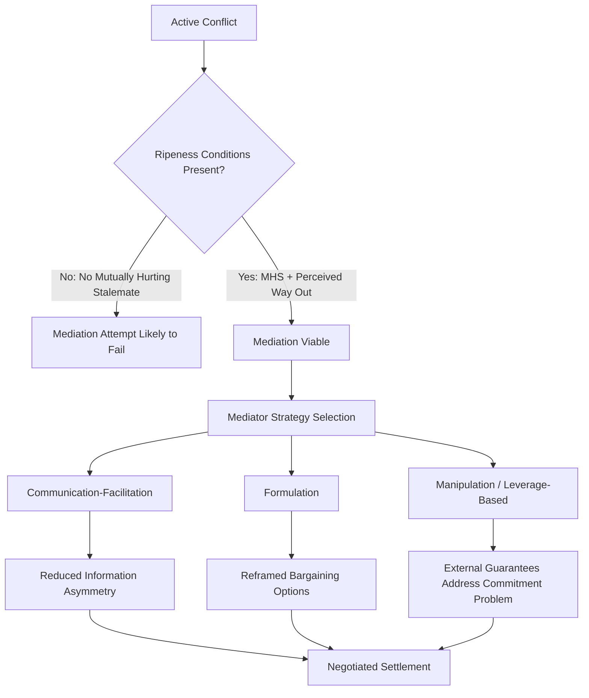

## Conflict Resolution and Mediation

### Definition and Conceptual Scope

Conflict resolution refers to the broad field of theory and practice concerned with ending or transforming disputes—interpersonal, intergroup, intrastate, or interstate—through processes other than the sustained application of force. Mediation is one specific mechanism within this field: a form of third-party assistance in which a mediator facilitates communication and negotiation between disputants without possessing the authority to impose a binding outcome, distinguishing it from arbitration (binding third-party decision) and adjudication (formal legal judgment).

The field draws on multiple disciplinary traditions, including political science, international relations, social psychology, and law, and encompasses several related but distinct concepts:

- **Conflict management**: containing or limiting the destructive effects of conflict without necessarily resolving underlying issues
- **Conflict resolution**: addressing the substantive issues in dispute to reach a mutually acceptable outcome
- **Conflict transformation**: a more expansive concept (associated with John Paul Lederach) focused on changing the underlying relationships, structures, and narratives that generate conflict, not merely settling a specific dispute
- **Negotiation**: direct bilateral or multilateral bargaining between parties without a facilitating third party
- **Mediation**: third-party-facilitated negotiation, non-binding
- **Arbitration**: third-party issues a binding decision, but the process remains voluntary and consensual in origin (distinguishing it from adjudication under compulsory jurisdiction)

### Theoretical Foundations

**Conflict as Rational Bargaining Failure**

As with the interstate and civil war literatures, rationalist bargaining theory frames conflict resolution as the challenge of helping parties locate and credibly commit to a settlement within an existing bargaining range. James Fearon's three bargaining-failure mechanisms (private information, commitment problems, indivisibility) directly inform mediation strategy: effective mediators often function to reduce information asymmetries, provide guarantees that substitute for weak credible commitment, and reframe issues to reduce perceived indivisibility.

**Ripeness Theory**

I. William Zartman's influential "ripeness theory" argues that conflicts become amenable to resolution only when parties perceive a "mutually hurting stalemate" (MHS)—a situation in which continued conflict is more costly than negotiation for all sides, and each perceives no unilateral path to victory. Ripeness typically also requires a perceived "way out"—a viable negotiated alternative that mediators or other actors can help identify and legitimize. Premature mediation attempts, before ripeness conditions exist, are frequently observed to fail regardless of mediator skill.

**Human Needs Theory**

John Burton's human needs theory argues that protracted social conflicts are frequently rooted in the frustration of basic human needs (identity, security, recognition, autonomy) that are non-negotiable, unlike interests, which can be traded off. This framework underlies "problem-solving workshop" approaches to conflict resolution, which bring conflicting parties together in unofficial, facilitated settings to explore underlying needs rather than bargaining over stated positions (associated with the "Track II" diplomacy tradition, discussed below).

**Principled Negotiation**

Roger Fisher and William Ury's *Getting to Yes* (1981) framework, developed through the Harvard Negotiation Project, proposes four core principles widely applied in both interpersonal and international mediation contexts:

1. **Separate the people from the problem**: address substantive issues without letting personal or relational friction derail negotiation
2. **Focus on interests, not positions**: identify underlying interests behind stated bargaining positions, since interests often permit more creative, mutually satisfying solutions than positions
3. **Generate options for mutual gain**: brainstorm multiple possible solutions before committing to a single outcome ("expanding the pie")
4. **Insist on objective criteria**: use fair, external standards (market value, precedent, expert judgment) to resolve disagreements over distribution

### Track Diplomacy Framework

Political science and conflict resolution scholarship distinguishes multiple "tracks" of diplomatic and mediation engagement, a typology originally developed by Joseph Montville and later expanded by Louise Diamond and John McDonald into a "multi-track diplomacy" model:

| Track | Actors | Characteristics |
| --- | --- | --- |
| Track I | Official government representatives, heads of state, diplomats | Formal, authoritative, can produce binding agreements |
| Track I.5 | Mixed official and unofficial actors in semi-formal settings | Bridges formal and informal diplomacy; often used to test proposals discreetly |
| Track II | Unofficial actors: academics, former officials, NGOs, religious leaders | Informal, exploratory, lower political risk, can generate ideas later adopted formally |
| Track III / Multi-track | Grassroots organizations, civil society, business, media, private citizens | Builds broad societal peace constituencies, addresses root causes at community level |

Track II diplomacy, in particular, has been extensively studied as a mechanism for building trust, testing politically sensitive proposals without formal commitment, and cultivating relationships that can later support Track I negotiations (a documented dynamic in, for example, the lead-up to the Oslo Accords).

### Mediator Roles and Strategies

Political scientist Jacob Bercovitch's extensive empirical work on international mediation identifies a spectrum of mediator behavior strategies:

1. **Communication-facilitation strategies**: the mediator primarily conveys information and facilitates dialogue without proposing substantive solutions (lowest level of mediator involvement/leverage)
2. **Formulation strategies**: the mediator actively proposes specific solutions, frames issues, and suggests possible trade-offs
3. **Manipulation strategies**: the mediator uses its own leverage—incentives, pressure, or side payments—to push parties toward agreement (also termed "power mediation"), most closely associated with major-power mediators possessing significant material leverage

**Mediator Characteristics and Bias**

Contrary to a common assumption that mediators must be strictly neutral, research (including work by Bercovitch and Kydd) suggests that mediators with some bias toward one party can sometimes be more effective, because their information and reassurances are more credible to the party they are perceived to favor, addressing information asymmetry problems even amid apparent partiality. This has been used to explain why powerful states with clear interests (e.g., the US role in various Middle East negotiations) can sometimes mediate effectively despite not being neutral.

### Stages of the Mediation Process

1. **Pre-mediation / entry**: mediator assesses ripeness, secures agreement from parties to participate, establishes ground rules and confidentiality parameters
2. **Issue framing and agenda-setting**: parties and mediator jointly define the scope of issues to be addressed
3. **Exploration of interests**: mediator facilitates identification of underlying interests distinct from stated positions
4. **Option generation**: joint or mediator-facilitated brainstorming of possible settlement terms
5. **Bargaining and convergence**: narrowing of options toward a mutually acceptable agreement, often involving mediator-proposed compromise formulas
6. **Agreement and implementation planning**: formalizing terms, often including monitoring, verification, and enforcement/guarantee mechanisms to address post-agreement commitment problems

### Illustrative Example: Mediation Applied to a Territorial Dispute

**Example**: In a hypothetical interstate territorial dispute, a mediator using a formulation strategy might propose disaggregating a single indivisible sovereignty question (which state controls the territory) into multiple separable interests—resource access rights, security guarantees, symbolic recognition, and administrative arrangements—each of which can be independently negotiated and traded, converting an apparently indivisible issue into a divisible bargaining space. This illustrates how mediators can address Fearon's "issue indivisibility" bargaining-failure mechanism through creative reframing rather than requiring either party to fully concede sovereignty.

### Determinants of Mediation Success

Empirical research on mediation outcomes points to several recurring findings:

- **Timing and ripeness** are consistently identified as necessary, though not sufficient, conditions for successful mediation.
- **Mediator leverage and resources** (the ability to offer incentives or apply pressure) are associated with higher rates of reaching formal agreements, particularly in high-stakes interstate disputes.
- **Multiparty consent and inclusivity**: mediation processes that exclude significant conflict parties or spoilers are frequently observed to produce less durable agreements, as excluded actors retain incentives to undermine implementation.
- **Sequencing with broader peace processes**: mediation efforts embedded within a broader, coordinated diplomatic and (where relevant) peacekeeping framework tend to show more durable outcomes than isolated mediation efforts.

**[Inference]** While the association between mediator leverage and agreement rates is well documented, the causal relationship between reaching a formal agreement and achieving durable, high-quality peace is more contested in the literature, since some studies suggest that agreements reached primarily through external pressure may be less robust than those reflecting genuine convergence of the parties' underlying interests.

### Contemporary Debates and Critiques

- **Track II effectiveness measurement**: because Track II diplomacy operates informally and often confidentially, rigorously evaluating its causal contribution to eventual formal settlements remains methodologically difficult, and much evidence remains process-tracing case-study based rather than statistically generalizable.
- **Gender and inclusive mediation**: research and UN policy (e.g., UN Security Council Resolution 1325 on Women, Peace and Security) increasingly emphasize that women's meaningful participation in mediation and peace processes is associated with more durable agreements, prompting institutional reforms to broaden participation beyond traditional (often male-dominated) elite negotiating teams.
- **Mediator neutrality vs. leverage trade-off**: the field continues to debate whether mediator effectiveness is better served by strict impartiality (enhancing perceived legitimacy) or by biased-but-credible leverage (enhancing enforcement capacity), with context-dependent findings rather than a universal answer.
- **Technology and mediation**: emerging practice explores digital platforms, data analytics, and AI-assisted tools for conflict early warning and mediation support, an actively developing area where **[Speculation]** the long-term impact on mediation practice and outcomes remains largely unestablished in the peer-reviewed literature.

### Related Topics

- Interstate War (bargaining failure framework)
- Civil War and Intrastate Conflict
- Peacekeeping and Peace Operations
- Track II and Multi-Track Diplomacy
- Ripeness Theory and Conflict Timing
- Transitional Justice and Post-Agreement Reconciliation
- Women, Peace, and Security (UNSCR 1325)
- International Arbitration and Adjudication
- Peace Agreement Design and Durability
- Conflict Early Warning Systems