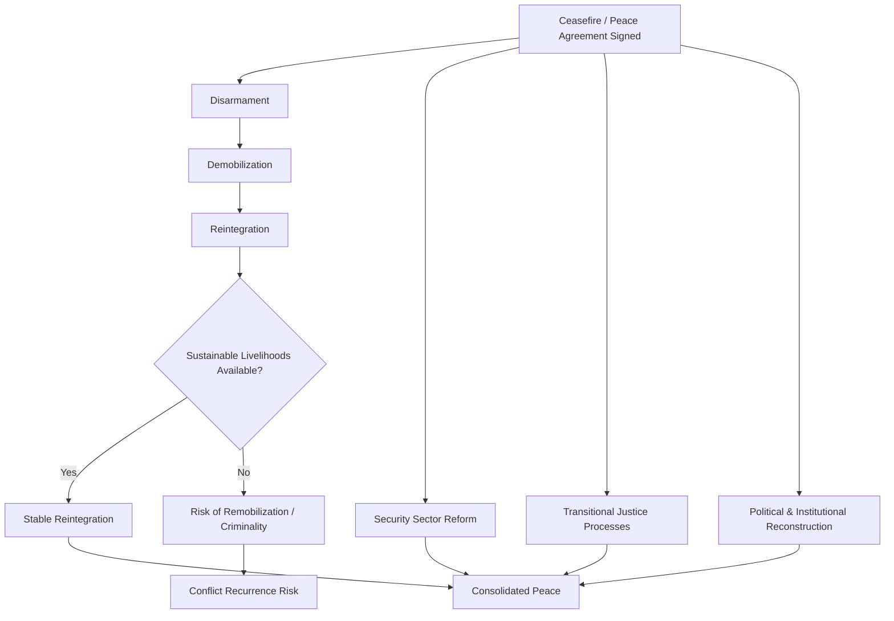

## Post-Conflict Reconstruction and Peacebuilding

### Definition and Conceptual Scope

Post-conflict reconstruction and peacebuilding refer to the range of activities undertaken after the cessation or significant reduction of armed conflict to consolidate peace, prevent conflict recurrence, and rebuild the political, economic, and social foundations of a war-affected society. The UN's foundational conceptualization, articulated in Secretary-General Boutros Boutros-Ghali's *An Agenda for Peace* (1992), defines peacebuilding as action to identify and support structures that strengthen and solidify peace in order to avoid a relapse into conflict, distinguishing it from peacekeeping (maintaining a ceasefire) and peacemaking (negotiating an end to conflict).

The field encompasses several overlapping but analytically distinct components:

- **Security sector reform (SSR)**: rebuilding and reforming military, police, and justice institutions under civilian, democratic oversight
- **Disarmament, demobilization, and reintegration (DDR)**: converting combatants into civilians and reintegrating them into economic and social life
- **Transitional justice**: mechanisms addressing past human rights abuses (trials, truth commissions, reparations, institutional reform)
- **Political and institutional reconstruction**: rebuilding governance structures, holding elections, drafting or reforming constitutions
- **Economic reconstruction**: rebuilding infrastructure, restoring livelihoods, and addressing war economies
- **Social reconciliation**: rebuilding trust and social cohesion across conflict-divided communities

### Theoretical Frameworks

**Liberal Peacebuilding**

The dominant post-Cold War paradigm, sometimes termed the "liberal peace" thesis, holds that durable peace is best achieved through the promotion of liberal democracy, market economics, and the rule of law—reflecting an extension of democratic peace theory logic to the domestic level of war-affected states. This approach heavily influenced UN, World Bank, and bilateral donor peacebuilding programming from the 1990s onward, typically sequencing rapid democratization (elections) alongside market liberalization.

**Critiques of Liberal Peacebuilding**

A substantial critical literature (Roland Paris, Oliver Richmond, Séverine Autesserre) has challenged the liberal peace paradigm on several grounds:

- **Sequencing problems**: Roland Paris's influential *At War's End* (2004) argues for "institutionalization before liberalization"—building functioning state institutions before introducing potentially destabilizing rapid democratization and market liberalization, since premature elections or economic shock therapy can reignite the very tensions peacebuilding aims to resolve.
- **Local ownership deficits**: critics argue that internationally designed and imposed peacebuilding templates frequently fail to account for local political economy, culture, and legitimacy structures, producing "liberal peace" institutions with weak local buy-in (associated with Oliver Richmond's critique of the "liberal peace" as a hegemonic and often externally imposed project).
- **Autesserre's peaceland critique**: Séverine Autesserre's ethnographic research on international peacebuilding practice highlights how the everyday habits, hierarchies, and social separation of international peacebuilders from local populations can undermine the effectiveness and legitimacy of interventions, independent of formal policy design.

**Hybrid Peace and Everyday Peace**

More recent scholarship (Roger Mac Ginty, Oliver Richmond) emphasizes "hybrid peace"—the ways in which local actors adapt, resist, or reshape internationally promoted peacebuilding frameworks to fit local political realities, producing outcomes that are neither purely "liberal" nor purely "traditional" but a negotiated hybrid. Related "everyday peace" scholarship examines micro-level practices by which ordinary people navigate and sustain coexistence in divided societies, independent of formal elite-level peace processes.

### Security Sector Reform (SSR)

SSR encompasses the transformation of a state's security institutions (military, police, intelligence, justice, and oversight bodies) to operate effectively, accountably, and under legitimate democratic civilian control. Core components typically include:

- **Vetting**: screening security personnel for past human rights abuses or conflict-era loyalties before integration into reformed institutions
- **Right-sizing**: adjusting the size of security forces to fiscally sustainable and strategically appropriate levels (often requiring downsizing from wartime troop levels)
- **Civilian oversight mechanisms**: parliamentary and judicial oversight structures, independent ombudspersons, and civil society monitoring capacity
- **Professionalization**: training programs, doctrine development, and human rights education for reformed forces

### Disarmament, Demobilization, and Reintegration (DDR)

DDR is typically conceptualized as a sequential, though often overlapping, three-phase process:

1. **Disarmament**: collection, documentation, control, and disposal of weapons held by combatants
2. **Demobilization**: formal and controlled discharge of combatants from armed forces or groups, often involving temporary cantonment and initial reinsertion support
3. **Reintegration**: the process by which former combatants acquire civilian status and sustainable livelihoods, socially and economically reintegrating into their communities

**[Inference]** DDR program effectiveness is widely documented in the literature to depend heavily on the availability of sustainable post-reintegration economic opportunities; disarmament and demobilization without adequate livelihood support are frequently associated with elevated risk of ex-combatant remobilization or criminal activity.

### Transitional Justice Mechanisms

Transitional justice refers to the range of judicial and non-judicial measures societies use to address large-scale past human rights abuses following conflict or authoritarian rule, typically pursuing some combination of accountability, truth, reparation, and institutional non-recurrence guarantees:

| Mechanism | Description | Example |
| --- | --- | --- |
| Criminal tribunals | Formal prosecution of perpetrators, domestic or international | International Criminal Tribunal for Rwanda (ICTR) |
| Truth commissions | Non-judicial bodies documenting patterns of abuse, often with public testimony | South African Truth and Reconciliation Commission (1996–2003) |
| Reparations programs | Material or symbolic compensation to victims | Peru's Comprehensive Reparations Plan |
| Institutional reform (lustration/vetting) | Removing or excluding perpetrators from public institutions | Post-communist Eastern European lustration laws |
| Traditional/local justice mechanisms | Community-based reconciliation practices adapted to transitional contexts | Rwanda's gacaca courts |

**[Inference]** The relative merits of retributive (prosecution-focused) versus restorative (truth and reconciliation-focused) transitional justice approaches remain actively debated; empirical findings on which approach better promotes durable reconciliation and deters future abuses vary by context and are not conclusively settled in the comparative literature.

### Political and Institutional Reconstruction

Post-conflict political reconstruction often involves sequenced (and contested) processes:

- **Constitution-making**: often conducted through participatory or elite-negotiated processes intended to establish new, more inclusive governance frameworks (e.g., South Africa's post-apartheid constitutional process)
- **Post-conflict elections**: frequently used as a legitimizing and transition-marking device, though scholarship (following Paris's sequencing critique) cautions that early elections held before institutional consolidation can reignite ethnic or factional competition rather than channel it peacefully
- **Power-sharing arrangements**: as discussed in relation to ethnic conflict, transitional or permanent power-sharing structures are frequently used to reassure former combatants and marginalized groups of continued political inclusion

### Economic Reconstruction and War Economies

Post-conflict economic reconstruction must typically address:

- **Infrastructure rehabilitation**: rebuilding transportation, energy, water, and communication systems damaged by conflict
- **War economy transformation**: converting conflict-era illicit or informal economic networks (resource extraction, smuggling) into licit economic activity, a persistent challenge given the vested interests such networks often create among former combatants and elites
- **Employment generation**: particularly urgent given the large pool of demobilized combatants and displaced populations requiring livelihoods
- **Land and property restitution**: resolving disputes over land and property rights disrupted by displacement, often a significant source of renewed local-level conflict if unaddressed

### Peacebuilding Architecture at the UN

The UN's institutional peacebuilding architecture, established through parallel 2005 General Assembly and Security Council resolutions, includes three linked bodies:

- **Peacebuilding Commission (PBC)**: an intergovernmental advisory body bringing together relevant actors (troop contributors, donors, regional organizations, host governments) to develop integrated peacebuilding strategies for specific countries
- **Peacebuilding Fund (PBF)**: provides catalytic, flexible financing for peacebuilding activities, particularly in the critical early post-conflict period before longer-term development financing becomes available
- **Peacebuilding Support Office (PBSO)**: provides secretariat support to the PBC and administers the PBF

### Measuring Peacebuilding Success

Assessing peacebuilding effectiveness is methodologically challenging; commonly used indicators and frameworks include:

- **Conflict recurrence rates**: the most common quantitative outcome measure, though critics note it captures only the absence of renewed large-scale violence, not the quality or depth of peace achieved
- **Fragile States Index / State Fragility measures**: composite indices tracking institutional, economic, and social indicators of state resilience
- **Positive peace frameworks**: drawing on Johan Galtung's distinction between negative peace (absence of direct violence) and positive peace (presence of social justice, functioning institutions, and structural conditions supporting durable peace), used by frameworks such as the Institute for Economics and Peace's Positive Peace Index to assess deeper societal peace resilience beyond mere ceasefire durability

### Contemporary Debates and Critiques

- **Local ownership vs. international assistance capacity**: peacebuilding practice continues to grapple with balancing genuine local ownership against the reality that severely conflict-affected states often lack the immediate institutional capacity to design and implement reconstruction programs without substantial external support.
- **Peacebuilding-development nexus**: growing recognition (reflected in the 2016 UN "Sustaining Peace" agenda resolutions) that peacebuilding should not be treated as a discrete post-conflict phase but as an integrated, continuous element of development and conflict prevention efforts across the conflict cycle.
- **Climate change and peacebuilding**: emerging programming and research examine how climate adaptation can be integrated into peacebuilding in climate-vulnerable, conflict-affected states, though this remains a relatively nascent area of both practice and rigorous evaluation.
- **Gender-responsive peacebuilding**: consistent with the Women, Peace and Security agenda (UNSCR 1325 and successor resolutions), scholarship and practice increasingly emphasize integrating women's participation and gender-sensitive programming across DDR, transitional justice, and institutional reconstruction, though implementation gaps are widely documented.

### Related Topics

- Civil War and Intrastate Conflict
- Peacekeeping and Peace Operations
- Conflict Resolution and Mediation
- Disarmament, Demobilization, and Reintegration (DDR)
- Transitional Justice and Reconciliation Mechanisms
- Security Sector Reform (SSR)
- State-Building and Fragile States
- Positive Peace and Galtung's Peace Theory
- Women, Peace, and Security (UNSCR 1325)
- Ethnic and Communal Conflict (power-sharing linkages)