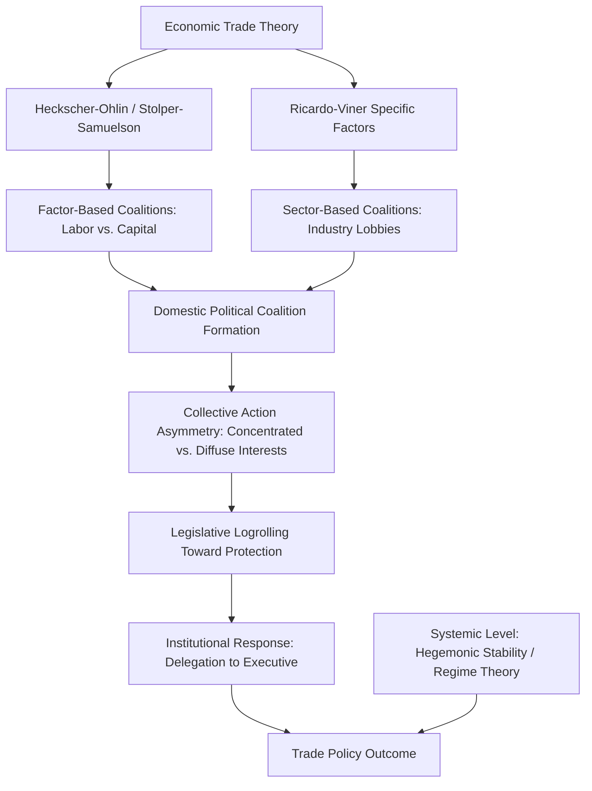

## Theories of International Trade Politics

### Definition and Conceptual Scope

Theories of international trade politics examine the political—as opposed to purely economic—determinants of trade policy: why states adopt protectionist or liberalizing trade policies, which domestic and international actors shape these outcomes, and how trade interacts with broader questions of power, security, and development. This field sits within International Political Economy (IPE) and bridges economic theories of comparative advantage with political science theories of interest group formation, institutional design, and international bargaining.

The field is conventionally organized around several levels of analysis:

- **Systemic/international level**: how the structure of the international system (hegemony, international institutions, power distribution) shapes trade openness
- **Domestic/societal level**: how domestic interest groups, coalitions, and factor endowments shape which actors favor protection versus liberalization
- **Institutional level**: how domestic political institutions (electoral systems, legislative-executive relations) and international institutions (WTO, trade agreements) mediate the translation of interests into policy

### Economic Foundations Underlying Political Analysis

**Comparative Advantage**

David Ricardo's theory of comparative advantage holds that countries benefit from trade by specializing in goods they can produce at relatively lower opportunity cost, even if one country has an absolute productivity advantage in all goods. This remains the baseline economic logic against which political trade theories explain deviations (protectionism) from predicted free-trade equilibria.

**Heckscher-Ohlin Model and the Stolper-Samuelson Theorem**

The Heckscher-Ohlin model predicts that countries export goods that intensively use their relatively abundant factors of production (labor, capital, land) and import goods using their scarce factors. The **Stolper-Samuelson theorem**, derived from this model, predicts the distributional political consequences of trade: trade liberalization benefits owners of a country's abundant factor and harms owners of its scarce factor. This theorem underpins the influential **factor-based approach** to trade politics (Ronald Rogowski's application in *Commerce and Coalitions*, 1989), predicting that in labor-abundant developing countries, labor should favor free trade while capital and land owners favor protection, and vice versa in capital-abundant developed countries.

**Ricardo-Viner (Specific Factors) Model**

An alternative economic microfoundation, the Ricardo-Viner or specific-factors model, assumes factors of production are not fully mobile across sectors in the short-to-medium run. This produces a **sector-based approach** to trade politics: political coalitions form around industries or sectors (e.g., steel, agriculture, textiles) rather than broad factor classes (labor vs. capital), since workers and capital owners in a given import-competing sector share a common interest in protection regardless of their factor type, and this model is often considered more empirically applicable to real-world trade lobbying patterns, which are typically organized by industry association rather than broad class coalition.

### Domestic-Level Theories

**Interest Group and Collective Action Approaches**

Building on Mancur Olson's *The Logic of Collective Action* (1965), trade politics scholarship emphasizes that protectionist interests (concentrated import-competing industries) typically face lower collective action costs than diffuse free-trade beneficiaries (consumers, export industries spread across the economy), helping explain a persistent political bias toward protectionism despite its aggregate economic costs—a dynamic often summarized as concentrated benefits versus diffuse costs.

**Institutional Explanations: Delegation and Logrolling**

E.E. Schattschneider's classic study of the Smoot-Hawley Tariff (1930) documented how legislative logrolling—reciprocal vote trading among legislators seeking protection for local industries—can produce an aggregate protectionist outcome even without majority support for protectionism overall. This insight informs institutional explanations for trade liberalization, notably:

- **Delegation to the executive**: many democracies (e.g., the US Reciprocal Trade Agreements Act of 1934, and subsequent "fast track"/Trade Promotion Authority mechanisms) delegate tariff-negotiating authority from legislatures to the executive branch specifically to insulate trade policy from concentrated protectionist lobbying and logrolling dynamics, since the executive represents a more diffuse national constituency.

**Electoral Systems and Trade Policy**

Comparative political economy research examines how electoral system design shapes trade policy outputs: proportional representation systems with large districts may generate different protectionist coalition incentives than majoritarian systems with geographically concentrated small districts, since the latter can create stronger incentives for legislators to champion narrow local industry protection.

### Systemic-Level Theories

**Hegemonic Stability Theory**

Hegemonic stability theory (Charles Kindleberger, Stephen Krasner, Robert Gilpin) argues that an open, liberal international trading order requires a dominant hegemonic power both willing and able to provide the collective good of open markets, enforce rules, and absorb short-term costs of maintaining the system (e.g., serving as a market of last resort during downturns). The theory is used to explain the collapse of open trade in the 1930s (attributed partly to a "vacuum" of hegemonic leadership as declining British power was not yet matched by an ascendant but still internally focused United States) and the post-1945 liberal trade order's association with US hegemony under the Bretton Woods system and GATT.

**[Inference]** Hegemonic stability theory's predictive power regarding the necessity of hegemony for open trade has been contested by scholars pointing to continued (and in some measures deepening) trade liberalization during periods of perceived US relative decline, suggesting that institutionalized cooperation may substitute for hegemonic enforcement under certain conditions.

**Institutionalist/Regime Theory**

In response to hegemonic stability theory's limitations, institutionalist scholars (Robert Keohane, in *After Hegemony*, 1984) argue that international institutions and regimes (like GATT/WTO) can sustain cooperative trade liberalization even after hegemonic decline, by reducing transaction costs, providing information, enabling issue linkage, and supporting iterated cooperation among self-interested states—applying insights from game theory (particularly the iterated Prisoner's Dilemma) to explain durable trade cooperation absent a hegemon.

### Trade Institutions and Governance

**GATT/WTO Framework**

The General Agreement on Tariffs and Trade (GATT, 1947) and its successor, the World Trade Organization (WTO, established 1995 following the Uruguay Round), institutionalize several core liberal trade principles:

- **Most-Favored-Nation (MFN) treatment**: members must extend the same favorable trade terms to all other members (with exceptions for regional trade agreements and preferential arrangements for developing countries)
- **National treatment**: imported goods, once past the border, must be treated no less favorably than domestically produced goods
- **Reciprocity**: trade concessions are exchanged on a mutually beneficial basis, facilitating domestic political sustainability of liberalization by pairing import-opening concessions with export-market gains
- **Binding and transparency**: tariff commitments are formally "bound" and publicly scheduled, and a dispute settlement mechanism (significantly strengthened under the WTO relative to GATT) adjudicates trade disputes

### Regionalism and Preferential Trade Agreements (PTAs)

The proliferation of regional and bilateral preferential trade agreements since the 1990s has generated substantial political science analysis regarding:

- **"Building blocs vs. stumbling blocs" debate**: whether PTAs serve as complementary steps toward broader multilateral liberalization (building blocs, per Jagdish Bhagwati's terminology) or instead create trade diversion and vested interests that undermine multilateral progress (stumbling blocs)
- **Domestic political economy of PTA formation**: PTAs are often analyzed as vehicles for governments to achieve deeper liberalization commitments than politically feasible multilaterally, by packaging concessions with reciprocal market access gains for powerful export interests
- **Legalization and dispute settlement design variation**: PTAs vary substantially in their institutionalization, ranging from shallow tariff-reduction agreements to deep integration frameworks (e.g., the EU single market) involving regulatory harmonization

### Trade and Security Linkages

- **Commercial liberalism**: as discussed in relation to interstate war, trade interdependence is theorized (following Norman Angell and later empirical work by Oneal and Russett) to raise the opportunity costs of conflict between trading partners, though the causal direction and robustness of this "capitalist peace" relationship remains debated in the literature.
- **Strategic trade policy**: some scholarship examines how states use trade policy instruments (export controls, tariffs, subsidies) for geopolitical leverage or to protect strategically important industries (e.g., semiconductors, rare earth minerals), a dimension of trade politics that has gained renewed prominence amid contemporary great-power competition and supply-chain security concerns.

### Contemporary Debates and Critiques

- **Trade and inequality**: recent scholarship (including work associated with economists David Autor, David Dorn, and Gordon Hanson on the "China shock") has documented significant, geographically concentrated labor-market disruption from import competition, reinvigorating political science interest in how trade-driven economic dislocation shapes protectionist and populist political mobilization in advanced democracies.
- **Backlash against globalization and trade populism**: the rise of protectionist political movements and policies in several advanced democracies since the mid-2010s has prompted renewed scholarly attention to the political sustainability of liberal trade orders when domestic distributional consequences are not adequately addressed through compensatory policy (e.g., inadequate trade adjustment assistance).
- **Industrial policy resurgence**: renewed interest in state-directed industrial policy (subsidies, local content requirements, strategic sector protection) among both developed and developing economies has generated debate over whether this represents a durable shift away from the post-1945 liberal trade consensus or a more limited, sector-specific adjustment.
- **WTO institutional strain**: the WTO's dispute settlement Appellate Body has faced significant operational challenges in recent years due to member disagreements over appointments, raising ongoing questions (subject to continuing developments) about the durability of multilateral trade dispute adjudication relative to bilateral or plurilateral alternatives.

### Related Topics

- Hegemonic Stability Theory and International Regimes
- Comparative Advantage and Factor Endowment Models
- Collective Action Problems in Political Economy
- Regionalism and Preferential Trade Agreements
- Globalization and Domestic Political Backlash
- Democratic Peace and Commercial Liberalism
- Industrial Policy and Strategic Trade
- International Monetary Politics (Bretton Woods, IMF)
- Global Value Chains and Economic Interdependence
- Populism and Economic Dislocation