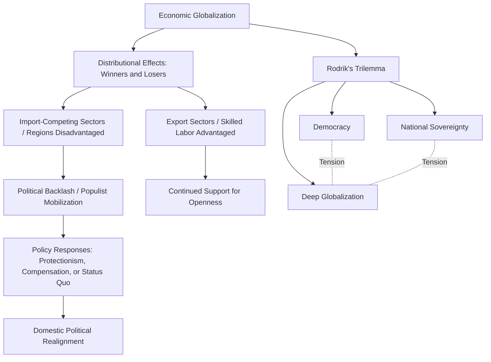

## Globalization and its Political Consequences

### Definition and Conceptual Scope

Globalization refers to the accelerating integration of economies, societies, and political systems across national borders, encompassing flows of trade, capital, information, technology, and people. Within political science, the study of globalization's political consequences examines how this deepening interdependence reshapes state sovereignty, domestic political coalitions, institutional governance capacity, and the distribution of political power both within and among states. The field is distinguished from purely economic analyses of globalization by its focus on power, authority, and political contestation rather than efficiency and welfare alone.

Scholars commonly distinguish several dimensions of globalization, each with distinct political implications:

- **Economic globalization**: trade liberalization, foreign direct investment (FDI), global value chains, and financial market integration
- **Political globalization**: the growth of international institutions, transnational governance arrangements, and global norms
- **Cultural globalization**: the transnational diffusion of ideas, media, and cultural practices
- **Technological/digital globalization**: cross-border data flows, digital platforms, and the compression of communication costs

### Theoretical Perspectives on Globalization and the State

**Hyperglobalist Perspective**

Early globalization scholarship (associated with figures like Kenichi Ohmae's "borderless world" thesis) argued that economic globalization was fundamentally eroding state sovereignty and rendering the nation-state increasingly obsolete as the primary unit of governance, as capital mobility and transnational production networks outpaced states' regulatory capacity.

**Skeptical Perspective**

A skeptical counter-tradition (associated with Paul Hirst and Grahame Thompson) argued that globalization's novelty and extent have been overstated, pointing to comparably high levels of trade and capital flows in the pre-1914 "first era of globalization," and emphasizing that states retain substantial regulatory authority and remain the primary architects of the international economic order (since trade and financial liberalization itself required active state policy choices, rather than reflecting the state's passive erosion).

**Transformationalist Perspective**

The transformationalist position (associated with David Held and Anthony McGrew) occupies a middle ground, arguing that globalization is fundamentally reconfiguring, rather than simply eroding or leaving unchanged, state power and sovereignty—producing new multi-level governance arrangements, new forms of state authority (regulatory rather than purely territorial), and increased entanglement between domestic and international politics, without predetermined outcomes regarding whether state capacity ultimately increases or decreases.

**Embedded Liberalism**

John Ruggie's influential concept of "embedded liberalism" (1982) describes the post-1945 Bretton Woods compromise: international economic openness was politically sustained by pairing it with robust domestic social protections (welfare states, capital controls) that cushioned populations from market volatility, illustrating how the political durability of economic openness has historically depended on compensatory domestic political arrangements rather than openness alone.

### Domestic Political Consequences

**Trilemma Frameworks**

Dani Rodrik's influential "political trilemma of the world economy" (sometimes called the "globalization trilemma") argues that democracy, national sovereignty, and deep economic globalization cannot be simultaneously and fully achieved—societies must sacrifice some degree of one to fully pursue the other two:

$$\text{Democracy} + \text{National Sovereignty} + \text{Deep Globalization} \Rightarrow \text{Choose at most two}$$

For example, deep global economic integration combined with full national sovereignty over economic policy constrains the scope for democratic domestic policy choices that diverge from market-friendly norms (a dynamic Rodrik associates with pressures toward policy convergence, sometimes termed a potential "race to the bottom" in regulatory standards).

**Distributional and Coalitional Effects**

As discussed in relation to trade politics, globalization generates identifiable winners and losers within societies. The "China shock" literature (Autor, Dorn, Hanson) documented substantial, geographically concentrated labor-market dislocation in advanced-economy regions exposed to import competition, contributing to significant political science interest in how such dislocation translates into shifting party coalitions, declining trust in mainstream parties, and increased support for protectionist or nationalist political movements.

**Compensation Hypothesis**

The "compensation hypothesis" (associated with political economists including David Cameron and Dani Rodrik) argues that states with greater exposure to international economic volatility historically developed larger welfare states and social insurance programs to politically compensate populations for globalization-related economic risk, suggesting a historically observed complementarity between economic openness and domestic social protection rather than an inherent tension—though **[Inference]** whether this compensatory relationship has weakened under contemporary fiscal and political constraints in advanced democracies remains a subject of ongoing debate.

### Globalization and Global Governance

Political globalization has produced an expanding architecture of international and transnational governance, raising distinct political science questions about legitimacy, accountability, and authority:

- **International organizations (IOs)**: the growth in number, scope, and authority of IOs (WTO, IMF, World Bank, UN specialized agencies) raises "principal-agent" questions about how effectively member states can monitor and control the international bureaucracies they create, and under what conditions IO autonomy expands beyond original state intentions.
- **Global governance networks**: transnational regulatory networks (e.g., the Basel Committee on Banking Supervision, International Organization for Standardization) increasingly set de facto global standards through technical and expert-driven processes operating partially outside traditional treaty-based international law.
- **Democratic deficit debates**: scholars (notably in EU integration studies but increasingly applied to global governance broadly) debate whether the delegation of authority to international and supranational institutions creates a legitimacy or "democratic deficit," since publics have limited direct accountability mechanisms over decisions made at the international level that nonetheless significantly affect domestic policy space.

### Globalization, Nationalism, and Populist Backlash

A substantial and rapidly growing literature examines the relationship between globalization and the resurgence of nationalist and populist political movements in the 2010s and 2020s:

- **Economic grievance explanations**: emphasize globalization-driven job displacement, wage stagnation, and regional economic decline as primary drivers of populist support (consistent with the "China shock" and compensation-hypothesis literatures above).
- **Cultural backlash explanations**: Pippa Norris and Ronald Inglehart's influential "cultural backlash" thesis argues that populist support is better explained by a reaction against progressive cultural value shifts (associated with globalization's cultural dimension) among populations who feel culturally displaced, rather than by economic grievance alone.
- **Identity and status threat**: related scholarship examines how globalization-associated demographic change (immigration) and perceived status threat among previously dominant groups contribute to nationalist political mobilization, independent of direct economic self-interest.

**[Inference]** The relative explanatory weight of economic versus cultural drivers of populist backlash remains an actively contested empirical question in the literature, with different studies emphasizing different mechanisms depending on case selection, measurement strategy, and time period examined.

### Globalization and Developing Countries

Globalization's political consequences for developing and emerging economies raise distinct considerations:

- **Dependency and world-systems perspectives**: earlier structuralist and dependency theory traditions (Raúl Prebisch, Immanuel Wallerstein) argued that global economic integration under existing terms tends to reproduce core-periphery inequalities rather than promote convergent development, a perspective that, while less dominant in mainstream political economy today, continues to inform critical globalization scholarship.
- **Developmental state debates**: the East Asian "developmental state" experience (South Korea, Taiwan, Singapore) is frequently cited as evidence that selective, strategic engagement with globalization—rather than either full autarky or unconditional openness—can support rapid development, informing ongoing debates about appropriate globalization policy sequencing for developing economies.
- **Capital flow volatility**: developing economies are frequently documented as disproportionately exposed to the political and economic disruption of sudden capital flow reversals ("sudden stops"), renewing debates over the appropriate scope for capital controls within otherwise liberalized economies.

### Digital Globalization and Emerging Political Dimensions

Contemporary scholarship increasingly examines the political consequences of digital and data-driven globalization:

- **Data governance and digital sovereignty**: growing state efforts (e.g., the EU's General Data Protection Regulation, China's data localization requirements) to assert regulatory authority over cross-border data flows illustrate an emerging arena of globalization-related political contestation distinct from traditional trade and finance.
- **Platform governance**: the transnational reach of major digital platforms raises novel questions about the locus of regulatory authority over content moderation, competition policy, and taxation, with different jurisdictions (EU, US, China) pursuing substantially different regulatory models.
- **[Speculation]** The long-term political-economic implications of AI-driven automation for globalization's distributional politics—potentially reshaping which sectors and countries benefit from global economic integration—remain an actively developing area without settled scholarly consensus.

### Contemporary Debates and Critiques

- **Deglobalization and geoeconomic fragmentation**: recent scholarship examines whether trends including supply-chain reshoring, expanded export controls, and great-power strategic competition (particularly US-China) represent a durable structural shift toward reduced global economic integration ("slowbalization" or fragmentation) or a more limited, sector-specific adjustment within a still fundamentally globalized system.
- **Globalization and democratic resilience**: ongoing debate examines whether globalization-associated economic and cultural disruption poses a genuine structural threat to democratic stability in advanced democracies, or whether documented democratic backsliding in this period reflects a more complex set of causes only partially attributable to globalization.
- **Measurement challenges**: composite globalization indices (e.g., the KOF Globalisation Index) face ongoing methodological debate regarding how to appropriately weight and combine economic, social, and political dimensions of globalization into comparable cross-national and over-time measures.

### Related Topics

- Theories of International Trade Politics
- Hegemonic Stability Theory and International Regimes
- Populism and Democratic Backsliding
- International Organizations and Global Governance
- Dependency Theory and World-Systems Analysis
- Developmental State Models
- Digital Governance and Platform Regulation
- Welfare State Politics and Social Compensation
- Nationalism and Identity Politics
- Global Value Chains and Supply Chain Politics