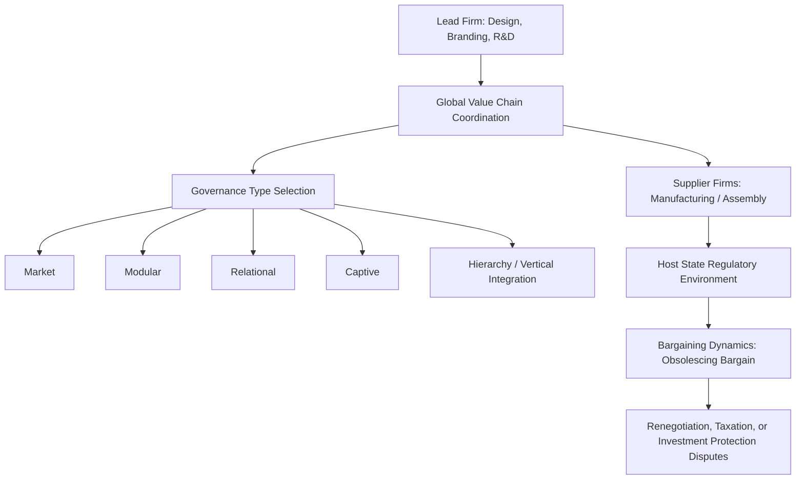

## Multinational Corporations and Global Production

### Definition and Conceptual Scope

Multinational corporations (MNCs), also termed transnational corporations (TNCs), are firms that own, control, or coordinate productive assets in more than one country, typically through foreign direct investment (FDI). Within political science, the study of MNCs and global production examines how these firms shape and are shaped by state power, international regulatory frameworks, and domestic political coalitions, positioning corporate actors as significant, though not fully autonomous, participants in international political economy alongside states and international institutions.

The field distinguishes several conceptually related phenomena:

- **Foreign direct investment (FDI)**: cross-border investment establishing a lasting ownership interest and degree of managerial control (conventionally 10% or more equity stake) in an enterprise, distinguishing it from portfolio investment
- **Global value chains (GVCs) / global production networks**: the fragmentation of production processes across multiple countries, with different stages of a good's design, manufacture, and assembly performed in different jurisdictions based on comparative and locational advantages
- **Offshoring**: relocating specific production stages to foreign locations, whether through FDI (captive offshoring) or contracting with independent foreign suppliers (offshore outsourcing)
- **Global production networks (GPN) framework**: an analytical approach (associated with economic geographers and political economists including Neil Coe and Henry Yeung) examining the power relations and governance structures linking lead firms, suppliers, and states across fragmented production networks

### Theoretical Approaches to MNC-State Relations

**Obsolescing Bargain Model**

Raymond Vernon's influential "obsolescing bargain" model (1971) describes a dynamic bargaining relationship between MNCs and host governments that shifts over time: prior to initial investment, the MNC holds significant bargaining leverage (the host state must offer attractive terms to attract the investment), but once the investment is sunk (particularly in immobile assets like extractive industries or heavy manufacturing), bargaining power shifts toward the host government, which can then renegotiate terms, increase taxation, or threaten expropriation, since the firm's exit costs have risen substantially. **[Inference]** The obsolescing bargain model's applicability is understood in the literature to vary significantly by industry and asset mobility, with less relevance to highly mobile, technology- or brand-intensive investments where the firm retains greater exit optionality even after the initial investment.

**Structural Power and Capital Mobility**

A related but distinct theoretical tradition (associated with structural or "instrumental" power arguments) emphasizes that capital mobility itself confers political power on MNCs independent of direct lobbying, since governments must anticipate and compete for mobile investment (sometimes termed regulatory or tax "competition for capital"), potentially constraining domestic regulatory and fiscal policy choices even absent explicit corporate political pressure—a dynamic closely related to Rodrik's globalization trilemma discussed under globalization's political consequences.

**Bargaining and Institutional Bargaining Power**

Later refinements to bargaining models (Theodore Moran and others) emphasize that host government bargaining power depends significantly on domestic institutional capacity (technical expertise to negotiate and monitor complex contracts), the availability of competing investment alternatives, and international legal protections (investment treaties) that can constrain host government renegotiation attempts even after the obsolescing bargain shift theoretically favors the state.

### Global Value Chains and Governance

Gary Gereffi's influential global value chain governance framework identifies distinct patterns by which lead firms coordinate and exert control across fragmented production networks, based on the complexity of transactions, the ability to codify information, and the capability of suppliers:

| Governance Type | Description | Degree of Lead Firm Control |
| --- | --- | --- |
| Market | Simple, arm's-length transactions based on price | Low |
| Modular | Suppliers make products to customer specifications using generic machinery | Low-Moderate |
| Relational | Complex transactions requiring mutual dependence and trust between firms | Moderate-High |
| Captive | Small suppliers highly dependent on and monitored by dominant lead firms | High |
| Hierarchy | Vertically integrated production within a single firm | Highest (no external governance needed) |

This framework informs political science analysis of where value, and correspondingly political and economic leverage, is captured within global production networks—commonly illustrated by the "smile curve" concept, in which higher value-added activities (design, branding, R&D at one end; marketing and after-sales service at the other) command greater returns than lower value-added assembly and manufacturing stages typically located in developing economies.

### Investment Governance and Legal Frameworks

**Bilateral Investment Treaties (BITs) and Investor-State Dispute Settlement (ISDS)**

States have negotiated an extensive network of bilateral and multilateral investment treaties, typically providing foreign investors protections including guarantees against uncompensated expropriation, fair and equitable treatment standards, and access to investor-state dispute settlement (ISDS)—a mechanism allowing foreign investors to bring claims directly against host governments before international arbitral tribunals, bypassing domestic courts. This system has generated substantial political science and legal scholarship debate:

- **Regulatory chilling effect concerns**: critics argue that ISDS exposure can deter host governments from adopting legitimate public-interest regulations (environmental, health, labor) due to fear of costly investor claims, sometimes termed "regulatory chill."
- **Legitimacy and sovereignty concerns**: the delegation of sovereign regulatory disputes to private international arbitrators, operating with limited transparency and no binding precedent or appeals mechanism in the traditional legal sense, has prompted sustained criticism and reform efforts (including proposals for a standing multilateral investment court, notably advanced by the EU).
- **Empirical effectiveness debates**: research on whether BITs actually increase FDI flows to signatory developing countries shows mixed and contested findings across different studies and methodologies.

### MNCs, Taxation, and Regulatory Competition

The global mobility of MNC profits and investment decisions has generated significant political economy scholarship on:

- **Tax competition and base erosion**: MNCs' ability to shift reported profits to low-tax jurisdictions (through transfer pricing and intellectual property licensing arrangements) has been documented to erode national corporate tax bases, generating a collective action problem among states competing for investment and tax revenue.
- **OECD/G20 Base Erosion and Profit Shifting (BEPS) initiative and global minimum tax**: recent multilateral efforts, notably the 2021 OECD/G20 Inclusive Framework agreement establishing a 15% global minimum corporate tax floor, represent a significant, though still unevenly implemented, attempt at coordinated international tax governance to reduce incentives for profit-shifting and a regulatory "race to the bottom."
- **Regulatory arbitrage more broadly**: beyond taxation, MNCs' capacity to locate production in jurisdictions with weaker labor, environmental, or safety regulations raises parallel debates about a broader "race to the bottom" versus "race to the top" (through consumer and reputational pressure, or binding international standards) dynamic in global regulatory competition.

### MNCs and Labor/Human Rights Governance

Given the frequent absence of binding international law directly regulating corporate conduct, governance of MNC labor and human rights practices has relied substantially on hybrid public-private mechanisms:

- **Voluntary corporate social responsibility (CSR) initiatives**: firm-level voluntary commitments and codes of conduct, subject to ongoing scholarly debate regarding their effectiveness absent binding enforcement.
- **Multi-stakeholder governance initiatives**: frameworks combining state, corporate, and civil society actors (e.g., the Fair Labor Association, various supply-chain certification schemes) to monitor and improve labor conditions in global production networks.
- **UN Guiding Principles on Business and Human Rights (2011)**: an influential, though non-binding, framework establishing a "protect, respect, remedy" structure delineating state duties to protect human rights and corporate responsibilities to respect them.
- **Binding treaty efforts**: ongoing (and not yet concluded) UN-level negotiations toward a binding international treaty on business and human rights illustrate continued contestation over whether voluntary or binding governance approaches are more appropriate and politically feasible for regulating MNC conduct.

### MNCs and Developing Country Political Economy

- **FDI and development strategy**: the relationship between FDI inflows and host-country development outcomes remains a debated empirical question, with findings varying by the type of investment (resource-extractive versus export-manufacturing-oriented), host-country absorptive capacity, and accompanying domestic policy frameworks (e.g., local content requirements, technology transfer conditions).
- **Resource extraction and political economy**: MNC involvement in extractive industries (oil, mining) in developing countries is closely linked to the broader "resource curse" literature discussed in relation to civil war, given documented associations in some contexts between resource-extraction-dependent economies, weak governance, and conflict risk.
- **Special Economic Zones (SEZs)**: many developing countries have used SEZs—demarcated areas with distinct regulatory, tax, and infrastructure regimes designed to attract export-oriented FDI—as a policy tool to integrate into global production networks, with documented but contested results regarding broader economy-wide spillover effects.

### Contemporary Debates and Critiques

- **Geoeconomic fragmentation of supply chains**: recent state efforts toward "friend-shoring," reshoring, and diversification away from geopolitically sensitive supply chain dependencies (particularly regarding China) represent a significant contemporary shift in the political economy of global production, with **[Speculation]** long-term implications for global value chain structure that remain actively unfolding and not yet fully documented in the scholarly literature.
- **Platform firms and digital MNCs**: the rise of major digital platform companies raises distinct governance challenges relative to traditional manufacturing MNCs, given their unique characteristics regarding data assets, network effects, and the difficulty of applying traditional physical-presence-based tax and regulatory frameworks to digital business models.
- **Environmental and climate governance intersections**: growing scrutiny of MNC supply chain contributions to carbon emissions and deforestation has generated new regulatory initiatives (e.g., the EU's Carbon Border Adjustment Mechanism and corporate due diligence directives), raising fresh questions about extraterritorial regulatory reach and compliance burden distribution across global production networks.
- **Power asymmetries in value chain governance**: continued scholarly attention to whether developing-country suppliers can achieve meaningful "economic upgrading" (moving into higher value-added activities) within lead-firm-governed value chains, or whether captive and hierarchical governance structures tend to lock suppliers into persistently lower-value activities.

### Related Topics

- Theories of International Trade Politics
- Globalization and its Political Consequences
- International Monetary and Financial Systems
- Resource Curse and Conflict Financing
- Developmental State Models
- Global Value Chains and Economic Upgrading
- Investor-State Dispute Settlement (ISDS) Reform
- Corporate Social Responsibility and Business-Human Rights Governance
- Tax Competition and Global Minimum Tax
- Special Economic Zones and Development Policy