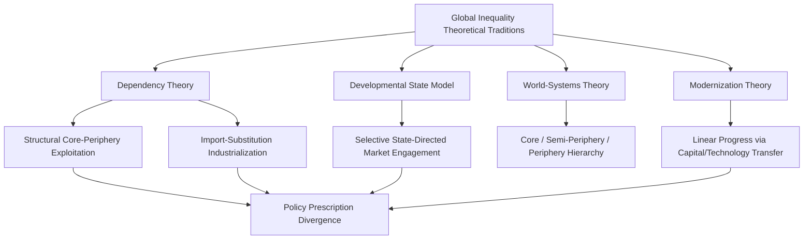

## Global Inequality and North-South Relations

### Definition and Conceptual Scope

Global inequality and North-South relations examine the persistent economic, political, and structural disparities between wealthier, historically industrialized states (conventionally termed the "Global North" or "core") and poorer, historically colonized or later-developing states (the "Global South" or "periphery"), along with the political relationships, institutions, and contestation this divide generates. The North-South framing emerged prominently during the Cold War and decolonization era as an alternative or complement to the East-West ideological divide, emphasizing economic development status and historical power relations rather than Cold War alignment.

Political science examines this domain through several interrelated dimensions:

- **Measurement of global inequality**: between-country inequality (differences in average income across states) versus within-country inequality (income distribution inside states), and global inequality (treating all individuals worldwide as a single distribution)
- **Historical structural origins**: colonialism, unequal terms of trade, and the historical construction of core-periphery economic relationships
- **Contemporary governance contestation**: Global South efforts to reform international economic institutions perceived as favoring established powers
- **Development policy debates**: competing prescriptions for reducing North-South disparities

### Theoretical Frameworks

**Modernization Theory**

Early post-war development theory (Walt Rostow's "Stages of Economic Growth," 1960) presented development as a linear process through which all societies could progress, given appropriate capital investment, technology transfer, and adoption of modern institutions and values, implicitly modeling Global South development on the historical trajectory of already-industrialized Western states.

**Dependency Theory**

Emerging substantially from Latin American economists and social scientists (Raúl Prebisch, Fernando Henrique Cardoso, Andre Gunder Frank), dependency theory rejected modernization theory's linear assumptions, arguing instead that the Global South's underdevelopment is not a prior stage awaiting progress but is actively produced and reproduced by its structural position within the global capitalist economy. Key mechanisms include:

- **Unequal terms of trade**: the Prebisch-Singer thesis argues that primary commodity exporters (typical of Global South economies) face a long-run tendency toward declining terms of trade relative to manufactured goods exporters, since demand for primary commodities grows more slowly than for manufactures as incomes rise, structurally disadvantaging commodity-dependent economies.
- **Core-periphery structure**: wealth and surplus extracted from peripheral economies flow toward core industrialized economies, reinforcing rather than closing the development gap over time.
- **Import-substitution industrialization (ISI)**: a major policy prescription flowing from dependency analysis, ISI sought to reduce peripheral dependence on manufactured imports by developing protected domestic industrial capacity, implemented extensively (with mixed and contested results) across Latin America and parts of Africa and Asia from the 1950s-1980s.

**World-Systems Theory**

Immanuel Wallerstein's world-systems analysis extends dependency insights into a comprehensive historical-structural framework, dividing the global capitalist economy into three tiers: **core** (high-wage, capital-intensive, politically powerful states), **periphery** (low-wage, resource-extractive, politically weak states), and **semi-periphery** (states occupying an intermediate structural position, exhibiting characteristics of both core exploitation of the periphery and peripheral-like relations with the core). World-systems theory treats this hierarchical structure as a persistent, systemic feature of the capitalist world economy since roughly the "long sixteenth century," rather than a temporary developmental lag.

**Neoliberal/Market-Oriented Critique**

Critics of dependency and world-systems approaches, drawing on neoclassical economics, argue that the empirical record of the post-war period—particularly the rapid growth of the East Asian "tiger" economies through export-oriented (rather than purely import-substituting) strategies—undermines strong dependency claims that integration into global capitalism structurally forecloses Global South development, pointing instead to domestic policy choices, institutional quality, and selective global market engagement as more decisive factors.

**Developmental State Model**

The East Asian experience (South Korea, Taiwan, Singapore) generated an influential alternative framework—the developmental state model (associated with Chalmers Johnson's foundational study of Japan, and later applied comparatively)—emphasizing that successful late development historically required a competent, relatively autonomous state bureaucracy strategically directing market forces (through targeted industrial policy, selective protection, and export promotion) rather than either pure market liberalization or closed import substitution.

### Historical Political Movements for Global Economic Reform

**Non-Aligned Movement (NAM)**

Founded in 1961 amid Cold War bipolarity, the Non-Aligned Movement brought together newly independent and developing states seeking to avoid formal alignment with either the US-led or Soviet-led blocs, while advocating collectively for decolonization and more equitable international economic relations, reflecting an early institutional expression of Global South political solidarity.

**New International Economic Order (NIEO)**

In 1974, developing countries, through the UN General Assembly, formally proposed the New International Economic Order—a comprehensive set of demands for restructuring global economic governance, including commodity price stabilization schemes, preferential trade access for developing-country exports, increased development financing, technology transfer requirements, and enhanced developing-country voice in international economic institutions. **[Inference]** The NIEO's limited ultimate implementation is generally attributed in the literature to sustained opposition from major industrialized states and a shifting global economic and ideological climate toward market liberalization in the 1980s, though it remains historically significant as a high-water mark of coordinated Global South institutional reform advocacy.

**UN Conference on Trade and Development (UNCTAD)**

Established in 1964 partly in response to Global South dissatisfaction with GATT's perceived favoring of industrialized-country trade interests, UNCTAD has served as an ongoing institutional forum for developing-country trade and development policy advocacy, including early championing of the Generalized System of Preferences (GSP), granting developing countries preferential (non-reciprocal) tariff access to developed-country markets.

### Measuring Global Inequality

Political economy and development scholarship distinguishes analytically important inequality concepts:

- **Concept 1 (unweighted between-country inequality)**: treats each country as a single unit regardless of population, comparing average national incomes
- **Concept 2 (population-weighted between-country inequality)**: weights country comparisons by population size, substantially affected by the trajectories of large economies (particularly China's growth has been documented to significantly reduce Concept 2 inequality in recent decades)
- **Concept 3 (true global inequality)**: treats all individuals worldwide as a single distribution, capturing both between-country and within-country inequality components

Branko Milanovic's influential empirical work using this framework has documented a global inequality pattern often summarized through the "elephant curve," showing substantial income gains for the global middle class (heavily concentrated in Asian emerging economies) and for the global top 1%, alongside relative income stagnation for lower-middle income groups in advanced economies, over the 1988-2008 period—a pattern with significant implications for understanding both South-side convergence and North-side political backlash discussed under globalization.

### Contemporary Global Governance Reform Debates

- **International financial institution governance reform**: continued Global South advocacy for increased voting share and leadership representation at the IMF and World Bank, reflecting persistent perceived underrepresentation relative to contemporary economic weight (discussed further under international monetary systems).
- **UN Security Council reform**: longstanding, though largely unrealized, calls for expanded permanent representation to include major developing-country powers, reflecting broader North-South governance legitimacy debates.
- **Special and differential treatment in trade**: ongoing contestation within the WTO over the appropriate scope and duration of "special and differential treatment" provisions permitting developing countries longer implementation periods and greater policy flexibility, with disagreement (including from some advanced economies) over which countries should still qualify for developing-country status and associated flexibilities.
- **Climate finance and differentiated responsibility**: the UNFCCC principle of "common but differentiated responsibilities" reflects an explicit North-South framing in climate governance, with ongoing and often contentious negotiations over developed-country climate finance commitments to developing countries (e.g., the long-disputed $100 billion annual climate finance goal and its successor targets).

### Debt, Aid, and Development Finance

- **Sovereign debt crises and the Global South**: recurring debt crises (Latin American debt crisis of the 1980s, and renewed debt distress among low-income countries in the 2020s) have generated sustained political science attention to the political economy of sovereign debt restructuring, IMF/World Bank structural adjustment conditionality, and debtor-creditor power asymmetries.
- **Official Development Assistance (ODA) politics**: foreign aid allocation and effectiveness remain contested areas of study, examining donor motivations (humanitarian versus strategic/commercial self-interest), aid conditionality debates, and mixed empirical evidence regarding aid's aggregate development impact.
- **South-South cooperation**: growing development financing and trade relationships among developing countries themselves (notably China's expanding role as a development financier and infrastructure investor, e.g., through the Belt and Road Initiative) represent a significant, actively evolving alternative or complement to traditional North-South development finance relationships, with **[Speculation]** its long-term comparative effectiveness and governance implications remaining an area of ongoing and not yet settled empirical assessment.

### Contemporary Debates and Critiques

- **Postcolonial and decolonial critiques**: scholarship increasingly examines how contemporary global economic governance structures and even mainstream development economics concepts may reproduce colonial-era power hierarchies and knowledge frameworks, calling for more fundamentally reconceived approaches to North-South relations beyond incremental institutional reform.
- **Middle-income and "Global South" category coherence**: the substantial economic divergence among countries historically grouped as "Global South" (from least-developed countries to large emerging economies like China, India, and Brazil) raises ongoing conceptual debate about whether the North-South framework retains sufficient analytical coherence for contemporary global political economy analysis, or requires more differentiated categorization.
- **Climate justice and historical responsibility**: intensifying debates connect global inequality directly to climate policy, given the disproportionate historical emissions contribution of industrialized Global North economies relative to the disproportionate projected climate vulnerability of Global South regions, informing contested claims regarding loss-and-damage financing responsibility.

### Related Topics

- Theories of International Trade Politics
- Globalization and its Political Consequences
- International Monetary and Financial Systems
- Developmental State Models
- Colonialism and Postcolonial Political Theory
- Sovereign Debt and Financial Crises
- Climate Justice and International Environmental Governance
- Foreign Aid and Development Assistance Politics
- South-South Cooperation and China's Global Role
- Multinational Corporations and Global Production