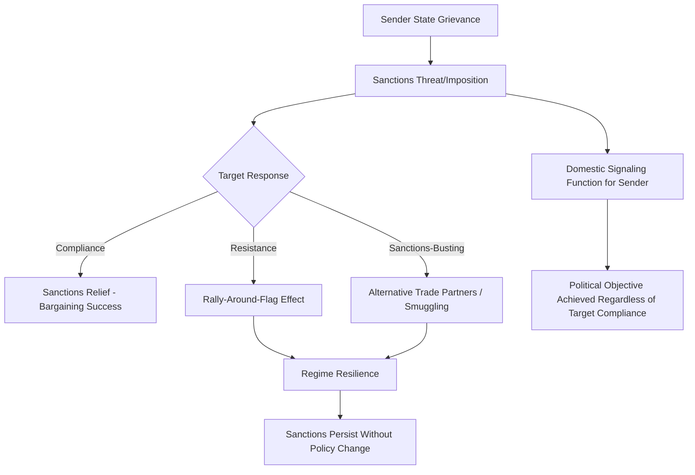

## Sanctions and Economic Statecraft

### Definition and Conceptual Scope

Economic statecraft refers to the use of economic instruments—rather than military force or traditional diplomacy—to pursue foreign policy and security objectives. David Baldwin's foundational work, *Economic Statecraft* (1985), defines the field as encompassing both positive economic inducements (foreign aid, trade concessions, investment guarantees) and negative economic instruments (sanctions, embargoes, export controls) that states use to influence the behavior of other states, non-state actors, or individuals. Sanctions—the deliberate, government-imposed withdrawal or threat of withdrawal of customary economic relations—represent the most extensively studied category within this broader field.

Key analytical distinctions within the sanctions literature include:

- **Comprehensive sanctions**: broad restrictions on most or all economic relations with a target state
- **Targeted (smart) sanctions**: restrictions aimed at specific individuals, entities, or sectors (asset freezes, travel bans, sectoral restrictions) intended to minimize humanitarian harm to the broader civilian population while pressuring specific elites or industries
- **Unilateral sanctions**: imposed by a single state
- **Multilateral sanctions**: imposed collectively, often through international organizations (notably UN Security Council sanctions, which carry binding legal authority under Chapter VII for all UN member states)
- **Secondary sanctions**: penalties imposed on third-party actors (including firms and individuals in non-target states) who engage in transactions with sanctioned entities, extending the sanctioning state's practical reach beyond its direct jurisdiction

### Theoretical Frameworks for Understanding Sanctions

**Coercive Bargaining Logic**

Sanctions are typically modeled within the same rationalist bargaining framework applied to interstate conflict: the sanctioning state seeks to impose sufficient costs on the target to alter its cost-benefit calculation regarding the disputed policy, functioning as a coercive bargaining tool positioned between diplomacy and military force on an escalation spectrum. As with the bargaining model of war, effective sanctions require credible signaling of resolve and, critically, a credible offer of sanctions relief contingent on target compliance—since a target with no expectation that compliance will actually produce relief has little incentive to change behavior.

**The "Sanctions Paradox" (Hufbauer, Schott, and Elliott)**

Extensive empirical research, notably the influential dataset and analysis by Gary Hufbauer, Jeffrey Schott, and Kimberly Elliott (*Economic Sanctions Reconsidered*, multiple editions), has documented that sanctions achieve their explicitly stated policy objectives in only a minority of cases historically, generating what is sometimes termed the "sanctions paradox"—the persistent and even increasing use of a policy instrument with a documented track record of frequently falling short of its stated goals.

**Explanations for the Sanctions Paradox**

Political science scholarship offers several, not mutually exclusive, explanations for this pattern:

- **Target regime resilience and rally-around-the-flag effects**: sanctions, particularly comprehensive ones, can generate nationalist backlash that strengthens rather than weakens target regime domestic support, especially in authoritarian contexts where regimes can control the narrative around external pressure.
- **Sanctions-busting and substitution**: targeted states frequently find alternative trading partners, smuggling routes, or domestic substitution strategies that blunt sanctions' intended economic impact, particularly when sanctions are unilateral rather than broadly multilateral.
- **Elite insulation from costs**: in authoritarian or weakly accountable political systems, sanctions' economic costs often fall disproportionately on the general population rather than the ruling elite whose behavior the sanctions aim to change, undermining the assumed transmission mechanism from economic pain to policy change.
- **Signaling and symbolic functions**: a substantial body of scholarship (notably work by scholars examining sanctions' domestic political functions) argues that sanctioning states sometimes impose sanctions primarily for domestic political signaling or international reputational purposes, rather than a genuine expectation of altering target behavior—meaning apparent "failure" to achieve the stated goal may reflect a mismeasurement of the policy's true (unstated) objective.

### Determinants of Sanctions Effectiveness

Comparative empirical research has identified several recurring factors associated with higher probability of sanctions achieving their stated objectives:

- **Multilateral cooperation and sanctions coalition breadth**: sanctions imposed by a broad coalition (particularly including major trading partners of the target) are generally documented to be more effective than unilateral measures, since they more comprehensively close off substitution options for the target.
- **Prior economic and political relationship**: sanctions tend to be more effective against targets with substantial pre-existing economic ties to and dependence on the sanctioning state or coalition.
- **Modesty of demanded policy change**: sanctions seeking modest, clearly specified policy changes are more frequently associated with success than sanctions seeking fundamental regime change or the abandonment of core strategic priorities (e.g., nuclear weapons programs tied to regime security calculations).
- **Target regime type**: some research suggests democratic or more institutionally accountable target governments may be more responsive to broad economic pressure than authoritarian regimes capable of shifting costs onto the general population while insulating ruling elites.
- **Target economic vulnerability and diversification**: targets with less diversified economies, particularly those heavily dependent on a narrow range of exports (e.g., oil), can be more vulnerable to sectoral sanctions targeting that specific economic activity.

**[Inference]** While these factors show consistent statistical association with sanctions outcomes across multiple studies, precise causal attribution remains complicated by selection effects—since sanctions may be more readily imposed, and more readily lifted upon partial compliance, in cases where success was already more likely for reasons independent of the sanctions themselves.

### Humanitarian Consequences and the Targeted Sanctions Reform

The comprehensive sanctions regime imposed on Iraq during the 1990s generated extensive documentation of severe humanitarian consequences for the Iraqi civilian population, substantially reshaping subsequent international sanctions policy and scholarship. This experience catalyzed the "targeted" or "smart sanctions" reform movement of the late 1990s and 2000s, exemplified by processes including the Interlaken, Bonn-Berlin, and Stockholm Processes, which sought to develop sanctions instruments (asset freezes, travel bans, arms embargoes, targeted sectoral restrictions) capable of pressuring specific responsible individuals and entities while reducing broad-based harm to general civilian populations.

**[Inference]** Despite this reform trajectory, ongoing scholarly and humanitarian assessment continues to document significant, sometimes underappreciated, indirect humanitarian effects of even "targeted" sanctions regimes—for example, through banking "de-risking" behavior (financial institutions broadly avoiding all transactions with a sanctioned jurisdiction to avoid compliance risk, even for permitted humanitarian transactions) that can produce broader economic disruption than the formal sanctions design intends.

### Institutional Architecture of Sanctions Regimes

**UN Security Council Sanctions**

UN sanctions, authorized under Chapter VII, carry binding legal authority for all UN member states and represent the most broadly multilateral sanctions instrument available, though subject to the veto power of the five permanent Security Council members, which has historically constrained the range of cases where UN-level sanctions consensus is achievable (particularly regarding conflicts involving P5 states or their close allies).

**Unilateral and Regional Sanctions Regimes**

Major unilateral and regional sanctions programs—notably US Treasury Office of Foreign Assets Control (OFAC) sanctions and European Union sanctions regimes—have become increasingly significant instruments of contemporary economic statecraft, particularly given the US dollar's centrality to global financial transactions (discussed under international monetary systems), which provides the US extensive practical extraterritorial reach through secondary sanctions and the threat of exclusion from dollar-clearing systems.

### Sanctions as a Tool Against Non-Proliferation and Terrorism

Sanctions have become a central instrument in non-proliferation and counter-terrorism policy, with notable historical cases including UN and unilateral sanctions regimes targeting Iran's and North Korea's nuclear programs, and targeted financial sanctions against individuals and entities associated with terrorist financing networks (significantly expanded institutionally following the September 11, 2001 attacks). **Example**: The multilateral sanctions regime against Iran, progressively tightened through UN Security Council resolutions and coordinated US-EU measures during the 2000s and early 2010s, is frequently cited as illustrating both the potential coercive leverage of broad multilateral sanctions coalitions (contributing to Iran's willingness to negotiate the 2015 Joint Comprehensive Plan of Action) and the fragility of such coalitions when major participating states subsequently withdraw or diverge in approach.

### Contemporary Debates and Critiques

- **Sanctions and great-power competition**: the extensive Western sanctions regime imposed on Russia following its 2022 invasion of Ukraine represents one of the most comprehensive contemporary sanctions cases, generating substantial ongoing scholarly assessment of sanctions effectiveness against a major economy with significant energy export leverage and access to alternative (notably Chinese) trading partnerships—**[Speculation]** definitive assessment of this case's long-term economic and political effects remains actively unfolding and contested.
- **Dedollarization incentives**: extensive use of dollar-based financial sanctions and secondary sanctions has generated renewed attention to whether sanctioned and sanctions-vulnerable states are accelerating efforts to develop alternative payment and reserve infrastructure less exposed to US financial leverage, connecting directly to debates on reserve currency competition discussed under international monetary systems.
- **Sanctions fatigue and coalition durability**: maintaining broad multilateral sanctions coalitions over extended periods faces documented challenges from divergent economic interests among coalition members, generating ongoing research interest in the political economy of sanctions coalition maintenance.
- **Export controls and technology denial**: growing use of targeted export controls (particularly regarding advanced semiconductors and dual-use technologies) as an instrument of strategic technology competition, notably in US-China relations, represents an increasingly significant and analytically distinct category of economic statecraft beyond traditional sanctions, with **[Speculation]** its long-term effectiveness and second-order effects on global technology supply chains remaining an active and unsettled area of research.

### Related Topics

- International Monetary and Financial Systems
- Theories of International Trade Politics
- Multinational Corporations and Global Production
- Deterrence Theory and Coercive Diplomacy
- Nuclear Non-Proliferation Regimes
- UN Security Council Decision-Making
- Interstate War (bargaining framework connections)
- Sovereign Debt and Financial Crises
- Great-Power Competition and Strategic Technology Denial
- Humanitarian Law and Civilian Protection