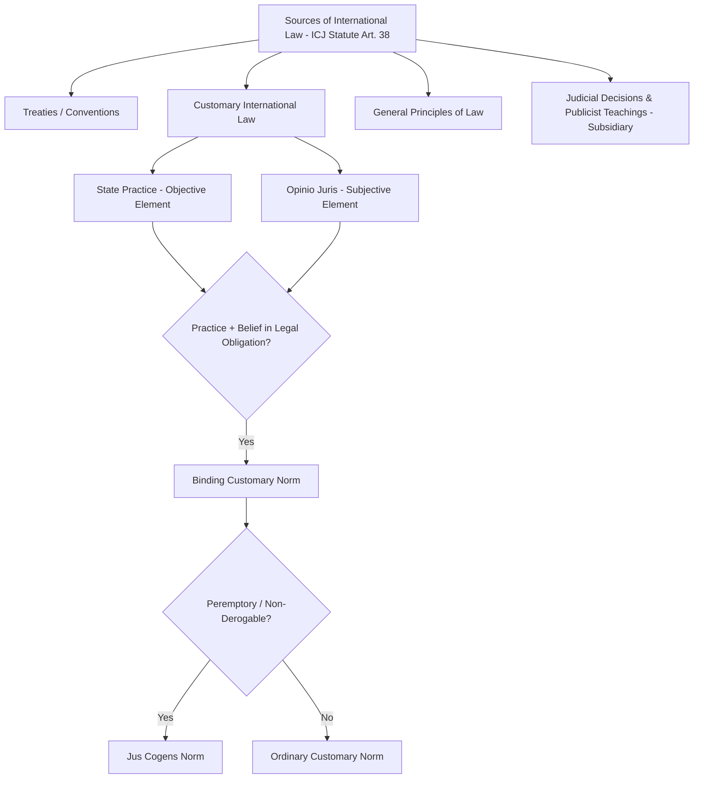

## Foundations and Sources of International Law

### Definition and Conceptual Scope

International law refers to the body of rules, norms, and principles governing relations among states and, increasingly, other international actors (international organizations, individuals, and non-state entities). Unlike domestic legal systems, international law operates without a central legislature, executive, or compulsory judiciary, raising foundational questions—long debated in political science and legal theory—about the basis of its authority, the mechanisms of its enforcement, and even whether it constitutes "law" in a meaningful sense (a skepticism associated with legal positivists like John Austin, who argued law requires a sovereign commander backing rules with coercive sanction).

Political science approaches to international law typically examine it through several complementary lenses:

- **Legal positivist/doctrinal approach**: focuses on identifying valid sources of law and their formal application, largely following the framework in the Statute of the International Court of Justice
- **Rationalist/institutionalist approach**: treats international law as one form of international institution that states create to reduce transaction costs, provide information, and enable credible commitment, analyzed through the same rationalist lens applied to international regimes and organizations generally
- **Constructivist approach**: examines how international law reflects and shapes evolving international norms, identities, and understandings of legitimate state behavior, independent of narrow material self-interest
- **Critical/TWAIL approaches**: Third World Approaches to International Law (TWAIL) scholarship examines how international law's historical development has been shaped by colonial power relations, and critiques persistent structural biases favoring established (historically colonial) powers

### Formal Sources of International Law

**Article 38 of the Statute of the International Court of Justice**

The most widely cited authoritative statement of international law's formal sources appears in Article 38(1) of the ICJ Statute, which the Court applies in deciding disputes:

1. **International conventions (treaties)**: whether general or particular, establishing rules expressly recognized by the contesting states
2. **International custom**: as evidence of a general practice accepted as law (customary international law)
3. **General principles of law**: recognized by civilized nations (a phrase reflecting the provision's 1920s drafting era, generally understood today to mean principles common across major legal systems)
4. **Judicial decisions and the teachings of highly qualified publicists**: as subsidiary means for determining rules of law, rather than as primary law-creating sources themselves

### Treaties (Conventional International Law)

Treaties are formal written agreements between states (or between states and international organizations) intended to create binding legal obligations. The **Vienna Convention on the Law of Treaties (VCLT, 1969)**—often termed a "treaty on treaties"—codifies the customary and conventional rules governing treaty formation, interpretation, and termination, including:

- **Pacta sunt servanda**: the foundational principle that treaties in force are binding on parties and must be performed in good faith
- **Consent-based obligation**: treaties bind only states that have consented to be bound (through signature and ratification, or accession), reflecting international law's fundamentally consensual character in contrast to domestic legislative processes binding all citizens regardless of individual consent
- **Reservations**: states may, subject to certain conditions and treaty-specific rules, exclude or modify the legal effect of specific treaty provisions in their own application, allowing broader participation in multilateral treaties at the cost of some uniformity
- **Rules of treaty interpretation**: emphasizing interpretation in good faith according to the ordinary meaning of treaty terms in their context and in light of the treaty's object and purpose (VCLT Article 31)
- **Grounds for treaty termination or withdrawal**: including material breach by another party, supervening impossibility of performance, and *rebus sic stantibus* (fundamental change of circumstances, applied narrowly and exceptionally)

### Customary International Law

Customary international law arises not from written agreement but from general and consistent state practice, followed because states believe it is legally obligatory to do so. Two cumulative elements are required, as consistently affirmed by the International Court of Justice:

1. **State practice (the objective element)**: consistent, general, and representative conduct by states, which may include diplomatic actions, domestic legislation, official statements, and military or administrative practice
2. **Opinio juris sive necessitatis (the subjective element)**: the psychological or normative element—states must engage in the practice out of a sense of legal obligation, not merely habit, courtesy, or convenience

**[Inference]** Precisely identifying when a body of state practice has crystallized into binding custom, and distinguishing legally obligatory practice from mere policy convenience or comity, remains a persistently contested question in both legal doctrine and political science analysis of international law formation, since opinio juris is an inherently difficult subjective element to verify empirically.

**Jus Cogens (Peremptory Norms)**

A distinct category of customary international law, jus cogens norms are considered so fundamental that no derogation is permitted, and any treaty conflicting with such a norm is void (VCLT Article 53). Widely recognized examples include prohibitions on genocide, slavery, torture, and aggressive war, though the precise scope and full list of jus cogens norms remains subject to ongoing legal and scholarly debate.

### General Principles and Subsidiary Sources

**General principles of law** serve a gap-filling function, allowing international tribunals to draw on principles common to major domestic legal systems (e.g., good faith, res judicata, estoppel, principles of due process) when treaty and customary law provide insufficient guidance for resolving a specific dispute.

**Subsidiary sources**—judicial decisions and scholarly writings—do not themselves create binding law but serve as persuasive evidence of what the law is. International law, unlike many domestic common law systems, does not operate under a strict doctrine of binding precedent (*stare decisis*); ICJ decisions bind only the parties to that specific case (ICJ Statute Article 59), though in practice, the Court's and other tribunals' prior reasoning carries substantial persuasive authority in subsequent cases.

### Political Science Theoretical Perspectives on Why States Comply

**Rationalist/Institutionalist Explanations**

Drawing on the same institutionalist logic applied to international regimes generally (Keohane's *After Hegemony*), states are theorized to comply with international law because it serves their long-run interests by reducing transaction costs, providing valuable information, enabling credible commitment, and supporting reputational capital useful for future cooperation—compliance reflects rational self-interest under conditions of anticipated repeated interaction, not moral obligation per se.

**Managerial Approach**

Abram and Antonia Chayes's influential "managerial" model argues that most instances of apparent non-compliance with international law reflect not deliberate defiance but capacity limitations, ambiguity in treaty language, or the time lag inherent in domestic implementation processes, suggesting that compliance is best promoted through cooperative capacity-building, transparency, and dispute resolution assistance rather than punitive enforcement.

**Transnational Legal Process**

Harold Koh's transnational legal process theory emphasizes how repeated interaction between domestic and international legal and political actors—through litigation, advocacy, and institutional interaction—leads international norms to become progressively internalized into domestic legal and political systems, eventually shaping state behavior through internalized normative commitment rather than external enforcement.

**Constructivist Norm Socialization**

Constructivist scholars (Martha Finnemore, Kathryn Sikkink) examine how international legal norms diffuse and become internalized through processes of persuasion, social pressure, and identity formation, using frameworks such as the "norm life cycle" (norm emergence, cascade, and internalization) to explain why and how international legal norms gain compliance pull independent of direct material enforcement.

**Liberal/Domestic Politics Approaches**

Andrew Moravcsik's liberal international relations theory and related scholarship emphasize that international law's effectiveness is substantially mediated by domestic political institutions and processes—particularly domestic judicial enforceability and the mobilization of domestic constituencies who benefit from or advocate for compliance—rather than operating through international-level enforcement mechanisms alone.

### Enforcement and the Absence of Centralized Authority

Unlike domestic legal systems, international law lacks a centralized enforcement mechanism analogous to police power backed by a sovereign government. Enforcement instead relies on a combination of decentralized mechanisms:

- **Self-help and reciprocity**: states may respond to treaty violations through proportionate countermeasures, reflecting international law's continued reliance on a degree of decentralized, self-help enforcement
- **Reputational costs**: violation of international legal obligations can damage a state's reputation for reliability, potentially affecting its ability to secure future cooperation, favorable treaty terms, or investment
- **International adjudication**: bodies including the ICJ, International Criminal Court (ICC), and specialized tribunals (WTO Dispute Settlement Body, International Tribunal for the Law of the Sea) can issue binding rulings, though their jurisdiction typically depends on state consent and enforcement of judgments still substantially depends on state cooperation or, in limited cases, UN Security Council action
- **UN Security Council enforcement**: the Council's Chapter VII powers provide the closest analogue to centralized international legal enforcement, though constrained by the veto power of the five permanent members

### Contemporary Debates and Critiques

- **Legal positivist skepticism revisited**: contemporary debates continue to engage the foundational question (originally posed by Austin and revisited by later legal theorists including H.L.A. Hart) of whether decentralized, largely self-enforced international law constitutes "law" in the same meaningful sense as domestic legal systems, or a distinct category of normatively influential but not fully "legal" international relations.
- **Fragmentation of international law**: the proliferation of specialized international legal regimes (trade law, human rights law, investment law, environmental law) with their own institutions and dispute resolution mechanisms has generated scholarly concern regarding potential inconsistency and lack of hierarchical coherence across different bodies of international law—sometimes termed the "fragmentation" problem, examined extensively by the UN International Law Commission.
- **TWAIL critiques of universalism**: Third World Approaches to International Law scholarship critiques claims of international law's neutral universality, arguing that core doctrines historically developed to legitimize colonial expansion and continue to reflect and reproduce power asymmetries favoring historically dominant states.
- **Soft law proliferation**: growing use of non-binding instruments (declarations, guidelines, memoranda of understanding) that influence state behavior without formal binding legal status raises ongoing definitional and theoretical debate regarding the boundary between "law" and influential but non-binding international norms.

### Related Topics

- International Organizations and Global Governance
- UN Security Council Decision-Making
- International Courts and Dispute Settlement (ICJ, ICC)
- Human Rights Law and Enforcement Mechanisms
- Sovereignty and Statehood in International Law
- Regime Theory and International Cooperation
- Transitional Justice and International Criminal Law
- Law of the Sea and Territorial Disputes
- Third World Approaches to International Law (TWAIL)
- Treaty Formation and the Vienna Convention