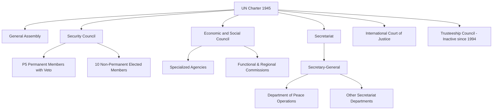

## The United Nations System

### Definition and Conceptual Scope

The United Nations system refers to the constellation of principal organs, specialized agencies, programs, and funds established under or affiliated with the United Nations Charter (signed 1945, entered into force October 24, 1945), constituting the most comprehensive and broadly universal international organization in the contemporary international system. Political science analysis of the UN system examines both its formal legal-institutional architecture and the political dynamics—power distribution, bureaucratic autonomy, member-state bargaining—that shape how the organization actually functions in practice, often diverging significantly from its formal Charter design.

The UN Charter establishes the organization's foundational purposes (Article 1), including maintaining international peace and security, developing friendly relations among nations based on respect for self-determination, achieving international cooperation on economic, social, and humanitarian problems, and serving as a center for harmonizing the actions of nations toward these common ends.

### The Six Principal Organs

The UN Charter establishes six principal organs, each with distinct composition, functions, and decision-making rules:

**General Assembly (GA)**

The UN's main deliberative body, comprising all 193 member states on a "one state, one vote" basis. The GA adopts resolutions (generally non-binding, except for certain internal/budgetary matters) by simple or two-thirds majority depending on the issue classification, and oversees the UN budget, elects non-permanent Security Council members, and appoints the Secretary-General upon Security Council recommendation.

**Security Council (SC)**

The organ with primary responsibility for international peace and security, comprising 15 members: five permanent members (P5: US, UK, France, Russia, China) holding veto power over substantive (non-procedural) resolutions, and ten non-permanent members elected by the General Assembly for two-year terms on a regional-rotation basis. Security Council resolutions adopted under Chapter VII are legally binding on all UN member states, distinguishing the Council from the GA's generally non-binding recommendatory authority.

**Secretariat**

The UN's administrative and executive arm, headed by the Secretary-General (appointed for renewable five-year terms), responsible for implementing programs and policies established by other UN organs, and providing the SG with an independent platform for diplomatic initiative, mediation, and moral suasion (sometimes termed the "bully pulpit" function of the office, exercised with varying degrees of activism across different Secretaries-General).

**Economic and Social Council (ECOSOC)**

Coordinates the UN's economic, social, and related work, including oversight of numerous specialized agencies, functional commissions, and regional commissions, though its practical influence is widely regarded in the scholarly literature as more limited than the Security Council's, given ECOSOC's more diffuse mandate and non-binding recommendatory authority.

**International Court of Justice (ICJ)**

The UN's principal judicial organ, seated in The Hague, adjudicating legal disputes between consenting states (contentious jurisdiction) and providing advisory opinions on legal questions referred by authorized UN organs and agencies (advisory jurisdiction). ICJ jurisdiction over contentious cases depends on state consent, expressed through specific case agreement, treaty-based jurisdiction clauses, or the "optional clause" (Statute Article 36(2)) by which states may accept compulsory jurisdiction in advance, subject to often significant reservations.

**Trusteeship Council**

Originally established to supervise the administration of trust territories transitioning toward self-government or independence, the Council formally suspended operations in 1994 following the independence of Palau, the last remaining UN trust territory, though it technically remains a Charter-established organ.

### Specialized Agencies, Funds, and Programs

Beyond the six principal organs, the broader UN system encompasses numerous specialized agencies (independent international organizations linked to the UN through cooperation agreements under Article 57 and 63 of the Charter), funds, and programs:

| Category | Examples | Function |
| --- | --- | --- |
| Specialized agencies | WHO, ILO, UNESCO, FAO, IMF, World Bank | Independent legal entities with own governance, budget, membership; coordinate with UN via ECOSOC agreements |
| Funds and programs | UNICEF, UNDP, UNHCR, WFP | Established by GA resolution, funded largely through voluntary contributions, operate under UN Secretariat authority |
| Related organizations | IAEA, WTO | Cooperate closely with the UN system but maintain independent legal and governance status |

**[Inference]** The degree of practical coordination and coherence across this sprawling institutional architecture is widely characterized in the political science and public administration literature as a persistent challenge, given the varied governance structures, funding mechanisms, and mandates across dozens of semi-autonomous entities.

### Security Council Decision-Making and the Veto

The P5 veto (formally, the requirement that Security Council resolutions on substantive matters require the concurring votes, or at minimum the non-objection/abstention, of all five permanent members) represents the Council's most politically consequential and analytically significant design feature. Political science scholarship examines the veto through several lenses:

- **Great-power management function**: the veto is frequently interpreted (following a realist institutionalist logic) as reflecting the UN's founders' judgment that great-power buy-in was a functional prerequisite for the organization's survival, learning from the League of Nations' collapse partly attributed to major-power absence or withdrawal.
- **Gridlock and Security Council paralysis**: the veto's practical effect of preventing binding Council action whenever a P5 member's core interests are implicated (or those of a closely aligned state) has generated extensive documentation of Council paralysis on major conflicts throughout the Cold War and in various contemporary cases, informing recurring reform debates.
- **"Uniting for Peace" mechanism**: adopted in 1950 partly in response to Soviet vetoes during the Korean War, this GA-initiated procedure allows the General Assembly to make recommendations (though not legally binding measures) on peace and security matters when Security Council deadlock prevents Council action, illustrating institutional adaptation to veto-driven gridlock, though its practical scope remains more limited than Chapter VII Council authority.

### UN Reform Debates

Security Council composition and veto reform have been subjects of sustained, though largely unrealized, political debate since at least the 1990s:

- **Expansion proposals**: various proposals have sought to expand permanent and/or non-permanent Council membership to better reflect contemporary geopolitical and economic realities, with different coalition groupings (e.g., the "G4" of Brazil, Germany, India, and Japan seeking permanent seats; the "Uniting for Consensus" group opposing new permanent seats in favor of expanded non-permanent membership; and the African Union's "Ezulwini Consensus" position) reflecting persistent, unresolved disagreement over reform's specific shape.
- **Veto restraint initiatives**: separate reform efforts (e.g., the France-Mexico initiative and the "Accountability, Coherence and Transparency" group's code of conduct) have sought voluntary P5 commitments to refrain from veto use in cases of mass atrocity, without altering the Charter's formal veto structure, reflecting the practical difficulty of achieving formal Charter amendment given the requirement of P5 unanimous ratification for Charter changes.

### Theoretical Perspectives on the UN's Role

**Realist Perspectives**

Realist scholarship generally views the UN as an arena reflecting, rather than transforming, underlying state power distributions—the Security Council's veto structure is interpreted as institutionalizing great-power primacy, and UN effectiveness is seen as fundamentally constrained by and contingent upon great-power interest alignment rather than independent institutional authority.

**Liberal Institutionalist Perspectives**

Institutionalist scholarship (following Keohane's regime theory logic) emphasizes the UN's functional value in reducing transaction costs, providing information, enabling issue linkage, and supporting iterated cooperation among member states, treating the organization as a genuinely consequential, if imperfect, mechanism for advancing collective interests that unilateral state action could not as efficiently achieve.

**Constructivist Perspectives**

Constructivist scholarship examines the UN's role in constructing and diffusing global norms (human rights, sovereignty, self-determination, sustainable development) and providing legitimation functions for state action—UN authorization is frequently treated by scholars and practitioners as conferring international legitimacy on state actions (particularly the use of force) independent of the UN's material enforcement capacity.

**Critical and Global South Perspectives**

Critical scholarship, including significant contributions from Global South and postcolonial perspectives, examines how UN institutional design and practice—despite formal sovereign equality principles—continues to reflect and reproduce historical power asymmetries, evident in Security Council permanent membership composition and broader North-South governance representation debates discussed under global inequality.

### The UN and International Peace and Security Operations

The UN system's peace and security functions—encompassing peacekeeping operations, peacebuilding architecture, sanctions regimes, and Secretary-General mediation initiatives—represent among the organization's most extensively studied and politically consequential activity areas, discussed in greater technical depth under dedicated peacekeeping, peacebuilding, and sanctions coverage elsewhere in this course.

### Financing the UN System

UN financing operates through several distinct funding streams:

- **Assessed contributions**: mandatory member-state payments to the regular UN budget and separately assessed peacekeeping budget, calculated according to a capacity-to-pay formula reflecting relative national income, with a cap (historically 22% for the regular budget) preventing any single member from exceeding a set proportional share regardless of actual capacity-to-pay calculations
- **Voluntary contributions**: many UN funds, programs, and specialized agencies (UNDP, UNICEF, UNHCR, WFP) rely substantially or entirely on voluntary member-state and private contributions rather than assessed dues, creating documented budgetary volatility and potential donor-influence dynamics distinct from assessed-contribution-funded bodies
- **Persistent arrears challenges**: chronic non-payment or delayed payment of assessed contributions by various member states (including, at various points, major contributors) has generated recurring UN liquidity crises and constrained organizational planning capacity

### Contemporary Debates and Critiques

- **Effectiveness amid great-power competition**: renewed great-power rivalry (particularly US-China and US/NATO-Russia tensions) has generated scholarly and policy concern regarding the UN system's capacity to fulfill core peace and security functions under conditions of Security Council gridlock more comparable to Cold War dynamics than the relatively more cooperative 1990s-2000s period.
- **Legitimacy and representativeness gaps**: persistent Security Council composition reform stalemate continues to generate questions regarding the organization's long-term legitimacy given significant divergence between 1945 geopolitical realities and the contemporary international system.
- **UN and non-state/civil society engagement**: growing (though still institutionally circumscribed) engagement with non-governmental organizations, private sector actors, and civil society raises ongoing debate regarding appropriate mechanisms for incorporating non-state voices into a fundamentally state-centric institutional architecture.
- **Secretary-General independence and selection process**: continued debate over the opacity of the traditionally closed-door Secretary-General selection process, and calls (with partial but incomplete reform implementation in recent selection cycles) for greater transparency and broader candidate consideration, including sustained advocacy for a female Secretary-General, a position never yet held by a woman.

### Related Topics

- Foundations and Sources of International Law
- Peacekeeping and Peace Operations
- Sanctions and Economic Statecraft
- International Courts and Dispute Settlement (ICJ, ICC)
- Global Inequality and North-South Relations (Security Council reform linkages)
- Regime Theory and International Cooperation
- Responsibility to Protect (R2P) Doctrine
- Post-Conflict Reconstruction and Peacebuilding
- Human Rights Law and Enforcement Mechanisms
- Sovereignty and Statehood in International Law