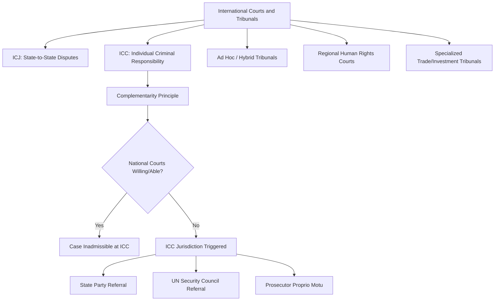

## International Courts and Tribunals

### Definition and Conceptual Scope

International courts and tribunals are permanent or ad hoc judicial or quasi-judicial bodies established to adjudicate disputes under international law, involving states, international organizations, individuals, or corporations depending on the specific tribunal's jurisdiction. Political science analysis of international adjudication examines not only the formal legal architecture of these bodies but the political conditions shaping their creation, jurisdiction, compliance with their rulings, and their broader effects on state behavior and international cooperation—treating courts as a distinctive and increasingly significant category of international institution alongside treaties and international organizations.

The proliferation of international courts and tribunals since the end of the Cold War—sometimes termed the "judicialization" of international relations—represents a significant institutional development, with the number of active international judicial bodies expanding substantially from the relatively limited landscape (dominated by the ICJ) of the earlier post-war period.

### The International Court of Justice (ICJ)

As the UN's principal judicial organ (discussed under the UN system), the ICJ adjudicates disputes between consenting states (contentious jurisdiction) and issues advisory opinions on legal questions referred by authorized UN organs (advisory jurisdiction). Key jurisdictional mechanisms include:

- **Special agreement (compromis)**: states jointly refer a specific dispute to the Court
- **Jurisdictional clauses in treaties**: many multilateral and bilateral treaties include clauses providing for ICJ jurisdiction over disputes concerning treaty interpretation or application
- **Optional clause declarations**: states may unilaterally declare acceptance of the Court's compulsory jurisdiction under Statute Article 36(2), though such declarations are frequently qualified by significant reservations, and a substantial minority of UN member states have made no such declaration at all

**[Inference]** The ICJ's practical influence on state behavior is understood in the literature to depend heavily on the perceived legitimacy of its rulings and states' calculations of reputational cost from non-compliance, since the Court itself possesses no independent enforcement mechanism (formal enforcement authority under UN Charter Article 94 rests with the Security Council, itself subject to the veto).

### International Criminal Court (ICC)

Established by the 1998 Rome Statute (entered into force 2002), the ICC represents the first permanent international criminal tribunal with jurisdiction over individuals (as opposed to states) for the most serious international crimes: genocide, crimes against humanity, war crimes, and the crime of aggression (jurisdiction over the latter activated only in 2018, following a specific amendment process).

**Jurisdictional Framework**

- **Complementarity principle**: the ICC's jurisdiction is explicitly complementary to, not a substitute for, national criminal jurisdiction—cases are admissible before the ICC only when national courts are unwilling or genuinely unable to prosecute, reflecting a deliberate design choice to respect state sovereignty while providing a backstop against impunity.
- **Triggering mechanisms**: ICC investigations can be initiated through state party referral, UN Security Council referral (allowing jurisdiction even over non-party states, as occurred regarding Sudan and Libya), or the Prosecutor's own initiative (*proprio motu*) with judicial authorization.
- **Non-universal membership**: significant major powers—including the United States, China, Russia, and India—are not parties to the Rome Statute, substantially constraining the Court's practical jurisdictional reach and generating persistent debate regarding the Court's claim to represent genuinely universal international criminal justice.

**Political Controversies**

The ICC has faced sustained political contestation, particularly regarding perceived disproportionate focus on African situations in its earlier case docket (prompting formal African Union engagement with, and periodic threats of coordinated withdrawal from, the Court, though only a small number of African states have actually withdrawn), and separately regarding jurisdictional assertions over nationals of non-party states (including US and Israeli officials), which has generated significant diplomatic friction and, in some cases, formal non-cooperation or sanctions responses from affected non-party states.

### Ad Hoc and Hybrid International Criminal Tribunals

Prior to and alongside the ICC's establishment, the international community created several ad hoc and hybrid tribunals to address specific conflict situations:

- **International Criminal Tribunal for the former Yugoslavia (ICTY, 1993–2017)**: established by UN Security Council Chapter VII resolution to prosecute crimes committed during the Yugoslav wars, notably securing convictions of senior political and military leaders and developing significant jurisprudence on genocide, command responsibility, and sexual violence as a war crime.
- **International Criminal Tribunal for Rwanda (ICTR, 1994–2015)**: similarly established to prosecute the 1994 Rwandan genocide, notably issuing the first-ever international conviction for genocide and establishing significant jurisprudence recognizing rape as an instrument of genocide.
- **Hybrid/internationalized tribunals**: combining international and domestic legal elements and personnel, including the Special Court for Sierra Leone, the Extraordinary Chambers in the Courts of Cambodia (addressing Khmer Rouge-era atrocities), and the Special Tribunal for Lebanon, reflecting an institutional design intended to enhance local legitimacy and capacity-building relative to purely international tribunals.

### Regional Human Rights Courts

Distinct regional judicial architectures have developed to adjudicate human rights claims, reflecting varying degrees of institutional strength and compliance:

| Court | Region | Notable Features |
| --- | --- | --- |
| European Court of Human Rights (ECtHR) | Council of Europe | Individual petition right; widely regarded as the most institutionally developed and compliance-effective regional human rights court |
| Inter-American Court of Human Rights | Organization of American States | Significant jurisprudence on forced disappearance, transitional justice; compliance varies substantially across member states |
| African Court on Human and Peoples' Rights | African Union | More limited jurisdiction (fewer states have accepted individual petition access); comparatively newer and less institutionally developed |

**[Inference]** Comparative compliance research generally finds the ECtHR to have achieved the highest degree of state compliance with its judgments among regional human rights courts, though scholars attribute this variously to the Council of Europe's relatively higher regional homogeneity in democratic governance, stronger domestic judicial incorporation mechanisms, and the political salience of Council of Europe/EU membership conditionality.

### Specialized Trade, Investment, and Law of the Sea Tribunals

- **WTO Dispute Settlement Body (DSB)**: adjudicates trade disputes between WTO members through a panel and Appellate Body process, historically regarded as one of the most institutionally developed and frequently used forms of international adjudication, though the Appellate Body has faced significant operational disruption in recent years due to unfilled member vacancies stemming from unresolved member disagreements over its functioning.
- **Investor-State Dispute Settlement (ISDS) tribunals**: ad hoc arbitral tribunals (frequently convened under ICSID—the International Centre for Settlement of Investment Disputes—or UNCITRAL rules) adjudicating disputes between foreign investors and host states under bilateral investment treaties, discussed in greater detail under multinational corporations and global production, given the significant political economy controversies surrounding this mechanism.
- **International Tribunal for the Law of the Sea (ITLOS)**: adjudicates disputes arising under the UN Convention on the Law of the Sea (UNCLOS), including notable rulings on maritime boundary delimitation and, in arbitral proceedings under UNCLOS Annex VII, high-profile disputes such as the 2016 South China Sea arbitration between the Philippines and China.

### Theoretical Perspectives on Compliance with International Judicial Rulings

**Rationalist/Reputational Approaches**

States are theorized to comply with international judicial rulings substantially because non-compliance risks reputational costs affecting future cooperation prospects, consistent with broader rationalist compliance theory applied to international law generally.

**Domestic Political Institution-Mediated Compliance**

Comparative research (drawing on liberal international relations theory) finds that domestic judicial incorporation of international rulings—whether international tribunal decisions can be directly invoked and enforced in domestic courts—significantly affects practical compliance rates, since compliance mediated through domestic legal-political mechanisms tends to be more durable than compliance dependent solely on international-level reputational pressure.

**Legitimacy and Backlash Dynamics**

More recent scholarship examines instances of state "backlash" against international courts—including withdrawal threats, non-cooperation, and domestic political mobilization against perceived judicial overreach—as a distinct phenomenon requiring explanation beyond simple compliance/non-compliance binaries, often linked to domestic political mobilization against perceived infringements on national sovereignty or majoritarian democratic decision-making.

### Contemporary Debates and Critiques

- **Judicialization and democratic legitimacy**: the expanding scope and authority of international courts, particularly regarding sensitive sovereignty-related questions, has generated sustained debate regarding the democratic legitimacy of judicial bodies whose members are not directly accountable to domestic electorates, paralleling similar debates regarding international organization "democratic deficits" discussed under globalization.
- **Fragmentation across specialized tribunals**: the proliferation of specialized courts and tribunals (trade, investment, human rights, criminal, law of the sea) operating with distinct jurisdictions and, at times, divergent legal interpretations, raises ongoing concern regarding coherence across the broader international legal system, connecting to the "fragmentation" debate discussed under foundations of international law.
- **Great-power resistance and selective engagement**: the pattern of major powers accepting some forms of international adjudication (e.g., WTO dispute settlement) while resisting others (e.g., ICC jurisdiction, compulsory ICJ jurisdiction) generates ongoing scholarly interest in explaining this variation, with explanations focusing on differential sovereignty costs, domestic political sensitivity, and the relative material stakes involved across different adjudicatory domains.
- **International criminal justice and peace-versus-justice debates**: ongoing debate examines whether pursuing international criminal accountability during active conflicts (through ICC investigations or indictments of sitting leaders) can complicate peace negotiations by reducing incentives for targeted leaders to accept negotiated exits, generating a documented but contested "peace versus justice" tension in transitional justice and conflict resolution scholarship.

### Related Topics

- Foundations and Sources of International Law
- The United Nations System
- Transitional Justice and Reconciliation Mechanisms
- Human Rights Law and Enforcement Mechanisms
- Multinational Corporations and Global Production (ISDS linkages)
- Theories of International Trade Politics (WTO dispute settlement)
- Sovereignty and Statehood in International Law
- Genocide and Mass Atrocity Prevention
- Regional Organizations and Governance (EU, AU, OAS)
- Law of the Sea and Territorial Disputes