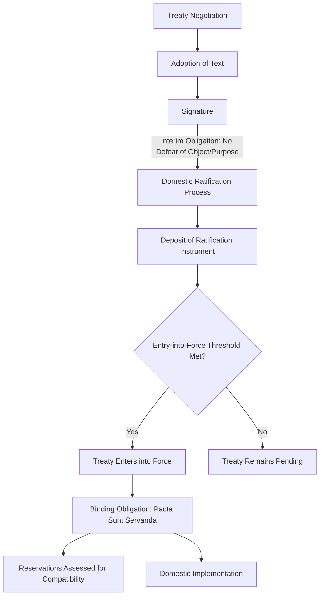

## Treaty Law and State Obligations

### Definition and Conceptual Scope

Treaty law governs the creation, interpretation, operation, and termination of treaties—formal written agreements between states, or between states and international organizations, intended to create binding obligations under international law. As the primary source of conventional (as opposed to customary) international law, treaty law occupies a central position in the international legal system, codified comprehensively in the **Vienna Convention on the Law of Treaties (VCLT, 1969)**, which itself is widely regarded as substantially reflecting pre-existing customary international law even for states not formally party to it (including, notably, the United States, which has signed but not ratified the VCLT yet generally treats most of its provisions as customary law).

Political science analysis of treaty law examines not only the formal doctrinal rules but the political conditions shaping treaty formation, ratification, compliance, and the strategic use of treaty design features (reservations, escape clauses, institutional oversight mechanisms) to manage the underlying commitment problems inherent in international cooperation.

### Treaty Formation and the Life Cycle of Treaty Obligation

**Negotiation and Adoption**

Treaty text is typically negotiated through diplomatic conferences or ongoing institutional processes, with the text formally adopted once negotiating parties reach consensus or an agreed voting threshold (for multilateral treaties negotiated within international organizations).

**Signature**

Signature typically signals a state's provisional endorsement of the treaty text and, under VCLT Article 18, creates an interim obligation not to defeat the treaty's object and purpose pending ratification—but signature alone generally does not create the full substantive obligations the treaty establishes, which typically require the subsequent step of ratification.

**Ratification, Accession, and Entry into Force**

Ratification is the formal act (governed by each state's domestic constitutional procedures) by which a state definitively consents to be bound by a treaty it has signed; accession is the equivalent act for a state joining a treaty it did not originally negotiate or sign. Multilateral treaties typically specify a minimum number of ratifications required for entry into force, reflecting negotiators' judgment about the threshold of participation needed for the treaty regime to be meaningful.

**Reservations**

Under VCLT Article 19-23, states may formulate reservations—unilateral statements purporting to exclude or modify the legal effect of specific treaty provisions in their application to that state—subject to certain limits: reservations incompatible with a treaty's object and purpose are impermissible, and other parties may object to a reservation, with legal effects varying depending on whether the reservation is accepted, objected to, or the treaty itself limits or prohibits reservations. **[Inference]** The reservations regime is widely understood in the political science literature as reflecting a deliberate design trade-off between promoting broad multilateral treaty participation (by allowing states some flexibility to opt out of specific obligations) and preserving substantive treaty uniformity and integrity, with different treaty regimes striking this balance differently based on their subject matter and negotiating context.

### Core Interpretive Principles

**Pacta Sunt Servanda**

The foundational principle of treaty law (VCLT Article 26): every treaty in force is binding upon the parties and must be performed by them in good faith. This principle underlies the entire edifice of treaty-based international cooperation, reflecting international law's reliance on voluntary compliance in the absence of centralized coercive enforcement.

**Rules of Interpretation**

VCLT Article 31 establishes the general rule of treaty interpretation: a treaty shall be interpreted in good faith in accordance with the ordinary meaning to be given to its terms in their context and in light of its object and purpose. Supplementary means of interpretation (including the treaty's negotiating history, or *travaux préparatoires*) may be used under Article 32 to confirm the meaning resulting from Article 31's application, or to determine meaning when the primary interpretive approach leaves the meaning ambiguous, obscure, or leads to a manifestly absurd or unreasonable result.

**Pacta Tertiis Nec Nocent Nec Prosunt**

A treaty does not create obligations or rights for third states without their consent (VCLT Articles 34-38), reflecting international law's fundamentally consensual character and the principle that sovereign states cannot be bound by agreements to which they are not party, subject to limited exceptions (such as provisions codifying pre-existing customary law, which would bind third states independent of the treaty itself).

### Grounds for Treaty Invalidity, Suspension, and Termination

The VCLT specifies limited, exhaustive grounds under which treaty obligations may be challenged or ended:

| Ground | Description |
| --- | --- |
| Error, fraud, corruption, coercion | Vitiates consent to be bound; treaty may be invalidated |
| Conflict with jus cogens (peremptory norm) | Treaty is void if it conflicts with a peremptory norm at the time of conclusion (or becomes void if a new peremptory norm later emerges) |
| Material breach | A serious violation by one party may entitle other parties to suspend or terminate the treaty (or the breaching state's own rights under it) |
| Supervening impossibility of performance | Permanent disappearance or destruction of an object indispensable for treaty execution |
| Fundamental change of circumstances (*rebus sic stantibus*) | Applied narrowly and exceptionally; requires that the changed circumstances were an essential basis of consent and radically transform the extent of obligations still to be performed |
| Denunciation/withdrawal per treaty terms | Many treaties include explicit provisions permitting withdrawal under specified conditions and notice periods |

**[Inference]** Because these grounds are narrowly and restrictively interpreted in international jurisprudence (reflecting the VCLT's overall design preference for treaty stability over easy exit), successful invocation of grounds like *rebus sic stantibus* remains rare in practice, with the International Court of Justice historically applying the doctrine cautiously.

### Political Science Perspectives on Treaty Design

**Rational Design Approach**

The influential "rational design" research program (associated with Barbara Koremenos, Charles Lipson, and Duncan Snidal) analyzes international institutions, including treaties, as deliberately designed by states to solve specific cooperation problems, examining variation in design features including:

- **Membership rules**: restrictive versus open membership, affecting the trade-off between depth of cooperation and breadth of participation
- **Scope**: the range of issues covered by a single treaty versus issue-specific agreements
- **Centralization**: the degree to which treaties establish centralized administrative or monitoring institutions
- **Control mechanisms**: voting rules and decision procedures governing treaty amendment or interpretation
- **Flexibility provisions**: escape clauses, renegotiation provisions, and reservations that allow states to manage uncertainty about future compliance costs without abandoning the treaty altogether

**Commitment Problems and Credible Commitment**

Treaties are frequently theorized as mechanisms states use to solve credible commitment problems, functioning to "lock in" policy commitments (particularly valuable when a government wants to bind not only other states but also its own future domestic political successors) or to provide reassurance to other states or domestic/international investors regarding policy durability, at the cost of reduced future domestic policy flexibility.

**Domestic Ratification Politics**

Robert Putnam's influential "two-level games" framework analyzes international negotiation as simultaneously occurring at the international bargaining table (Level I) and within domestic ratification politics (Level II), with a negotiator's "win-set" (the range of agreements that would be ratifiable domestically) constraining what can be credibly negotiated internationally—a framework extensively applied to explain treaty ratification failures and negotiating dynamics across trade, arms control, and environmental treaty contexts.

### State Responsibility for Treaty Breach

Separate from the VCLT's treaty-specific rules, the broader law of state responsibility (substantially codified, though not through a binding treaty, in the International Law Commission's 2001 Articles on Responsibility of States for Internationally Wrongful Acts) governs the legal consequences when a state breaches an international obligation, including treaty obligations. Core elements include:

- **Attribution**: establishing that the wrongful conduct is attributable to the state (through its organs, officials, or, under certain conditions, private actors exercising governmental authority or acting under state instruction/control)
- **Breach**: the conduct must constitute a failure to conform with the obligation, regardless of the obligation's origin (treaty, custom, or general principle)
- **Countermeasures**: an injured state may, subject to specific procedural and proportionality limitations, take otherwise unlawful measures against the responsible state to induce compliance with reparation obligations, reflecting international law's continued reliance on decentralized, self-help enforcement mechanisms
- **Reparation obligations**: the responsible state bears an obligation to make full reparation for injury caused, encompassing restitution, compensation, and/or satisfaction depending on the nature of the harm

### Specialized Treaty Regimes and Distinctive Compliance Architectures

Different issue areas have developed specialized treaty compliance mechanisms reflecting their distinctive cooperation problems:

- **Arms control treaties**: often incorporate specialized verification mechanisms (on-site inspections, satellite monitoring provisions) given the acute credible-commitment challenges inherent in security-related cooperation, where cheating carries potentially severe strategic consequences
- **Environmental treaties**: frequently employ flexible, iterative "framework convention-protocol" structures (e.g., the UN Framework Convention on Climate Change followed by the Kyoto Protocol and Paris Agreement) allowing initial broad-participation framework agreement followed by more detailed, and potentially more contested, subsequent protocols
- **Human rights treaties**: often rely on reporting and reviewthe mechanisms (periodic state reporting to treaty monitoring bodies) rather than binding dispute settlement, reflecting the distinctive challenge that human rights treaty violations typically occur within a state's own territory against its own nationals, limiting traditional reciprocity-based enforcement incentives available in other treaty domains

### Contemporary Debates and Critiques

- **Treaty withdrawal and exit dynamics**: several high-profile treaty withdrawals and threatened withdrawals in recent years (across arms control, trade, and environmental treaty contexts) have renewed political science and legal scholarship attention to withdrawal clause design and the political conditions under which states exercise formal exit options.
- **Living instrument interpretation debates**: ongoing jurisprudential debate, particularly prominent in human rights treaty interpretation (e.g., the European Court of Human Rights' "living instrument" doctrine), regarding whether treaties should be interpreted according to contemporary evolving standards or the original understanding of drafting-era states parties, paralleling broader originalist/evolutionary interpretive debates familiar from domestic constitutional law.
- **Informal and non-binding alternatives to treaties**: growing use of non-binding instruments (political commitments, memoranda of understanding, "soft law" declarations) as an alternative or complement to formal treaty-making, reflecting documented state preferences in certain contexts for greater flexibility and lower domestic ratification hurdles at the cost of reduced binding legal force.
- **Treaty congestion and interpretive coherence**: the sheer proliferation of overlapping treaty regimes across trade, environmental, human rights, and investment law raises ongoing scholarly concern regarding interpretive coherence and potential conflicts between treaty obligations, connecting to the broader "fragmentation of international law" debate.

### Related Topics

- Foundations and Sources of International Law
- The United Nations System
- International Courts and Tribunals
- Theories of International Trade Politics (trade treaty design)
- International Monetary and Financial Systems (Bretton Woods treaty architecture)
- Arms Control and Non-Proliferation Regimes
- Environmental Treaties and Climate Governance
- Human Rights Law and Enforcement Mechanisms
- State Responsibility and International Wrongful Acts
- Two-Level Games and Domestic Ratification Politics