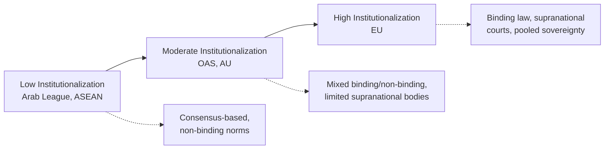

## Regional International Organizations

### Definition and Scope

Regional international organizations (RIOs) are intergovernmental institutions formed by states within a geographically or politically defined region to pursue shared objectives—economic integration, security cooperation, political coordination, or normative harmonization—that fall short of global universality but exceed bilateral arrangements. They are a subset of international organizations (IOs) distinguished by a bounded, typically contiguous membership rather than open-ended global membership (contrast with the United Nations or World Trade Organization).

RIOs are studied in political science and international law as instruments of:

- **Regional integration** — pooling sovereignty in specified domains (trade, currency, mobility)
- **Regional security governance** — collective defense, conflict prevention, peacekeeping
- **Norm diffusion and socialization** — spreading democratic, human rights, or trade norms among neighboring states
- **Institutional balancing** — providing smaller or middle powers collective leverage vis-à-vis great powers or global institutions

### Theoretical Foundations

**Key Points**

- **Neofunctionalism** (Ernst Haas, 1950s) posits that integration in one functional area (e.g., coal and steel) generates "spillover" pressures toward integration in adjacent areas, driving expansion of regional institutions over time — the foundational theory behind the European Coal and Steel Community's evolution into the European Union.
- **Intergovernmentalism** (Stanley Hoffmann; later Liberal Intergovernmentalism, Andrew Moravcsik) counters that integration reflects deliberate bargains among sovereign states pursuing national interests, with states retaining ultimate control over the pace and scope of pooling sovereignty.
- **New Regionalism** approaches (1990s onward) broaden analysis beyond Europe-centric models to account for regionalism in the Global South, emphasizing informal, state-led, and often security- or development-driven regional projects distinct from the EU's legal-supranational template.
- **Rational Institutionalism** treats RIOs as functional responses to collective action problems (coordination, information asymmetry, credible commitment) among regional states.
- [Inference] Much of the theoretical literature was developed with the European Union as an implicit benchmark, which has been criticized for producing a "EU-centric bias" that undervalues distinct institutional logics found in African, Asian, and Latin American regionalism.

### Typology of Regional International Organizations

| Type | Primary Function | Representative Examples |
| --- | --- | --- |
| Economic/Trade Integration | Tariff reduction, common markets, monetary union | European Union (EU), Mercosur, ASEAN Economic Community |
| Security/Defense | Collective defense, conflict management | NATO, African Union (AU) Peace and Security Architecture, Collective Security Treaty Organization (CSTO) |
| Political/Diplomatic Coordination | Norm-setting, dispute mediation, political dialogue | Organization of American States (OAS), African Union, Arab League |
| Development/Functional Cooperation | Infrastructure, development finance, sector-specific coordination | Association of Southeast Asian Nations (ASEAN), Southern African Development Community (SADC) |
| Hybrid/Comprehensive | Combines economic, political, and security mandates | European Union, African Union |

### Case Studies of Major Regional Organizations

**European Union (EU)**

- Origin: Founded through the Treaty of Rome (1957) building on the European Coal and Steel Community (1951); transformed into the EU by the Maastricht Treaty (1993).
- Institutional structure: Supranational bodies (European Commission, European Parliament, Court of Justice of the EU) combined with intergovernmental bodies (European Council, Council of the European Union), representing the most legally developed pooling of sovereignty among RIOs.
- Distinctive features: Direct effect and supremacy of EU law over national law in covered domains; a common currency (the euro) among a subset of members (the Eurozone); freedom of movement for goods, services, capital, and persons within the Single Market.
- [Inference] The EU is frequently treated as the theoretical and institutional benchmark against which other RIOs are compared, though scholars increasingly caution against treating it as a normative template that other regions should be expected to replicate.

**African Union (AU)**

- Origin: Established in 2002, succeeding the Organization of African Unity (OAU, founded 1963).
- Mandate: Broader than its predecessor, explicitly including provisions for intervention in member states in cases of grave circumstances (war crimes, genocide, crimes against humanity) under Article 4(h) of its Constitutive Act — a notable departure from the OAU's strict non-interference norm.
- Institutional architecture: African Union Commission, Pan-African Parliament, Peace and Security Council, and the African Continental Free Trade Area (AfCFTA), which entered into force in 2019 as a major economic integration initiative.

**Association of Southeast Asian Nations (ASEAN)**

- Origin: Founded in 1967 by Indonesia, Malaysia, the Philippines, Singapore, and Thailand.
- Institutional style: Characterized by the "ASEAN Way" — consensus-based decision-making, non-interference in domestic affairs, and avoidance of binding supranational authority, contrasting sharply with the EU's legal-institutional model.
- Pillars: ASEAN Political-Security Community, ASEAN Economic Community, and ASEAN Socio-Cultural Community, formalized under the ASEAN Charter (2008).

**Organization of American States (OAS)**

- Origin: Established in 1948 via the Charter of Bogotá, with roots tracing to the Pan-American Union (1890).
- Mandate: Promotes democracy, human rights (via the Inter-American Commission and Court of Human Rights), security, and development among Western Hemisphere states.
- [Unverified: specific current membership status of individual states, such as Cuba's suspension history or Venezuela's withdrawal, should be checked against current OAS records, as membership disputes have shifted over time.]

**North Atlantic Treaty Organization (NATO)**

- Origin: Founded in 1949 as a collective defense alliance under Article 5 of the Washington Treaty (an armed attack against one member is treated as an attack against all).
- Function: Primarily a security/military alliance rather than an economic or political integration project, though it has expanded into crisis management and partnership programs.
- [Inference] NATO is sometimes classified separately from "regional organizations" in strict typologies because its core function is collective military defense rather than regional governance, though it is commonly included in comparative regionalism literature given its regionally bounded membership.

### Institutional Design Variables

**Key Points**

- **Degree of supranationalism**: The extent to which the organization can bind member states through majority voting or independent judicial/administrative bodies, ranging from low (ASEAN, Arab League) to high (EU).
- **Legalization**: The degree to which commitments are precise, binding, and subject to third-party (judicial) interpretation — a framework developed by Abbott, Keohane, Moravcsik, Slaughter, and Snidal (2000) to compare institutional design across IOs generally, applicable to RIOs.
- **Membership scope and depth**: Whether membership is open to a broad regional bloc or restricted by strict accession criteria (e.g., the EU's Copenhagen Criteria requiring democratic governance, rule of law, and market economy standards for candidate states).
- **Dispute settlement mechanisms**: Presence or absence of standing courts or tribunals (e.g., the Court of Justice of the EU, the defunct SADC Tribunal, the East African Court of Justice) shapes the enforceability of regional commitments.

### Diagram: Institutional Design Spectrum

### Regional Organizations and International Law

- RIOs derive legal personality from their founding treaties, enabling them to enter agreements, maintain missions, and in some cases (notably the EU) create law directly binding on member states' domestic legal systems.
- Article 52 of the UN Charter explicitly recognizes regional arrangements for maintaining international peace and security, provided their activities are consistent with UN Purposes and Principles — the legal basis for organizations like the AU and OAS to authorize regional peace operations.
- Regional human rights systems (European Court of Human Rights under the Council of Europe, Inter-American Court of Human Rights under the OAS, African Court on Human and Peoples' Rights under the AU) constitute a distinct sub-field, providing enforcement mechanisms often more accessible to individuals than global human rights bodies.
- [Inference] The relationship between regional and universal international law remains a live debate, particularly around whether proliferating regional courts risk "fragmenting" international law through inconsistent interpretations of shared principles (a concern raised in International Law Commission studies on fragmentation).

### Regionalism and Global Governance: Interaction Effects

**Example**

The AfCFTA (African Continental Free Trade Area) illustrates the interplay between regional and global economic governance: it operates within World Trade Organization (WTO) rules on regional trade agreements (GATT Article XXIV), requiring notification and consistency with multilateral trade law while pursuing continent-specific integration goals such as reducing intra-African tariffs and non-tariff barriers.

**Conclusion**

Regional organizations are neither substitutes for nor mere subordinates of global institutions; they function as an intermediate layer of governance that can implement, complement, contest, or exceed global norms, depending on regional political will and institutional capacity.

### Illustration: Layers of Regional Governance (svg_diagram)

<svg xmlns="http://www.w3.org/2000/svg" viewBox="0 0 760 420" font-family="Helvetica, Arial, sans-serif">
<text x="380" y="30" font-size="20" font-weight="bold" text-anchor="middle" fill="#1a1a2e">Layers of Regional Governance (svg_diagram)</text>
<rect x="230" y="60" width="300" height="60" rx="10" fill="#3d5a80" />
<text x="380" y="95" font-size="14" font-weight="bold" text-anchor="middle" fill="white">Global Institutions (UN, WTO)</text>
<line x1="380" y1="120" x2="380" y2="150" stroke="#555" stroke-width="2" />
<rect x="230" y="150" width="300" height="60" rx="10" fill="#4a6fa5" />
<text x="380" y="185" font-size="14" font-weight="bold" text-anchor="middle" fill="white">Regional Organizations</text>
<line x1="330" y1="210" x2="200" y2="250" stroke="#555" stroke-width="1.5" />
<line x1="430" y1="210" x2="560" y2="250" stroke="#555" stroke-width="1.5" />
<line x1="380" y1="210" x2="380" y2="250" stroke="#555" stroke-width="1.5" />
<rect x="60" y="250" width="200" height="70" rx="10" fill="#81b29a" />
<text x="160" y="280" font-size="12" font-weight="bold" text-anchor="middle" fill="white">Economic Integration</text>
<text x="160" y="298" font-size="10" text-anchor="middle" fill="white">EU, Mercosur, AfCFTA</text>
<rect x="280" y="250" width="200" height="70" rx="10" fill="#e07a5f" />
<text x="380" y="280" font-size="12" font-weight="bold" text-anchor="middle" fill="white">Security Cooperation</text>
<text x="380" y="298" font-size="10" text-anchor="middle" fill="white">NATO, CSTO, AU PSC</text>
<rect x="500" y="250" width="200" height="70" rx="10" fill="#f2cc8f" />
<text x="600" y="280" font-size="12" font-weight="bold" text-anchor="middle" fill="#1a1a2e">Political Coordination</text>
<text x="600" y="298" font-size="10" text-anchor="middle" fill="#1a1a2e">OAS, ASEAN, Arab League</text>
<line x1="160" y1="320" x2="160" y2="360" stroke="#555" stroke-width="1.5" />
<line x1="380" y1="320" x2="380" y2="360" stroke="#555" stroke-width="1.5" />
<line x1="600" y1="320" x2="600" y2="360" stroke="#555" stroke-width="1.5" />
<rect x="60" y="360" width="640" height="45" rx="8" fill="#9d8189" />
<text x="380" y="388" font-size="12" font-weight="bold" text-anchor="middle" fill="white">Member States (source of pooled/delegated sovereignty)</text>
</svg>

### Comparative Analytical Framework for Assessment

When analyzing any regional organization for coursework or research, a standard comparative rubric includes:

1. **Founding treaty and legal basis** — date, founding instrument, amendments
2. **Membership criteria and current composition** — accession conditions, suspension/expulsion mechanisms
3. **Institutional architecture** — executive, legislative, judicial organs and their respective powers
4. **Decision-making rules** — consensus vs. qualified majority vs. weighted voting
5. **Scope of mandate** — economic, security, political, human rights, or hybrid
6. **Enforcement and compliance mechanisms** — sanctions, judicial rulings, peer review
7. **Relationship to global institutions** — complementary, competitive, or subordinate

### Common Pitfalls and Debates

**Key Points**

- Assuming all RIOs aspire toward EU-style supranationalism ("teleological" bias), when many regions deliberately favor sovereignty-preserving, consensus-based models as a design choice rather than an immature stage of development.
- Conflating "regional organization" with "regional integration," when many RIOs (e.g., security alliances, political coordination bodies) do not pursue economic integration at all.
- Overlooking overlapping and competing regional memberships — many states belong to multiple, sometimes overlapping RIOs (e.g., African states frequently hold simultaneous membership in the AU and multiple sub-regional economic communities such as ECOWAS, SADC, or EAC), a phenomenon termed "spaghetti bowl" regionalism in trade contexts.
- [Speculation] The long-term trajectory of regionalism amid rising great-power competition and contested multilateralism is unsettled in the literature; whether regional organizations will increasingly substitute for weakened global institutions or remain complementary to them is an open empirical question.

### Related Topics

- Neofunctionalism versus intergovernmentalism in integration theory
- The European Union's institutional architecture and supranational law
- African Union peace and security architecture and Article 4(h) intervention norms
- Regional human rights courts: European, Inter-American, and African systems
- ASEAN's non-interference norm and consensus-based decision-making
- Legalization and institutional design in international organizations (Abbott et al. framework)
- Overlapping regionalism and institutional competition in Africa and Latin America
- Regional trade agreements and their relationship to WTO law (GATT Article XXIV)
- Regional organizations' role in peacekeeping under UN Charter Article 52
- Comparative regionalism in the Global South versus Euro-centric integration theory