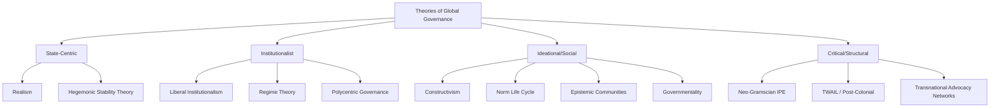

## Theories of Global Governance

### Definition and Conceptual Foundations

Global governance refers to the collective, often decentralized, processes and institutions through which state and non-state actors coordinate responses to transnational problems in the absence of a world government. James Rosenau, one of the concept's foundational theorists, described global governance as encompassing "systems of rule at all levels of human activity" in which control is exercised through mechanisms other than formal hierarchical authority. Theories of global governance seek to explain who governs, through what mechanisms, with what legitimacy, and to what effect, given the absence of a centralized global sovereign.

**Key Points**

- Global governance is distinguished from "government" by the absence of a single locus of coercive authority; it instead relies on a plurality of overlapping authorities, norms, and institutions.
- The field draws on international relations theory, international law, public administration, and political theory, making it inherently interdisciplinary.
- Analytically, global governance theories can be grouped by their underlying assumptions about actors (state-centric vs. pluralist), mechanisms (formal institutions vs. informal networks), and normative orientation (efficiency-focused vs. justice-focused).

### Realist and State-Centric Approaches

Realist approaches to global governance treat international institutions as instruments of state power rather than autonomous actors. Institutions persist because they serve the interests of powerful states, particularly hegemonic powers that bear disproportionate costs of institutional maintenance.

**Key Points**

- Hegemonic Stability Theory (associated with scholars including Charles Kindleberger and later Robert Gilpin) holds that stable global order and effective governance of collective goods (e.g., an open trading system) require a dominant power willing and able to bear the costs of provision.
- Structural realists (e.g., Kenneth Waltz, John Mearsheimer) are generally skeptical that international institutions have significant independent causal effect on state behavior, viewing them instead as epiphenomenal to the underlying distribution of power.
- Realist accounts explain the persistence of Security Council veto power and weighted voting in institutions like the International Monetary Fund (IMF) as reflections of underlying power asymmetries embedded into formal governance structures.

### Liberal Institutionalism

Liberal institutionalism (or neoliberal institutionalism), associated with scholars such as Robert Keohane and Joseph Nye, argues that international institutions matter independently of power distributions because they reduce transaction costs, provide information, create issue linkages, and enable iterated cooperation that would otherwise be undermined by collective action problems.

**Key Points**

- Institutions reduce uncertainty by monitoring compliance, providing focal points, and creating reputational costs for defection, which allows states to escape prisoner's dilemma-like traps in repeated interactions.
- Keohane's concept of "regimes" (drawing on the definition by Stephen Krasner: "implicit or explicit principles, norms, rules, and decision-making procedures around which actors' expectations converge") became central to explaining sector-specific governance (trade, monetary relations, environment).
- Complex interdependence theory (Keohane and Nye) posits that as states become interconnected through multiple channels (not just military-security relations), governance shifts toward multi-issue, multi-actor bargaining rather than pure power politics.
- Functionalist logic (drawing on earlier work by David Mitrany) underlies much liberal institutionalist thought: governance emerges incrementally as technical cooperation in low-politics areas (postal services, health, aviation standards) spills over into deeper integration.

### Constructivism and Global Governance

Constructivist approaches emphasize the role of ideas, norms, identities, and social construction in shaping global governance, treating institutions not merely as functional solutions to material problems but as sites where actors' interests and identities are themselves formed and transformed.

**Key Points**

- Norm diffusion and the "norm life cycle" model (associated with Martha Finnemore and Kathryn Sikkink) describes how norms emerge through advocacy by "norm entrepreneurs," cascade through socialization and emulation among states, and eventually become internalized as taken-for-granted standards of behavior.
- Epistemic communities (a concept developed by Peter Haas) — networks of scientific and technical experts sharing causal beliefs and normative commitments — are theorized to shape state preferences and governance outcomes in technically complex domains such as environmental regulation.
- Constructivists highlight how international organizations (IOs) can develop autonomous bureaucratic cultures and exercise power through classification, categorization, and the diffusion of expert knowledge, a dynamic examined extensively by Michael Barnett and Martha Finnemore in their analysis of IO authority and pathologies.

### Global Governmentality and Post-Structuralist Approaches

Drawing on Michel Foucault's concept of governmentality, post-structuralist scholars analyze global governance as a diffuse form of power that operates through the production of knowledge, norms, and subjectivities rather than through direct coercion.

**Key Points**

- This approach examines how governance technologies (indicators, rankings, benchmarks, best-practice standards) produce disciplinary effects on states and populations without requiring direct command.
- [Inference] Critics using this lens argue that ostensibly neutral or technical global governance instruments (e.g., sovereign credit ratings, human development indices, ease-of-doing-business rankings) can encode particular political and economic assumptions while presenting themselves as objective, though the extent and mechanisms of such effects remain contested within the literature.

### Global Governance Without Government / Polycentric Governance

James Rosenau and Ernst-Otto Czempiel's foundational volume *Governance Without Government* (1992) argued that governance can occur through decentralized, spontaneous order among a multiplicity of actors, without requiring formal, centralized authority.

**Key Points**

- Polycentric governance theory, developed initially by Elinor and Vincent Ostrom in the context of local commons management and later applied to global governance (notably to climate governance by Elinor Ostrom), argues that overlapping, multi-level governance arrangements can be more adaptive and resilient than a single centralized regime, particularly for complex collective action problems.
- This perspective underlies "regime complex" theory (associated with scholars including Kal Raustiala and David Victor), which analyzes how multiple, only loosely coupled, overlapping institutions govern the same issue area (e.g., climate change is governed simultaneously by the UNFCCC/Paris Agreement, the Montreal Protocol's HFC provisions, the International Civil Aviation Organization's aviation emissions scheme, and various regional and bilateral arrangements).

### Global Governance and Non-State Actors: Multi-Stakeholder and Network Governance

Contemporary theories increasingly emphasize governance arrangements that formally incorporate non-state actors: multinational corporations, NGOs, transnational advocacy networks, private standard-setting bodies, and public-private partnerships.

**Key Points**

- Transnational advocacy network theory (Margaret Keck and Kathryn Sikkink) describes how NGOs and activist networks generate the "boomerang pattern," in which domestic groups unable to influence their own government appeal to international allies who pressure that government from outside.
- Private governance and transnational rule-making (examined by scholars including Tim Büthe and Walter Mattli) analyze how non-state standard-setting bodies (e.g., the International Organization for Standardization, the Forest Stewardship Council, credit rating agencies) exercise de facto regulatory authority that shapes global markets without formal state delegation.
- Multi-stakeholder governance models, exemplified by bodies such as the Internet Corporation for Assigned Names and Numbers (ICANN) or the Global Fund to Fight AIDS, Tuberculosis and Malaria, formally combine states, private sector actors, and civil society in decision-making structures, raising distinct questions about accountability and legitimacy relative to purely intergovernmental bodies.

### Critical and Post-Colonial Approaches

Critical theories, including neo-Gramscian and post-colonial approaches, interrogate global governance as a site that can reproduce and legitimate existing structures of economic and political inequality between the Global North and Global South.

**Key Points**

- Neo-Gramscian international political economy (associated with Robert Cox) analyzes global governance institutions (e.g., the Bretton Woods institutions) as mechanisms that can help construct and sustain a hegemonic world order reflecting the interests of dominant transnational class coalitions, while also allowing for the possibility of counter-hegemonic resistance.
- Post-colonial and Third World Approaches to International Law (TWAIL) scholarship examines how global governance structures, including voting weights at the IMF and World Bank and the composition of the UN Security Council, can perpetuate colonial-era hierarchies under a formally decolonized international system.
- [Inference] These critical approaches generally treat questions of representation and voice within global governance institutions as central normative concerns, in contrast to institutionalist approaches that tend to prioritize functional efficiency; this is a difference in analytical and normative emphasis rather than a strictly settled empirical dispute.

### Comparative Table: Major Theoretical Traditions

| Theory | Core Unit of Analysis | View of Institutions | Central Mechanism |
| --- | --- | --- | --- |
| Realism / Hegemonic Stability | States, power distribution | Instruments of powerful states | Hegemonic provision, coercion |
| Liberal Institutionalism | States, regimes | Independent, reduce transaction costs | Information, monitoring, reciprocity |
| Constructivism | Norms, ideas, identities | Shape and are shaped by actor identities | Norm diffusion, socialization |
| Governmentality / Post-structuralism | Discourses, knowledge/power | Diffuse disciplinary technologies | Indicators, benchmarks, expertise |
| Polycentric / Regime Complex | Multi-level institutional clusters | Overlapping, loosely coupled | Adaptive decentralization |
| Network / Multi-stakeholder | Transnational networks, NGOs, firms | Sites of private and hybrid authority | Advocacy, standard-setting |
| Neo-Gramscian / TWAIL / Critical | Class, colonial hierarchy | Reproduce or contest hegemony | Ideological legitimation, resistance |

### Illustrative Diagram: Theoretical Landscape

### Worked Example

**Example**

Applying multiple theoretical lenses to a single case: global governance of climate change.

- **Realist lens**: Explains the weakness of binding enforcement in the Paris Agreement (2015) as a reflection of the unwillingness of major powers (particularly large emitters) to accept constraints on sovereignty absent a hegemon willing and able to compel compliance.
- **Liberal institutionalist lens**: Explains the shift from the binding, top-down Kyoto Protocol structure to the Paris Agreement's bottom-up "nationally determined contributions" (NDCs) plus transparency framework as an institutional design adaptation intended to maximize participation and information-sharing given the impossibility of centralized enforcement.
- **Constructivist lens**: Highlights the role of scientific epistemic communities, particularly the Intergovernmental Panel on Climate Change (IPCC), in constructing shared understandings of climate risk that shaped what counted as an appropriate policy response over time.
- **Polycentric governance lens**: Points to the proliferation of city-level, sub-national, corporate, and regional climate initiatives (e.g., the C40 Cities network, corporate net-zero pledges) operating alongside the formal UNFCCC process as evidence of adaptive, multi-level governance rather than a single failed or successful regime.
- **Critical/TWAIL lens**: Emphasizes disputes over "common but differentiated responsibilities," climate finance obligations, and historical emissions responsibility as reflecting deeper North-South structural inequalities embedded in the governance architecture itself.

### Legitimacy and Accountability in Global Governance

**Key Points**

- Input legitimacy concerns the fairness and inclusiveness of decision-making procedures (who gets a seat at the table); output legitimacy concerns whether governance arrangements produce effective, beneficial outcomes. Global governance institutions are frequently critiqued on both dimensions simultaneously.
- The "democratic deficit" critique argues that global governance institutions exercise significant authority over populations who have no direct electoral mechanism for holding them accountable, unlike domestic democratic government.
- Accountability mechanisms proposed or partially implemented in global governance include transparency and reporting requirements, peer review, judicial or quasi-judicial review (e.g., WTO dispute settlement), stakeholder consultation processes, and reputational accountability through media and civil society scrutiny.

### Contemporary Debates and Critiques

**Key Points**

- Fragmentation debate: Scholars disagree over whether the proliferation of overlapping institutions and regime complexes represents a problematic fragmentation of international law and governance authority, or an efficient, adaptive form of polycentric order suited to complex, multi-level problems.
- Backlash and contestation: Recent scholarship examines populist and nationalist backlash against multilateral institutions (e.g., withdrawal from or non-cooperation with international bodies) as a challenge to prevailing liberal institutionalist assumptions about the durability of post-1945 governance architecture.
- Rising power contestation: The growing role of China, India, and other emerging powers in reshaping or creating parallel governance institutions (e.g., the Asian Infrastructure Investment Bank, the New Development Bank) raises questions about whether existing theories, largely developed to explain a US-led liberal order, adequately capture an increasingly multipolar governance landscape. [Unverified] The long-term trajectory and stability of these parallel institutions relative to established Bretton Woods bodies remains an open empirical question subject to ongoing developments.
- Digital and platform governance: The governance of transnational digital infrastructure (data flows, artificial intelligence standards, platform content moderation) has emerged as a domain testing existing theories, since it involves powerful private corporate actors alongside states in ways that do not map neatly onto traditional intergovernmental models.

### Conclusion

Theories of global governance offer complementary rather than strictly competing explanations: realist and hegemonic stability approaches foreground power and interest, liberal institutionalism foregrounds the functional value of rules and information, constructivism foregrounds norms and identity formation, polycentric and network theories foreground the multiplicity and adaptability of overlapping authorities, and critical/post-colonial approaches foreground structural inequality and contested legitimacy. Most contemporary empirical analyses of specific governance domains, such as climate change, global health, or internet governance, draw selectively across these traditions, since no single theory fully accounts for the diversity of mechanisms, actors, and normative stakes involved in governing an interdependent world without a world government.

**Related Topics**

- Regime Theory and International Institutions
- The United Nations System and Its Reform Debates
- Global Governance of Climate Change (UNFCCC, Paris Agreement)
- Transnational Advocacy Networks and NGOs in World Politics
- The Bretton Woods Institutions (IMF, World Bank) and Voting Power
- Multi-Stakeholder Internet Governance (ICANN, IGF)
- North-South Relations and TWAIL Scholarship
- Legitimacy and Accountability Deficits in International Organizations
- Regime Complexity and Institutional Fragmentation
- Global Health Governance (WHO, Global Fund)