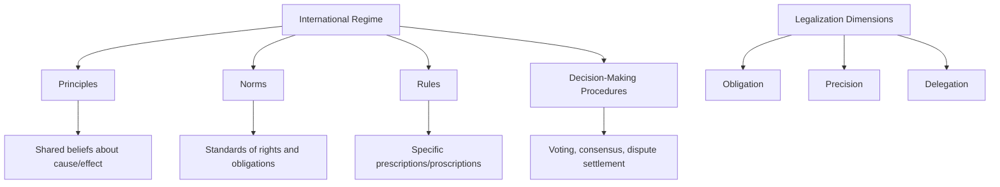

## International Regimes and Institutions

### Definition and Conceptual Foundations

International regimes and institutions constitute the analytical core of institutionalist approaches to international relations, describing the patterned, rule-governed arrangements through which states and other actors coordinate behavior in specific issue areas. The most widely cited definition, formulated by Stephen Krasner in the edited volume *International Regimes* (1983), describes regimes as "implicit or explicit principles, norms, rules, and decision-making procedures around which actors' expectations converge in a given issue area."

**Key Points**

- Krasner's definition disaggregates regimes into four components: **principles** (beliefs of fact, causation, and rectitude), **norms** (standards of behavior defined in terms of rights and obligations), **rules** (specific prescriptions and proscriptions for action), and **decision-making procedures** (prevailing practices for making and implementing collective choice).
- "Institutions" is often used more broadly than "regime" to include both the rule-sets themselves and the formal organizations (secretariats, bureaucracies, courts) that administer them; some scholars use the terms near-interchangeably, while others reserve "regime" for informal or semi-formal rule complexes and "international organization" (IO) for the formal bureaucratic entities with legal personality, headquarters, and staff (e.g., the United Nations, the World Trade Organization).
- Regimes are distinguished from mere "cooperation" (short-term, ad hoc convergence of interests) by their institutionalized, rule-based, and relatively durable character.

### Theoretical Explanations for Regime Formation

**Realist/Power-Based Theories**

Realist accounts, including hegemonic stability theory (Charles Kindleberger, Robert Gilpin, Robert Keohane's early work), argue regimes form and persist when a hegemonic power has both the capability and willingness to bear disproportionate costs of provision, because it benefits disproportionately from the resulting order (e.g., the post-1945 Bretton Woods regime under U.S. hegemony).

**Interest-Based / Neoliberal Institutionalist Theories**

Robert Keohane's *After Hegemony* (1984) offered an influential rebuttal to strict hegemonic stability theory, arguing regimes can persist even after hegemonic decline because they perform valuable functions independent of the hegemon: reducing transaction costs, providing information, reducing uncertainty, and enabling states to escape collective action problems modeled by game-theoretic frameworks such as the prisoner's dilemma and the stag hunt.

**Key Points**

- Functional theory of regimes treats regimes as solutions to market failures in the international system: information asymmetries, high transaction costs, and monitoring difficulties that would otherwise prevent mutually beneficial cooperation.
- Iteration and the "shadow of the future": regimes facilitate cooperation by transforming single-shot interactions into repeated games, where the prospect of future interaction disciplines present behavior (drawing on the folk theorem in game theory and Robert Axelrod's work on the evolution of cooperation).

**Knowledge-Based (Cognitivist) Theories**

Cognitivist approaches, associated with Peter Haas's concept of epistemic communities, argue regime formation depends on shared causal understanding among policymakers and experts, particularly in technically complex domains such as ozone layer protection, where scientific consensus preceded and enabled political agreement (e.g., the Vienna Convention and subsequent Montreal Protocol).

**Constructivist Theories**

Constructivists (e.g., Friedrich Kratochwil, John Ruggie) argue regimes are constituted by shared intersubjective understandings and norms rather than merely reflecting exogenously given interests; Ruggie's concept of "embedded liberalism" describes how the post-war international economic regime reflected a normative compromise between free trade and domestic social welfare commitments, not simply a power-based or purely efficiency-based outcome.

### Regime Effectiveness and Compliance

**Key Points**

- Regime effectiveness is commonly assessed along multiple dimensions: problem-solving effectiveness (does the regime address the underlying issue), behavioral effectiveness (does it change state behavior), and normative effectiveness (does it establish and legitimate shared standards).
- Oran Young's work on regime effectiveness distinguishes between regimes that are effective because they alter the underlying incentive structure of a problem versus regimes that primarily codify behavior states would have undertaken anyway (calling into question causal attribution of "success").
- The managerial school (Abram and Antonia Chayes) argues that most non-compliance within regimes reflects ambiguity, incapacity, or unintended lag rather than willful defection, favoring compliance-management tools (capacity building, transparency, dispute resolution) over punitive sanctions.

### Types of International Institutions

**Formal Intergovernmental Organizations (IGOs)**

Formal IGOs possess international legal personality, a permanent secretariat, a charter or founding treaty, and structured decision-making bodies. Examples include the United Nations, World Trade Organization, International Monetary Fund, World Bank Group, and World Health Organization.

**Treaty-Based Regimes Without Standing Bureaucracy**

Some regimes operate through treaty commitments with lighter institutional infrastructure, relying on periodic Conferences of the Parties (COPs) rather than a large standing secretariat, exemplified historically by many multilateral environmental agreements in their earlier phases.

**Informal Institutions and Clubs**

Informal groupings such as the G7 and G20 operate without founding treaties or formal legal personality, relying instead on summit diplomacy, communiqués, and peer pressure; scholars including Andrew Cooper and others have analyzed these as "club governance" or "informal institutions" that offer flexibility unavailable to treaty-bound IGOs.

**Regime Complexes**

As issue areas grow more complex, multiple overlapping regimes can govern the same domain without a single unifying authority. Kal Raustiala and David Victor's concept of the "regime complex" describes this phenomenon, using the example of plant genetic resources governance, which is addressed simultaneously by the Convention on Biological Diversity, the International Treaty on Plant Genetic Resources for Food and Agriculture, and intellectual property regimes under the World Trade Organization's TRIPS Agreement.

### Institutional Design Variables

**Key Points**

- **Membership rules**: Universal (open to all states, e.g., UN) versus restricted/club-based (e.g., OECD, NATO, G7) membership shapes both legitimacy and negotiating efficiency.
- **Voting rules**: Range from one-state-one-vote (UN General Assembly), weighted voting based on financial contribution (IMF, World Bank), to consensus-based decision-making (WTO, many environmental regimes).
- **Flexibility mechanisms**: Escape clauses, reservations, opt-outs, and sunset clauses allow states to accept obligations while retaining limited flexibility, often increasing willingness to join at the cost of weaker binding force.
- **Delegation**: The degree to which states delegate authority to independent bodies (courts, dispute panels, technical secretariats) versus retaining direct control varies substantially; Kenneth Abbott and Duncan Snidal's concept of "legalization" analyzes regimes along three dimensions: obligation (bindingness), precision (rule clarity), and delegation (third-party authority to interpret and apply rules).

### Illustrative Diagram: Regime Components and Design

### Worked Example

**Example**

Applying Krasner's regime framework to the international trade regime (GATT/WTO):

1. **Principles**: Open, non-discriminatory trade promotes global welfare; protectionism generates negative externalities and retaliation cycles.
2. **Norms**: Most-Favored-Nation (MFN) treatment (Article I, GATT) — any trade advantage granted to one member must be extended to all members; National Treatment (Article III) — imported goods must be treated no less favorably than domestic goods once inside a market.
3. **Rules**: Specific tariff schedules (bound tariff rates negotiated in trade rounds), rules on subsidies and countervailing measures, anti-dumping procedures, and Trade-Related Aspects of Intellectual Property Rights (TRIPS) provisions.
4. **Decision-making procedures**: Formally, one-member-one-vote with consensus as the practical norm; the Dispute Settlement Understanding (DSU) provides a structured, quasi-judicial procedure (panels, Appellate Body review, and authorized retaliation) that increases legalization and delegation relative to the earlier, more diplomacy-based GATT system.

**Comparative institutional design**: This can be contrasted with the climate regime (UNFCCC/Paris Agreement), which exhibits lower obligation and delegation (nationally determined contributions are not internationally adjudicated) but has evolved increasingly precise transparency and reporting rules, illustrating that legalization dimensions can vary independently within a single regime rather than moving uniformly together.

### Comparative Table: Institutional Forms

| Form | Legal Personality | Standing Bureaucracy | Example | Typical Decision Rule |
| --- | --- | --- | --- | --- |
| Formal IGO | Yes | Yes, permanent secretariat | UN, WTO, WHO | Varies (one-state-one-vote, weighted, consensus) |
| Treaty regime (COP-based) | Treaty-based | Minimal to moderate | CITES, early UNFCCC | Consensus among parties |
| Informal club | No | No or minimal | G7, G20 | Consensus, communiqué-based |
| Regime complex | N/A (aggregate) | Multiple, overlapping | Plant genetic resources governance | Fragmented across constituent regimes |
| Judicialized regime | Yes | Yes, includes tribunal/panel system | WTO DSU, ECtHR | Binding third-party adjudication |

### Regime Change and Decline

**Key Points**

- Regimes can weaken or collapse through several mechanisms: hegemonic decline (if hegemonic stability theory's causal logic holds for a given regime), rising non-compliance that erodes credibility, the emergence of superior competing institutional arrangements, or fundamental shifts in underlying interests or technology that render existing rules obsolete.
- Regime shift versus regime death: scholars distinguish between a regime evolving substantially in response to new conditions (e.g., GATT's evolution into the WTO with expanded scope and a strengthened dispute settlement mechanism) versus outright institutional collapse or abandonment.
- Forum shopping and regime shifting: powerful actors dissatisfied with rules in one institutional venue may shift negotiation or dispute activity to a more favorable venue, a dynamic examined extensively in intellectual property governance (movement between the World Intellectual Property Organization and the WTO's TRIPS framework) and analyzed by scholars including Laurence Helfer.

### Contemporary Debates

**Key Points**

- **Institutional proliferation and fragmentation**: The growth in the sheer number of international institutions since 1945 raises questions about coordination costs, forum shopping, and whether overlapping regimes produce productive diversity or harmful incoherence.
- **Legitimacy and the democratic deficit**: As delegation to international institutions increases (e.g., binding WTO dispute rulings, IMF conditionality), critics question the democratic accountability of decision-makers who are often technocrats or diplomats insulated from direct electoral pressure.
- **Great power contestation of existing regimes**: The creation of parallel institutions by rising powers (e.g., the Asian Infrastructure Investment Bank, the New Development Bank, the Shanghai Cooperation Organisation) raises the question of whether these represent genuine alternatives to Bretton Woods-era regimes or complementary additions within an increasingly complex regime landscape. [Unverified] The long-run trajectory of these parallel institutions relative to legacy institutions remains subject to ongoing developments and should be checked against current reporting for up-to-date assessment.
- **Regime interplay with domestic politics**: Two-level game theory (Robert Putnam) highlights how international regime negotiation is constrained by the need for simultaneous ratifiability in domestic political arenas, complicating simple state-as-unitary-actor models of regime formation.

### Conclusion

International regimes and institutions constitute the primary mechanisms through which states manage interdependence and collective action problems absent centralized global authority. Explanations for their formation range from power-based accounts privileging hegemonic provision, to interest-based functional accounts emphasizing transaction-cost reduction, to knowledge-based and constructivist accounts emphasizing shared understanding and norms. Institutional design varies substantially across membership rules, voting procedures, and degrees of legalization, producing a diverse ecosystem ranging from highly formalized, judicialized IGOs to informal clubs and diffuse regime complexes. Understanding any specific global governance challenge typically requires examining not a single institution in isolation, but the broader regime architecture, including overlapping and sometimes competing institutional arrangements, that collectively shapes state and non-state behavior in that issue area.

**Related Topics**

- Theories of Global Governance
- Hegemonic Stability Theory and the Liberal International Order
- The Legalization of World Politics (Obligation, Precision, Delegation)
- Regime Complexes and Institutional Fragmentation
- Two-Level Games and Domestic-International Linkage
- The World Trade Organization Dispute Settlement System
- Epistemic Communities and Global Environmental Governance
- Informal Institutions: The G7, G20, and Club Governance
- Compliance and Enforcement in International Law
- Reform Debates in the Bretton Woods Institutions