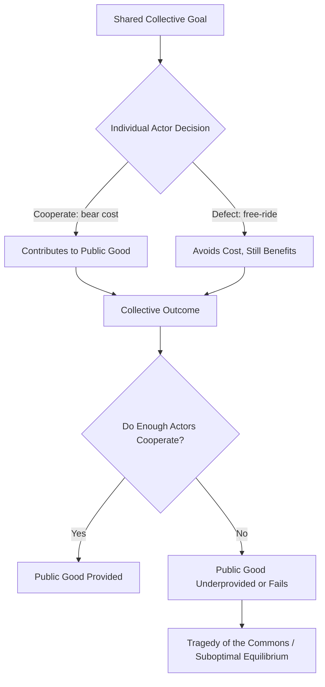

## Collective Action Problems in World Politics

### Definition and Conceptual Foundations

A collective action problem arises when a group of actors would all benefit from a particular outcome, but individually rational behavior by each actor leads to a suboptimal or failed outcome for the group as a whole. In world politics, this occurs among states, international organizations, non-state actors, and other entities that share an interest in achieving some collective good but face incentives to free-ride, defect, or underinvest relative to what collective welfare would require.

The concept draws heavily from Mancur Olson's foundational work, *The Logic of Collective Action* (1965), which argued that rational, self-interested individuals will not act to achieve common or group interests unless the number of individuals is small, or unless there is coercion or some separate incentive to induce them to act in their common interest.

**Key Points**

- Collective action problems are distinct from simple conflicts of interest; actors share a common goal but face structural incentives that undermine cooperation
- The problem is most acute in anarchic international systems lacking a central enforcement authority
- Solutions typically require altering incentive structures, reducing group size, establishing monitoring/enforcement mechanisms, or generating selective incentives

### Theoretical Underpinnings

#### The Prisoner's Dilemma Structure

Many collective action problems in international relations are modeled using game-theoretic frameworks, most notably the Prisoner's Dilemma. In this structure, mutual cooperation yields the best collective outcome, but each actor has a dominant strategy to defect regardless of what the other does, because defection yields a higher individual payoff whether the other party cooperates or defects.

$$U_i(\text{defect}) > U_i(\text{cooperate}) \quad \forall \text{ strategies of } j$$

The resulting Nash equilibrium is mutual defection, even though mutual cooperation is Pareto superior.

#### Public Goods and the Free-Rider Problem

Many international outcomes — climate stability, open sea lanes, financial stability, disease eradication, nuclear non-proliferation — function as public goods, characterized by:

- **Non-excludability**: no actor can be effectively prevented from enjoying the benefit once produced
- **Non-rivalry**: one actor's consumption does not diminish availability to others

Because states cannot be excluded from a stable climate or a disease-free world even if they contributed nothing, each has an incentive to free-ride on the contributions of others, leading to systematic underprovision.

#### N-Person Dilemmas and Group Size

Olson's group-size argument holds that as the number of actors (N) increases:

- The individual share of the collective benefit shrinks
- The individual's marginal contribution becomes less noticeable and less likely to be pivotal
- Monitoring and enforcing cooperation becomes more costly and complex

This is why small groups of great powers (e.g., a "k-group" or "privileged group") sometimes provide public goods successfully while universal-membership institutions (192+ UN member states) struggle.

### Diagram: Structure of a Collective Action Problem

### Substantive Domains in World Politics

#### Climate Change

Climate change is frequently cited as the paradigmatic global collective action problem. Greenhouse gas mitigation costs are borne nationally and immediately, while benefits (climate stability) are diffused globally and temporally deferred. This generates strong incentives for states to under-commit to emissions reductions while hoping others bear the burden.

**Example**

The Kyoto Protocol (1997) imposed binding targets primarily on developed countries, and the United States declined to ratify it, citing competitive disadvantage relative to non-binding developing economies — a textbook free-rider dynamic. The Paris Agreement (2015) shifted toward a "pledge and review" model with nationally determined contributions (NDCs), explicitly designed to work around enforcement limitations by relying on reputational incentives and transparency rather than binding sanctions.

#### Security and Alliance Burden-Sharing

Collective defense arrangements such as NATO exhibit classic collective action dynamics: smaller or less-exposed member states have historically under-contributed to defense spending relative to agreed benchmarks (e.g., the 2% of GDP guideline), relying on larger powers like the United States to provide the bulk of deterrent capability.

#### Global Public Health

Disease surveillance, pandemic preparedness, and vaccine development/distribution involve collective action failures. During the COVID-19 pandemic, "vaccine nationalism" — wealthy states securing disproportionate vaccine supplies — undermined the COVAX initiative's goal of equitable global distribution, illustrating how individually rational hoarding behavior undermines collectively optimal outcomes (both epidemiologically and economically).

#### International Trade and Monetary Stability

Open trade regimes and stable exchange rate systems are quasi-public goods. The interwar period's competitive currency devaluations and tariff wars (e.g., the Smoot-Hawley Tariff Act of 1930) are commonly analyzed as failures of collective action that deepened the Great Depression, motivating the post-1945 creation of the IMF and GATT.

#### Nuclear Non-Proliferation and Arms Control

States face incentives to acquire nuclear weapons for security even though universal restraint would leave all states more secure. The Nuclear Non-Proliferation Treaty (NPT) attempts to solve this through a combination of normative commitment, security guarantees, and monitoring (IAEA safeguards), though it remains vulnerable to defection by states like North Korea.

#### Common Pool Resources

Fisheries, deep-sea mineral resources, and Antarctic resources represent common-pool resource problems distinct from pure public goods in that they are non-excludable but *rivalrous* — one actor's extraction depletes what remains for others. This is the international analogue of Garrett Hardin's "Tragedy of the Commons" (1968).

### Proposed Solutions and Institutional Mechanisms

#### Hegemonic Stability Theory

Associated with Charles Kindleberger and Robert Gilpin, this theory argues that a dominant power (hegemon) can solve collective action problems by unilaterally absorbing disproportionate costs of providing public goods, because its large share of aggregate benefit makes doing so individually rational even without reciprocation. The relative decline of a hegemon is theorized to correlate with declining provision of global public goods.

#### Regime Theory and Institutionalism

Robert Keohane's *After Hegemony* (1984) argued that international regimes and institutions can sustain cooperation even in the absence of a hegemon by:

- Reducing transaction costs of repeated negotiation
- Providing information that reduces uncertainty about others' behavior
- Enabling issue linkage across negotiations
- Creating iterated interaction, which supports strategies like Tit-for-Tat that sustain cooperation in repeated games

#### Reciprocity and Repeated Games

Robert Axelrod's iterated Prisoner's Dilemma tournaments demonstrated that when interactions are repeated indefinitely (i.e., the "shadow of the future" is long), strategies based on conditional reciprocity can sustain cooperation without centralized enforcement, because the long-term cost of retaliation outweighs short-term defection gains.

$$\delta > \frac{T - R}{T - P}$$

where $\delta$ is the discount factor (patience/probability of future interaction), $T$ is the temptation payoff, $R$ the reward for mutual cooperation, and $P$ the punishment for mutual defection. Cooperation is sustainable in equilibrium when the discount factor exceeds this threshold. [Inference: the precise threshold value depends on the specific payoff matrix used; this is the general folk-theorem condition rather than a fixed empirical constant.]

#### Selective Incentives and Club Goods

Olson proposed that organizations can overcome free-riding by offering selective incentives — benefits available only to contributors. In international politics, this appears as club goods: NATO membership provides security guarantees exclusively to members; WTO membership provides preferential trade terms unavailable to non-members, incentivizing accession and compliance.

#### Issue Linkage and Package Deals

Linking cooperation on one issue to benefits or penalties on another can alter incentive structures. Trade agreements bundling market access with labor or environmental standards are a common example.

#### Monitoring, Transparency, and Verification

Reducing information asymmetry lowers the risk of unilateral exploitation. Arms control verification regimes (e.g., IAEA inspections), climate transparency frameworks (Paris Agreement's enhanced transparency framework), and trade dispute mechanisms (WTO panels) all function to make defection more visible and thus more costly reputationally.

### Diagram: Institutional Pathways to Overcoming Collective Action Problems (svg_diagram)

<svg xmlns="http://www.w3.org/2000/svg" viewBox="0 0 900 480">
\<style\>
.title{font:bold 16px sans-serif;fill:#1a1a2e;}
.box{font:12px sans-serif;fill:#1a1a2e;}
.lbl{font:11px sans-serif;fill:#444;}
.node{fill:#eef3fb;stroke:#3a5a8c;stroke-width:1.5;}
.center{fill:#fff4e0;stroke:#b8860b;stroke-width:2;}
.arrow{stroke:#555;stroke-width:1.5;fill:none;marker-end:url(#arrow);}
\</style\>
<text x="450" y="28" text-anchor="middle" class="title">Solutions to Collective Action Problems (svg_diagram)</text>
<rect x="360" y="200" width="180" height="60" rx="8" class="center" />
<text x="450" y="225" text-anchor="middle" class="box">Collective Action</text>
<text x="450" y="242" text-anchor="middle" class="box">Problem</text>
<rect x="40" y="60" width="180" height="55" rx="8" class="node" />
<text x="130" y="82" text-anchor="middle" class="box">Hegemonic</text>
<text x="130" y="98" text-anchor="middle" class="box">Stability</text>
<rect x="40" y="405" width="180" height="55" rx="8" class="node" />
<text x="130" y="427" text-anchor="middle" class="box">Selective</text>
<text x="130" y="443" text-anchor="middle" class="box">Incentives / Club Goods</text>
<rect x="680" y="60" width="180" height="55" rx="8" class="node" />
<text x="770" y="82" text-anchor="middle" class="box">Institutions &amp;</text>
<text x="770" y="98" text-anchor="middle" class="box">Regimes</text>
<rect x="680" y="405" width="180" height="55" rx="8" class="node" />
<text x="770" y="427" text-anchor="middle" class="box">Monitoring &amp;</text>
<text x="770" y="443" text-anchor="middle" class="box">Verification</text>
<rect x="360" y="20" width="180" height="0" class="node" opacity="0" />
<rect x="360" y="390" width="180" height="55" rx="8" class="node" />
<text x="450" y="412" text-anchor="middle" class="box">Reciprocity /</text>
<text x="450" y="428" text-anchor="middle" class="box">Repeated Games</text>
<path d="M220,90 L360,215" class="arrow" />
<path d="M220,435 L360,240" class="arrow" />
<path d="M680,90 L540,215" class="arrow" />
<path d="M680,435 L540,240" class="arrow" />
<path d="M450,390 L450,260" class="arrow" />

<text x="130" y="140" text-anchor="middle" class="lbl">absorbs disproportionate cost</text>

<text x="770" y="140" text-anchor="middle" class="lbl">lowers transaction costs</text>

<text x="130" y="385" text-anchor="middle" class="lbl">excludable benefits</text>

<text x="770" y="385" text-anchor="middle" class="lbl">raises cost of defection</text>

</svg>

### Critiques and Limitations

- **Overemphasis on rationalism**: Constructivist scholars argue that collective action frameworks understate the role of norms, identity, and socialization in generating cooperation independent of material incentive calculations
- **Power asymmetries**: Collective action models often abstract away from unequal power distributions that shape *whose* preferences define the "collective" good in the first place
- **Empirical scope conditions**: Hegemonic stability theory's predictive power regarding post-Cold War unipolarity and the current period of contested multipolarity remains debated among scholars [Unverified: contemporary applicability to a multipolar order with a rising China is an active area of scholarly disagreement rather than settled empirical consensus]
- **Compliance vs. cooperation**: Some scholars (e.g., Chayes and Chayes) argue that apparent "cooperation" is often actually low-cost compliance with agreements states would have followed anyway, overstating the causal role of institutional design

### Related Topics

- Tragedy of the Commons and Common Pool Resource Management
- Game Theory in International Relations (Prisoner's Dilemma, Stag Hunt, Chicken)
- Hegemonic Stability Theory
- Regime Theory and Neoliberal Institutionalism
- Public Goods Theory (Global Public Goods)
- Alliance Politics and Burden-Sharing
- International Environmental Cooperation and Climate Regimes
- The Tragedy of the Horizon (long-term risk discounting in international cooperation)
- Principal-Agent Problems in International Organizations
- Reciprocity, Reputation, and Repeated Games in IR