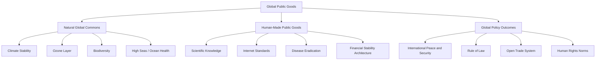

## Global Public Goods

### Definition and Core Properties

Global public goods (GPGs) are goods, resources, or services whose benefits (or costs) extend across borders, generations, and populations, such that no single state can produce or manage them unilaterally, and consumption by one actor does not preclude consumption by others. The concept extends the domestic economic theory of public goods (Samuelson, 1954) to the international level.

A good qualifies as a public good when it exhibits two defining properties:

- **Non-excludability**: it is impossible or prohibitively costly to prevent any actor from consuming the good once it is provided
- **Non-rivalry (non-subtractability)**: one actor's consumption does not diminish the quantity or quality available to others

**Key Points**

- "Global" adds a jurisdictional dimension: benefits/costs are not confined to a single nation-state or region and cannot be adequately managed within a domestic regulatory framework alone
- Inge Kaul and colleagues at the UNDP (in *Global Public Goods: International Cooperation in the 21st Century*, 1999) popularized the term and framework in policy circles
- The absence of a world government means GPGs cannot rely on centralized taxation or coercive provision, unlike domestic public goods

### Typology of Goods

International goods are often classified along the excludability/rivalry matrix:

|  | Excludable | Non-Excludable |
| --- | --- | --- |
| **Rivalrous** | Private goods (e.g., bilateral aid) | Common-pool resources (e.g., high-seas fisheries) |
| **Non-Rivalrous** | Club goods (e.g., NATO security guarantee) | Public goods (e.g., climate stability) |

**Example**

Ozone layer protection is a pure global public good: no country can be excluded from a repaired ozone layer, and one country's protection from UV radiation does not reduce protection available to others. By contrast, ocean fisheries are a common-pool resource: exclusion is difficult, but one state's catch directly reduces the stock available to others — creating rivalry.

### Categories of Global Public Goods

#### Natural Global Commons

Shared natural systems requiring collective stewardship:

- Stable climate system / atmospheric carbon sink capacity
- Ozone layer
- Biodiversity and genetic resources
- Ocean health and high-seas resources
- Antarctic environment

#### Human-Made Global Public Goods

Goods created intentionally through cooperative human effort:

- Knowledge and scientific research (particularly basic research with non-appropriable findings)
- Internet infrastructure and technical standards (e.g., interoperability protocols)
- Disease eradication (e.g., smallpox eradication, 1980; polio eradication efforts)
- Financial stability architecture

#### Global Policy Outcomes / Intangible Goods

Outcomes achieved through coordinated policy rather than a physical resource:

- Peace and international security
- Rule of law and international legal order
- Open, rules-based trade system
- Human rights norms

### Diagram: Typology of Global Public Goods

### The Underprovision Problem

GPGs are systematically underprovided relative to the socially optimal level because of the same free-rider dynamics that afflict domestic public goods, intensified by the absence of a supranational enforcement authority. Formally, in a simple additive model of public good provision:

$$G = \sum_{i=1}^{n} g_i$$

where $G$ is the aggregate level of the public good and $g_i$ is state $i$'s individual contribution, each state's privately optimal contribution is determined by weighing its own marginal benefit against its own marginal cost, ignoring the positive externality conferred on all other states. This produces an aggregate supply below the Pareto-efficient level, since no actor internalizes the full social benefit of its contribution.

**Aggregation technologies** matter significantly for provision dynamics, following the taxonomy developed by Hirshleifer (1983) and applied to GPGs by Kaul et al.:

- **Summation**: total provision equals the sum of individual contributions (e.g., aggregate greenhouse gas reductions) — most vulnerable to free-riding since every unit of effort is substitutable
- **Weakest link**: the good's overall level is determined by the *smallest* individual contribution (e.g., disease surveillance and containment — a single weak link/gap allows a pathogen to spread globally regardless of other states' efforts)
- **Best shot**: the good's overall level is determined by the *single largest* individual contribution (e.g., a technological breakthrough such as a vaccine, which only needs to be achieved once)

[Inference: the appropriate policy response — decentralized incentive-based approaches versus targeted capacity-building for the weakest contributors — depends heavily on which aggregation technology characterizes a given good, a point emphasized in the applied GPG policy literature but not always made explicit in general IR theory.]

### Provision Mechanisms and Governance Architecture

#### International Institutions and Regimes

Formal international organizations serve as the primary vehicles for GPG provision by reducing transaction costs, providing monitoring, and creating focal points for coordination:

- **UNFCCC / Paris Agreement** — climate stability
- **World Health Organization / International Health Regulations** — pandemic preparedness and disease surveillance
- **World Trade Organization** — open trade system
- **International Atomic Energy Agency** — nuclear safety and non-proliferation verification
- **Montreal Protocol Secretariat** — ozone layer protection (widely regarded as the most successful GPG regime to date)

#### Financing Mechanisms

- **Assessed contributions**: mandatory dues based on formulas (e.g., UN regular budget, IMF quotas)
- **Voluntary contributions**: discretionary funding (e.g., Green Climate Fund pledges)
- **Innovative financing**: mechanisms designed to generate dedicated revenue streams, such as the Global Fund's replenishment model, carbon pricing/taxation schemes, or proposed financial transaction taxes
- **Blended finance**: combining public concessional funding with private capital to de-risk investment in GPG-adjacent infrastructure

#### Hegemonic and Great Power Provision

Consistent with hegemonic stability theory, dominant powers have historically shouldered disproportionate costs of certain GPGs (e.g., U.S. provision of maritime security via naval power projection, underwriting freedom of navigation) because their outsized share of aggregate benefit makes unilateral provision individually rational even absent full reciprocity.

### Case Studies

**Example**

The Montreal Protocol (1987) is frequently cited as the most successful case of GPG provision: it used a combination of binding phase-out schedules, differentiated timelines for developing countries (common but differentiated responsibilities), a dedicated Multilateral Fund to finance compliance, and trade restrictions on non-parties to eliminate incentives for free-riding. Global production of major ozone-depleting substances fell by over 98 percent from baseline levels, and the ozone layer is on a documented path toward recovery.

**Example**

By contrast, global climate governance illustrates persistent underprovision: despite near-universal participation in the Paris Agreement, aggregated Nationally Determined Contributions remain insufficient to meet the agreement's stated temperature targets, reflecting the summation-technology vulnerability to free-riding, the absence of binding enforcement, and heterogeneous national interests tied to fossil fuel-dependent economies.

### Diagram: GPG Provision Pathway (svg_diagram)

<svg xmlns="http://www.w3.org/2000/svg" viewBox="0 0 880 380">
\<style\>
.title{font:bold 16px sans-serif;fill:#1a1a2e;}
.box{font:12px sans-serif;fill:#1a1a2e;}
.lbl{font:11px sans-serif;fill:#444;}
.node{fill:#eef3fb;stroke:#3a5a8c;stroke-width:1.5;}
.out{fill:#e6f5e9;stroke:#2f7a3f;stroke-width:1.5;}
.arrow{stroke:#555;stroke-width:1.5;fill:none;marker-end:url(#arrow2);}
\</style\>
<text x="440" y="28" text-anchor="middle" class="title">Global Public Good Provision Pathway (svg_diagram)</text>
<rect x="30" y="70" width="160" height="55" rx="8" class="node" />
<text x="110" y="92" text-anchor="middle" class="box">Identify GPG</text>
<text x="110" y="108" text-anchor="middle" class="box">and Aggregation Type</text>
<rect x="260" y="70" width="160" height="55" rx="8" class="node" />
<text x="340" y="92" text-anchor="middle" class="box">Institutional</text>
<text x="340" y="108" text-anchor="middle" class="box">Regime Formation</text>
<rect x="490" y="70" width="160" height="55" rx="8" class="node" />
<text x="570" y="92" text-anchor="middle" class="box">Financing</text>
<text x="570" y="108" text-anchor="middle" class="box">Mechanism</text>
<rect x="720" y="70" width="140" height="55" rx="8" class="node" />
<text x="790" y="92" text-anchor="middle" class="box">Monitoring &amp;</text>
<text x="790" y="108" text-anchor="middle" class="box">Compliance</text>
<path d="M190,97 L260,97" class="arrow" />
<path d="M420,97 L490,97" class="arrow" />
<path d="M650,97 L720,97" class="arrow" />
<rect x="300" y="250" width="280" height="60" rx="8" class="out" />
<text x="440" y="275" text-anchor="middle" class="box">Provision Level Closer to</text>
<text x="440" y="292" text-anchor="middle" class="box">Socially Optimal Outcome</text>
<path d="M790,125 L790,180 L440,180 L440,250" class="arrow" />
<text x="620" y="200" text-anchor="middle" class="lbl">reduces free-riding via enforcement/reputation</text>
</svg>

### Critiques and Debates

- **Definitional overreach**: Critics argue the term "global public good" is sometimes applied loosely to any good with cross-border importance (e.g., "global financial stability"), diluting its analytical precision as a technical economic category
- **Depoliticization concern**: Framing contested political goods (e.g., "security," "development") in the technocratic language of public goods theory can obscure underlying power asymmetries and distributive conflicts over who bears provision costs
- **North-South equity**: Developing countries have historically contributed least to the depletion of certain global commons (e.g., cumulative carbon emissions) yet bear significant costs of both climate impacts and mitigation burdens, a tension embedded in the principle of "common but differentiated responsibilities"
- **Measurement difficulty**: Quantifying the socially optimal level of provision for intangible goods (e.g., "international peace") is inherently contested, limiting the precision with which underprovision can be empirically demonstrated [Unverified: the degree of underprovision for non-quantifiable GPGs is necessarily an analytical judgment rather than a precisely measurable gap]

### Related Topics

- Collective Action Problems in World Politics
- Tragedy of the Commons and Common Pool Resource Management
- Hegemonic Stability Theory
- Common but Differentiated Responsibilities (CBDR) in International Environmental Law
- Global Health Governance and the WHO
- Climate Finance and the Green Climate Fund
- Regime Theory and International Institutions
- The Global Commons (Atmosphere, High Seas, Antarctica, Outer Space)
- International Financial Architecture and Systemic Risk
- Development Assistance and Foreign Aid Effectiveness